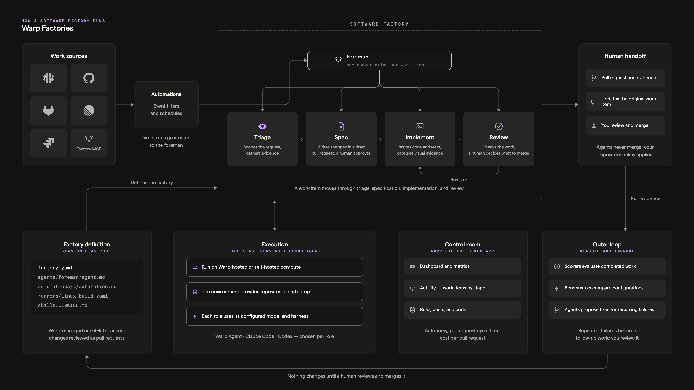

import { VARS } from '@data/vars';

A software factory assembles the {VARS.WARP_AUTOMATION_PLATFORM}'s primitives — runs, environments, runners, integrations, and secrets — into one measurable workflow. Work enters from the tools your team already uses, a foreman coordinates specialized agents through the stages each work item needs, and a human makes the final call.

## How a factory runs

1. **Work sources** - Work items arrive from [Slack](/factories/integrations/slack/), [GitHub](/factories/integrations/github/), [GitLab](/factories/integrations/gitlab/), [Linear](/factories/integrations/linear/), or [Jira](/factories/integrations/jira/), from local coding agents through the [Factory MCP](/factories/factory-mcp/), or from direct runs and schedules.
2. **Automations** - Each provider event runs through [automations](/factories/automations/), whose filters decide which events start work and which agent handles them. Schedules fire automations on a timer; direct requests skip this step and go straight to the foreman.
3. **The foreman** - The factory's coordinator holds one continuous conversation per work item, decides which stage the work needs next, dispatches the right agent, relays questions to the requester, and pauses at human checkpoints. See [factory agents](/factories/factory-agents/).
4. **Stage agents** - Triage scopes the request and gathers evidence, Spec writes product and technical specifications in a draft pull request (a human approves the spec by default), Implement writes the code with tests and visual evidence, and Review checks the result with fresh eyes and returns an advisory verdict. Review can send work back to Implement for revision, and the foreman skips stages the work doesn't need.
5. **Human handoff** - The factory presents the finished pull request with its evidence and posts results back at the source. Agents never merge; your repository permissions and branch protection govern who does.
6. **The factory definition** - Version-controlled files — `factory.yaml` plus `agents/`, `automations/`, `runners/`, and `skills/` directories — define the whole factory. Definitions are Warp-managed or live in a GitHub repository your team owns, where changes arrive as reviewed pull requests. See [definitions as code](/factories/factory-as-code/).
7. **Platform execution** - Every stage runs as a cloud agent run: in a Warp-hosted sandbox or on a [self-hosted worker](/platform/self-hosting/), with the workspace from the factory's repositories and compute from its [runners](/platform/runners/). Each role can use its own model and [harness](/platform/harnesses/) — the Warp Agent, Claude Code, or Codex.
8. **The factory dashboard** - The Warp Factories web app (the control room in the diagram) shows the factory's metrics (autonomy, PR cycle time, cost per PR), work items by stage, runs, costs, and definition files. See the [factory dashboard](/factories/factory-dashboard/).
9. **The outer loop** - [Scorers](/factories/measure-and-improve/) judge completed work against your criteria, benchmarks compare model, harness, and runner configurations, and Self-improvement turns repeated failures into follow-up pull requests against the application code or the factory definition itself. Nothing is adopted without your review.

## Related pages

* [How Warp Factories work](/factories/how-factories-work/) - The work-item lifecycle in depth.
* [Warp Factories overview](/factories/) - What factories are and who they're for.
* [Stack overview](/platform/architecture/stack-overview/) - The platform layers a factory builds on.
