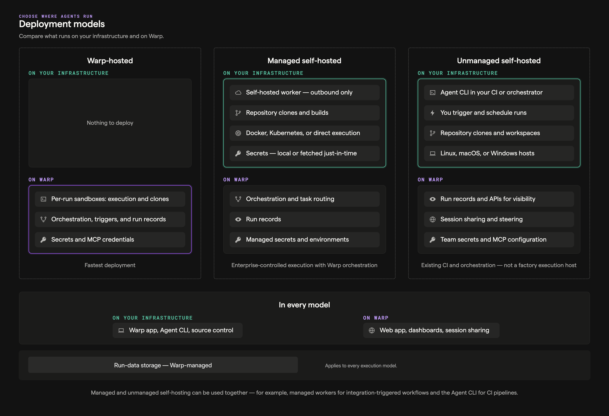
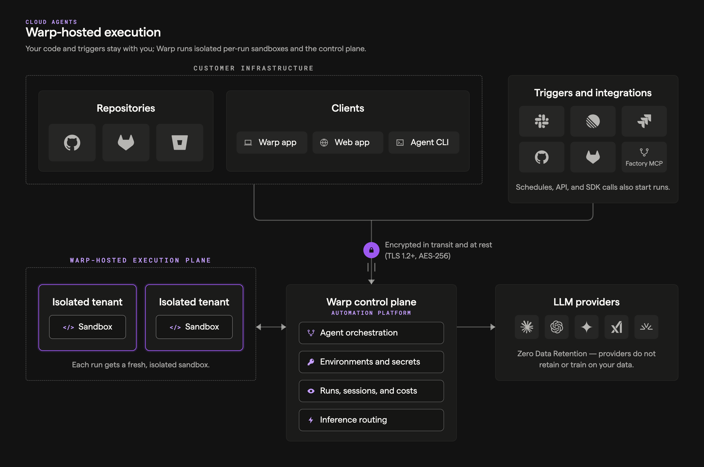

import { VARS } from '@data/vars';

Teams adopt cloud agents in a few repeatable ways. This page outlines the most common architectures, what they're good for, and how they fit together.

## Quick mental model

Cloud agent setups usually have four moving parts:

1. **Trigger**: something happens (CI step, webhook, cron, Slack mention).
2. **Orchestration**: something decides what to run and tracks it ({VARS.WARP_AUTOMATION_PLATFORM} orchestrator, GitHub Actions, your internal system).
3. **Execution**: where the agent actually runs (your runner, {VARS.WARP_AUTOMATION_PLATFORM}-hosted environment, or self-hosted workers).
4. **Visibility**: how the team monitors and intervenes ({VARS.DASHBOARD}, session sharing, APIs).

---

## Pattern 1: CLI-only agents (bring your own orchestrator)

Use this when you already have a system that schedules work (CI, dev boxes, internal orchestrators), and you need a reliable, cloud-connected agent runner.

### What it looks like

* **Trigger**: GitHub Actions / CI, a script, a dev box action, or an internal orchestrator
* **Orchestration**: your existing system
* **Execution**: wherever that system runs
* **Warp adds**: cloud connectivity, shared context, visibility, session sharing, and tracking

### Why teams choose it

* You want a **drop-in replacement** for other CLI/SDK-based agents (Claude Code, Codex CLI, Gemini CLI/SDK-style flows).
* You want to run agents anywhere without requiring Warp desktop.
* You still want **team-level observability** even when execution is “outside Warp.”

### Common examples

* **CI PR helper**: run formatting checks, generate review comments, suggest fixes, open PRs.
* **Remote dev box agent**: run refactors or debugging tasks inside a pre-provisioned box.
* **Internal orchestrator integration**: treat Warp as one agent option alongside other model providers.

### What you still get even without Warp orchestration

* Access to your shared Warp context (for example MCP config, Warp Drive context, rules/prompts).
* [Agent Session Sharing](/agents/local-agents/session-sharing/) to monitor/steer runs.
* Read-only APIs for tracking and reporting.
* A path to [Handoff](/platform/handoff/) workflows (where a run can be continued or inspected in richer surfaces).

### Minimal setup checklist

* A Warp team
* A [cloud agent](/platform/agents/) (recommended for automation)
* The {VARS.WARP_AGENT_CLI} installed on the runner / box
* Any needed credentials (often via secrets + environment variables)

---

## Pattern 2: Warp-hosted agents and orchestration (managed cloud execution)

Use this when you want the {VARS.WARP_AUTOMATION_PLATFORM} to run agent workloads on Warp-managed infrastructure, typically inside reproducible Docker environments, with built-in lifecycle management.

The [cloud agent run lifecycle](/platform/architecture/cloud-agent-run-lifecycle/) reference walks through this architecture step by step.

### What it looks like

* **Trigger**: first-party integrations, cron schedules, API/SDK calls, or on-demand commands
* **Orchestration**: {VARS.WARP_AUTOMATION_PLATFORM} orchestrator
* **Execution**: {VARS.WARP_AUTOMATION_PLATFORM}-hosted environments (Docker-based)
* **Visibility**: {VARS.DASHBOARD} + session sharing + APIs/SDKs

### Why teams choose it

* You want the simplest path to reproducible, scalable cloud execution.
* You want to run many tasks in parallel without building your own sandboxing and scaling layer.
* You want a consistent “production” setup with standardized environments and centralized configuration.

### Common ways to trigger

* **First-party integrations (Slack, Linear, etc.)** that create tasks automatically from external events.
* **[Scheduled agents](/platform/triggers/scheduled-agents/)** for recurring work (cron-like automation).
* **Custom triggers** from your own systems using Warp’s API/SDK.
* **On-demand cloud jobs** using CLI commands like `oz agent run-cloud`.

### Example recipe: daily dead-code cleanup

1. Define a Warp [Environment](/platform/environments/) with the repo + toolchain.
2. Create a [schedule](/platform/triggers/scheduled-agents/) with a fixed prompt for cleanup.
3. The {VARS.WARP_AUTOMATION_PLATFORM} runs the agent on the cadence.
4. Your team monitors runs in the [{VARS.WEB_APP}](/platform/oz-web-app/) and [viewing cloud agent runs](/platform/viewing-cloud-agent-runs/), reviews artifacts (PRs, plans), and intervenes when needed.

### Example recipe: crash triage via Sentry webhook

1. Define a Warp Environment with the target repo.
2. Register a Sentry webhook to your handler (server, cloud function, Zapier/n8n).
3. Handler extracts crash details, constructs a prompt, and calls the {VARS.WARP_AUTOMATION_PLATFORM} orchestrator API/SDK to start a task.
4. Warp spins up the run in the environment and you monitor progress via UI/API.

### Example recipe: fan-out parallel work (sharding)

When a task is naturally divisible, use [multi-agent orchestration](/platform/orchestration/) to spawn one child agent per shard from a single parent run. The parent owns coordination and result aggregation; the children execute in parallel, each with their own repo subset, prompt, and (optionally) model. See [Running orchestrated agents](/platform/orchestration/multi-agent-runs/) for slash command, CLI, web app, and API examples.

### Example recipe: same task across multiple models

* Launch N runs with the same prompt, but different profiles that map to different models.
* Compare results and choose the best output (or merge).

---

## Pattern 3: Self-hosted execution

Use this when you need to control where agent execution happens while still using {VARS.WARP_AUTOMATION_PLATFORM} orchestration and visibility. Repositories are cloned and stored only on your infrastructure. Orchestration metadata and session transcripts route through Warp's backend; cloud conversations require Warp to store conversation data according to Warp's retention terms. LLM inference requests and responses route through Warp to contracted model providers under [ZDR](/enterprise/security-and-compliance/security-overview/#zero-data-retention-zdr), except for provider-specific models that are not covered by ZDR and follow the provider's retention requirements.

Think of self-hosted execution as **customer-hosted execution with Warp-hosted orchestration**, not as a fully offline agent stack. Code repositories, build artifacts, runtime secrets, and execution workspaces stay on your infrastructure. Code context can still appear in session transcripts and LLM prompts as the agent works.

:::note
**Enterprise feature**: Self-hosted execution is available exclusively to teams on an Enterprise plan.
:::

Self-hosting has two architectures that differ on **who orchestrates agent runs** (both keep code and execution on your infrastructure):

* **[Managed](/platform/self-hosting/#managed-architecture)** — The {VARS.WARP_AUTOMATION_PLATFORM} orchestrates. You run the `oz-agent-worker` daemon; the {VARS.WARP_AUTOMATION_PLATFORM} routes runs to it from Slack, Linear, schedules, the API, or `oz agent run-cloud`. Tasks execute in Docker containers, Kubernetes Jobs, or directly on the host.
* **[Unmanaged](/platform/self-hosting/unmanaged/)** — You orchestrate. Invoke `oz agent run` directly from your CI, Kubernetes, or dev environment. Warp provides session tracking and observability; it does not start or stop agents.

Why teams choose self-hosted execution:

* Code and execution must stay within your network boundary for compliance or security requirements.
* Agents need to access services behind a VPN or self-hosted SCMs like GitLab or Bitbucket. Warp-hosted agents can also access GitLab and Bitbucket over the public internet — see the [GitLab](/platform/integrations/gitlab/) and [Bitbucket](/platform/integrations/bitbucket/) setup guides.
* Your environments (multi-service stacks, heavy resource requirements) don't fit in a single Docker container.

For setup, decision guides, and a quickstart, start with [Self-hosting](/platform/self-hosting/).
