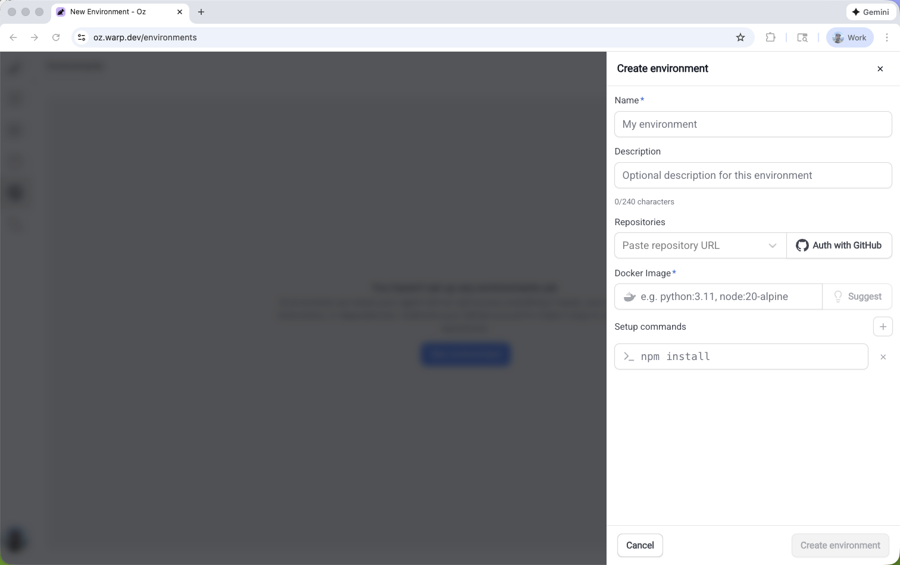

import { VARS } from '@data/vars';

Environments ensure your [cloud agents](/platform/) run with the same toolchain and setup every time, regardless of where they're triggered from.

An environment defines the execution context for automated agent runs. It specifies the **Docker image**, **repositories**, **setup commands**, and **runtime configuration** that prepare the workspace before an agent starts.

:::note
You don't need an environment for an interactive local run in a working checkout that uses your existing machine setup.
:::

## Key features

* **Consistent behavior across triggers** - A workflow from Slack uses the same toolchain and setup steps as one from Linear or the CLI.
* **One configuration, many uses** - Define an image and setup once, then reuse them across triggers and hosts.
* **Run visibility** - Inspect the image, repos, and commands for a run to debug failures or reproduce results.

:::note
Warp provides [prebuilt dev images](https://github.com/warpdotdev/oz-dev-environments) with common languages and tools pre-installed.
:::

## About environments

Environments define _how_ an agent runs, not _what_ it does. Automated [{VARS.WARP_AUTOMATION_PLATFORM}](/platform/overview/) workflows, including cloud agents, integrations, and API runs, require an environment. Interactive local runs do not.

An environment includes the following.

* **Docker image** - The image with the toolchain and dependencies your code needs. A self-hosted Kubernetes worker with a [`default_image`](/platform/self-hosting/managed-kubernetes/) can run without a separate environment.
* **Repositories** - One or more repos the agent can clone and use.
* **Setup commands** - Commands that prepare the workspace, such as dependency installation, builds, or bootstrapping. Setup commands run as the [container user](#container-user-and-permissions). If an image starts as root, prefix commands that require root access with `sudo`.

Use the Docker image for the language runtimes, package managers, system libraries, and scripts your project needs. Custom images don't need to install the {VARS.WARP_AGENT_CLI} binary. Warp supplies the agent runtime separately. Start with an official image or [Warp's prebuilt dev images](https://github.com/warpdotdev/oz-dev-environments).

:::note
Configure runtime settings with the following.
* **Environment variables** - Configure these in your Dockerfile with Docker `ENV` directives or pass them when you run the container.
* **Secrets** - Store credentials and sensitive data in [Agent Secrets](/platform/secrets/). Warp injects secrets securely at runtime.
:::

An environment does not control the following.

* **Host** - Hosts determine where execution happens, either on Warp-hosted or self-hosted infrastructure.
* **[Agent Profiles](/agents/capabilities/agent-profiles-permissions/)** - Profiles control permissions, model choice, and defaults.
* **[Rules](/agents/capabilities/rules/)** - Rules influence agent responses and decisions.
* **[MCP servers](/platform/mcp/)** - MCP servers connect agents to external tools and data.
* **Per-run context** - Slack threads, PR metadata, and CI logs attach to an individual task.

## How environments fit into cloud agent runs

An environment is the runtime layer for automated {VARS.WARP_AUTOMATION_PLATFORM} runs. It supplies the container image, repos, and setup steps when a trigger starts an agent task.

Each cloud agent run follows this execution flow.

1. **Trigger** - An event starts work, such as a Slack mention, Linear comment, CI event, or API call.
2. **Task** - Warp creates a tracked task for the run.
3. **Environment** - The task loads its execution context from an environment.
4. **Host** - The environment runs on Warp-hosted or self-hosted infrastructure.
5. **Agent execution** - The agent works in the prepared environment.
6. **Outputs** - The run produces a PR, message, report, or transcript.

:::note
Local agent runs with `oz agent run` use your current machine setup and don't require an environment. Cloud agents and integrations require one.
:::

### Hosts and environments

While environments define _how_ an agent runs, hosts determine _where_ the environment executes.

You can run an environment on the following hosts.

* **Warp-hosted** - Warp provides the infrastructure. This suits most teams that want managed execution.
* **[Self-hosted](/platform/self-hosting/)** - You provide runners in your cloud or network. Use this for compliance requirements, on-premise execution, or custom hardware.
* **Local** - This upcoming option will run environments on your local machine for sandbox development and testing.

The same environment can run on different hosts with identical behavior. For more details on hosting options, see [Deployment Patterns](/platform/deployment-patterns/) and [hosts](/platform/overview/#hosts).

### What happens at runtime

When a trigger starts an agent, Warp follows these steps.

1. **Warp receives the trigger.** Warp captures the message content (Slack thread, Linear issue) and any linked context.
2. **Warp creates an execution environment.** Warp spins up an isolated execution context from the Docker image defined in your environment.
3. **Repositories are cloned.** GitHub repositories associated with the environment are cloned into the container.
4. **Setup commands run.** Warp runs configured setup commands, such as dependency installation and builds.
5. **The agent workflow runs.** The agent executes the task using the provided context, tools, and permissions.
6. **Results are posted back.** Progress updates, summaries, and results appear in the trigger source or task transcript.
7. **The container is destroyed.** After completion, the container is torn down. Each run starts from a clean, isolated environment.

Each run starts from the same baseline. That makes results reproducible and failures easier to debug.

---

## Container user and permissions

Cloud agents run as a non-root user inside the container. This improves the security of agent environments.

Warp determines the user when the container starts.

* **Image with a non-root `USER`** - Warp respects the Dockerfile `USER` directive and runs the agent as that user.
* **Image that starts as root** - Warp runs the agent as a dedicated `agent` user with passwordless `sudo`. The user has UID and GID 1000 when available.
* **Image that cannot support a non-root user** - If Warp can't install `sudo` or the workspace isn't writable by the agent user, it logs a warning and continues as root.

If your image starts as root, design the image and setup commands for the `agent` user.

* **Use `sudo` for root access** - Prefix commands such as `apt-get install`, writes to `/usr/local` or `/etc`, and `chown` with `sudo`. Passwordless `sudo` preserves your `PATH`, but removes unsafe variables such as `LD_*` and `BASH_ENV`.
* **Install tools outside `/root`** - The agent home directory is `/home/agent`. Install tools and configuration stored in `~/.bashrc`, `~/.cargo`, or `~/.nvm` system-wide or somewhere the `agent` user can access.
* **Keep directories writable by UID and GID 1000** - Files the agent creates use UID 1000. Directories in your image must be writable by that user.

:::note
Cloud agents previously ran as root. To temporarily restore that behavior while you update your image or setup commands, set the environment variable `WARP_AGENT_NONROOT=0` in your image (for example, with an `ENV` directive in your Dockerfile). This opt-out is available for a limited deprecation window after the change ships.
:::

---

## When to use environments

Use an environment when your run needs a predictable toolchain and repeatable setup, regardless of where it’s triggered from.

* **Integrations and schedules** - Use an environment when runs start from Slack, Linear, GitHub Actions, schedules, or other integrations.
* **CI and remote automation** - Use an environment when different runners or base images could change results.
* **Team standardization** - Use an environment when your team needs the same image, repos, and setup steps.
* **Toolchain-specific workflows** - Use an environment when the workflow depends on specific language versions, linters, build tools, or system packages.

### When you can skip an environment

You don't need an environment for an interactive local run in a working checkout that uses your existing machine setup.

### Decision checklist

Choose an environment if any of the following apply.

* **Consistent runs** - The workflow must behave the same across triggers and hosts.
* **Fixed toolchain** - You need a known image and deterministic setup steps to avoid "it works on my machine" drift.
* **Shared workflow** - Multiple people or systems need repeatable results.

### Example

If your team tags @Warp in Slack to fix a failing CI job, an environment ensures that every run uses the same Docker image, clones the same repos, and runs the same setup commands.

The fix the agent applies matches what runs in CI and what your teammates see when they review the PR.

### Where to configure environments

Create an environment in the {VARS.WEB_APP}, with guided setup in Warp, or through the {VARS.WARP_AGENT_CLI}.

### Before you begin

Make sure you have the following.

* **GitHub repositories** - Add one or more repos for the agent to clone and work in.
* **GitHub authorization** - Authorize GitHub so the agent can access your repos. For user-triggered runs, each user authorizes GitHub. For an automated workflow that uses an agent API key, configure [team GitHub authorization](/platform/team-access-billing-and-identity/#team-github-authorization) in the Admin Panel.
* **Docker image** - Use a publicly accessible image that can build and run your code. Official [node](https://hub.docker.com/_/node), [python](https://hub.docker.com/_/python), and [rust](https://hub.docker.com/_/rust) images work for many projects. You can also use [Warp's prebuilt dev images](https://github.com/warpdotdev/oz-dev-environments).

:::caution
Musl-based Docker images (such as Alpine Linux) are not supported. The agent runtime requires glibc. Use glibc-based images like Debian, Ubuntu, or the default (non-Alpine) variants of official Docker Hub images.
:::

:::note
Create an environment for each codebase, then reuse it across Slack, Linear, and CLI runs.
:::

### Create an environment from the web app

<figure>

<figcaption>The Create environment panel in the Oz web app.</figcaption>
</figure>

1. Open the <a href={`${VARS.WEB_APP_URL}/environments`}>Environments page in the {VARS.WEB_APP}</a>, then click **New environment**.
2. Enter a name, select one or more repositories, and enter a **Docker image reference**. To get a recommendation from the {VARS.WARP_AUTOMATION_PLATFORM}, click **Suggest**. You can also start with [Warp's prebuilt dev images](https://github.com/warpdotdev/oz-dev-environments).
3. Add setup commands, cloud provider access for AWS or GCP, or a description when needed.
4. Click **Create environment**. The environment is ready to use with cloud agents and integrations.

:::tip
The **Easy Setup in Warp** button at the bottom of the form opens the guided setup in the Warp desktop app, which inspects your repos and suggests configuration automatically.
:::

### Create an environment with guided setup in Warp

Use [`/create-environment`](warp://action/create_environment) when you want Warp to inspect your repos and recommend an environment configuration automatically. Warp detects your languages, frameworks, and tools, then suggests appropriate images and setup commands.

Run the command from a Git repo directory with no argument, or pass one or more repo paths or URLs.

```text
# Local file paths
/create-environment ./warp-internal ./warp-server

# owner/repo
/create-environment warpdotdev/warp-internal warpdotdev/warp-server

# GitHub URLs
/create-environment https://github.com/warpdotdev/warp-internal.git
```

Guided setup does the following.

* **Detect repositories** - Identifies the languages, frameworks, and tools in the repos the agent will use.
* **Recommend an image** - Finds an existing Dockerfile, recommends an official base image, or helps build a custom image.
* **Suggest setup commands** - Uses your scripts and package managers to recommend workspace setup.
* **Create the environment** - Creates the environment through the CLI and returns an environment ID.

The command creates an environment that you can connect to integrations and cloud agents.

### Create an environment with the CLI

Use the {VARS.WARP_AGENT_CLI} when you know the environment configuration, need a custom Docker image, or want to automate environment creation.

```bash
oz environment create \
  --name <name> \
  --docker-image <image> \
  --repo <owner/repo> \
  --repo <owner/repo> \
  --setup-command "<command1>" \
  --setup-command "<command2>" \
  --description "Optional description"
```

The command supports the following flags.

* **`--name` (`-n`)** - A human-readable environment label.
* **`--docker-image` (`-d`)** - An image name on Docker Hub. If you omit this flag, the CLI prompts you to select an image. Run `oz environment image list` to see the options.
* **`--repo` (`-r`)** - A repo to clone. Repeat the flag for each repo.
* **`--setup-command` (`-c`)** - A setup command. Commands run in the order provided, and you can repeat the flag.
* **`--description`** - An optional description of up to 240 characters.

---

## Managing environments

After you create an environment, use the [{VARS.WARP_AGENT_CLI}](/reference/cli/) to inspect and update it.

### List environments

```bash
oz environment list
```

### View an environment

Replace `<ENV_ID>` with the ID of the environment you want to view.

```bash
oz environment get <ENV_ID>
```
### Update an environment

Update repos, setup commands, and other properties without recreating the environment. Replace `<ENV_ID>` with the ID of the environment you want to modify.

```bash
# Add a repo
oz environment update <ENV_ID> --repo owner/repo

# Remove a repo
oz environment update <ENV_ID> --remove-repo owner/repo

# Add a setup command
oz environment update <ENV_ID> --setup-command "your command"

# Remove a setup command (must match exactly)
oz environment update <ENV_ID> --remove-setup-command "exact command"

# Update the name, description, or Docker image
oz environment update <ENV_ID> --name "new name"
oz environment update <ENV_ID> --description "Updated description"
oz environment update <ENV_ID> --docker-image node:22
```

### Additional flags

* **`--remove-description`** - Clears the description.
* **`--force`** - Skips confirmation checks for environments used by integrations.

### Delete an environment

Replace `<ENV_ID>` with the ID of the environment you want to delete.

```bash
oz environment delete <ENV_ID>
```

Add `--force` to skip confirmation checks for environments used by integrations.

:::note
For end-to-end setup, see the [Integration setup](/reference/cli/integration-setup/) guide.
:::

---

## Environment design and best practices

A well-designed environment gives every run the same starting conditions. When an agent opens a PR from Slack or fixes a failed CI job, your team can reproduce the result locally and in CI.

### Design guidelines

* **Keep setup repeatable** - Write setup steps that are safe to rerun and produce the same toolchain and workspace state for a given repo revision.
* **Pin toolchain versions** - Pin language runtimes and core tools in a Docker image, then use lockfiles such as `package-lock.json` for dependencies.
* **Define the workspace boundary** - In a multi-repo environment, state which repos are cloned and where setup commands run.
* **Make prerequisites explicit** - Add any required build, code generation, or system-package installation steps to the setup commands.

### Example setup commands

```bash
# Safer patterns (repeatable and stable)
mkdir -p .cache
npm ci

# Less safe patterns (can fail on rerun or drift over time)
mkdir .cache
npm install
```

:::note
If setup commands need credentials, configure [Agent Secrets](/platform/secrets/) instead of hardcoding tokens.
:::

### Common issues

* **Setup assumes previous state** - Leftover caches, existing directories, or already-cloned repos can make runs unreliable. These failures can return [`environment_setup_failed`](/reference/api-and-sdk/troubleshooting/errors/environment-setup-failed/).
  * **Solution** - Write idempotent setup commands that work in a fresh container.
* **Permission denied during setup or an agent run** - Commands can return `Permission denied` or `EACCES` because agents run as non-root users by default.
  * **Solution** - Prefix commands that require root access with `sudo`, and make directories in your image writable by UID and GID 1000. See [container user and permissions](#container-user-and-permissions).
* **Missing credentials or secrets** - Private repos, package registries, and external services require authorization.
  * **Solution** - Configure credentials with [Agent Secrets](/platform/secrets/).
* **Repo access or GitHub authorization fails** - A run fails when GitHub lacks repo access or the triggering user lacks permission. Missing external authorization can return [`external_authentication_required`](/reference/api-and-sdk/troubleshooting/errors/external-authentication-required/).
  * **Solution** - Follow [GitHub authorization setup](/reference/cli/integration-setup/#how-github-authorization-works).
* **Docker image is incompatible** - The run shows "VM failed before the agent could run. This is likely an issue with your Docker image."
  * **Cause** - Alpine Linux and other musl-based images are incompatible with the agent runtime, which requires glibc. These failures can return [`environment_setup_failed`](/reference/api-and-sdk/troubleshooting/errors/environment-setup-failed/).
  * **Solution** - Switch to a glibc-based image such as Debian, Ubuntu, or a default non-Alpine official image such as `node`, `python`, or `rust`.

## Related pages

* [Integrations overview](/platform/integrations/) - Connect environments to Slack, Linear, GitHub, and other triggers that start cloud agents.
* [Scheduled Agents](/platform/triggers/scheduled-agents/) - Run cloud agents on a cron schedule in a fixed environment.
* [Multi-agent orchestration](/platform/orchestration/) - Fan work out to cloud child agents that run in configured environments.
* [Managing cloud agents](/platform/managing-cloud-agents/) - Inspect environment-backed runs by source, status, and owner.
