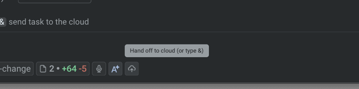
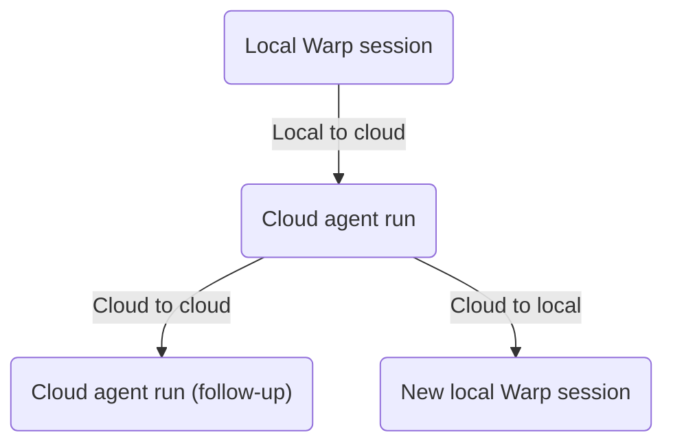

import { VARS } from '@data/vars';

Handoff moves agent work between local Warp sessions and cloud agent runs without making you restart the task. Depending on the direction, Warp carries over conversation history, workspace changes, and attachments so the receiving agent can continue from the prior session instead of starting from scratch.

<figure style={{ maxWidth: "350px" }}>

<figcaption>The Handoff control in a local conversation.</figcaption>
</figure>

## Directions of handoff

Handoff supports three directions:

* **Local to cloud** - Promote a local Warp Agent conversation to a cloud agent run when you need more compute, longer-running work, or parallel variants of the same task. The cloud agent starts from your conversation history and a snapshot of your uncommitted workspace changes. See [Handoff from local to cloud](/platform/handoff/local-to-cloud/).
* **Cloud to cloud** - Send a follow-up to a cloud run after its session has ended. The run continues in the same conversation, with the prior session's workspace state restored. See [Handoff from cloud to cloud](/platform/handoff/cloud-to-cloud/).
* **Cloud to local** - Fork a cloud conversation into a local Warp session with **Continue locally** or `/continue-locally`. See [Viewing cloud agent runs](/platform/viewing-cloud-agent-runs/#5-fork-the-session-to-your-local-warp).

### Third-party agent runtime coverage

Handoff coverage depends on which agent is running the conversation:

* **Cloud to cloud** works for the Warp Agent and the [third-party cloud harnesses currently supported in the {VARS.WARP_AUTOMATION_PLATFORM}](/platform/harnesses/): Claude Code and Codex. For Claude Code and Codex runs, click **Continue**, then enter your follow-up prompt. Warp Agent runs use the streamlined follow-up input.
* **Local to cloud** works for the Warp Agent. It isn't available for third-party CLI agent sessions.

## What carries over

Handoff preserves enough state that the receiving agent can resume the work, not only read about it.

* **Conversation history** - The receiving agent sees the full transcript of the prior session. Local-to-cloud forks the conversation so the source isn't modified; cloud-to-cloud continues in the same conversation.
* **Workspace state** - Local-to-cloud and cloud-to-cloud capture the prior session's repository changes (tracked and untracked) and apply them in the receiving run before the agent answers the next prompt. The cloud-to-local direction doesn't currently apply workspace patches to your local checkout; review the cloud agent's branch or pull request artifact to inspect those changes.
* **Conversation attachments** - Files attached during the prior session remain available to the receiving agent.

Handoff is best-effort. When the receiving agent can apply the prior session's changes cleanly, it picks up where the prior agent left off. When it can't, the agent reports which changes failed to apply and continues with the changes that applied cleanly.

## When to use handoff

Each direction has a clear motivating workflow.

* **Local to cloud** - Use when a local conversation has grown into work that's better done in the cloud: long-running tasks you don't want to keep your laptop awake for, parallel variants of the same task, or steering work from another device once it's running.
* **Cloud to cloud** - Use when a cloud agent finished and you want to send a follow-up without losing the prior workspace state. Also useful when a Slack-triggered or scheduled run completes and someone on the team wants to push it further.
* **Cloud to local** - Use when a cloud agent has done the heavy lifting and you want to take over locally to verify, iterate, or polish before shipping.

## Related pages

* [Cloud agents overview](/platform/) - What cloud agents are, when to use them, and how they fit into the {VARS.WARP_AUTOMATION_PLATFORM}.
* [Managing cloud agents](/platform/managing-cloud-agents/) - Inspect handoff runs from the Agent Management Panel in the Warp app or the Runs page in the {VARS.WEB_APP} alongside local conversations.
* [Viewing cloud agent runs](/platform/viewing-cloud-agent-runs/) - Open and continue a cloud run locally with **Continue locally** or `/continue-locally`.
* [Cloud-synced conversations](/agents/local-agents/cloud-conversations/) - How conversations sync between local and cloud so handoff can find them.
* [Environments](/platform/environments/) - The runtime context a cloud agent runs in after a handoff.
