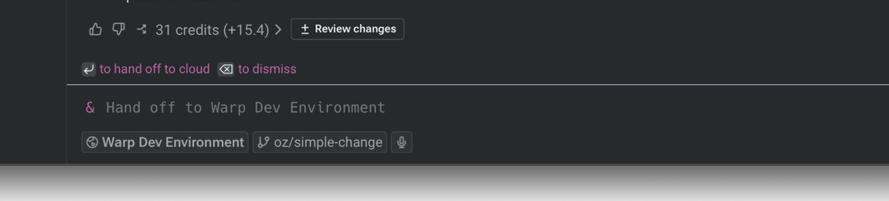
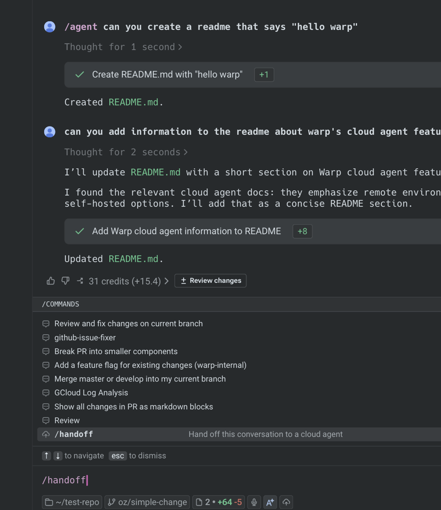
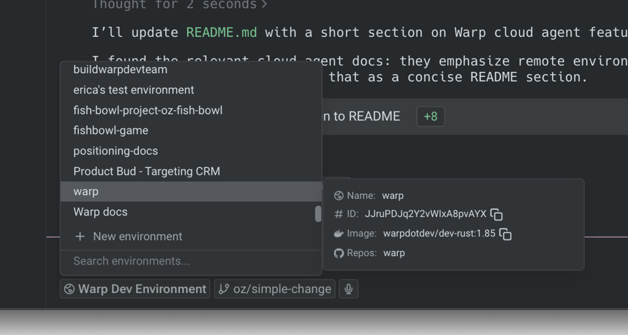
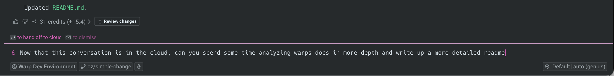

import VideoEmbed from '@components/VideoEmbed.astro';
import { VARS } from '@data/vars';

Local-to-cloud handoff in Warp promotes an active local Warp Agent conversation into a cloud agent run. Warp forks the conversation, snapshots your uncommitted workspace changes, and sends both to the cloud so the agent can continue the same task with the context and files it needs.

Watch this walkthrough to see how to move a local Warp Agent conversation into a cloud agent run.

<VideoEmbed url="https://www.youtube.com/watch?v=9qpGYZ58Wck" title="How to hand off local agents to the cloud in Warp" />

Use this handoff direction when:

* You have a long-running task and don't want to keep your laptop awake.
* You want to fan out variants of the same task across multiple cloud agents in parallel.
* You want to walk away and check on the agent from a different device.
* You want the agent to keep working while you start a new conversation locally.

## What the cloud agent receives

When you hand off from local to cloud, the receiving cloud agent inherits:

* **A forked conversation** - Warp forks your local conversation so the cloud agent inherits the full transcript without modifying the source. See [Cloud-synced conversations](/agents/local-agents/cloud-conversations/) for related sync behavior.
* **A workspace snapshot** - Warp captures your uncommitted repository changes, including both tracked modifications and untracked files, and packages them for the cloud agent. The cloud agent applies them before answering your follow-up.
* **Conversation attachments** - Files attached to the local conversation remain available in the cloud run.

If any changes fail to apply in the cloud run, the cloud agent reports which changes failed and continues with the changes that applied cleanly.

## Prerequisites

* **An active local conversation** - Have a [Warp Agent](/agents/) conversation open in Warp with the work you want to hand off.
* **A configured environment** - The cloud agent needs an [environment](/platform/environments/) that includes the same repositories you're working in locally. The environment's repos must match your local checkout so the workspace snapshot applies cleanly.
* **Cloud conversation storage enabled** - In the Warp app, go to **Settings** > **Privacy** and turn on **Store AI conversations in the cloud** so the conversation can be forked. See [Cloud-synced conversations](/agents/local-agents/cloud-conversations/).
* **Sufficient credits** - Cloud agent runs consume credits. See [Credits](/support-and-community/plans-and-billing/credits/) for how credit usage works, and [Access, billing, and identity](/platform/team-access-billing-and-identity/) for team-specific credit requirements.

## Handing off a conversation to the cloud

1. **Open the handoff flow from your active conversation.** With the local conversation focused, press `&` or run the `/handoff` slash command. Either entry point opens the handoff flow scoped to the current conversation. The `/cloud-agent` slash command always starts a fresh cloud conversation and isn't an entry point for handoff.
2. **Choose the environment for the cloud run.** Pick the one whose repositories match the directories your local conversation has been editing. If you don't have a matching environment yet, create one and add the repos you've been working in.
3. **Add a follow-up prompt and submit.** Enter the next message you want the cloud agent to act on.

The `&` entry point and `/handoff` slash command both open the same handoff flow.

<figure style={{ maxWidth: "375px" }}>

<figcaption>The ampersand handoff entry point.</figcaption>
</figure>

<figure style={{ maxWidth: "375px" }}>

<figcaption>The `/handoff` slash command.</figcaption>
</figure>

After the flow opens, choose the cloud environment and add the follow-up prompt the cloud agent should act on.

<figure style={{ maxWidth: "375px" }}>

<figcaption>The environment selector in the handoff flow.</figcaption>
</figure>

<figure style={{ maxWidth: "563px" }}>

<figcaption>A follow-up prompt before handoff.</figcaption>
</figure>

:::note
The cloud agent runs with the same model your local conversation was using. Changing the model during handoff isn't supported.
:::

After you submit, the cloud agent applies your workspace snapshot and responds to your follow-up. The local conversation is not modified, so you can keep working in it locally or close it.

To check on the new run, open it from the <a href={`${VARS.WEB_APP_URL}/runs`}>Runs page</a> in the {VARS.WEB_APP} or the conversation panel in the Warp app.

## Troubleshooting

**The cloud agent reports that some changes couldn't be applied.**
The most common cause is a repository mismatch between your local checkout and the environment. The workspace snapshot is generated against your local repo's current state; the environment must be on a compatible branch and commit for the changes to apply cleanly. Switch the environment's repo to the branch you were on locally and retry the handoff.

**The cloud agent doesn't see my uncommitted changes.**
Cloud conversation storage must be enabled for handoff to work. In the Warp app, open **Settings** > **Privacy** and confirm **Store AI conversations in the cloud** is on. Otherwise, the conversation can't be forked and the run falls back to starting over.

**The conversation doesn't appear in the cloud run.**
The source conversation may not have finished syncing to the cloud when you triggered the handoff. Wait a moment and retry. If the problem persists, check the conversation panel in the Warp app to confirm the conversation has a cloud-synced indicator.

## Related pages

* [Handoff overview](/platform/handoff/) - What handoff is, the directions it supports, and what carries over.
* [Handoff from cloud to cloud](/platform/handoff/cloud-to-cloud/) - Continue a finished cloud run with workspace state restored.
* [Environments](/platform/environments/) - Configure the repos, image, and setup commands the cloud agent starts in.
* [Multi-agent orchestration](/platform/orchestration/) - Fan the handed-off work across parallel cloud child agents.
* [Viewing cloud agent runs](/platform/viewing-cloud-agent-runs/) - Open and steer the cloud run after handoff.
* [Cloud agents quickstart](/platform/quickstart/) - Run your first cloud agent from scratch.
