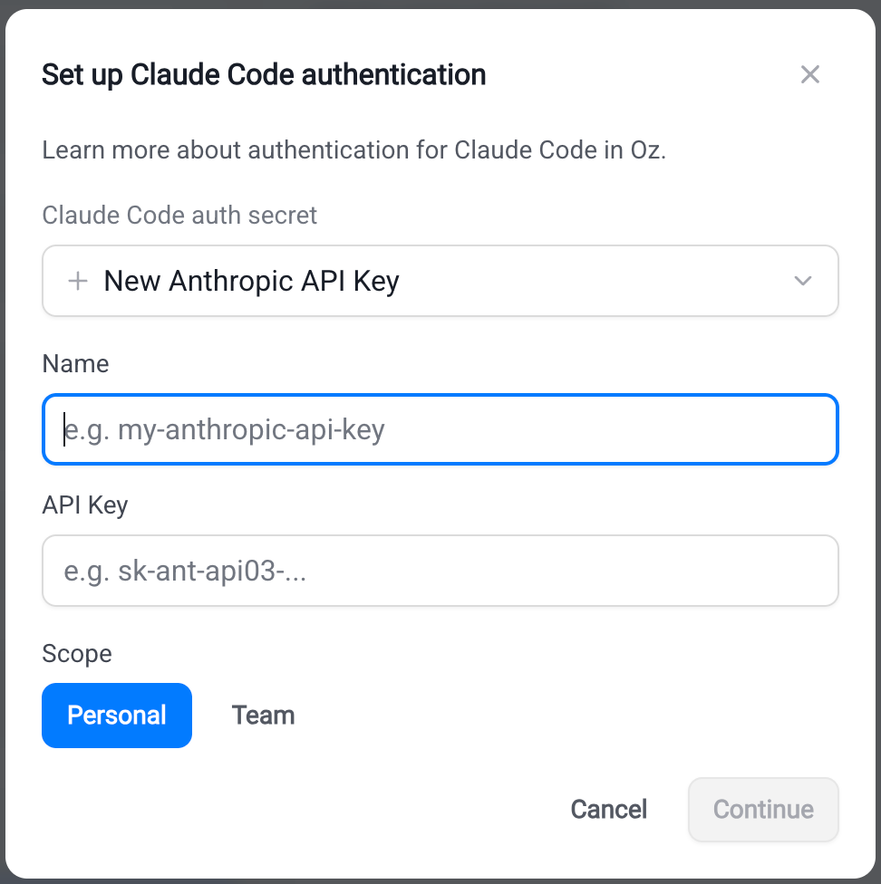

import { VARS } from '@data/vars';

Third-party cloud agent authentication in the {VARS.WARP_AUTOMATION_PLATFORM} stores provider credentials for cloud runs as Warp-managed secrets. Third-party cloud agents, like [Claude Code](#connecting-claude-code-credentials) and [Codex](#connecting-codex-credentials), call their providers directly, so set up an Anthropic or OpenAI credential once before launching a third-party harness.

Auth secrets can be scoped to a **team** (available to all teammates' runs) or **personal** (only your own runs), like any other Warp-managed secret. A [factory agent](/factories/factory-agents/#configuring-a-third-party-harness) can only select **team**-scoped secrets, since a factory's runs aren't tied to one person; personal secrets remain available when you start an ad hoc cloud run instead.

:::note
[Bring Your Own Key (BYOK)](/agents/inference/bring-your-own-api-key/) configured in the Warp desktop app applies to local agent runs only. Cloud runs of Claude Code and Codex always use Warp-managed secrets.
:::

## Connecting Claude Code credentials

Claude Code is Anthropic's agentic coding tool. For more on Claude Code authentication, see [Anthropic's Claude Code auth docs](https://code.claude.com/docs/en/authentication).

### Create an Anthropic API key

1. Go to the [Anthropic Console](https://platform.claude.com/login?returnTo=/?) and sign in or create an account.
2. Confirm your account has API credits. Claude Code runs are billed against your Anthropic API balance.
3. Navigate to the API keys section, then click **Get API key**.
4. Create a new API key and copy the value.

The {VARS.WARP_AUTOMATION_PLATFORM} also supports Bedrock-routed credentials (**Anthropic Bedrock API key** and **Anthropic Bedrock access key**) if your team consumes Anthropic models through AWS.

### Store the API key

#### Warp desktop app

Start a new cloud agent run and choose **Claude Code** from the **Agent harness** dropdown. In the harness auth secret field, add or select your Anthropic credential.

#### Web app

Start a <a href={`${VARS.WEB_APP_URL}/runs/new`}>new run</a>, choose **Claude Code** as the harness, and add a new key in the Claude Code auth secret dialog.

<figure style={{ maxWidth: "563px" }}>

<figcaption>The Claude Code auth secret dialog.</figcaption>
</figure>

#### CLI

```bash
oz secret create claude api-key --team <KEY_NAME>
```

Add `--description "..."` to record rotation notes or owner info. Replace `--team` with `--personal` to make the secret available only to your own runs.

**Expected outcome.** `oz secret list` shows the new secret with the matching Anthropic credential type. The value is never displayed.

## Connecting Codex credentials

Codex is OpenAI's coding agent. For more on Codex authentication, see [OpenAI's Codex auth docs](https://developers.openai.com/codex/auth).

:::caution
A ChatGPT subscription (Plus, Pro, Team) does not include API access. You need a separate OpenAI API key with API credits.
:::

### Create an OpenAI API key

1. Go to the [OpenAI Platform](https://platform.openai.com/) and sign in (or create an account).
2. Confirm your account has API credits. Codex runs are billed against your OpenAI API balance, not a ChatGPT subscription.
3. Navigate to the API keys section, then click **Create API key**.
4. In the **Create new secret key** dialog, choose the owner, project, and permissions for the key.
5. Click **Create secret key**, then copy the value.

### Store the API key

#### Warp desktop app

Start a new cloud agent run and choose **Codex** from the **Agent harness** dropdown. In the harness auth secret field, add or select your OpenAI credential.

#### Web app

Start a <a href={`${VARS.WEB_APP_URL}/runs/new`}>new run</a>, choose **Codex** as the harness, and add a new key in the Codex auth secret dialog.

#### CLI

```bash
oz secret create codex api-key --team <KEY_NAME>
```

Add `--description "..."` to record rotation notes or owner info. Replace `--team` with `--personal` to make the secret available only to your own runs.

**Expected outcome.** `oz secret list` shows the new secret with the matching OpenAI credential type. The value is never displayed.

## Managing harness auth secrets

Auth secrets follow the same management commands as any other Warp-managed secret. See [Cloud agent secrets](/platform/secrets/) for the full reference. Common tasks:

```bash
# List secrets you can see
oz secret list

# Rotate a secret value (prompts for the new value)
oz secret update --team --value ANTHROPIC_API_KEY

# Update the description
oz secret update --team --description "Rotated 2026-05-12; owned by platform team" ANTHROPIC_API_KEY

# Delete a secret (irreversible)
oz secret delete --team ANTHROPIC_API_KEY
```

:::caution
Deleting an auth secret breaks any scheduled or integration-triggered run that references it by name. Update the schedules and integrations to point at a new secret first.
:::

## Troubleshooting

**Claude Code or Codex run fails with an authentication error.**\
Confirm the run was started with a harness auth secret selected. From the {VARS.WEB_APP}'s run detail pane, the **Harness auth secret** field shows which secret (if any) was used. Re-launch the run with the correct secret selected, or create one if your team doesn't have one yet.

**The harness auth secret dropdown is empty.**\
The dropdown only lists secrets whose type matches the selected harness — Anthropic types for Claude Code, OpenAI for Codex. If you stored the credential as a raw value, recreate it using the typed flow above.

**The selected harness is disabled.**\
Your team admin has disabled the harness for your workspace. Contact your admin or pick a different harness for the run.

## Related pages

* [Harnesses in the {VARS.WARP_AUTOMATION_PLATFORM}](/platform/harnesses/) — overview of third-party harnesses in the {VARS.WARP_AUTOMATION_PLATFORM}.
* [Claude Code in Warp](/agents/cli-agents/claude-code/) — run Claude Code locally in the Warp terminal.
* [Codex CLI in Warp](/agents/cli-agents/codex/) — run Codex locally in the Warp terminal.
* [Cloud agent secrets](/platform/secrets/) — the full Warp-managed secrets reference.
