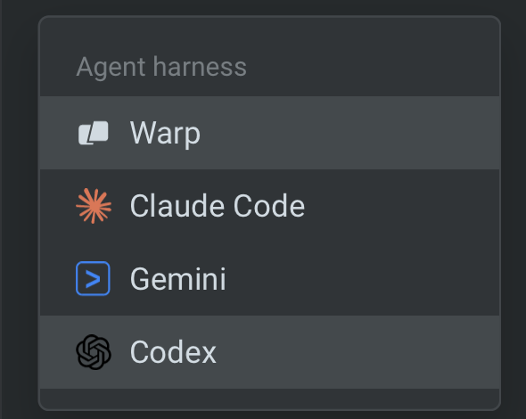

import VideoEmbed from '@components/VideoEmbed.astro';
import { VARS } from '@data/vars';

The {VARS.WARP_AUTOMATION_PLATFORM} can run third-party agent harnesses as cloud agents alongside Warp Agent, including [Claude Code](/platform/harnesses/claude-code/) and [Codex](/platform/harnesses/codex/). You choose the harness (agent runtime) that fits the task; the platform around the run stays the same.

Watch this walkthrough to see how to run Warp Agent, Claude Code, or Codex as a cloud agent.

<VideoEmbed url="https://www.youtube.com/watch?v=ZUYyuA5i1VU" title={`Run any agent in the cloud with the ${VARS.WARP_AUTOMATION_PLATFORM} - Claude Code, Codex, or Warp Agent`} />

## What stays the same

Third-party harnesses inherit the same {VARS.WARP_AUTOMATION_PLATFORM} features as Warp Agent:

* **Triggers** — Slack, Linear, schedules, CI, and API [triggers](/platform/triggers/) launch any harness.
* **Environments and secrets** — Reuse the same [environments](/platform/environments/) and [agent secrets](/platform/secrets/).
* **Skills and Rules** — Saved [Skills](/agents/capabilities/skills/) and [Rules](/agents/capabilities/rules/) apply across harnesses.
* **Observability** — Every run produces a transcript and shareable session in the [{VARS.DASHBOARD}](/platform/managing-cloud-agents/).

## Plan requirements

Third-party harnesses require a Build plan or higher. On the Free plan, cloud agent runs use Warp Agent, and choosing another harness returns an upgrade prompt. See [Warp pricing](https://www.warp.dev/pricing) for what each plan includes.

## Billing

Claude Code and Codex each call their provider directly using credentials you supply, and the provider bills your account for inference. Warp meters [compute credits](/support-and-community/plans-and-billing/credits/#compute-credits) for the run's sandbox and [platform credits](/support-and-community/plans-and-billing/platform-credits/) for the [multi-agent orchestration](/platform/orchestration/) layer.

## How to switch harnesses

### Warp app

In Cloud Mode, choose a harness from the **Agent harness** dropdown above the input.

<figure style={{ maxWidth: "375px" }}>

<figcaption>The Agent harness selector.</figcaption>
</figure>

:::note
You can enter Cloud Mode by creating a new **Cloud Agent** tab or by using the `/cloud-agent` slash command.
:::

### Web app

On the new run or new schedule pane, choose the harness in the **Harness** field.

### API and SDK

Set the `harness` field on the agent config. See the [API reference](/reference/api-and-sdk/) for the exact field names.

## Related pages

* [Warp Agent with the {VARS.WARP_AUTOMATION_PLATFORM}](/platform/harnesses/warp-agent/) — the {VARS.WARP_AUTOMATION_PLATFORM}'s default first-party harness.
* [Claude Code with the {VARS.WARP_AUTOMATION_PLATFORM}](/platform/harnesses/claude-code/) — Claude Code as a cloud harness.
* [Codex with the {VARS.WARP_AUTOMATION_PLATFORM}](/platform/harnesses/codex/) — Codex as a cloud harness.
* [Authentication](/platform/harnesses/authentication/) — connect credentials and launch Claude Code or Codex.
* [Multi-agent orchestration](/platform/orchestration/) — run parent and child agents across harnesses and locations.
* [Third-party CLI agents in the Warp terminal](/agents/cli-agents/overview/) — run Claude Code, Codex, and other CLI agents locally.
