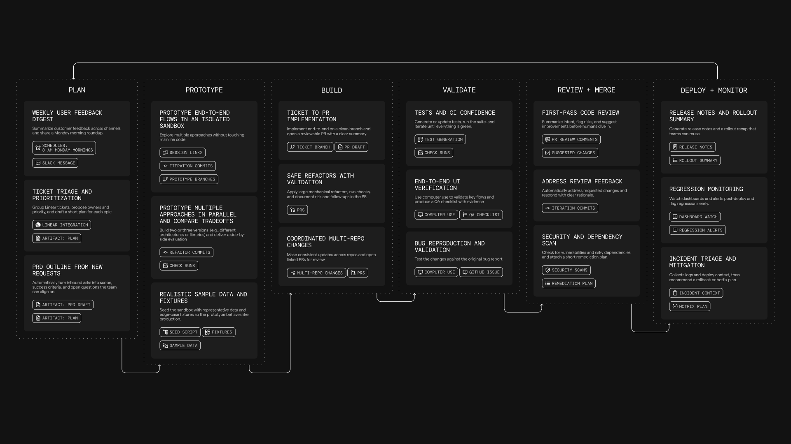

import { VARS } from '@data/vars';
import VideoEmbed from '@components/VideoEmbed.astro';

{/* Transition notice for the 2026-08-18 rename. Remove after 2026-09-15, when
    the CLI and web app take their new names and the old one stops appearing. */}
:::note
**Oz is now the [{VARS.WARP_AUTOMATION_PLATFORM}](/platform/overview/).** Only the name changed. Your existing cloud agents, integrations, API keys, and schedules keep working exactly as before. The `oz` CLI and the <a href={VARS.WEB_APP_URL}>{VARS.WEB_APP}</a> keep the Oz name until September 15, 2026.
:::

Cloud agents are autonomous, background agents that run on Warp's cloud infrastructure or your own, triggered by system events, schedules, or integrations like Slack and GitHub. They execute tasks with full observability — every run is tracked, inspectable, and shareable across your team.

**New to cloud agents?** Start with the [Cloud agents quickstart](/platform/quickstart/) to run your first cloud agent in ~10 minutes.

### Monitor, inspect, and share cloud agent runs

To understand what a cloud agent did, start from the [Agent Management Panel](/platform/managing-cloud-agents/) in the Warp app or the [Runs page in the {VARS.WEB_APP}](/platform/oz-web-app/#runs). From there, you can find a run by source, status, trigger, or owner; open the run transcript; inspect the prompt, plan, commands, logs, and output; and share the session link with teammates for review.

For a full walkthrough, see [Viewing cloud agent runs](/platform/viewing-cloud-agent-runs/). If the run came from Slack, Linear, GitHub Actions, a schedule, the CLI, or the API, it still produces a reviewable cloud agent run record.

<VideoEmbed url="https://youtu.be/poLkJhO7fdo" title="Cloud agents overview" />

### What cloud agents are designed for

Cloud agents are designed for situations where:

* **You need agents to react to system events.**
  * Examples include crashes, bug reports, [Slack interactions](/platform/integrations/slack/), cron timers, or CI steps.
* **You want observability into agent activity across a team or system.**
  * This includes being able to see what ran, when it ran, what triggered it, what the agent did, and how teammates can review or share the result.
* **You need more parallelism than local execution typically allows.**
  * For example, running many agent tasks concurrently in the cloud, sharding a repo-wide task into multiple runs, or fanning out the same task across multiple targets.
* **You want agents to operate continuously as part of engineering infrastructure.**
  * This includes [scheduled maintenance tasks](/platform/triggers/scheduled-agents/) and integration-driven automation.

---

### What is a cloud agent run?

A cloud agent run is represented as an agent task. A task is created when a trigger fires (for example a webhook event or schedule) or when a user starts a run explicitly.

Each task includes:

* **Inputs**: a prompt, and often additional context from the triggering system (for example a Slack message, PR metadata, or CI logs).
* **Execution context (optional)**: an [Environment](/platform/environments/) that defines the repo, image, and startup commands the agent should run with.
* **Lifecycle state**: created → running → completed / failed.
* **Persistent record**: status, metadata, and a session transcript that can be reviewed after the task completes, including the prompt, plan, commands, logs, outputs, and follow-up messages where available.

:::note
If you are evaluating whether something should be a cloud agent, a good test is whether you can define:\
(1) what triggers it, (2) what context it needs, and (3) how the team will inspect or validate the output.
:::

### How cloud agents work

Cloud agents run on the [{VARS.WARP_AUTOMATION_PLATFORM}](/platform/overview/), which provides the primitives for triggering work, orchestrating tasks, executing agents (optionally in environments), injecting secrets, and inspecting results.

* Something **triggers** an agent task.
* The **orchestrator creates** and tracks the task.
* The agent **executes** on a host, optionally inside an [environment](/platform/environments/), with whatever [secrets](/platform/secrets/) and credentials it needs.

The exact way tasks are triggered and executed depends on your deployment model (for example CLI-only, Warp-hosted orchestration, or self-hosted execution). Those options are covered in the [Deployment Patterns](/platform/deployment-patterns/) pages.

For teams that need execution to stay within their network boundary, self-hosting supports two architectures: a **managed** worker daemon that lets the {VARS.WARP_AUTOMATION_PLATFORM} orchestrate agents in Docker containers on your machines, and an **unmanaged** mode where you run `oz agent run` directly in your CI, Kubernetes, or dev environment. See [Self-hosting](/platform/self-hosting/) for details.

### What you get by default

Because cloud agents run on the [{VARS.WARP_AUTOMATION_PLATFORM}](/platform/overview/), each run is tracked and produces a persistent record that can be observed, shared, and reviewed (even if execution happens outside the Warp app).

#### Codebase Context

Cloud agent runs automatically benefit from [Codebase Context](/agents/capabilities/codebase-context/) for semantic code understanding and search, as long as Codebase Context is enabled for your account. See [Codebase Context in cloud agent runs](/agents/capabilities/codebase-context/#codebase-context-in-cloud-agent-runs) for details.

#### Observability and steerability

Cloud agent tasks are designed to be inspectable by the team:

* The [Agent Management Panel](/platform/managing-cloud-agents/) in the Warp app and the [Runs page in the {VARS.WEB_APP}](/platform/oz-web-app/#runs) surface task status, source, trigger, creator, history, and credit usage.
* [Cloud agent session sharing](/platform/viewing-cloud-agent-runs/) opens the run transcript so teammates can inspect the prompt, plan, commands, logs, files changed, outputs, and follow-up messages where available.
* [Agent Session Sharing](/agents/local-agents/session-sharing/) lets authorized teammates share, monitor, and steer live local or third-party agent sessions.

#### Centralized configuration

Cloud agent workflows often rely on shared configuration such as [MCP servers](/platform/mcp/), rules, saved prompts, environment variables, and [secrets](/platform/secrets/).

Warp supports centralized configuration so the same workflow behaves consistently across triggers (for example Slack + CI + schedules), without duplicating setup in every system.

For details on configuring MCP servers for cloud agents, see [MCP Servers](/platform/mcp/).

#### API access to tasks

The {VARS.WARP_AUTOMATION_PLATFORM} exposes task visibility via the [**{VARS.API_SDK_NAME}**](/reference/api-and-sdk/), so teams can:

* Query which tasks are running or have run.
* Fetch task metadata and outcomes.
* Build internal dashboards or monitoring (for example success rates, runtime, failure reasons).

### Using cloud agents with or without the Warp app

Cloud agents do not require the Warp app. Teams can deploy and operate them through the [{VARS.WARP_AUTOMATION_PLATFORM}](/platform/overview/) using:

* [{VARS.WARP_AGENT_CLI}](/reference/cli/) — run agents from scripts, CI, or the terminal
* [{VARS.WEB_APP}](/platform/oz-web-app/) — visual interface for managing runs, schedules, environments, and integrations (works on mobile)
* [Agent Session Sharing](/agents/local-agents/session-sharing/) — attach to running tasks to monitor or steer
* [Agent Management Panel](/platform/managing-cloud-agents/) — view agent activity and run history in the Warp app
* [APIs and SDKs](/reference/api-and-sdk/) — programmatic access for custom integrations

If your team also uses Warp's terminal, you get an additional workflow: tasks launched via the CLI can be handed off into an interactive session for review, edits, or continuation.

---

### Billing and plan requirements

Cloud agents and [integrations](/platform/integrations/) run on the [{VARS.WARP_AUTOMATION_PLATFORM}](/platform/overview/) control plane, and usage is billed using credits.

:::note
[Bring Your Own API Key (BYOK)](/agents/inference/bring-your-own-api-key/) is not supported for cloud agent runs. BYOK keys are stored locally on your device and are not accessible to cloud-hosted agents. All cloud agent runs consume Warp credits.
:::

#### For cloud agents via CLI/API

Individual users can run cloud agents without being on a team. Requirements:

* You need at least 20 credits available
* Cloud agents run on Warp-hosted infrastructure
* Self-hosted agents require a team subscription

#### For integrations (Slack/Linear)

Integrations require you to be part of a [Warp team](/knowledge-and-collaboration/teams/) and additional requirements:

* **Plan requirements**
  * **Supported plans**: Build, Max, Business
  * Your plan must support add-on credits.
* **Credit requirements**
  * Your team must have at least 20 credits available to run cloud agents and integrations.

For more details, see [Access, Billing, and Identity Permissions](/platform/team-access-billing-and-identity/).

:::caution
If your credit balance reaches zero, cloud agent runs will not be able to execute until credits are replenished.
:::

---

### Learn more

* [Cloud agents quickstart](/platform/quickstart/) — run your first cloud agent with an environment in ~10 minutes.
* [{VARS.WARP_AUTOMATION_PLATFORM}](/platform/overview/) — CLI, {VARS.API_SDK_NAME}, orchestration, tasks, environments, hosts, integrations, and more.
* [Harnesses](/platform/harnesses/) — pick between Warp Agent, Claude Code, and Codex for any cloud agent run.
* [Agents](/platform/agents/) — cloud agents that own and execute runs on your team.
* [Multi-agent orchestration](/platform/orchestration/) — coordinate a parent agent and its child agents across local and cloud runs to build supervisor/worker, fan-out, critic, DAG, and swarm workflows.
* [Skills as Agents](/platform/skills-as-agents/) — run agents based on reusable skill definitions from the CLI, web app, API, or on a schedule.
* [{VARS.WARP_AGENT_CLI}](/reference/cli/) — shows how to run agents in non-interactive mode from CI, scripts, or remote machines, including auth and common commands.
* [Environments](/platform/environments/) — explains how environments provide the runtime context (repo, image, startup commands) for agent tasks.
* [{VARS.API_SDK_NAME}](/reference/api-and-sdk/) — documents the REST API for creating, querying, and monitoring agent tasks programmatically.
* [Agent Secrets](/platform/secrets/) — covers how to store, scope, and inject credentials into agent runs safely.
* [MCP Servers](/platform/mcp/) — how to configure MCP servers for agent tool access and how MCP configuration is applied across runs.
* [Deployment Patterns](/platform/deployment-patterns/) (beta) — compares common ways to deploy cloud agents and when to use each.
* [Access, Billing, and Identity Permissions](/platform/team-access-billing-and-identity/) — explains individual and team-level requirements, credit billing behavior, and the permission model for who can run, view, and steer cloud agent tasks.
