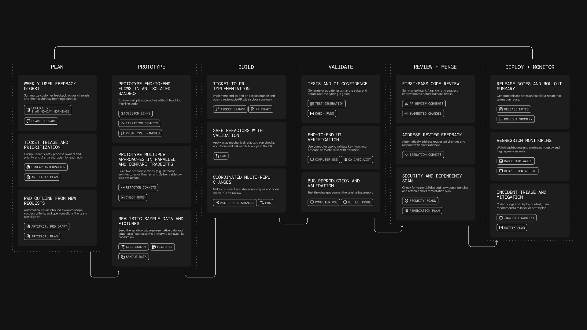

import { VARS } from '@data/vars';

Cloud agents execute a request away from your laptop, on Warp-hosted compute or your own infrastructure. For example, an agent can investigate a failed build, review a pull request, or respond to an issue filed in your tracker.

For a standing team workflow with agents, automations, and tools to evaluate results, start with [Warp Factories](/factories/). To run cloud agents directly from Warp, use the [cloud agents quickstart](/platform/quickstart/).

Already using the legacy web app or CLI? See [transitioning from Oz to Warp Factories](/platform/transitioning-from-oz/). The standalone workflows below remain distinct from factory setup.

## Monitor, inspect, and share cloud agent runs

For factory work, open the factory's [Runs page](/factories/factory-dashboard/#inspect-runs). For standalone workflows, use the [Agent Management Panel](/platform/managing-cloud-agents/) in Warp or the [legacy Runs page](/platform/oz-web-app/#runs).

Open a run's transcript to inspect its prompt, commands, logs, and outputs, or to share its session link with teammates. See [viewing cloud agent runs](/platform/viewing-cloud-agent-runs/) for steering and continuing a session.

## What cloud agents are designed for

* **Event-driven work** - Respond to bug reports, [Slack messages](/platform/integrations/slack/), or CI failures.
* **Parallel tasks** - Use [multi-agent orchestration](/platform/orchestration/) to divide independent work among agents running in the cloud.
* **Recurring maintenance** - Run [scheduled agents](/platform/triggers/scheduled-agents/) for dependency checks, cleanup, or reports.

Cloud agents can assist throughout the development lifecycle, from planning a change to validating it and investigating problems after deployment.

<figure style={{ maxWidth: "736px" }}>

<figcaption>Cloud-agent work spans the software development lifecycle.</figcaption>
</figure>

---

## Preparing a cloud-agent task

Before automating a task, identify its trigger, the context the agent needs, and how someone will validate its result.

## How cloud agents work

The [{VARS.WARP_AUTOMATION_PLATFORM} overview](/platform/overview/) explains the execution model shared by factories and standalone agents, including environments and credentials.

The exact way tasks are triggered and executed depends on your deployment model. [Deployment patterns](/factories/deployment-patterns/) covers Warp-hosted and managed self-hosted execution for factories. For standalone agents, see [Unmanaged execution](/platform/unmanaged-execution/).

For teams that need execution to stay within their network boundary, self-hosting supports two architectures: a **managed** worker daemon that lets the {VARS.WARP_AUTOMATION_PLATFORM} orchestrate agents in Docker containers on your machines, and an **unmanaged** mode where you run `oz agent run` directly in your CI, Kubernetes, or dev environment. See [Self-hosting](/factories/self-hosting/) for details.

## What you get by default

The following features apply to standalone cloud-agent workflows. For factory configuration, see [definitions as code](/factories/factory-as-code/).

### Codebase Context

Cloud agent runs automatically benefit from [Codebase Context](/agents/capabilities/codebase-context/) for semantic code understanding and search, as long as Codebase Context is enabled for your account. See [Codebase Context in cloud agent runs](/agents/capabilities/codebase-context/#codebase-context-in-cloud-agent-runs) for details.

### Centralized configuration

Configure [MCP servers](/platform/mcp/) and [secrets](/platform/secrets/) for the tools your task needs. The [shared configuration reference](/platform/overview/#shared-configuration) links to each configuration type and its scope.

### API access to tasks

The [{VARS.WARP_PLATFORM_API}](/factories/api-and-sdk/) lets you query run status, metadata, and results from your own services.

## Using cloud agents with or without the Warp app

Cloud agents do not require the Warp app. Teams can deploy and operate them through the [{VARS.WARP_AUTOMATION_PLATFORM}](/platform/overview/) using:

* [{VARS.WARP_AGENT_CLI}](/agents/cli/oz-cli/) — run agents from scripts, CI, or the terminal
* [{VARS.WEB_APP}](/platform/oz-web-app/) — visual interface for managing runs, schedules, environments, and integrations (works on mobile)
* [Agent Session Sharing](/agents/local-agents/session-sharing/) — attach to running tasks to monitor or steer
* [Agent Management Panel](/platform/managing-cloud-agents/) — view agent activity and run history in the Warp app
* [APIs and SDKs](/factories/api-and-sdk/) — programmatic access for custom integrations

Use [Handoff](/platform/handoff/) to continue work between local and cloud sessions.

---

## Billing and plan requirements

Cloud agents and [integrations](/platform/integrations/) run on the [{VARS.WARP_AUTOMATION_PLATFORM}](/platform/overview/) control plane, and usage is billed using credits.

:::note
[Bring Your Own API Key (BYOK)](/agents/inference/bring-your-own-api-key/) is not supported for cloud agent runs. BYOK keys are stored locally on your device and are not accessible to cloud-hosted agents. All cloud agent runs consume Warp credits.
:::

### For cloud agents via CLI/API

Individual users can run cloud agents without being on a team. Requirements:

* You need at least 20 credits available
* Cloud agents run on Warp-hosted infrastructure
* Self-hosted agents require a team subscription

### For integrations (Slack/Linear)

Integrations require you to be part of a [Warp team](/knowledge-and-collaboration/teams/) and additional requirements:

* **Plan requirements**
  * **Supported plans**: Build, Max, Business
  * Your plan must support add-on credits.
* **Credit requirements**
  * Your team must have at least 20 credits available to run cloud agents and integrations.

For more details, see [Access, Billing, and Identity Permissions](/platform/team-access-billing-and-identity/).

:::caution
If your credit balance reaches zero, cloud agent runs will not be able to execute until credits are replenished.
:::

---

## Related pages

* [Cloud agents quickstart](/platform/quickstart/) — run a cloud agent with an environment.
* [{VARS.WARP_AUTOMATION_PLATFORM}](/platform/overview/) — CLI, {VARS.WARP_PLATFORM_API}, orchestration, tasks, environments, hosts, integrations, and more.
* [Warp Factories](/factories/) — configure a standing development workflow and evaluate its results.
* [Harnesses](/platform/harnesses/) — pick between Warp Agent, Claude Code, and Codex for any cloud agent run.
* [Agents](/platform/agents/) — cloud agents that own and execute runs on your team.
* [Multi-agent orchestration](/platform/orchestration/) — coordinate a parent agent and its child agents across local and cloud runs to build supervisor/worker, fan-out, critic, DAG, and swarm workflows.
* [Skills as Agents](/platform/skills-as-agents/) — run agents based on reusable skill definitions from the CLI, web app, API, or on a schedule.
* [{VARS.WARP_AGENT_CLI}](/agents/cli/oz-cli/) — shows how to run agents in non-interactive mode from CI, scripts, or remote machines, including auth and common commands.
* [Environments](/platform/environments/) — explains how environments provide the runtime context (repo, image, startup commands) for agent tasks.
* [{VARS.WARP_PLATFORM_API}](/factories/api-and-sdk/) — documents the REST API for creating, querying, and monitoring agent tasks programmatically.
* [Agent Secrets](/platform/secrets/) — covers how to store, scope, and inject credentials into agent runs safely.
* [MCP Servers](/platform/mcp/) — how to configure MCP servers for agent tool access and how MCP configuration is applied across runs.
* [Deployment Patterns](/factories/deployment-patterns/) (beta) — compares common ways to deploy cloud agents and when to use each.
* [Access, Billing, and Identity Permissions](/platform/team-access-billing-and-identity/) — explains individual and team-level requirements, credit billing behavior, and the permission model for who can run, view, and steer cloud agent tasks.
