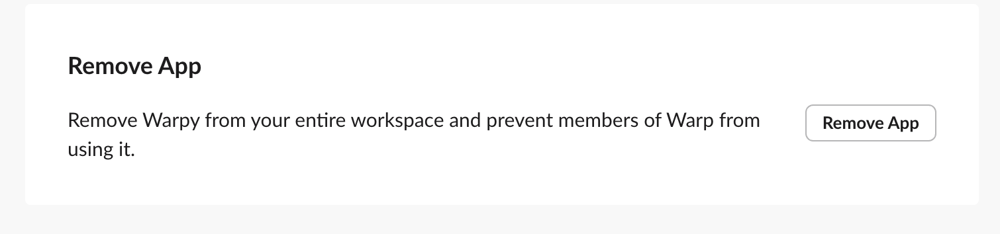

import { VARS } from '@data/vars';

The Slack integration lets your team trigger cloud agents directly from Slack conversations. Tag @Warp in a message or DM the bot to start a cloud agent that clones your repos, works through the task, posts progress updates, and opens pull requests back into the same thread.

### Get started

#### Installation

1. Log in to the <a href={VARS.WEB_APP_URL}>{VARS.WEB_APP}</a> and go to the <a href={`${VARS.WEB_APP_URL}/integrations`}>Integrations page</a>.
2. Click **Connect** next to **Slack**. You'll be prompted to install the Warp app into your Slack workspace.
3. After installing, you're returned to the Integrations page to finish setup: choose the [environment](/platform/environments/) agents should use, which defines the repos, Docker image, and setup commands.
4. Start using Warp in Slack by mentioning **@Warp** with a task.

Alternatively, install via the [{VARS.WARP_AGENT_CLI}](/reference/cli/):

```
oz integration create slack --environment <ENV_ID>
```

The CLI opens a browser window to install the Warp app into your Slack workspace. After installation, the integration is available to all members of your Warp team.

#### Requirements

* **Team membership** - The Slack integration requires you to be part of a [Warp team](/knowledge-and-collaboration/teams/). Teams can be created on any plan, including Free.
* **Plan and credits** - Your team must have cloud agents enabled and credits available. See [Access, Billing, and Identity](/platform/team-access-billing-and-identity/) for details.
* **Infrastructure** - By default, agents run on Warp-hosted infrastructure. Enterprise teams can [self-host agents](/platform/self-hosting/) on their own infrastructure.

---

### Using Warp inside Slack

Tagging @Warp in a message or thread starts an agent run. The agent clones the repositories in your environment, sets up your development environment using your Docker image and setup commands, and begins working with the context from the Slack conversation. The bot posts updates back into the thread as it progresses so you can follow along without opening your terminal.

Agents also share a link to an interactive remote session using Warp's [cloud agent session sharing](/platform/viewing-cloud-agent-runs/). Opening this link gives you a live terminal view of the cloud agent running your code. You can interrupt or steer the agent by providing additional instructions, and the agent will pick up where it left off with the new context.

When the work is complete, Warp will create a pull request on your behalf using your GitHub permissions and send a summary and PR link back to the original Slack thread.

### Triggering an agent

You can start an agent in three ways:

*   **Tag @Warp in a channel message**

    Describe the task, and Warp will begin working with full context from the thread.
*   **Tag @Warp inside a thread**

    Warp will automatically collect the thread's prior messages and use them as context.
*   **DM the Warp bot directly**

    Useful for private tasks or experimentation.

The bot will acknowledge the request in Slack and start running the task immediately.

### Monitoring agent progress

Agents keep you informed directly in Slack via:

* Activity updates showing progress throughout the run
* Checkpoints indicating major steps completed
* A direct link to the {VARS.PLATFORM_RUN} in the [{VARS.WEB_APP}](/platform/oz-web-app/), where you can view the full run transcript and metadata
* A session-sharing link that opens a live terminal view of the remote agent

[Cloud agent session sharing](/platform/viewing-cloud-agent-runs/) works in Warp or in your browser and supports multiple teammates joining the same live session.

To monitor Slack-triggered runs alongside the rest of your team's agents, open the [Agent Management Panel](/platform/managing-cloud-agents/) in the Warp app, where integration-triggered runs appear in the **All** tab.

### Joining the live remote session

Selecting **View conversation** opens the active agent session. Inside the session you’ll see:

* The agent’s full execution log
* The plan/task list
* Real-time output just like a local Warp task
* An input box for follow-up instructions

Any instruction you type will interrupt the agent, incorporate the new guidance, and then resume execution. This is the best way to debug or steer multi-step tasks.

### Pull requests and output

Once the agent finishes, it will:

* Commit changes using your GitHub account
* Create a pull request via the GitHub CLI
* Generate a clean title and description referencing your Slack request
* Post the summary and PR link directly into the Slack thread

Because PRs are created as you, the workflow slots seamlessly into your team’s existing review process.

---

### Configuration

#### 1. Create an environment

An environment defines everything the agent needs to run your code in the cloud:

* A Docker image (public on Docker Hub)
* The GitHub repos the agent should clone
* Optional setup commands that run before the agent starts

Create an environment via:

* **{VARS.WARP_AGENT_CLI}**

```bash
oz environment create \
  --name <name> \
  --docker-image <image> \
  --repo <owner/repo> \
  --setup-command "<command>"
```

*   **Guided setup using `/create-environment`** ( [Slash Commands](/agents/capabilities/slash-commands/))

    This flow analyzes your repos, recommends a Docker image, suggests setup commands, and can build + push a custom image if needed.

See the [Environments](/platform/environments/) docs for detailed instructions.

#### 2. Optional: custom prompt

You can attach a custom prompt that is applied to every agent run:

```
oz integration create slack \
  --environment <ENV_ID> \
  --prompt "Always prefix PR titles with '[WARP]' and include detailed test steps."
```

:::tip
If the integration cannot be created or a Slack-triggered run cannot start, use the returned error code to narrow the fix. Common errors include:

* [`feature_not_available`](/reference/api-and-sdk/troubleshooting/errors/feature-not-available/) (plan does not support integrations)
* [`external_authentication_required`](/reference/api-and-sdk/troubleshooting/errors/external-authentication-required/) (missing GitHub or Slack authorization)
:::

### Identity mapping and team access

* Integrations are scoped to your Warp team.
* Any teammate in the same Slack workspace and Warp team can use the integration.
* The first time you mention the bot or DM it, Warp sends you a link to connect your Slack identity to your Warp account.
* Teammates must individually authorize GitHub on their first run.

---

### Privacy

The Warp app reads Slack messages only where it is mentioned or directly messaged: the triggering message, its thread history (used as task context), and your Slack profile information. Message content is used to run the agent task and is handled per the [Warp Privacy Policy](https://www.warp.dev/privacy), which describes how Warp collects, manages, and stores third-party data.

### Uninstallation instructions

To remove the Warp app from your Slack workspace:

1. Open Slack and go to **Apps** in the left sidebar.
2. Search for Warp.
3. Select the app, then open the **About** tab.
4. Click **Configuration**. This will open your workspace’s app configuration page in the browser.
5. Scroll to the bottom and select **Remove App**.
6. Confirm the removal.

<figure>

<figcaption>The Warp Slackbot in Slack.</figcaption>
</figure>



Once removed, Slack will immediately disable the integration for all teammates. Events for a disabled integration can return [`integration_disabled`](/reference/api-and-sdk/troubleshooting/errors/integration-disabled/).

### Troubleshooting

If something isn't working—missing repos, Slack not detecting @Warp, PR failures, or environment configuration issues—see [troubleshooting cloud agent environments](/platform/environments/troubleshooting-environments/). It covers:

* GitHub authorization and repo access
* Docker image incompatibility
* Missing credentials and secrets
* Setup commands that fail on a fresh container

For identity mismatches and installation problems, see [identity mapping and team access](/platform/integrations/slack/#identity-mapping-and-team-access) above.
