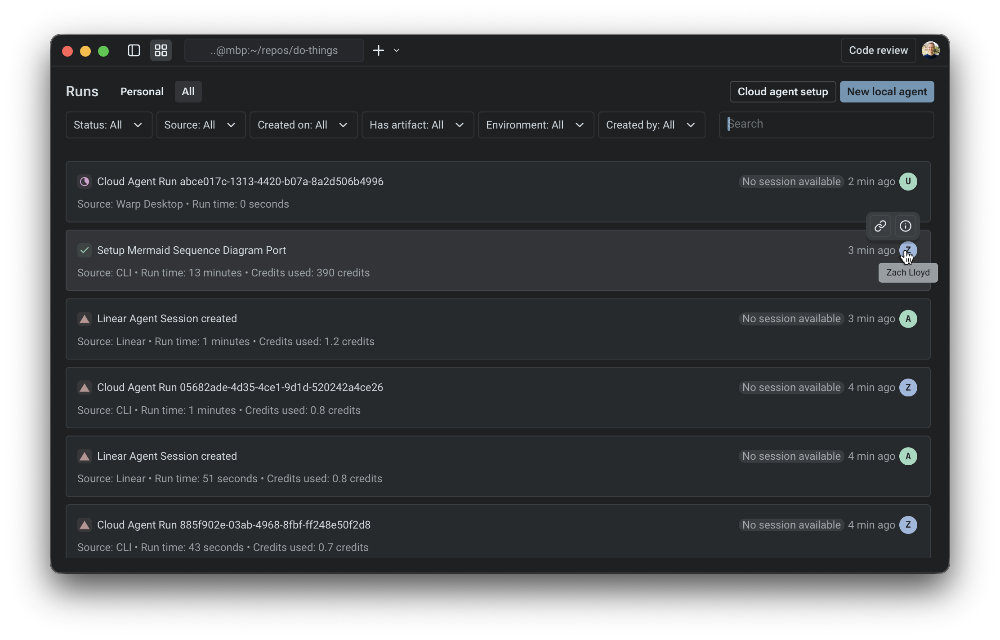

import VideoEmbed from '@components/VideoEmbed.astro';

Warp provides two management surfaces for tracking and observing agent activity across your account and, where applicable, your team: the **Agent Management Panel** in the Warp app and the [**Runs** page in the Oz web app](/platform/oz-web-app/#runs), which also works on mobile devices.

Use these surfaces as the starting point for real-time agent observability in Warp. They help you see which agents are active, which runs are blocked or failed, where each run started, and which session link opens the prompt, plan, commands, logs, outputs, and follow-up messages behind the work.

The Agent Management Panel and Oz web app Runs page are designed to answer, at a glance:

* Which agents are active or have been running recently.
* Which runs are working, blocked, failed, succeeded, or canceled.
* Where an agent run was triggered from, such as a local agent conversation, the Oz CLI, Slack, Linear, a schedule, or the API.
* How parent and child runs relate in orchestrated workflows.
* Which session to open when you need prompt, plan, command, log, output, or follow-up context.
* How many credits those runs consumed.

Warp's agent observability is run- and session-oriented. It is not a replacement for full APM, OpenTelemetry, or Datadog-style tracing across arbitrary agent frameworks. Use Warp to track agent run status, trigger/source, owner, parent-child relationships, transcripts, commands, logs, outputs, and replayable session links.

<VideoEmbed url="https://www.loom.com/share/679c267ddd2d44519abf79edcb1122c7" title="Managing cloud agent runs video" />

These management surfaces include your **local (interactive) agents** and [cloud agent](/platform/) runs.

<figure style={{ maxWidth: "563px" }}>

<figcaption>Warp's Agent Management Panel showing interactive and cloud agent runs.</figcaption>
</figure>

### What appears in the agent management surfaces

The Agent Management Panel and Oz web app Runs page include two categories of agent activity.

#### Interactive agents

* Initiated from the Warp app.
* The conversation is owned by you. It opens locally in Warp, and can be shared via a link when needed.
* Credit usage reflects inference.

#### Cloud agent runs

* Background executions initiated by triggers such as integrations and automations (for example: Slack, Linear, schedules, GitHub Actions, or API/CLI invocations).
* Each run produces a shared session that can be inspected after completion (including logs, messages, and outputs).
* Credit usage reflects inference + compute, shown as a single combined value in this view.

:::caution
All usage rolls up into Warp's standard [**credit**](/support-and-community/plans-and-billing/credits/) system.
:::

In the **Personal** tab, you can view all of the interactive and cloud agent conversations that you own. In the **All** tab, you can see everything from the personal tab, as well as any cloud agent sessions that are shared with you by your teammates; right now, this only includes things triggered from integrations.

---

### Inspect or review an agent run

Use the Agent Management Panel or Oz web app Runs page as the starting point when a teammate asks, "What did the agent do?"

1. In the agents list, use the filter menu to filter by source, day, creator, or status.
2. Select the matching row to open the shared session or local conversation.
3. Inspect the prompt, plan, commands, logs, outputs, and follow-up messages where available.
4. Share the session link with teammates if they need to review the same context.
5. For PR-producing workflows, include the session link alongside the PR link so reviewers can inspect both the code diff and the agent's execution context.

For cloud agent runs, the session opens in [Cloud agent session sharing](/platform/viewing-cloud-agent-runs/). For local interactive agents, the conversation opens in Warp and can be shared with [Agent Session Sharing](/agents/local-agents/session-sharing/).

---

### The agents list

Each row represents a single item in the agents list (either an interactive conversation or a cloud agent run). The list is scannable: you can understand “what happened” without opening anything.

#### Fields you’ll see

**Source**

Where the agent was launched from. Common sources include:

* **Interactive:** an [agent conversation](/agents/) started in the Warp app
* **CLI**: a local run triggered by the [Oz CLI](/reference/cli/)
* **API**: a run triggered by [Warp's API](/reference/api-and-sdk/)
* **Slack / Linear**: runs triggered by [integrations](/platform/integrations/)
* **Scheduled**: runs triggered on a [cron schedule](/platform/triggers/scheduled-agents/)

**Status**

Warp uses a small set of statuses to help you quickly identify what needs attention:

<table><thead><tr><th width="173.375">Status</th><th width="78.41973876953125">Icon</th><th>Description</th></tr></thead><tbody><tr><td><code>Working</code></td><td>N/A</td><td>in progress (may include queued / running states)</td></tr><tr><td><code>Blocked</code></td><td>🟨</td><td>
<em>(interactive only)</em>

 the conversation is waiting on user input or a required step
</td></tr><tr><td><code>Canceled</code></td><td>⬜️</td><td>(interactive only)  the interactive conversation was canceled before completion</td></tr><tr><td><a href="/reference/api-and-sdk/troubleshooting/errors/"><code>Failed / Errored</code></a></td><td>🔺</td><td>something went wrong (applies to both interactive and cloud agent runs)</td></tr><tr><td><code>Success</code></td><td>✅</td><td>completed successfully (applies to both interactive and cloud agent runs)</td></tr></tbody></table>

**Duration (for cloud agent tasks)**

* Shown for cloud agent runs to indicate how long the task executed.
* Note: Interactive conversations generally don’t map cleanly to a single “run duration,” so this is currently omitted.

---

### Inspecting an agent

**The primary interaction is simple:**

* Clicking a cloud agent row opens the [shared session](/platform/viewing-cloud-agent-runs/) for that run (prompt, plan, commands, logs, messages, and output where available).
* Clicking an interactive row opens the conversation locally in the Warp app.

This makes the agents list a navigation surface: find the thing you care about, click once, and you’re in the right context to inspect or continue work.

### Filtering

In both _Personal_ and _All_ views, you can open the filter menu and filter by:

* Source (interactive, API, CLI, Slack/Linear, scheduled)
* Day of creation
* Creator
* Status

This is the fastest way to isolate "everything that failed today," "runs from Slack," or "what a specific teammate triggered via integrations."

---

### Orchestrated runs (parent and child)

When a parent agent spawns one or more child agents through [multi-agent orchestration](/platform/orchestration/), the parent and each child are tracked as separate runs. Where you see them depends on the surface:

* **Local children in the Warp app** - while you're viewing the parent agent, an orchestration pill bar above the agent view header shows one pill per child with a live status badge. Click a child pill to switch the pane to that child's conversation in place; click the parent pill - or the breadcrumb that replaces the pill bar while you're viewing a child - to return. Local children don't appear as separate rows in the Agent Management Panel list.
* **Cloud children in the Warp app** - appear in the Agent Management Panel list as their own rows alongside the parent and other runs. Filter by source, status, or creator to isolate them.
* **Cloud children in the [Oz web app](/platform/oz-web-app/)** - grouped under the parent's row on the Runs page, and surfaced together inside the parent's detail pane on a **Sub-agents** tab.

The parent's own status reflects only its work - a parent can finish successfully while a child is still running or has failed. To verify that an orchestration completed, check each child individually from the pill bar (in the Warp app) or the **Sub-agents** tab (in the Oz web app).

## Related pages

* [Cloud agents overview](/platform/) — What cloud agents are and when to use them.
* [Multi-agent orchestration](/platform/orchestration/) — Parent/child model, run state transitions, and common orchestration patterns.
* [Viewing cloud agent runs](/platform/viewing-cloud-agent-runs/) — Open and inspect a remote cloud agent run.
* [Handoff between local and cloud agents](/platform/handoff/) — Move agent work between local and cloud, or continue a finished cloud run.
* [Oz web app](/platform/oz-web-app/) — Manage runs and schedules from any browser.
