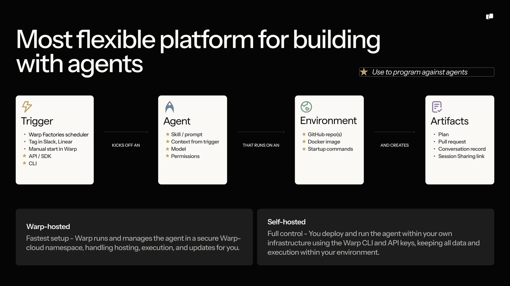
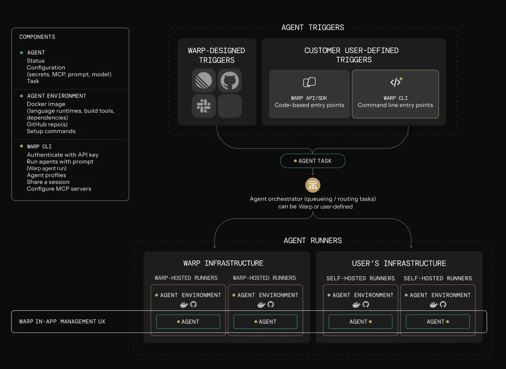

import VideoEmbed from '@components/VideoEmbed.astro';
import { VARS } from '@data/vars';

[Cloud agents](/platform/) run on the {VARS.WARP_AUTOMATION_PLATFORM}. You define the work (a prompt or a skill) and what starts it, and the platform runs the agent and records what it did. For example, an agent can triage each new issue as it's filed, or start fixing a build the moment CI fails.

If you're new to cloud agents, the [Cloud agents quickstart](/platform/quickstart/) gets you to your first run in about ten minutes.

{/* Transition notice for the 2026-08-18 rename. Remove after 2026-10-06, when
    the CLI and web app take their new names and the old one stops appearing. */}
:::note
**Oz is now the {VARS.WARP_AUTOMATION_PLATFORM}.** Only the name changed. Your existing integrations, API keys, scheduled agents, and scripts keep working exactly as before — nothing to migrate.

The `oz` CLI and the <a href={VARS.WEB_APP_URL}>{VARS.WEB_APP}</a> keep the Oz name until October 6, 2026, which is why you'll still see it in commands and URLs.
:::

<VideoEmbed url="https://youtu.be/poLkJhO7fdo" title={`${VARS.WARP_AUTOMATION_PLATFORM} cloud agents overview video`} />

## How a run works

Every run follows the same path, whatever starts it:

1. A **trigger** fires: a schedule, an integration event like a Slack mention or a CI failure, an API call, or a manual start.
2. Warp creates a **task**, the tracked record of the run. The trigger's context travels with it: the Slack thread, the PR metadata, the CI logs.
3. The agent executes on a **host**, optionally inside an [environment](/platform/environments/) that defines its image, repos, and setup.
4. The task produces **outputs**: a pull request, a Slack reply, a report, or just a transcript and summary.

## Integrations and triggers

Every run starts with a trigger. [Integrations](/platform/integrations/) turn events in other tools into runs: mention @warp in [Slack](/platform/integrations/slack/) and the agent gets the message and its thread, or run agents inside your [GitHub Actions](/platform/integrations/github-actions/) workflows with your CI context. [Scheduled agents](/platform/triggers/scheduled-agents/) start runs on a cron schedule. For event sources Warp doesn't cover, receive the event in your own system and start the run through the [API](/reference/api-and-sdk/); it becomes a normal, fully tracked task.

Set up a first-party integration with `oz integration create` on the {VARS.WARP_AGENT_CLI}; the [integration setup guide](/reference/cli/integration-setup/) covers it end to end.

## Tasks and tracking

Warp tracks every run as a task: its status, transcript, and outputs stay available after the run finishes. Watch or steer a live run with [session sharing](/agents/local-agents/session-sharing/), browse history in the [management UI](/platform/managing-cloud-agents/), or query it from the [{VARS.WARP_AGENT_CLI}](/reference/cli/) and the [API](/reference/api-and-sdk/). Access control decides who can run, view, or intervene in tasks.

To fan work out across parent and child agents, see [multi-agent orchestration](/platform/orchestration/).

## Environments

An [environment](/platform/environments/) defines what a run needs: a Docker image with your toolchain, the repositories to clone, and setup commands. Automated runs (integrations, schedules, API calls) use an environment so every run starts from the same setup; interactive local runs use your machine as-is and don't need one. Define one environment per codebase and reuse it across triggers.

## Hosts

A host is where the agent executes. By default runs execute on [Warp-hosted infrastructure](/platform/warp-hosting/), with nothing to set up. On Enterprise plans, [self-hosted runners](/platform/self-hosting/) keep code and execution inside your own network while Warp still tracks the runs.

## The CLI

The [{VARS.WARP_AGENT_CLI}](/reference/cli/) starts and manages runs where there's no UI: CI jobs, scripts, and remote servers. Start a run with `oz agent run`, and it reports progress to Warp like any other task, so work that starts on a CI runner shows up alongside everything else your team runs. For interactive sessions, use [agents in the Warp app](/agents/).

## API and SDKs

The [{VARS.API_SDK_NAME}](/reference/api-and-sdk/) creates and inspects tasks over HTTP: submit a prompt with optional configuration, poll status, and fetch results with full provenance. Teams use it to start agents from incident tooling and internal systems, build dashboards over run history, and coordinate large batches of runs. Official [Python](https://github.com/warpdotdev/oz-sdk-python) and [TypeScript](https://github.com/warpdotdev/oz-sdk-typescript) SDKs add typed requests and responses, built-in retries, and consistent errors. Start with an SDK unless you need full control over your HTTP client.

## Secrets

Agents often need credentials for APIs, cloud providers, databases, and MCP servers. Store them as [secrets](/platform/secrets/), and Warp injects them at runtime without exposing the values in logs or the UI. Secrets can be scoped to the whole team or to one person.

## Shared configuration

Runs pick up your team's shared setup no matter what triggered them: [MCP servers](/platform/mcp/), [rules](/agents/capabilities/rules/), [saved prompts](/knowledge-and-collaboration/warp-drive/prompts/), and [environment variables](/knowledge-and-collaboration/warp-drive/environment-variables/). Configure these once and every trigger uses them.

## Warp Factories

[Warp Factories](/factories/) builds on these pieces to run persistent, multi-agent development workflows: specialized cloud agents move each work item through triage, specification, implementation, and review. It's in Early Access. [Request access](https://www.warp.dev/factories/request-access) to use it with your team.

## Where to go next

* [Cloud agents](/platform/) - what cloud agents are, how they get triggered, and how to run them with or without the Warp app.
* [Cloud agents quickstart](/platform/quickstart/) - run your first cloud agent in about ten minutes.
* [Environments](/platform/environments/) - define the toolchain and repos a run executes against.
* [{VARS.API_SDK_NAME}](/reference/api-and-sdk/) - drive the platform programmatically.
