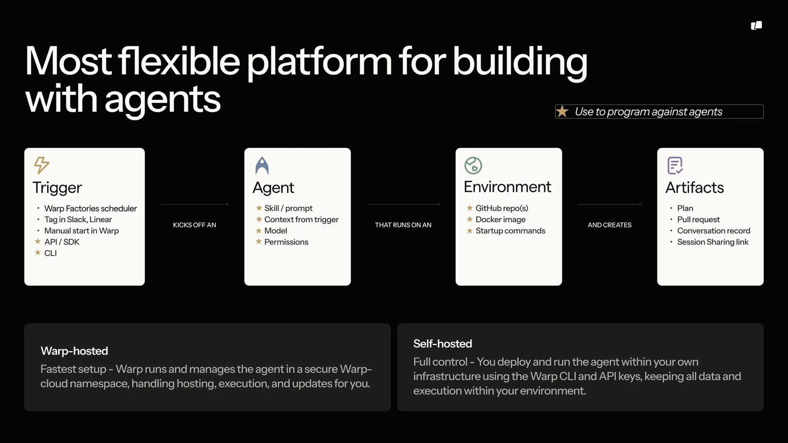
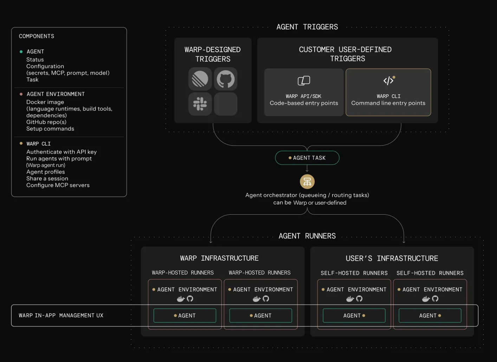

import { VARS } from '@data/vars';

[Warp Factories](/factories/) and [standalone cloud agents](/platform/) run on the {VARS.WARP_AUTOMATION_PLATFORM}. It provides the execution, configuration, and APIs they share.

For a team workflow that takes issues through planning, implementation, and review, start with the [Warp Factories quickstart](/factories/quickstart/) in the <a href={VARS.FACTORY_WEB_APP_URL}>{VARS.FACTORY_WEB_APP}</a>. For a single run in Warp, use the [cloud agents quickstart](/platform/quickstart/). See [transitioning from Oz](/platform/transitioning-from-oz/) if you already use the legacy web app, CLI, or SDKs.

## How a run works

A run starts with a request or event and ends with a result you can inspect:

1. A **trigger** fires: a schedule, an integration event like a Slack mention or a CI failure, an API call, or a manual start.
2. Warp creates a **task**, the tracked record of the run. The trigger's context travels with it: the Slack thread, the PR metadata, the CI logs.
3. The agent executes on a **host**, optionally inside an [environment](/platform/environments/) that defines its image, repos, and setup.
4. The task produces **outputs**: a pull request, a Slack reply, a report, or just a transcript and summary.

## Integrations and triggers

[Factory automations](/factories/automations/) route events and schedules to factory agents. Connect the [tools your team uses](/factories/connect-your-factory/), or use [webhooks](/factories/webhooks/) and [factory endpoints](/factories/factory-api/) for custom intake.

Standalone agents also have [integrations](/platform/integrations/) and [scheduled runs](/platform/triggers/scheduled-agents/). For CLI setup, use `oz integration create` on the {VARS.WARP_AGENT_CLI}; see the [integration setup guide](/agents/cli/oz-cli/integration-setup/).

## Tasks and tracking

Warp tracks every run as a task: its status, transcript, and outputs stay available after the run finishes. Watch or steer a live run with [session sharing](/agents/local-agents/session-sharing/), browse history in the [management UI](/platform/managing-cloud-agents/), or query it from the [{VARS.WARP_AGENT_CLI}](/agents/cli/oz-cli/) and the [API](/factories/api-and-sdk/). Access control decides who can run, view, or intervene in tasks.

To fan work out across parent and child agents, see [multi-agent orchestration](/platform/orchestration/).

## Environments

An [environment](/platform/environments/) defines what a run needs: a Docker image with your toolchain, the repositories to clone, and setup commands. Automated runs (integrations, schedules, API calls) use an environment so every run starts from the same setup; interactive local runs use your machine as-is and don't need one. Define one environment per codebase and reuse it across triggers.

## Hosts

A host is where the agent executes. By default runs execute on [Warp-hosted infrastructure](/factories/warp-hosting/), with nothing to set up. On Enterprise plans, [self-hosted runners](/factories/self-hosting/) keep code and execution inside your own network while Warp still tracks the runs.

## The CLI

The [{VARS.WARP_AGENT_CLI}](/agents/cli/oz-cli/) starts and manages runs where there's no UI: CI jobs, scripts, and remote servers. Start a run with `oz agent run`, and it reports progress to Warp like any other task, so work that starts on a CI runner shows up alongside everything else your team runs. For interactive sessions, use [agents in the Warp app](/agents/).

## API and SDKs

Use the [{VARS.WARP_PLATFORM_API} and SDKs](/factories/developer-tools/) to send work from your own services. [Factory endpoints](/factories/factory-api/) dispatch by factory UID; [agent and run endpoints](/factories/api-and-sdk/) start standalone runs and inspect, continue, or cancel runs.

The official [`warp-platform-sdk` Python package](https://pypi.org/project/warp-platform-sdk/) and [`@warp-dot-dev/warp-platform-sdk` TypeScript package](https://www.npmjs.com/package/@warp-dot-dev/warp-platform-sdk) provide typed requests, retries, and error handling.

## Secrets

Agents often need credentials for APIs, cloud providers, databases, and MCP servers. Store them as [secrets](/platform/secrets/), and Warp injects them at runtime without exposing the values in logs or the UI. Secrets can be scoped to the whole team or to one person.

## Shared configuration

For factories, declare shared [skills](/factories/factory-skills/), MCP servers, and execution defaults in the [factory definition](/factories/factory-as-code/). Standalone workflows also use [MCP servers](/platform/mcp/), [rules](/agents/capabilities/rules/), [saved prompts](/knowledge-and-collaboration/warp-drive/prompts/), and [environment variables](/knowledge-and-collaboration/warp-drive/environment-variables/); follow each reference for its scope and setup.

## Warp Factories

Use [Scorers](/factories/measure-and-improve/scorers/), [benchmarks](/factories/benchmarks/), and [Self-improvement](/factories/measure-and-improve/self-improvement/) to evaluate factory work and propose changes to its configuration. See [measure and improve](/factories/measure-and-improve/) for metric definitions and limitations.

## Related pages

* [Warp Factories quickstart](/factories/quickstart/) - Create a factory and send its first work item.
* [Architecture](/platform/architecture/) - reference diagrams of the stack, the run lifecycle, and data boundaries.
* [Cloud agents](/platform/) - what cloud agents are, how they get triggered, and how to run them with or without the Warp app.
* [Cloud agents quickstart](/platform/quickstart/) - run your first cloud agent in about ten minutes.
* [Environments](/platform/environments/) - define the toolchain and repos a run executes against.
* [{VARS.WARP_PLATFORM_API}](/factories/api-and-sdk/) - drive the platform programmatically.
