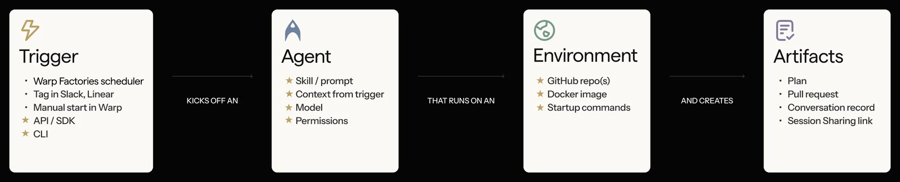

import { VARS } from '@data/vars';

[Warp Factories](/factories/) and [standalone cloud agents](/platform/) run on the {VARS.WARP_AUTOMATION_PLATFORM}. It provides the execution, configuration, and APIs they share.

For a team workflow with planning, implementation, and review, start with the [Warp Factories quickstart](/factories/quickstart/). To run cloud agents directly from Warp, use the [cloud agents quickstart](/platform/quickstart/). See [transitioning from Oz](/platform/transitioning-from-oz/) if you already use the legacy web app, CLI, or SDKs.

## How a run works

A run starts with a request or event and ends with a result you can inspect:

1. A **trigger** fires. This could be a schedule, an integration event like a Slack mention or a CI failure, an API call, or a manual start.
2. The agent receives the request and its context, such as a Slack thread, PR metadata, or CI logs.
3. The agent executes on a **host**. If an [environment](/platform/environments/) is configured, it defines the image, repositories, and setup commands.
4. The run produces **outputs**, like a pull request, Slack reply, report, or transcript and summary.

The diagram shows this flow with a configured environment, from the trigger to the artifacts the agent produces.

<figure style={{ maxWidth: "736px" }}>

<figcaption>A trigger starts a run that produces reviewable artifacts.</figcaption>
</figure>

## Integrations and triggers

[Factory automations](/factories/automations/) route events from [connected tools](/factories/connect-your-factory/) to factory agents. They also start runs on a schedule. For custom intake, use [webhooks](/factories/webhooks/) and [factory endpoints](/factories/factory-api/).

Standalone cloud-agent workflows also have [integrations](/platform/integrations/) and [scheduled runs](/platform/triggers/scheduled-agents/). For CLI setup, use `oz integration create` on the {VARS.WARP_AGENT_CLI}. See the [integration setup guide](/agents/cli/oz-cli/integration-setup/).

## Inspecting results

Runs retain their status, transcript, and outputs for later review. For inspection, sharing, and steering, see [viewing cloud agent runs](/platform/viewing-cloud-agent-runs/). Factory work and standalone work have different inspection paths; the [cloud agents overview](/platform/#monitor-inspect-and-share-cloud-agent-runs) links to each.

## Environments

An [environment](/platform/environments/) defines a Docker image with your toolchain, repositories, and setup commands. Use the [environment setup reference](/platform/environments/configuring-environments/) for standalone runs and [factory runners](/factories/runners/) for factory execution.

## Hosts

A host is where the agent executes. By default, runs execute on [Warp-hosted infrastructure](/factories/warp-hosting/), with nothing to set up. On Enterprise plans, [self-hosted runners](/factories/self-hosting/) keep code and execution inside your own network while Warp still tracks the runs.

## The CLI

Use the [{VARS.WARP_AGENT_CLI}](/agents/cli/oz-cli/) for `oz` workflows in CI, scripts, and remote servers. The separate [{VARS.WARP_CLI}](/agents/cli/) runs the Warp Agent with `warp`. Consult each command reference rather than treating the binaries as interchangeable.

## API and SDKs

Use the [{VARS.WARP_PLATFORM_API} and SDKs](/factories/developer-tools/) to send work from your own services. [Factory endpoints](/factories/factory-api/) dispatch by factory UID; [agent and run endpoints](/factories/api-and-sdk/) start standalone runs and inspect, continue, or cancel runs.

The official [`warp-platform-sdk` Python package](https://pypi.org/project/warp-platform-sdk/) and [`@warp-dot-dev/warp-platform-sdk` TypeScript package](https://www.npmjs.com/package/@warp-dot-dev/warp-platform-sdk) provide typed requests, retries, and error handling.

## Secrets

Agents often need credentials for APIs, cloud providers, databases, and MCP servers. Store them as [secrets](/platform/secrets/), and Warp injects them at runtime without exposing the values in logs or the UI. Secrets can be scoped to the whole team or to one person.

## Shared configuration

For factories, declare shared [skills](/factories/factory-skills/), MCP servers, and execution defaults in the [factory definition](/factories/factory-as-code/). Standalone workflows also use [MCP servers](/platform/mcp/), [rules](/agents/capabilities/rules/), [saved prompts](/knowledge-and-collaboration/warp-drive/prompts/), and [environment variables](/knowledge-and-collaboration/warp-drive/environment-variables/); follow each reference for its scope and setup.

## Measuring factory work

Use [Scorers](/factories/measure-and-improve/scorers/), [benchmarks](/factories/benchmarks/), and [Self-improvement](/factories/measure-and-improve/self-improvement/) to evaluate factory work and propose changes to its configuration. See [measure and improve](/factories/measure-and-improve/) for metric definitions and limitations.

## Related pages

* [Warp Factories quickstart](/factories/quickstart/) - Create a factory and send its first work item.
* [Architecture](/platform/architecture/) - reference diagrams of the stack, the run lifecycle, and data boundaries.
* [Cloud agents](/platform/) - what cloud agents are, how they get triggered, and how to run them with or without the Warp app.
* [Cloud agents quickstart](/platform/quickstart/) - run a cloud agent from Warp.
* [Environments](/platform/environments/) - define the toolchain and repos a run executes against.
* [Multi-agent orchestration](/platform/orchestration/) - divide work among parent and child agents.
* [{VARS.WARP_PLATFORM_API}](/factories/api-and-sdk/) - drive the platform programmatically.
