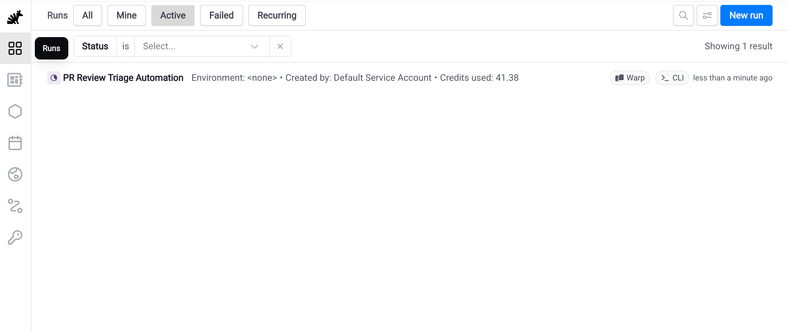
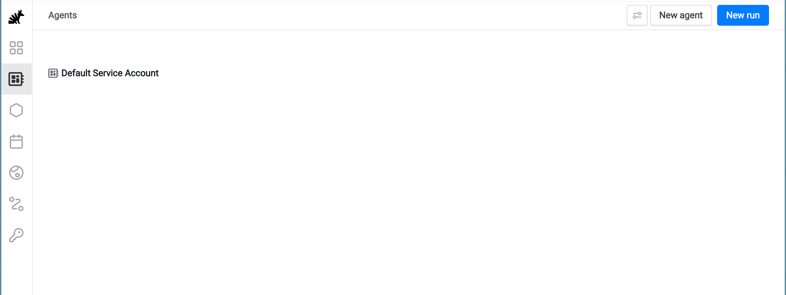
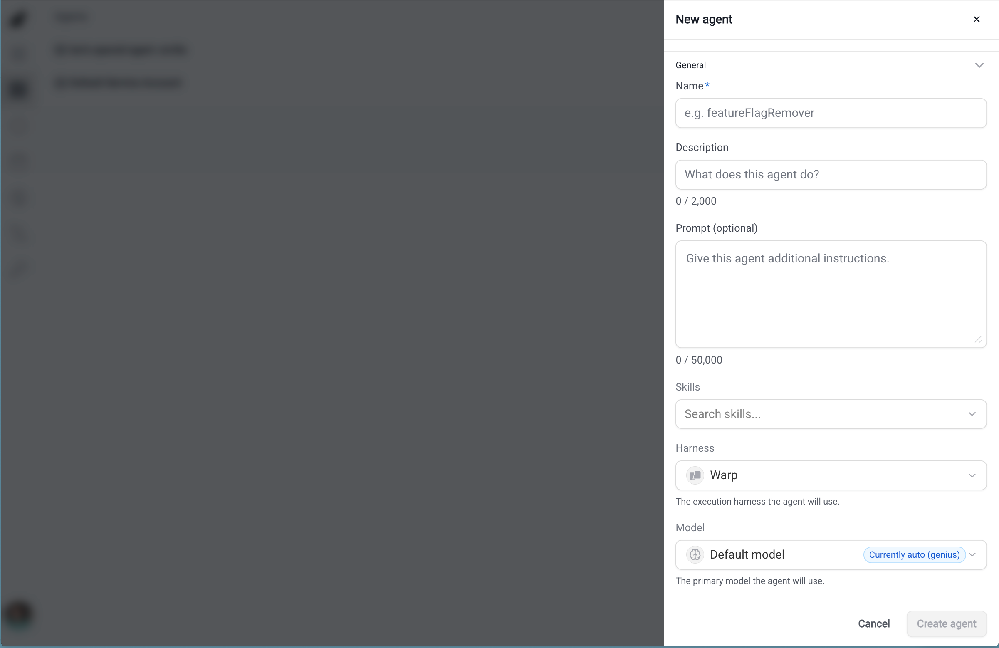
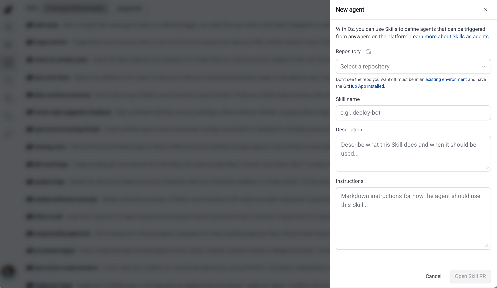
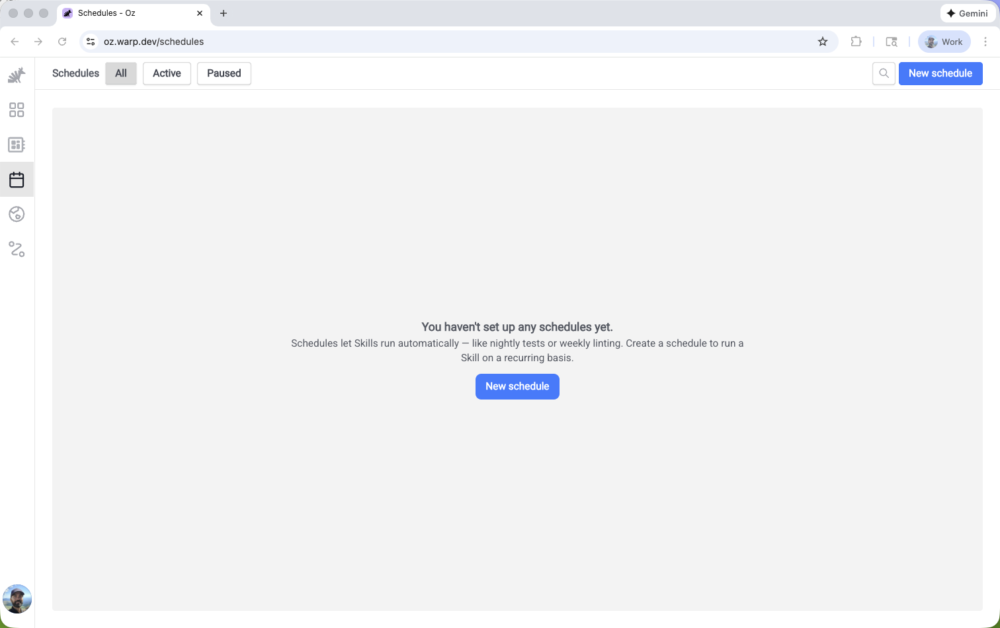
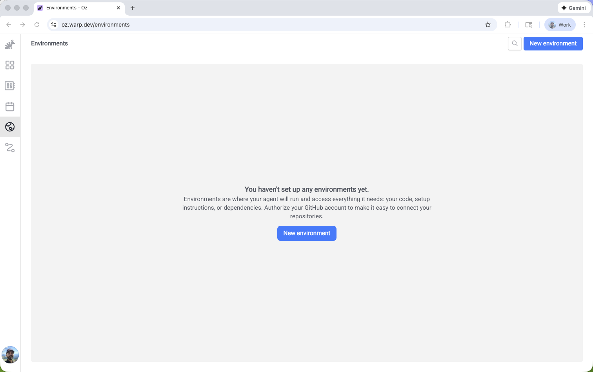
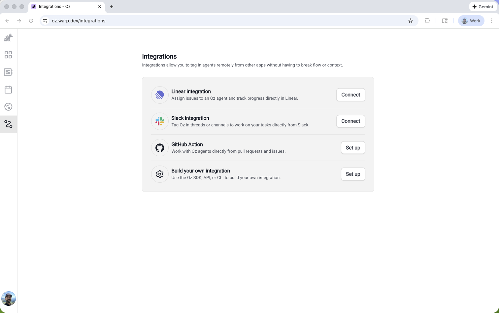

import VideoEmbed from '@components/VideoEmbed.astro';
import { VARS } from '@data/vars';

The <a href={VARS.WEB_APP_URL}>{VARS.WEB_APP}</a> provides a visual interface for managing cloud agents. You can start runs, browse agents and skills, create schedules, configure environments, and set up integrations—all without installing Warp or using the CLI.

:::note
The {VARS.WEB_APP} works on mobile devices, so you can monitor and manage your cloud agents from anywhere.
:::

Watch this short demo to create an environment and run an agent using the {VARS.WEB_APP}:
<VideoEmbed url="https://youtu.be/h9Wd77leIYg" title={`${VARS.WEB_APP} cloud agents walkthrough`} />

## Quick reference

<table><thead><tr><th width="150">Page</th><th width="120">Path</th><th>What you can do</th></tr></thead><tbody><tr><td><strong>Runs</strong></td><td><code>/runs</code></td><td>View all runs, filter by status/source/creator, start new runs, inspect transcripts</td></tr><tr><td><strong>Agents</strong></td><td><code>/agents</code></td><td>Browse saved agents, create agents, configure defaults, and start runs</td></tr><tr><td><strong>Skills</strong></td><td><code>/skills</code></td><td>Browse skills from your environments, view suggested skills, create skills for agents, and start runs</td></tr><tr><td><strong>Schedules</strong></td><td><code>/schedules</code></td><td>Create scheduled agents, pause/enable schedules, view run history</td></tr><tr><td><strong>Environments</strong></td><td><code>/environments</code></td><td>Create and manage environments with repos, Docker images, and setup commands</td></tr><tr><td><strong>Secrets</strong></td><td><code>/secrets</code></td><td>Create and manage Warp-managed secrets for cloud agent runs</td></tr><tr><td><strong>Integrations</strong></td><td><code>/integrations</code></td><td>Connect Slack, Linear, and GitHub to trigger agents from external tools</td></tr></tbody></table>

<figure style={{ maxWidth: "563px" }}>

<figcaption>The Oz web app Runs page.</figcaption>
</figure>

## When to use the web app

The {VARS.WEB_APP} is ideal when you want to:

* **Monitor agent activity** — View runs, check status, and inspect outputs from any device
* **Start quick runs** — Dispatch agents without opening a terminal
* **Manage agents and skills** — Create saved agents, browse skills from connected repositories, and start runs from either configuration
* **Manage schedules visually** — Create and edit scheduled agents with a guided interface
* **Configure environments** — Set up repos, Docker images, and setup commands through a form-based flow
* **Set up integrations** — Connect Slack and Linear with a guided setup flow, and configure how [GitHub](/platform/integrations/github/) mention-triggered runs execute

For scripting, automation, and CI/CD workflows, use the [{VARS.WARP_AGENT_CLI}](/reference/cli/) or [API](/reference/api-and-sdk/).

## Getting started

When you first sign in to the {VARS.WEB_APP}, you'll see a guided onboarding flow that helps you get started based on your goals.

The onboarding asks "What brings you to the {VARS.WARP_AUTOMATION_PLATFORM}?" and offers three paths:

* **Create an agent automation** — Walks you through setting up a scheduled agent, integration-triggered agent, or other automation
* **Run Cloud Agents in Warp** — Opens the Warp app (or takes you to the download page) to run cloud agents interactively
* **Build an app that uses agents** — Links to the [{VARS.WARP_AUTOMATION_PLATFORM}](/platform/overview/) docs for using the CLI, SDK, or API

You can skip onboarding at any time to go directly to the Runs page.

## Runs

The **Runs** page (`/runs`) is your central view for monitoring cloud agent activity. It shows runs across your account and team, where applicable, including those triggered from the CLI, API, integrations, and schedules.

### Run details

Each run displays the following information:

<table><thead><tr><th width="140">Field</th><th>Description</th></tr></thead><tbody><tr><td><strong>Status</strong></td><td>Working, succeeded, failed, canceled, errored, or blocked</td></tr><tr><td><strong>Title</strong></td><td>The run's title or prompt summary</td></tr><tr><td><strong>Environment</strong></td><td>Which environment the agent ran in</td></tr><tr><td><strong>Creator</strong></td><td>Who started the run</td></tr><tr><td><strong>Source</strong></td><td>Where the run was triggered from (CLI, API, Slack, Linear, scheduled)</td></tr><tr><td><strong>Artifacts</strong></td><td>Any outputs like PRs or files created</td></tr><tr><td><strong>Credits</strong></td><td>How many credits the run consumed</td></tr></tbody></table>

Click any run to open the detail pane, where you can view the full transcript, artifacts, and metadata.

### Filtering and search

<table><thead><tr><th width="140">Quick filter</th><th>Shows</th></tr></thead><tbody><tr><td><strong>All</strong></td><td>All runs</td></tr><tr><td><strong>Mine</strong></td><td>Only runs you created</td></tr><tr><td><strong>Active</strong></td><td>Runs currently in progress</td></tr><tr><td><strong>Failed</strong></td><td>Runs that failed</td></tr><tr><td><strong>Recurring</strong></td><td>Runs triggered by schedules</td></tr></tbody></table>

You can also search by title, prompt, or agent name, and add advanced filters for source, status, creator, and date range.

### Starting a new run

To start a new run:

1. Click **New run** in the header to start a cloud agent.
2. Select an agent, if needed. Choose **Quick run** to run as yourself, or choose a saved agent from the **Agent** dropdown.
3. Select the environment where the agent should run.
4. Add a prompt with context and instructions for this specific run.

**Quick run** runs as your own user. A saved agent uses its saved defaults, and your prompt adds context for this particular execution.

### Artifact media pages

A screenshot or video recording an agent captured also has its own page at `/artifacts/<artifact-uid>`, showing that single capture with its description. Agents link to these pages when they attach captures to a pull request or share them in Slack, an issue comment, or a chat reply, so a reviewer can open one capture without opening the whole run.

Access follows the artifact: private captures require signing in with an account that can access the run, while captures your team has published for embedding open without signing in. See [Screenshots and videos in pull requests](/agents/capabilities/computer-use/artifacts-in-prs/) for the team setting that controls this.

### Inspecting orchestrated runs

The {VARS.WEB_APP} renders [multi-agent orchestrations](/platform/orchestration/) as nested rows on the **Runs** page, so you can follow parent and child execution together.

Open a parent run from the Runs page. When the run has children, the detail pane adds a **Sub-agents** tab next to **Details**:

* Each child agent row shows the child's current status and title. Click a row to open that child's detail pane; closing it returns you to the parent's **Sub-agents** tab.
* The parent's own status badge at the top of the detail pane reflects the parent's work, not its children. Open a child to inspect its state directly.

## Agents

The **Agents** page (`/agents`) is where you browse, create, and run saved agents. Agents are reusable cloud agent configurations that can include a prompt, skills, harness, model, environment, and secrets.

Skills are reusable instruction sets stored in repositories. You can attach existing skills to an agent through the **Skills** field; for more details, see [Skills as Agents](/platform/skills-as-agents/).

Saved agents use Warp's team-scoped identity model, which lets a reusable agent own runs and carry default configuration for teammates. You manage saved agents from the Agents page. For plan limits, API endpoints, and API key binding behavior, see [Agents](/platform/agents/).

<figure style={{ maxWidth: "563px" }}>

<figcaption>The Agents page in the Oz web app.</figcaption>
</figure>

Open an agent to review its prompt, skills, harness, model, environment, and attached secrets. From the detail pane, you can inspect activity, create schedules, edit configuration, or start a run from the saved agent.

### Running an agent

Click any agent to view its details, then click **New run** to start a run from that saved configuration. You can also click **New run** from the header to start a run with optional agent selection.

### Creating a new agent

To create a saved agent:

1. Click **New agent** to open the guided creation flow.
2. Define the instructions and defaults. Add a name, description, prompt, optional skills, harness, model, environment, and secrets.
3. Click **Create agent**. The saved agent appears on the Agents page and is available for runs.

For deeper guidance on reusable skills and team-scoped identities, see [Skills as Agents](/platform/skills-as-agents/) and [Agents](/platform/agents/).

<figure style={{ maxWidth: "563px" }}>

<figcaption>Creating a new agent in the Oz web app.</figcaption>
</figure>

## Skills

The **Skills** page (`/skills`) is where you browse and run skills. Skills are reusable instruction sets stored in repositories, and agents can include one or more skills as part of their default configuration.

Use the **From your Environments** filter to view skills from repositories connected to your environments, or switch to **Suggested** to view recommended skills. Open a skill to view its activity, schedules, and `SKILL.md` configuration.

### Running a skill

Click any skill to view its details, then click **New run** to start a run with that skill attached. You can also click **New run** from the page header to start a run with optional skill selection.

### Creating a skill for agents

To create a skill for agents:

1. Click **New agent** on the Skills page to open the skill creation flow.
2. Choose a repository from an existing environment with GitHub access.
3. Define the skill. Add a skill name, description, and instructions.
4. Click **Open Skill PR** to create a pull request that adds the skill to the selected repository.

<figure style={{ maxWidth: "563px" }}>

<figcaption>Creating a skill in the Oz web app.</figcaption>
</figure>

After the PR is merged, refresh skills so the new skill appears in the {VARS.WEB_APP}.

## Schedules

The **Schedules** page (`/schedules`) lets you create and manage scheduled agents that run automatically on a cron schedule.

### Schedule details

Each schedule displays:

<table><thead><tr><th width="150">Field</th><th>Description</th></tr></thead><tbody><tr><td><strong>Name</strong></td><td>A descriptive name for the scheduled task</td></tr><tr><td><strong>Frequency</strong></td><td>Human-readable description of the cron schedule (e.g., "Every Monday at 10am")</td></tr><tr><td><strong>Next run</strong></td><td>When the schedule will next execute</td></tr><tr><td><strong>Environment</strong></td><td>Which environment the scheduled agent runs in</td></tr><tr><td><strong>Agent</strong></td><td>Which saved agent the schedule uses (if any)</td></tr><tr><td><strong>Status</strong></td><td>Whether the schedule is active or paused</td></tr></tbody></table>

<figure style={{ maxWidth: "563px" }}>

<figcaption>The Schedules page in the Oz web app.</figcaption>
</figure>

### Creating a schedule

To create a scheduled agent:

1. Click **New schedule** in the header.
2. Name the schedule. Use a descriptive name that explains what the scheduled agent does.
3. Set the frequency. Choose a preset or enter a cron schedule.
4. Select the environment where the scheduled agent should run.
5. Choose a saved agent, if needed.
6. Add the prompt that the agent should follow each time it runs.
7. Click **Create schedule**. The schedule appears on the Schedules page.

### Managing schedules

Click any schedule to view its details and recent run history. From the detail pane, you can:

* **Edit** the schedule configuration
* **Pause** or **enable** the schedule
* **Delete** the schedule
* **View past runs** triggered by this schedule

:::note
For CLI-based schedule management, see [Scheduled Agents](/platform/triggers/scheduled-agents/).
:::

## Environments

The **Environments** page (`/environments`) shows all environments configured for your account. Environments define the execution context for cloud agents, including repos, Docker images, and setup commands.

### Environment details

Each environment displays:

<table><thead><tr><th width="170">Field</th><th>Description</th></tr></thead><tbody><tr><td><strong>Name</strong></td><td>The environment's identifier</td></tr><tr><td><strong>Docker image</strong></td><td>The container image used for execution</td></tr><tr><td><strong>Repositories</strong></td><td>Which repos the agent can access</td></tr><tr><td><strong>Setup commands</strong></td><td>Commands run before the agent starts</td></tr></tbody></table>

<figure style={{ maxWidth: "563px" }}>

<figcaption>The Environments page in the Oz web app.</figcaption>
</figure>

### Creating an environment

To create a new environment:

1. Click **New environment** in the header.
2. Name the environment. Use a descriptive name that explains the runtime context.
3. Select the repositories the agent should be able to access.
4. Choose a Docker image. Warp provides prebuilt dev images, or you can use your own.
5. Add any setup commands that should run when the environment starts, such as `npm install`.
6. Click **Create environment**. The environment appears on the Environments page.

:::note
For advanced environment configuration, see [Environments](/platform/environments/) and the [CLI reference](/reference/cli/integration-setup/).
:::

## Integrations

The **Integrations** page (`/integrations`) lets you configure first-party integrations with Slack, Linear, and GitHub.

### Available integrations

<table><thead><tr><th width="120">Integration</th><th>Description</th></tr></thead><tbody><tr><td><strong>Slack</strong></td><td>Tag @warp in messages or threads to trigger agents directly from Slack conversations</td></tr><tr><td><strong>Linear</strong></td><td>Tag @warp on issues to trigger agents from your issue tracker</td></tr><tr><td><strong>GitHub</strong></td><td>Mention @warp-agent on issues, pull requests, and review comments to trigger agents from GitHub</td></tr></tbody></table>

<figure style={{ maxWidth: "563px" }}>

<figcaption>The Integrations page in the Oz web app.</figcaption>
</figure>

### Setting up an integration

Click an integration to start the guided setup flow. You'll authorize Warp to connect with the external service, select an environment, and configure any integration-specific settings.

The GitHub row works differently. Instead of an authorization flow started here, it reflects the Warp Factories GitHub App installation that a team admin enables in the Admin Panel. Once the installation is associated with your team, use the row to choose the environment, model, agent, prompt, and secrets that GitHub-triggered runs use.

:::note
For detailed integration setup instructions, see [Slack](/platform/integrations/slack/), [Linear](/platform/integrations/linear/), and [GitHub](/platform/integrations/github/).
:::

## Related resources

* [Cloud Agents overview](/platform/) — Learn about cloud agents and when to use them
* [Multi-agent orchestration](/platform/orchestration/) — Parent/child model and common orchestration patterns
* [Skills as Agents](/platform/skills-as-agents/) — Run agents based on reusable skill definitions
* [Scheduled Agents](/platform/triggers/scheduled-agents/) — Run agents automatically on a cron schedule
* [Environments](/platform/environments/) — Configure runtime context for cloud agents
* [Managing Cloud Agents](/platform/managing-cloud-agents/) — Monitor agent activity and inspect runs
* [{VARS.WARP_AGENT_CLI}](/reference/cli/) — Command-line interface for running agents
* [{VARS.API_SDK_NAME}](/reference/api-and-sdk/) — Programmatic access to cloud agents
