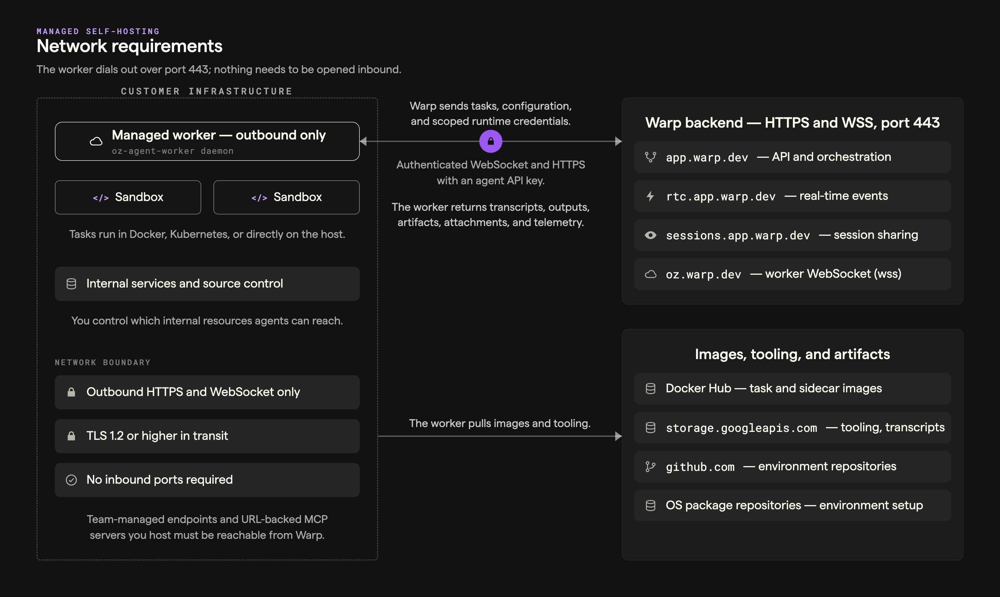

Repository clones and agent workloads stay on your infrastructure, while orchestration and inference route through Warp. These boundaries apply to [managed](/platform/self-hosting/#managed-architecture) and [unmanaged](/platform/self-hosting/unmanaged/) deployments.

## Data boundaries

Self-hosted execution keeps repository clones, source files, build artifacts, runtime secrets, environment variables, and agent workspaces on infrastructure you control. Agents can also reach internal systems that your host can reach, such as VPN-only services, private databases, or self-hosted source control.

**Stored and executed only on your infrastructure:**

* Repository clones and source files.
* Build artifacts and compiled outputs.
* Runtime secrets and environment variables.
* Container filesystem state (managed architecture) or host workspace (Direct backend / unmanaged).

**Routes through Warp's backend** (under [Zero Data Retention (ZDR)](/enterprise/security-and-compliance/security-overview/#zero-data-retention-zdr)):

* Orchestration metadata (task status, lifecycle events).
* Session transcripts, which include agent-generated summaries of code context, file contents the agent reads, and command output.
* LLM inference requests and responses, which include code context from the agent's interactions.

:::note
Repositories are cloned and stored only on your infrastructure, but code content can still appear in session transcripts, artifacts, and LLM prompts as part of normal agent operation. Warp does not persistently store your source code or train on it. For retention with customer-supplied inference, see [LLM inference and BYOLLM](#llm-inference-and-byollm).
:::

---

## Network requirements

Self-hosted agents **do not require any network ingress**. They require outbound (egress) access to the following services:

**Warp's backend (all architectures):**

* `app.warp.dev` — port 443
* `rtc.app.warp.dev` — port 443
* `sessions.app.warp.dev` — port 443
* `oz.warp.dev` — port 443 (managed architecture only)

Docker Hub — for pulling task images (managed architecture only).

Tasks use the following Docker images:
* [`warpdotdev/warp-agent:latest`](https://hub.docker.com/r/warpdotdev/warp-agent)
* [`warpdotdev/warp-xvfb-sidecar:latest`](https://hub.docker.com/r/warpdotdev/warp-xvfb-sidecar) (only if [computer use](/agents/capabilities/computer-use/) is enabled)
* [`warpdotdev/warp-claude-cli-sidecar:latest`](https://hub.docker.com/r/warpdotdev/warp-claude-cli-sidecar) (only if using Claude Code)
* [`warpdotdev/warp-codex-cli-sidecar:latest`](https://hub.docker.com/r/warpdotdev/warp-codex-cli-sidecar) (only if using Codex)
* The base image specified by your [environment](/platform/environments/)

**Google Cloud Storage (`storage.googleapis.com`)** — port 443, for downloading managed Docker Sandbox tooling sidecar archives (Warp CLI, computer use, and coding CLI tooling), uploading conversation transcripts so conversations can be resumed locally, and providing attachments to the agent.

**GitHub (`github.com`)** — only with the managed architecture, when using a Warp [environment](/platform/environments/) with configured GitHub repositories.

**Linux distribution-specific package repositories** — only with the managed architecture, when using a Warp environment whose base image does not have Git pre-installed. The exact repositories depend on the package manager configuration in the environment's base image.

All traffic uses HTTPS (port 443). No inbound ports need to be opened.

[Team-managed inference endpoints](/enterprise/enterprise-features/team-managed-keys-and-endpoints/) and URL-backed MCP servers that you host must be reachable from Warp's servers.

---

## Backend-specific security considerations

### Docker backend

* **Docker socket access** — The worker requires access to the Docker daemon to create task containers. When running the worker via Docker, this means mounting `/var/run/docker.sock`. Ensure appropriate access controls on the host.
* **Volume mounts** — If using `-v` / `--volumes`, be mindful of what host paths you expose to task containers.
* **Task isolation** — Each task runs in its own container. Containers are removed after execution by default (disable with `--no-cleanup` for debugging).

### Kubernetes backend

* **Kubernetes RBAC** — The worker uses namespace-scoped permissions to manage Jobs and read Pods, logs, and events. The task namespace must allow a root init container unless native image volumes are enabled.
* **Kubernetes service accounts** — The worker Deployment ServiceAccount is separate from the task Job `serviceAccountName` in `pod_template`. Scope each to its workload.
* **API key management** — Store `WARP_API_KEY` in a Kubernetes Secret and inject it only into the worker. Add task credentials through `pod_template` or an external secrets operator.
* **Task isolation** — Each task runs as a Kubernetes Job and Pod. Successful Jobs are removed. With cleanup enabled, failed or orphaned Jobs remain for 24 hours; `--no-cleanup` keeps them without a TTL.

### Direct backend

* **Shared host kernel** — The Direct backend does not provide container-level isolation. Each task runs in an isolated workspace directory but shares the host OS and kernel.
* **Minimal environment by default** — The Direct backend intentionally starts tasks with a minimal environment (`HOME`, `TMPDIR`, `PATH` only). Sensitive worker credentials like `WARP_API_KEY` are not passed to tasks unless explicitly configured.
* **Workspace cleanup** — Workspaces under `workspace_root` are removed after execution by default (disable with `--no-cleanup` for debugging).

### Unmanaged

* **Host inheritance** — Agents inherit the host's network access, tools, and credentials. If the host has access to a VPN or internal services, the agent will too. Evaluate accordingly.
* **Kubernetes pod isolation** — Whether Kubernetes pods provide sufficient sandboxing for agents depends on your cluster configuration and risk profile. Evaluate your pod security policies, network policies, and RBAC settings based on your organization's security requirements.

---

## VPN and on-premises access

Self-hosted agents inherit the host's network access, including VPN services, private source control, and databases.

See [GitLab](/platform/integrations/gitlab/) and [Bitbucket](/platform/integrations/bitbucket/) setup guides for SCM integration details.

---

## LLM inference and BYOLLM

LLM inference routes through Warp's backend. With Warp-managed inference, requests go to contracted providers covered by [ZDR](/enterprise/security-and-compliance/security-overview/#zero-data-retention-zdr) agreements. With customer-supplied inference, provider-side retention follows your team's agreement with that provider. Enterprise teams that want inference routed and billed through their own accounts can use [team-managed model keys and endpoints](/enterprise/enterprise-features/team-managed-keys-and-endpoints/) or [Bring Your Own LLM (BYOLLM)](/enterprise/enterprise-features/bring-your-own-llm/); cloud agent support varies by provider, so check each provider's page.

---

## Related pages

* [Self-hosting overview](/platform/self-hosting/) — Managed vs unmanaged and architecture decision guide.
* [Data security and boundaries](/platform/architecture/#data-security-and-boundaries) — Diagrams of where each class of data lives and travels.
* [Security overview](/enterprise/security-and-compliance/security-overview/) — Warp's broader security model, including ZDR.
* [Bring Your Own LLM (BYOLLM)](/enterprise/enterprise-features/bring-your-own-llm/) — Route inference through your own cloud provider accounts.
* [Self-hosted worker reference](/platform/self-hosting/reference/) — CLI flags and config schema, including every security-relevant option.
