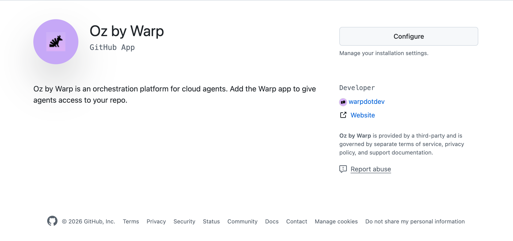

import { VARS } from '@data/vars';

This page explains how access to cloud agents works for both individual users and teams, how billing and credits apply, and how Warp maps user identities across integrations.

---

## Overview: individual vs team access

Cloud agents can be used in two ways:

**Individual users** (without a team):
* Can run cloud agents via CLI or API
* Can use Warp credits, including [cloud agent credits](/support-and-community/plans-and-billing/credits/#compute-credits)
* Agents run on Warp-hosted infrastructure
* Cannot use integrations (Slack, Linear, Jira, GitHub) or self-hosted agents

**Teams** (users who are part of a [Warp team](/knowledge-and-collaboration/teams/)):
* All individual capabilities, plus:
* Can use integrations (Slack, Linear, Jira, and the [GitHub integration](/platform/integrations/github/)) to trigger agents
* Can self-host agents on their own infrastructure (Enterprise only)
* Share team-level configuration (environments, secrets, integrations)
* Team must be on Build, Max, or Business plan with at least 20 credits for cloud agents and integrations

---

## Individual access

Individual users can run cloud agents via the CLI or API without being part of a team.

**How it works:**

* Run agents using `oz agent run-cloud` or the {VARS.API_SDK_NAME}
* Credits are drawn from your Warp credits (including cloud agent credits, when applicable)
* Agents execute on Warp-hosted infrastructure

**What you can do:**

* Run cloud agents from CI/CD pipelines
* Trigger agents programmatically via API
* Use personal secrets for authentication

**What requires a team:**

* Integrations (Slack, Linear, Jira, and the [GitHub integration](/platform/integrations/github/))
* Self-hosted agent execution
* Team secrets and shared configuration

---

## Team access

A [Warp team](/knowledge-and-collaboration/teams/) is a group of users who share configuration and collaborate on cloud agents. Teams can be created on any plan, including Free.

**What teams enable:**

* **Integrations** - Create Slack, Linear, and Jira integrations that all team members can use, and enable the [GitHub integration](/platform/integrations/github/) so teammates can start agents with an `@warp-agent` mention
* **Shared configuration** - Team-level environments, secrets, and settings
* **Self-hosting** - Run agents on your own infrastructure (Enterprise only)
* **Team visibility** - Shared observability into agent runs and history

Integrations are created at the team level, not per-user. Once a Slack or Linear integration is installed, everyone on your Warp team can use **@warp** in the connected workspace. The integration behaves the same way for all teammates, and everyone shares the same underlying environment configuration. The GitHub integration is team-level in the same way: once an admin enables the GitHub organization, any teammate with a connected GitHub account can start a run by mentioning **@warp-agent**.

When someone triggers a cloud agent for the first time, Warp may prompt them to grant GitHub authorization so the agent can open pull requests or push branches under their identity. This allows each run to use the correct permissions without requiring additional setup from an admin.

#### Requirements for integrations

Integrations and [cloud agents](/platform/) run inside Warp's cloud, which means usage is billed based on [credits](/support-and-community/plans-and-billing/credits/).

Your team must meet the following requirements to run integrations:

* You must be on a **Build, Max, or Business** plan with [add-on credits](/support-and-community/plans-and-billing/add-on-credits/) enabled, or on an **Enterprise** plan with a team credit pool per your contract.
* Your team needs at least **20 credits** available to run cloud agents and integrations

When a user triggers an agent through an integration (like Slack or Linear), the run draws from credits based on who the run is billed to:

* **User-triggered runs on Build, Max, or Business** - Warp draws from any [cloud agent credits](/support-and-community/plans-and-billing/credits/#compute-credits) the user has, then the user's plan-included credits, then the team's shared add-on credit pool.
* **Agent API key or scheduled cloud agent runs on Build, Max, or Business** - Warp bills the team owner. The waterfall is: the owner's plan-included credits, then the team's shared add-on credit pool. With auto-reload off, the request is blocked when both are depleted. With auto-reload on, usage can trigger a reload into the team's shared pool subject to the team-wide monthly spend cap; once the cap is reached, runs are blocked until the cap resets or increases.
* **Enterprise plans** - Runs draw from the team-scoped credit pool, per your Enterprise contract terms.

If all applicable credit sources are exhausted and no auto-reload is configured, integrations and cloud agents will not run until credits are added. See [add-on credits](/support-and-community/plans-and-billing/add-on-credits/) for the full self-serve waterfall and [platform credits](/support-and-community/plans-and-billing/platform-credits/) for the third bucket that applies to every cloud agent run.

:::note
If you're on an Enterprise plan, please reach out to [contact sales](https://www.warp.dev/contact-sales) with any billing questions related to integrations.
:::

### Identity mapping

Warp needs a reliable way to know which person a cloud agent run is acting for, across Warp, Slack, Linear, and GitHub.

* Slack uses a dedicated account-linking flow to map a Slack user to their Warp account. This is the recommended path for Slack-triggered agents, since it doesn’t rely on email matching.
* Linear currently maps identities using email address matching. Your Linear email must match your Warp account email for Warp to correctly attribute and scope agent runs.
* The [GitHub integration](/platform/integrations/github/) maps the GitHub account that mentioned `@warp-agent` to the Warp account that connected it, rather than by email. Until a teammate connects their GitHub account, Warp replies in the thread with a link to connect instead of starting a run. That binding sets run attribution, team ownership, and billing; the run's GitHub access comes from the app installation instead.
* Each teammate must authorize GitHub before an agent can write PRs or push branches on their behalf
* For Slack-triggered, Linear-triggered, and locally triggered runs, agents operate using the GitHub permissions of the triggering user

This ensures runs are scoped to what the user is allowed to see and modify, and that ownership of PRs remains clear across teams and repositories. The two exceptions are agent API key runs with [team GitHub authorization](#team-github-authorization) and runs started from an `@warp-agent` mention, which both authenticate as the Warp Factories GitHub App installation.

---

## Team GitHub authorization

By default, cloud agents authenticate with GitHub using the personal token of the user who triggered the run. Team GitHub authorization gives you an alternative: authenticate with the **Warp Factories** GitHub App instead, so agents can clone repositories and open pull requests without relying on any individual's token.

This is useful for fully automated workflows that use an [agent API key](/reference/cli/api-keys/), like CI/CD pipelines, scheduled agents, and SDK-triggered runs, where you want code changes attributed to the GitHub App rather than a specific person.

### How it works

When an agent task is initiated with an agent API key, there is no individual user to authenticate on behalf of. Instead, Warp uses tokens issued by the **Warp Factories** GitHub App installation to authenticate directly with GitHub.

The GitHub App token gives the agent access to the repositories included in the app installation — it can clone repos, create branches, push commits, and open pull requests. During installation, you choose whether the app can access **all repositories** or only **selected repositories** in your GitHub organization, and this controls what agent API key runs can access.

### Setting up team GitHub authorization

1. **Install the Warp Factories GitHub App.** A user with admin permissions on the GitHub organization installs the [Warp Factories](https://github.com/apps/warp-factories) GitHub App. During installation, grant the app access to **all repositories** or **selected repositories** in your org.

   :::note
There are two places you may encounter this installation flow:
   * During the first-time experience for the {VARS.WARP_AUTOMATION_PLATFORM}, when you connect your GitHub account.
   * When you click **Configure access on GitHub** in the repository selector while creating an environment.

   Each installation is scoped to a single GitHub organization or personal account — you can install the app to multiple orgs separately.
:::

   <figure>
   
   <figcaption>Installing the Warp Factories GitHub App.</figcaption>
   </figure>

2. **Enable the GitHub org for your Warp team.** A Warp team admin opens the Admin Panel in the Warp app (**Settings** > **Admin Panel** > **Platform**) and adds the GitHub organization under **Enabled GitHub Orgs**. This associates the GitHub App installation with your Warp team.

   <figure>
   
   <figcaption>Enabled GitHub Orgs setting in the Admin Panel.</figcaption>
   </figure>

3. **Use an agent API key.** Tasks initiated with an agent API key on the team now use tokens from the GitHub App installation to clone repos and push changes. No individual GitHub authorization is needed. On GitHub, commits and pull requests are opened by the Warp Factories GitHub App rather than any individual user; in the {VARS.DASHBOARD}, the run is attributed to the bound [cloud agent](/platform/agents/).

### How this relates to environments

An [environment](/platform/environments/) is a template for a cloud agent's sandbox — it defines the Docker image, repos, and setup commands, but it does not carry its own GitHub permissions. The same environment can be used by different users or by agent API key runs, and each will authenticate to GitHub independently.

The environment configuration and the **Enabled GitHub Orgs** setting in the Admin Panel serve different purposes:

* **Environment repo list** - "This agent needs repos A, B, and C."
* **Enabled GitHub Orgs** - "This team can use the Warp Factories GitHub App to access repos in this GitHub organization."

### Personal tokens vs. GitHub App tokens

Team GitHub authorization is complementary to the existing personal token flow:

* **User-triggered runs** (personal API key, Slack, Linear, Warp app) - The agent authenticates using the triggering user's personal token. PRs and commits are attributed to that user.
* **Agent API key runs with GitHub App authorization** - The agent authenticates as the GitHub App installation. On GitHub, PRs and commits are attributed to the Warp Factories GitHub App rather than any individual user. In the {VARS.DASHBOARD}, the run is attributed to the bound [cloud agent](/platform/agents/), which controls run filtering and audit attribution on the Warp side.
* **[GitHub integration](/platform/integrations/github/) runs** (an `@warp-agent` mention on an issue or pull request) - The agent authenticates as the installation that delivered the event, so its repository access and its GitHub attribution match the agent API key flow. In the {VARS.DASHBOARD} the run is still attributed to the teammate who wrote the mention, and their team is billed.

These flows can coexist on the same team. Personal tokens are still used for user-triggered runs from a personal API key, Slack, Linear, and the Warp app, and the GitHub App installation token is used for agent API key runs and for GitHub integration runs.

:::caution
GitHub App installation tokens are scoped to a single GitHub organization at a time. If your team works across repos in multiple GitHub organizations, the agent can only use the installation token for the organization enabled in the Admin Panel. Repos in other organizations require user-triggered runs with a personal API key.
:::

:::note
To change which repositories the GitHub App can access, edit the app installation in your [GitHub settings](https://github.com/settings/installations).
:::

---

## Data and permissions

#### Slack / Linear

Installing the {VARS.WARP_AUTOMATION_PLATFORM} app gives Warp access to the Slack channels or Linear teams where the app is installed.

**When a run is triggered, Warp receives:**

* The content of the tagged thread or issue
* Relevant surrounding context used to build the agent prompt

Warp stores only the content required for the agent to complete its task. You can message @warp directly, mention it in channels, or tag it on specific issues depending on the integration.

#### GitHub

Warp’s behavior in GitHub is defined by two layers of control:

1. **The Warp GitHub App installation scope**
   * Determines which organizations and repositories Warp can read and write to
   * Can be edited at any time in GitHub settings
2. **Permissions of the triggering user**
   * Agents inherit the user’s read/write privileges
   * Agents cannot elevate permissions, see additional repos, or write to repos the user cannot access

**In practice, agents can only operate on repositories that:**

* Are included in the environment configuration
* Are accessible to both the GitHub app and the triggering user.

Runs triggered by an `@warp-agent` mention through the [GitHub integration](/platform/integrations/github/) follow the first layer only. Warp receives the content of the issue, pull request, or review thread that carried the mention, including the recent comments and the diff of a commented file, and the run authenticates with the GitHub App installation that delivered the event. Cloning, commits, branches, pull requests, and status comments all use that installation's access rather than the mentioning user's, so the installation's repository selection is the only boundary on what those runs can reach. The repository that triggered the mention is cloned alongside any repositories in the configured environment, and only the repositories that installation covers are available to the agent.

---

## Additional notes: how cloud agents use credits

Cloud agents can run automatically in the background when activated by a trigger such as a Slack mention, a Linear update, or a scheduled task. These runs require compute and model usage, which translates to credit consumption.

**Typical credit usage:**

Cloud agent runs consume credits based on the complexity of the task and whether an environment is used. The exact amount varies by run.

#### How credit usage works

How credits are consumed depends on how the agent run is triggered and authenticated:

**User-triggered runs** (CLI with personal API key, Slack, Linear, or the Warp app):

* Runs are tied to the triggering user's identity.
* On Build, Max, and Business plans, Warp always drains credits in a fixed order — there is no setting to spend personal credits first while on a team:
  1. The triggering user's plan-included monthly credits.
  2. Shared bonus or add-on grants available to the active team (team-wide pool first).
  3. Any remaining user-scoped bonus grants that apply on that team (for example, leftover personal add-on balances from May–August 2026), only after shared grants are exhausted.
* On Enterprise plans, runs draw from the team-scoped credit pool, per your Enterprise contract terms.

**Agent API key and scheduled cloud agent runs** (fully automated workflows):

* Runs are not tied to any individual user.
* On Build, Max, and Business plans, Warp bills the team owner: the owner's plan-included credits, then the team's shared add-on credit pool. With auto-reload off, the request is blocked when both are depleted. With auto-reload on, usage can trigger a reload into the team's shared pool subject to the team-wide monthly spend cap.
* On Enterprise plans, these runs draw from the team-scoped credit pool, per your Enterprise contract terms.
* Ideal for CI/CD pipelines, scheduled tasks, and other automated workflows.
* For workflows that require code changes (opening pull requests, pushing branches, or writing to a repository), configure [team GitHub authorization](#team-github-authorization) so the agent can authenticate with the Warp Factories GitHub App. Alternatively, use a [personal API key](/reference/cli/api-keys/) to authenticate as an individual user.

For more details on creating and using API keys, see [API Keys](/reference/cli/api-keys/).

:::note
When a user triggers an agent via Slack or Linear, the run still follows that same order — plan-included credits first, then shared team grants, then any applicable user-scoped grants — as long as the triggering user's identity can be mapped to their Warp account.
:::

#### Who configures triggers and workflows

All triggers and instructions used by cloud agents are defined and controlled by your team’s authorized users.

* Admins or other authorized users decide which triggers exist, when they fire, and what the agent should do in response.
* Trigger behavior and the agent’s instructions (system prompts, workflow steps, repo access, etc.) are fully managed by your admins or other designated users.

#### Staying aware of usage

Because triggers and instructions are configured by your team, the credits consumed when an agent runs are billed according to the model above:

* **Build, Max, Business** - User-triggered runs draw from the triggering user's plan-included credits, then shared team grants, then any remaining user-scoped grants. Agent API key runs and scheduled cloud agent runs are billed to the team owner (the owner's plan-included credits, then the team's shared add-on credit pool, subject to the team-wide spend cap when auto-reload is on).
* **Enterprise** - All runs draw from the team-scoped credit pool, per your Enterprise contract terms.

It's the team's responsibility to manage triggers, confirm they behave as intended, and monitor usage. Reviewing triggers, prompts, and agent behavior periodically helps ensure that credit usage aligns with expectations.

---

## Troubleshooting

If a cloud agent or integration run fails with an error code, use the error reference to narrow the fix:

* **Missing GitHub or external authorization** - See [`external_authentication_required`](/reference/api-and-sdk/troubleshooting/errors/external-authentication-required/) when a user needs to authorize GitHub, Slack, or Linear before a run can continue.
* **Insufficient repo permissions** - See [`not_authorized`](/reference/api-and-sdk/troubleshooting/errors/not-authorized/) when the triggering user or GitHub App lacks access to the repo the agent needs.
* **Credits or spend caps block a run** - See [`insufficient_credits`](/reference/api-and-sdk/troubleshooting/errors/insufficient-credits/) or [`budget_exceeded`](/reference/api-and-sdk/troubleshooting/errors/budget-exceeded/) when the billed account has depleted credits or reached a configured spend cap.

---

## Related resources

* [Add-on credits](/support-and-community/plans-and-billing/add-on-credits/) - How team-shared add-on credits, auto-reload, and the team-wide spend cap work on self-serve plans.
* [Platform credits](/support-and-community/plans-and-billing/platform-credits/) - The third credit bucket that applies to every cloud agent run, alongside AI credits and compute credits.
* [Credits overview](/support-and-community/plans-and-billing/credits/) - The full credit model across plans.
