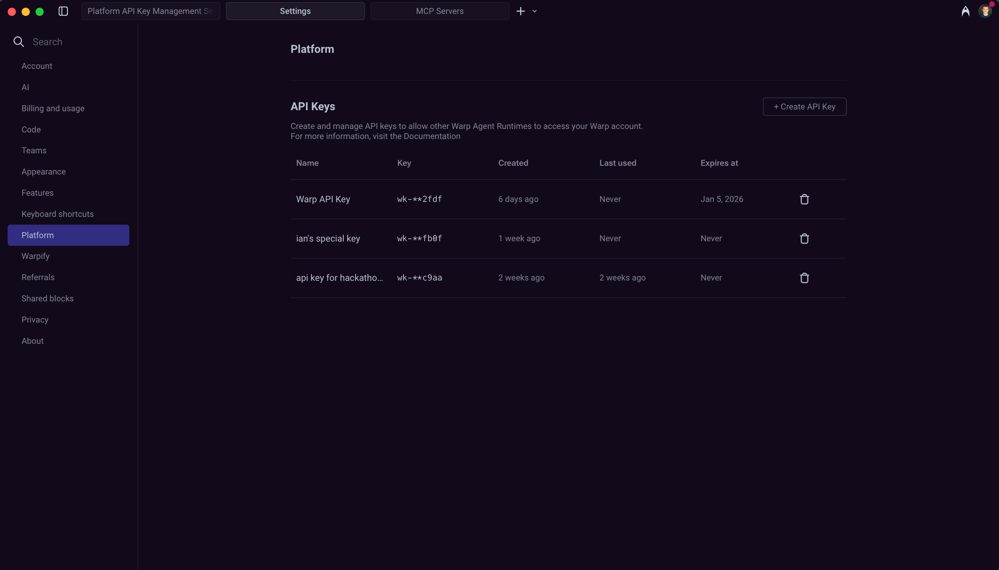

API keys let the Oz CLI and cloud agents authenticate without human interaction. Use API keys for CI pipelines, headless servers, VMs, Codespaces, containers, and other automated environments.

## Creating API keys

You can create an API key from your settings in Warp:

1. Click your profile photo in the top-right corner, then click **Settings**.
2. In the sidebar, expand **Cloud platform** and click **Oz Cloud API Keys**.
3. In the API Keys section, click **+ Create API Key**.
4. Name the key and choose an expiration (1 day, 30 days, 90 days, or never).
5. Select the key type:
   * `Personal` - Tied to your individual Warp account
   * `Team` - Tied to your team, not any individual user

:::note
When an agent needs to make code changes (e.g., opening pull requests, pushing branches, or writing to a repository), you have two options:

* Use a **personal API key** to authenticate as you. The agent runs with your GitHub permissions, and code changes are attributed to your GitHub account.
* Use a **team API key** with [team GitHub authorization](/agent-platform/cloud-agents/team-access-billing-and-identity/#team-github-authorization) configured. The agent authenticates with the Oz by Warp GitHub App, and code changes are not attributed to any individual user.
:::

:::note
Team keys without GitHub App authorization are the right fit for automated workflows that don't require writing to GitHub, such as analysis, monitoring, or triage.
:::

6. Click **Create key**.
7. Copy the raw API key and store it securely. **You won't be able to see it again after closing the dialog.**



## Personal vs team API keys

Warp supports two types of API keys, each with different billing and identity behavior:

* **Personal API keys** - Cloud agent runs authenticate as you. These runs can use your personal base credits before drawing from team Add-on Credits, just like running an agent from the Warp app or triggering one via Slack or Linear.
* **Team API keys** - Cloud agent runs are not tied to any individual user. These runs can only draw from your team's pool of Add-on Credits. They cannot use any individual's base credits. When [team GitHub authorization](/agent-platform/cloud-agents/team-access-billing-and-identity/#team-github-authorization) is configured, team key runs can also clone repositories and open pull requests using the Oz by Warp GitHub App.

Team API keys are useful for fully automated workflows, CI/CD pipelines, and scheduled tasks where no specific user context is needed. For billing details, see [Access, Billing, and Identity Permissions](/agent-platform/cloud-agents/team-access-billing-and-identity/).

## Authenticating with API keys

You can authenticate with an API key in the CLI using either an environment variable or command flag. We recommend environment variables for security and easier reuse across multiple commands.

**Via environment variable (recommended):**

```sh
$ export WARP_API_KEY="wk-xxx..."
$ oz agent run --prompt "analyze this codebase"
```

**Via command flag:**

```sh
$ oz agent run --api-key "wk-xxx..." --prompt "analyze this codebase"
```

:::note
API keys start with the prefix `wk-`. If your key doesn't have this prefix, it may be invalid or from an older format.
:::

## Managing API keys

The API Keys section in **Settings** > **Cloud platform** > **Oz Cloud API Keys** displays all your active keys with the following information:

* **Name** - The name you assigned when creating the key
* **Key** - A masked suffix (`wk-**xxxx`) to help identify the key
* **Scope** - Whether the key is Personal or Team
* **Created** - When the key was created
* **Last used** - When the key was last used for authentication
* **Expires at** - The key's expiration date, or "Never" if it doesn't expire

### Deleting API keys

To delete an API key:

1. Go to **Settings** > **Cloud platform** > **Oz Cloud API Keys**.
2. Find the key you want to delete in the API Keys list.
3. Click the delete icon next to the key.

Deleted keys are immediately invalidated and cannot be recovered. Any services or scripts using the deleted key will lose access.

## Best practices

* **Use environment variables** - Avoid passing API keys directly in commands where they may be logged or visible in shell history.
* **Set appropriate expiration** - Use shorter expiration times for development and testing; consider longer durations for stable production workflows.
* **Use team keys for automation** - For CI/CD and scheduled tasks, team keys provide cleaner billing attribution and don't depend on any individual user's account.
* **Use personal keys or configure team GitHub authorization when agents need to write to GitHub** - Personal keys authenticate as you; team keys can also write to GitHub when [team GitHub authorization](/agent-platform/cloud-agents/team-access-billing-and-identity/#team-github-authorization) is configured via the Admin Panel.
* **Rotate keys periodically** - Create new keys and retire old ones on a regular schedule to limit exposure from compromised credentials.
* **Store securely** - Use secret managers (like 1Password CLI, HashiCorp Vault, or cloud provider secret services) rather than plain text files.
