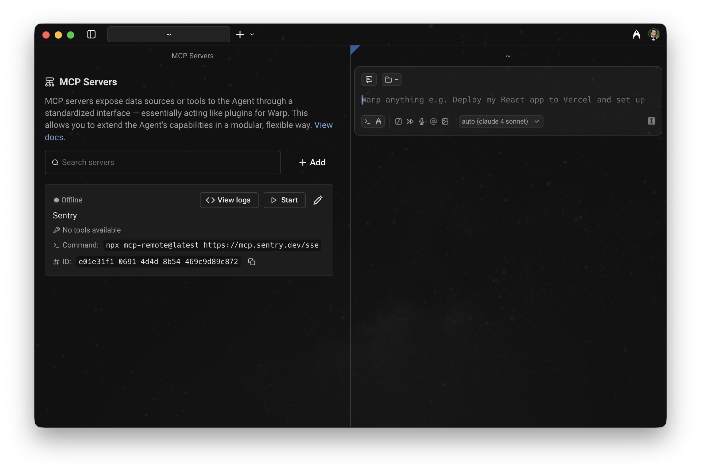

MCP servers connect agents to external systems like GitHub, Linear, or Sentry. To use a [Model Context Protocol (MCP)](/agent-platform/capabilities/mcp/) server from the CLI, use the `--mcp` flag with `oz agent run` or `oz agent run-cloud`.

For a conceptual overview of MCP with cloud agents — including configuration schema, full agent config examples, and limitations — see [MCP Servers](/agent-platform/cloud-agents/mcp/) in the Cloud Agents docs.

---

## Using the `--mcp` flag

The `--mcp` flag accepts three formats:

* **UUID** — reference a Warp-shared MCP server by its UUID (find UUIDs with `oz mcp list`)
* **Inline JSON** — pass a full MCP JSON configuration directly as a string
* **File path** — path to a JSON file containing the MCP configuration

You can repeat `--mcp` to include multiple servers.

### Passing MCP servers by UUID

1. Locate the MCP server UUID using `oz mcp list`. This command lists all MCP servers configured in your Warp account, including team-shared ones:

```sh
$ oz mcp list
+--------------------------------------+--------+
| UUID                                 | Name   |
+===============================================+
| 1deb1b14-b6e5-4996-ae99-233b7555d2d0 | github |
|--------------------------------------+--------|
| 65450c32-9eb1-4c57-8804-0861737acbc4 | linear |
|--------------------------------------+--------|
| d94ade64-0e73-47a6-b3ee-14e5afec3d90 | Sentry |
+--------------------------------------+--------+
```

  Alternatively, copy the UUID from Warp in **Settings** > **Agents** > **MCP servers**.



2. Pass the UUID to `--mcp`:

```sh
$ oz agent run --mcp "1deb1b14-b6e5-4996-ae99-233b7555d2d0" --prompt "who last updated the README?"
```

### Passing MCP servers as inline JSON or a file

You can pass MCP configuration inline or via a file:

```sh
# Inline JSON
$ oz agent run --mcp '{"github": {"url": "https://api.githubcopilot.com/mcp/"}}' --prompt "list open issues"

# From a file
$ oz agent run --mcp ./my-mcp-config.json --prompt "list open issues"
```

The file must contain a valid MCP JSON object. For example:

```json
{
  "github": {
    "url": "https://api.githubcopilot.com/mcp/"
  },
  "sentry": {
    "command": "npx",
    "args": ["-y", "mcp-remote@latest", "https://mcp.sentry.dev/mcp"]
  }
}
```

### Combining multiple servers

Pass `--mcp` multiple times to combine UUID references, inline JSON, and file-based configs in a single run:

```sh
$ oz agent run \
  --mcp "1deb1b14-b6e5-4996-ae99-233b7555d2d0" \
  --mcp '{"sentry": {"url": "https://mcp.sentry.dev/sse"}}' \
  --prompt "open a PR that fixes the top Sentry error"
```

---

## Environment variables on remote machines

Warp syncs MCP server configuration between machines logged in with your Warp account, but **does not** sync the environment variables used in that configuration. When running on a remote machine, set any required secrets manually before running the agent:

```sh
export MY_MCP_SERVER_ACCESS_TOKEN="..."
$ oz agent run --mcp "904a8936-fa82-4571-b1d6-166c26197981" --prompt "use my MCP server to check for errors"
```

:::note
For cloud agent workflows, use [Oz-managed secrets](/agent-platform/cloud-agents/secrets/) to store and inject credentials safely — secrets are stored in the cloud and referenced by name in your config. For local runs, a secrets manager CLI such as [`op`](https://developer.1password.com/docs/cli/get-started/), [`pass`](https://www.passwordstore.org/), or [`gcloud secrets versions access`](https://cloud.google.com/secret-manager/docs/create-secret-quickstart#secretmanager-quickstart-gcloud) can fetch secrets on remote hosts without exposing them in your shell history.
:::

---

## Learn more

* [MCP Servers (cloud agents)](/agent-platform/cloud-agents/mcp/) — configuration schema, full agent config file examples, and cloud agent limitations
* [Model Context Protocol (MCP)](/agent-platform/capabilities/mcp/) — configuring MCP servers in Warp for local agents
* [Secrets](/agent-platform/cloud-agents/secrets/) — store credentials in Warp so agents can access them at run time without exposing them in config files
