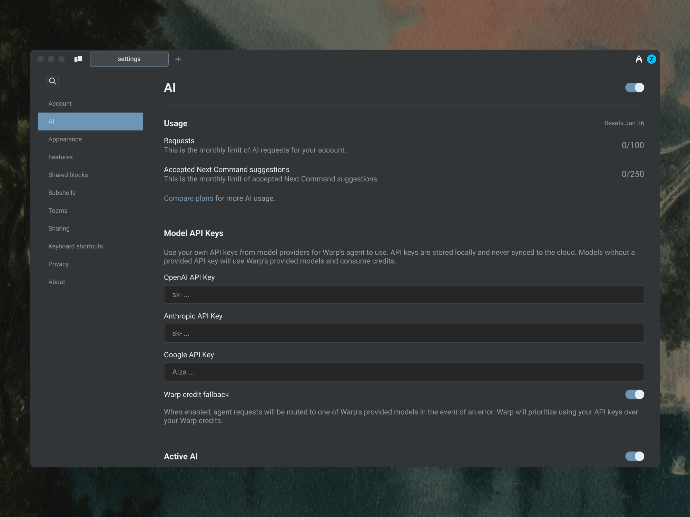
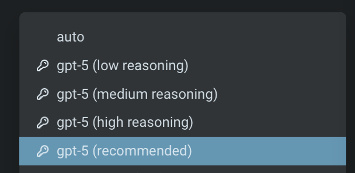
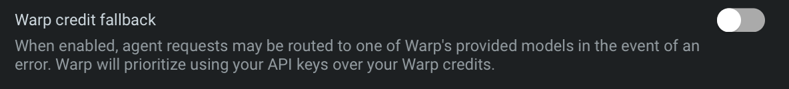

Warp supports **Bring Your Own Key (BYOK)** for users who want to connect Warp’s agent to their own Anthropic, OpenAI, or Google API accounts.

This lets you use your own API keys to access models directly, giving you full control over model selection, billing, and data routing. See [Model Choice](/agent-platform/capabilities/model-choice/) for a list of supported models.

BYOK provides greater flexibility in model access and ensures Warp **never consumes your** [credits](/support-and-community/plans-and-billing/credits/) for requests routed through your own keys.

:::note
BYOK is currently only available on Warp's paid plans, starting with Build. Learn more about plans and pricing [warp.dev/pricing](https://www.warp.dev/pricing).
:::

## How does BYOK work?

When you add your own model API keys in Warp, those keys are stored **locally on your device** and are **never synced to the cloud**.

Warp uses these API keys to directly route your agent requests to the model provider you've configured.

:::caution
BYOK does not apply to [Oz Cloud Agents](/agent-platform/cloud-agents/overview/). Because your API keys are stored locally on your device, they are not available to cloud-hosted agent runs. Cloud agent runs always consume [Warp credits](/support-and-community/plans-and-billing/credits/).
:::

When a model is selected using your own key:

* Warp **does not consume** any of your [credits](/support-and-community/plans-and-billing/credits/).
* Costs are billed directly through your model provider account.
* Warp does not retain or store your API key on any of its servers.

## Enabling BYOK

To enable and configure your API keys:

1. Open **Settings** and search for `API keys` to jump to the BYOK configuration.
2. Add your API key(s) for Anthropic, OpenAI, or Google.
3. Once added, you'll see a **key icon** next to supported models in the model picker.

:::note
The BYOK configuration widget doesn't currently live on a dedicated sidebar subpage; searching from the **Settings** window is the quickest way to reach it. We're tracking a follow-up to surface it under a persistent sidebar entry.
:::

When you explicitly select a model with a key icon, Warp routes requests through your own API key instead of consuming Warp's credits.

## BYOK usage and billing behavior

### Auto Model

Warp's **Auto** models dynamically route requests across different models based on context and performance. Because this routing logic depends on Warp’s infrastructure, **Auto always consumes Warp's credits**, even if you’ve configured your own API keys.

To use your own key, select a specific provider model (for example, Claude Sonnet 4.5, GPT-5, or Gemini 2.5 Pro) directly from the model picker with a key icon.

### Credit usage

When you select a model with the key icon in your model picker, Warp routes the request through your API key.

In this case:

* No Warp credits are consumed.
* The cost of the request is billed directly through your provider account.
* Core Agent Mode always **prioritizes BYOK usage** over any available credits.

The credit transparency footer will show “0 credits used”, and the `Billing & Usage` page will reflect no deductions from your monthly credit total.

**Other AI features in Warp**

Some AI-powered features are not affected by BYOK and are included as part of Warp’s paid plans.

| Feature                                                                       | Uses Warp's credits | Description                                                          |
| ----------------------------------------------------------------------------- | ------------------- | -------------------------------------------------------------------- |
| [Active AI Recommendations](/agent-platform/local-agents/active-ai/) | No                  | Always included with Build and higher plans.                         |
| [Codebase Context](/agent-platform/capabilities/codebase-context/)               | Yes                 | Uses Warp's AI infrastructure and consumes credits.                  |
| [Oz Cloud Agents](/agent-platform/cloud-agents/overview/) | Yes                 | BYOK keys are stored locally and not available to cloud-hosted runs. |

These features will continue to function normally regardless of whether you’ve configured BYOK.

### Failover and fallback behavior

If Warp detects an issue with your API key, you’ll see a clear error message corresponding with the AI request.

If your key:

* Is invalid: Warp notifies you and halts the request.
* Hits usage or rate limits: Warp will not retry using credits.
* You can update or replace your keys anytime by opening **Settings** and searching for `API keys`.

**Failover and fallback:**

By default, Warp does not fall back to your credits when a BYOK (Bring Your Own Key) request fails.

You can choose to enable **Warp credit fallback**. When enabled, if an agent request fails with your BYOK model (for example, due to an API error or quota limit), Warp will automatically route the request to one of Warp’s provided models. Warp always prioritizes your API keys first and only uses Warp credits when necessary.

### Zero Data Retention (ZDR) and BYOK

Warp is **SOC 2 compliant** and has **Zero Data Retention (ZDR)** policies with all of its contracted LLM providers. No customer AI data is retained, stored, or used for training by the model providers.

However, when you use your own API key:

* Data retention policies depend on your provider’s account settings.
* Warp cannot enforce ZDR for requests sent through your API keys.
* If your Anthropic, OpenAI, or Google account does not have ZDR enabled, your requests may be retained by the provider according to their terms.

Warp itself never stores your LLM API keys.

### BYOK on Enterprise and Business plans

Currently, BYOK is configured at the **user level**, not the team or admin level:

* Each team member can add and manage their own API keys locally.
* Team admins cannot yet enforce or share API keys across members.
* There is currently no organization-level Admin Panel for BYOK management.

If your organization has specific needs for managed keys or enterprise-level control, please contact us at [warp.dev/contact-sales](https://warp.dev/contact-sales).
