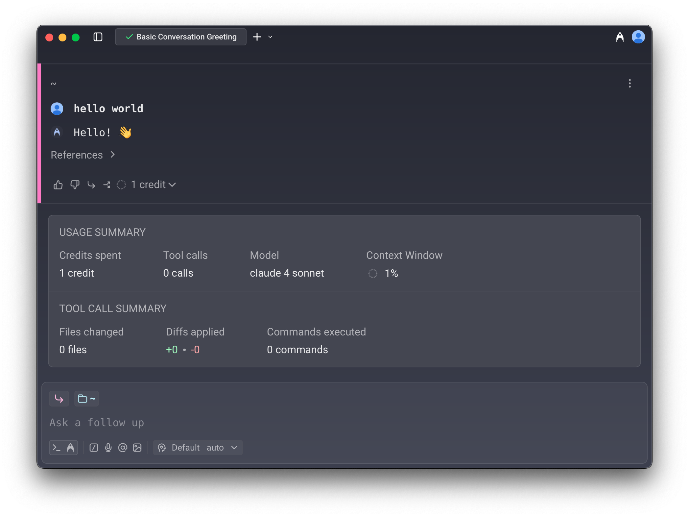

### What are Warp credits?

Any interaction with Warp's Agent consumes credits. Credits are primarily based on AI usage — the number of credits a task consumes varies based on the size and complexity of your codebase, the size of the task, the model you're using, the amount of context the agent needs to gather, and more.

Credits also include a small hosting fee, charged only when running agents in the cloud, hosted on Warp's infrastructure. For details on cloud agent credits, see [Cloud Agent Credits](/support-and-community/plans-and-billing/credits/#cloud-agent-credits).

Each interaction consumes **at least one credit**, though more complex interactions may use **multiple credits**. Because of factors such as codebase size, model choice, number of tool calls, and the nature of LLMs, credit usage is **non-deterministic** — two similar prompts can still use a different number of credits.

:::note
For a general breakdown of what factors contribute to how many credits are consumed, please refer to: [How are Warp credits calculated?](/support-and-community/plans-and-billing/credits/#how-are-warp-credits-calculated)
:::

Since there's no exact formula for predicting usage, we recommend building an intuitive understanding by experimenting with different prompts, models, and tracking how many credits they consume.

**Tracking your credit usage**

In an Agent conversation, a **turn** represents a single exchange (a response from the LLM). To see how many credits a turn consumed, hover over the **credit count chip** at the bottom of the Agent's response:

:::note
You can view your total credit usage, along with other billing details, in **Settings** > **Billing and usage**.
:::

#### Credit **limits and billing**

* **Seat-level allocation**: On team plans, credit limits apply per seat — each team member has their own allowance. Individual users (not on a team) also have their own credit allocation.
* **Cloud Agent Credits**: Individual users can run cloud agents via CLI/API using their normal Warp credits, [Cloud Agent Credits](/support-and-community/plans-and-billing/credits/#cloud-agent-credits), or a Build plan with available credits. Integrations (Slack, Linear) require team membership.
* **Hitting the credit limits**: Once you hit your monthly credit limit, your access will depend on your plan. On the Free plan, AI access stops until your next billing cycle. On paid plans, you can continue using AI with usage-based billing via [Add-on Credits](/support-and-community/plans-and-billing/add-on-credits/).

#### **Other features that use credits**

In addition to direct Agent conversations, the following features also consume credits:

* [Generate](/agent-platform/local-agents/overview/) helps you look up commands and suggestions as you type. As you refine your input, multiple credits may be used before you select a final suggestion.
* [AI Autofill in Workflows](/knowledge-and-collaboration/warp-drive/workflows/#ai-autofill) counts as a credit each time it is run.

:::tip
Regular shell commands in Warp do not consume or count towards credits.
:::

### How are Warp credits calculated?

A **credit** in Warp is a unit of work representing the total processing required to complete an interaction with an Agent. It is **not** the same as "one user message" — instead, it scales with the number of tokens processed during the interaction.

In short: **the more tokens used, the more credits consumed**.

Several factors influence how many credits are counted for a single interaction:

#### **1. The LLM model used**

Generally, smaller, faster models typically consume fewer credits than larger, reasoning-based models.

For example, **Claude Opus 4.6** and **Claude Opus 4.5** tend to consume the most tokens and credits in Warp, followed by **Claude Sonnet 4.6, GPT-5.4, GPT-5.3 Codex, Gemini 3 Pro**, and others in roughly that order. This generally correlates with model pricing as well.

:::note
**Tip**: If your task doesn't require deep reasoning, planning, or multi-step problem solving, choose a more lightweight model to reduce credit usage.
:::

#### 2. Tool calls triggered by the Agent

Warp's Agents make a variety of tool calls, including:

* Searching for files (grep)
* Retrieving and reading files
* Making and applying code diffs
* Gathering web or documentation context
* Running other utilities

Some prompts require only a couple of tool calls, while others may trigger many — especially if the Agent needs to explore your development environment, navigate a large codebase, or apply complex changes. **More tool calls = more credits**.

#### 3. Task complexity and number of steps

Some tasks are straightforward and may require only a single quick response, without much thinking or reasoning. Others can involve multiple stages—such as planning, generating intermediate outputs, verifying results, applying changes, and self-correcting—each of which can add to the credits count.

:::note
**Tip**: Keep tasks that you give to the Agent well-scoped, work incrementally, and break large changes into smaller, contained steps.
:::

#### 4. Amount of context passed to the model

Prompts that include large amounts of context (such as [attached blocks](/agent-platform/local-agents/agent-context/blocks-as-context/), long user query messages, etc.) or file attachments like [images](/agent-platform/local-agents/agent-context/images-as-context/) may also increase the number of credits used due to increased token consumption.

:::note
**Tip**: When sharing logs, code, or other large pieces of content, attach only the most relevant portions instead of full outputs.
:::

#### 5. Prompt caching (hits and misses)

Many model prompts include repeated content, like system instructions:

* **Cache hits**: if the model provider can match a prefix or a part of the prompt from a past request, it can reuse results from the cache, reducing both tokens consumed and latency.
* **Cache misses**: if no match is found, the full prompt may be processed again, which can increase credit consumption.

Because cache results depend on model provider behavior and timing, two similar prompts may still have different credit counts, depending on when you run the commands.

:::note
**Tip**: Work in a continuous session when possible to improve cache hit rates.
:::

These are the most common factors affecting credit usage, though there are others. Understanding them can help you manage your credits more efficiently and get the most from your plan.

### Cloud Agent Credits

Cloud Agent Credits are a type of credit consumed only by cloud agent runs — AI requests that run on Warp-hosted compute.

#### Eligible for Cloud Agent Credits

The following scenarios use Cloud Agent Credits:

* **First-party integrations** — Running agents through Slack or Linear integrations
* **Cloud agent runs** — Using `oz agent run-cloud` via the CLI
* **Oz API** — Running agents through Warp's Oz API
* **Cloud Mode** — Running an agent from Cloud Mode in the Warp app

#### Not eligible for Cloud Agent Credits

The following scenarios do **not** use Cloud Agent Credits:

* **Local agent runs** — Using `oz agent run` on your local machine
* **Self-hosted compute** — Using `oz agent run` on GitHub Actions, CI/CD pipelines, or other self-hosted infrastructure
