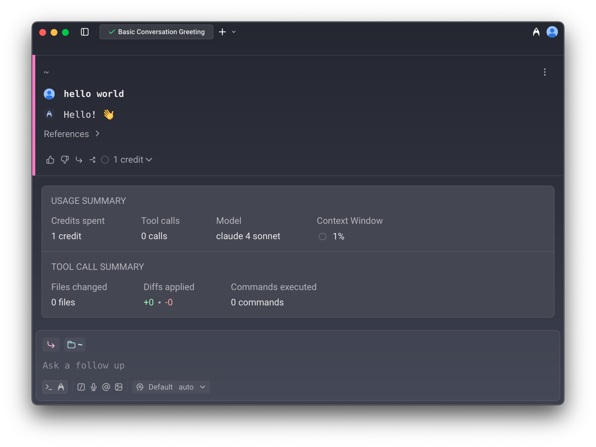

import { VARS } from '@data/vars';

### What are Warp credits?

Any interaction with Warp's Agent consumes credits. Credits are primarily based on AI usage — the number of credits a task consumes varies based on the size and complexity of your codebase, the size of the task, the model you're using, the amount of context the agent needs to gather, and more.

Warp meters credits across three types of infrastructure — inference, compute, and platform — each with its own bucket. Credit types and where an agent runs (local or cloud) are independent: each agent run consumes from whichever credit types apply to it.

* **AI credits** cover inference: the LLM call itself. Consumed when Warp pays for the model call through Warp-managed providers.
* **Compute credits** cover compute: the sandbox an agent runs in. Consumed when an agent run uses Warp-hosted compute. In practice this is cloud agent runs; local agent runs use your own machine and don't consume compute credits. See [compute credits](/support-and-community/plans-and-billing/credits/#compute-credits).
* **Platform credits** cover Warp's platform layer: run lifecycle, integrations, dashboard, APIs, and observability. Apply to every cloud agent run, plus local agent runs on Business and Enterprise plans that use customer-supplied inference (BYOK, a custom inference endpoint, or BYOLLM). See [platform credits](/support-and-community/plans-and-billing/platform-credits/).

All three buckets draw from the same Warp credit pool and [add-on credits](/support-and-community/plans-and-billing/add-on-credits/), so you can manage them as a single balance in the Warp app under **Settings** > **Billing and usage**.

Each interaction consumes **at least one credit**, though more complex interactions may use **multiple credits**. Because of factors such as codebase size, model choice, number of tool calls, and the nature of LLMs, credit usage is **non-deterministic** — two similar prompts can still use a different number of credits.

:::note
For a general breakdown of what factors contribute to how many credits are consumed, see [How are Warp credits calculated?](/support-and-community/plans-and-billing/credits/#how-are-warp-credits-calculated)
:::

Since there's no exact formula for predicting usage, we recommend building an intuitive understanding by experimenting with different prompts, models, and tracking how many credits they consume.

**Tracking your credit usage**

In an Agent conversation, a **turn** represents a single exchange (a response from the LLM). To see how many credits a turn consumed, hover over the **credit count chip** at the bottom of the Agent's response:

<figure style={{ maxWidth: "563px" }}>

<figcaption>Conversation usage footer.</figcaption>
</figure>

:::note
You can view your total credit usage, along with other billing details, in **Settings** > **Billing and usage**.
:::

#### Credit **limits and billing**

* **Seat-level allocation**: On team plans, credit limits apply per seat — each team member has their own allowance. Individual users (not on a team) also have their own credit allocation.
* **Cloud agents and integrations**: Individual users can run cloud agents via the CLI and API, drawing from their Warp credits. Slack and Linear integrations require team membership.
* **Credit limits by plan**: The Free plan doesn't include bundled AI usage for the Warp Agent. To use the Warp Agent, [upgrade to a paid plan](https://www.warp.dev/pricing), buy [add-on credits](/support-and-community/plans-and-billing/add-on-credits/) without subscribing, or bring your own inference with [Bring Your Own API Key (BYOK)](/agents/inference/bring-your-own-api-key/), a [custom inference endpoint](/agents/inference/custom-inference-endpoint/), or a [SuperGrok or X Premium subscription](/agents/inference/grok-subscription/). On paid plans, once you reach your monthly credit limit you can continue using AI with usage-based billing via [add-on credits](/support-and-community/plans-and-billing/add-on-credits/).

#### **Other features that use credits**

In addition to direct Agent conversations, the following features also consume credits:

* [Generate](/agents/local-agents/generate/) helps you look up commands and suggestions as you type. As you refine your input, multiple credits may be used before you select a final suggestion.
* [AI Autofill in Workflows](/knowledge-and-collaboration/warp-drive/workflows/#ai-autofill) counts as a credit each time it is run.

:::tip
Regular shell commands in Warp do not consume or count towards credits.
:::

### How are Warp credits calculated?

A **credit** in Warp is a unit of work representing the total processing required to complete an interaction with an Agent. It is **not** the same as "one user message" — instead, it scales with the number of tokens processed during the interaction.

In short: **the more tokens used, the more credits consumed**.

Several factors influence how many credits are counted for a single interaction:

#### **1. The LLM model used**

Generally, smaller, faster models typically consume fewer credits than larger, reasoning-based models.

For example, **Claude Opus 4.7** tends to consume the most tokens and credits in Warp, followed by **Claude Sonnet 4.6, GPT-5.5, Gemini 3.1 Pro**, and others in roughly that order. This generally correlates with model pricing as well.

:::note
**Tip**: If your task doesn't require deep reasoning, planning, or multi-step problem solving, choose a more lightweight model to reduce credit usage.
:::

#### 2. Tool calls triggered by the Agent

Warp's Agents make a variety of tool calls, including:

* Searching for files (grep)
* Retrieving and reading files
* Making and applying code diffs
* Gathering web or documentation context
* Running other utilities

Some prompts require only a couple of tool calls, while others may trigger many — especially if the Agent needs to explore your development environment, navigate a large codebase, or apply complex changes. **More tool calls = more credits**.

#### 3. Task complexity and number of steps

Some tasks are straightforward and may require only a single quick response, without much thinking or reasoning. Others can involve multiple stages—such as planning, generating intermediate outputs, verifying results, applying changes, and self-correcting—each of which can add to the credits count.

:::note
**Tip**: Keep tasks that you give to the Agent well-scoped, work incrementally, and break large changes into smaller, contained steps.
:::

#### 4. Amount of context passed to the model

Prompts that include large amounts of context (such as [attached blocks](/agents/local-agents/agent-context/blocks-as-context/), long user query messages, etc.) or file attachments like [images](/agents/local-agents/agent-context/images-as-context/) may also increase the number of credits used due to increased token consumption.

:::note
**Tip**: When sharing logs, code, or other large pieces of content, attach only the most relevant portions instead of full outputs.
:::

#### 5. Prompt caching (hits and misses)

Many model prompts include repeated content, like system instructions:

* **Cache hits**: if the model provider can match a prefix or a part of the prompt from a past request, it can reuse results from the cache, reducing both tokens consumed and latency.
* **Cache misses**: if no match is found, the full prompt may be processed again, which can increase credit consumption.

Because cache results depend on model provider behavior and timing, two similar prompts may still have different credit counts, depending on when you run the commands.

:::note
**Tip**: Work in a continuous session when possible to improve cache hit rates.
:::

These are the most common factors affecting credit usage, though there are others. Understanding them can help you manage your credits more efficiently and get the most from your plan.

### Compute credits

Compute credits cover Warp-hosted compute consumed by an agent run. In practice, cloud agent runs consume them because they run on Warp's compute; local agent runs typically don't, since they run on your own machine.

Compute credits are sometimes referred to as **cloud agent credits** when the conversation is framed around cloud agents vs local agents — they're the same bucket described from a different angle.

#### Eligible for compute credits

The following scenarios use compute credits:

* **First-party integrations** - Running agents through Slack or Linear integrations
* **Cloud agent runs** - Using `oz agent run-cloud` via the CLI
* **{VARS.API_SDK_NAME}** - Running agents through Warp's API
* **Cloud Mode** - Running an agent from Cloud Mode in the Warp app

#### Not eligible for compute credits

* **Local agent runs** — Using `oz agent run` on your local machine
* **Self-hosted compute** — Using `oz agent run` on GitHub Actions, CI/CD pipelines, or other self-hosted infrastructure

### Platform credits

Platform credits are calculated from agent hours, the time an agent spends actively working on a task. They cover Warp's platform layer (run lifecycle, integrations, dashboard, APIs, and observability) and apply to every cloud agent run, plus local agent runs on Business and Enterprise plans that use customer-supplied inference.

#### Eligible for platform credits

Platform credits are used in the following scenarios:

* **Cloud agents on any plan** use platform credits for every cloud agent run, regardless of which agent runs the task or which inference source it uses.
* **Local agents on Business or Enterprise with customer-supplied inference** use platform credits when the local agent run uses [Bring Your Own API Key (BYOK)](/agents/inference/bring-your-own-api-key/), a [custom inference endpoint](/agents/inference/custom-inference-endpoint/), or [BYOLLM](/enterprise/enterprise-features/bring-your-own-llm/).

#### Not eligible for platform credits

The following scenarios do **not** use platform credits:

* **Local agents on Free, Build, or Max plans** don't use platform credits, regardless of inference source.
* **Local agents on Business or Enterprise using Warp-managed inference** don't use platform credits because Warp is already paying for the model call through AI credits.
* **Regular terminal usage** doesn't use platform credits. Shell commands and non-AI Warp features don't consume credits.
* **Third-party agent CLIs run directly** don't use platform credits when you run `claude`, `codex`, or another agent CLI outside of Warp.

For a full breakdown of how platform credits work, see [platform credits](/support-and-community/plans-and-billing/platform-credits/).

### Cloud agent runs on team plans

Cloud agent runs that aren't initiated by a specific team member — for example, scheduled runs or runs triggered through an agent API key — follow plan-specific billing rules. On self-serve plans (Build, Max, Business), these runs are billed to the team owner: the owner's plan-included credits first, then the team's shared add-on credit pool. With auto-reload off, the request is blocked when both are depleted (insufficient credits error). With auto-reload on, usage can trigger a reload into the team's shared pool subject to the team-wide spend cap. On Enterprise plans, these runs draw from the team-scoped credit pool per your contract.

For the full waterfall, see [How are cloud agent runs on team plans billed when no individual user triggered them?](/support-and-community/plans-and-billing/pricing-faqs/#how-are-cloud-agent-runs-on-team-plans-billed-when-no-individual-user-triggered-them) in the Pricing FAQs.
