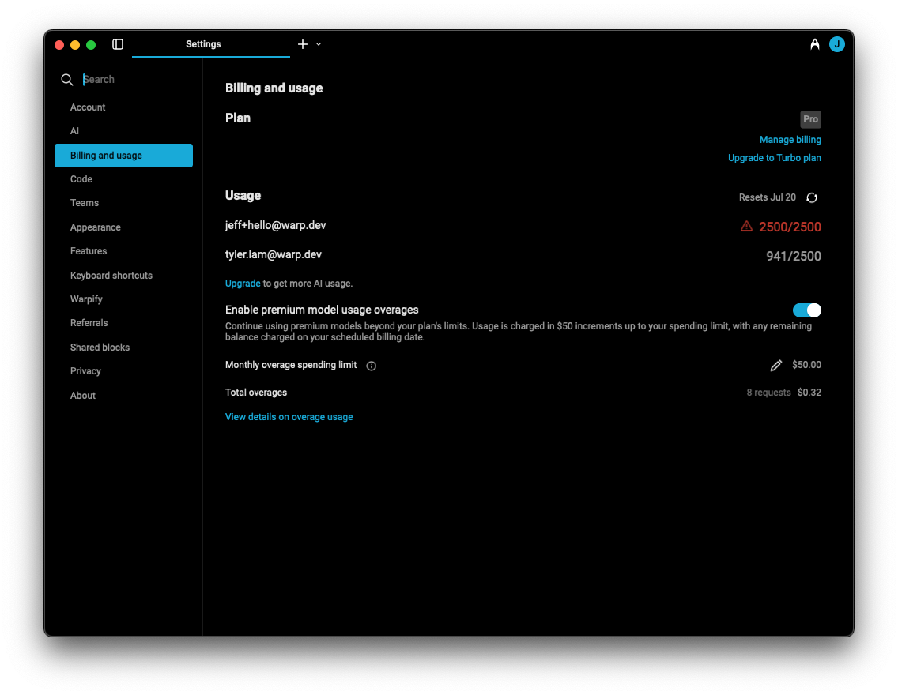

Warp offers usage-based pricing for Subscribers, allowing continued access to premium AI models even after reaching the monthly credits limit included in the plan (billed at $0.04 per additional credit).

You can manage usage-based pricing directly in Warp under **Settings** > **Billing and usage**.

### Enabling overages

**Team admins** can enable or disable "premium model overages" and set a monthly spending limit from the settings dashboard. Individual subscribers can manage their own overage settings directly in the settings dashboard.

:::note
Usage-based pricing only applies after you’ve reached the credit limit on your plan — you won’t be charged for any overages until that point, even if overages are enabled.
:::

### How overages work

Overages are managed **at the team level**, even if your team only has one member (i.e. individual users). Once overages are enabled, any team member who reaches their monthly credit quota can continue to have access to premium models — with **additional usage billed at cost ($0.04 per credit)**.

Each user on the team has their **own credit limit**, but only **credits made beyond that personal quota** are considered overages. These charges are tracked and billed **collectively** at the team level.

For example, if your plan includes 10,000 credits per team member:

* If **User A** reaches their 10,000 limit, any further usage by them counts towards overages.
* If **User B** has only used 2,000 credits, they still have 8,000 included credits left.
* User A's overages **do not** consume User B's remaining quota.

Overages are **billed monthly**, or when your team accumulates **$20 worth of charges**, whichever comes first.

### Plan upgrades and cancellations

If you upgrade from lower to a higher plan, your monthly credit limit will update immediately to match the higher plan. (For exact limits, see our [pricing page](https://www.warp.dev/pricing).) However, **any overages incurred while on the lower plan will still be billed** — upgrading does not retroactively remove or reduce existing overage charges.

If you cancel your subscription, you’ll retain access to premium features until the end of your current billing period. Any usage-based overages accrued during that period will be charged at the time your plan ends.\\
