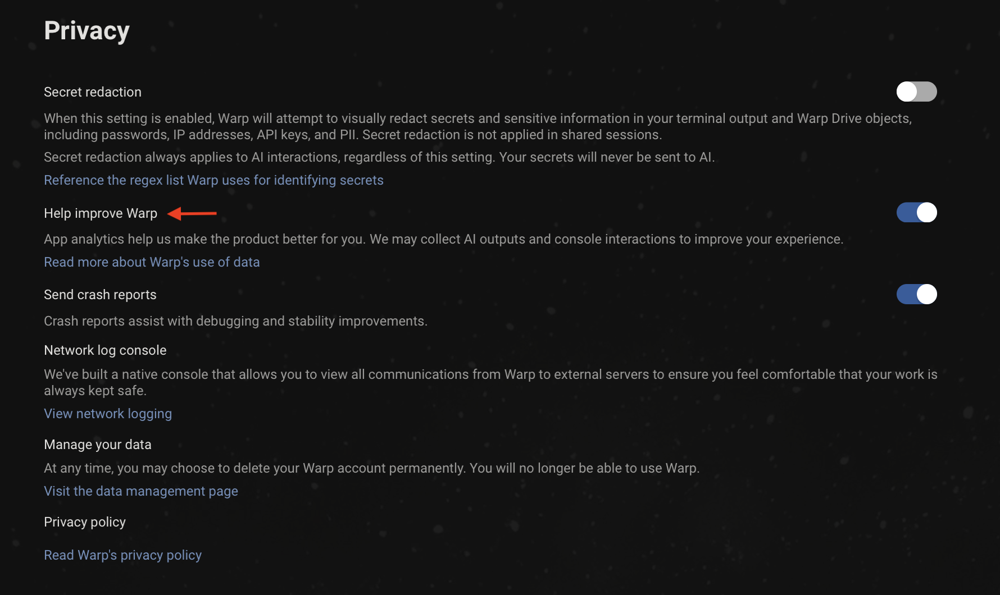

:::note
If you have questions, reach out at [privacy@warp.dev](mailto:privacy@warp.dev). For security-related issues, email [security@warp.dev](mailto:security@warp.dev).
:::

## Transparency and control

Our philosophy is complete transparency and control over any data leaving your machine. This means you can:

* Read a complete list of [all the telemetry events](/support-and-community/privacy-and-security/privacy/#exhaustive-telemetry-table) that get sent for app analytics
* Monitor telemetry in real-time with Warp's native [Network Log](/support-and-community/privacy-and-security/network-log/)
* [Opt out](/support-and-community/privacy-and-security/privacy/#how-to-disable-telemetry-and-crash-reporting) of telemetry at any time
* Read and audit Warp's client source code at [`warpdotdev/warp`](https://github.com/warpdotdev/warp), open source under [AGPL v3](https://github.com/warpdotdev/warp/blob/master/LICENSE)

## What telemetry data does Warp collect and why?

Warp collects high-level telemetry and usage data to discover product quality issues and guide feature prioritization.

If you haven't opted out of "Help improve Warp", we may collect:

1. High level product usage and analytics data to analyze feature uptake and usage patterns. See the full list of tracked events in the [exhaustive telemetry table](/support-and-community/privacy-and-security/privacy/#exhaustive-telemetry-table) below. These are all high level metrics and do not include any user generated content.
2. AI interactions and console inputs that power our [AI features](/agent-platform/local-agents/overview/). Warp unconditionally applies [Secret Redaction](/support-and-community/privacy-and-security/secret-redaction/) in all AI interactions to ensure that any sensitive data is _never_ collected or sent to third parties.

:::note
Telemetry must be enabled to use AI features on the Free plan, while paid plans can opt out at any time and continue using Warp, including AI.
:::

:::caution
Business and Enterprise plans are covered by our Zero Data Retention (ZDR) agreement. No AI interaction or console data is ever collected.
:::

Selling usage data will never be part of Warp's business model. This data is used solely to improve the end-user experience. Warp uses Sentry for crash reporting and Rudderstack for app analytics.

You can read our [full privacy policy](https://www.warp.dev/legal/privacy-policy) as well as [how Warp handles security](https://www.warp.dev/legal/security).

### How to disable telemetry and crash reporting

1. Navigate to **Settings** > **Privacy**, or open the [Command Palette](/terminal/command-palette/) and search for "privacy"
2. Toggle off "Help improve Warp", "Send crash reports", or both

With telemetry disabled, no console interactions are ever persisted on Warp's servers. Each request contains a `X-Warp-Telemetry-Enabled` header to specify whether telemetry is disabled, and even if this is missing from the request, our server assumes it's disabled.

### Delete your account and data

Warp provides a convenient way for you to delete your account and data. Any active Warp subscriptions associated with the account will also be cancelled when deleted. You can delete your Warp account and data in the following ways:

*   From Warp, go to **Settings** > **Privacy** > **"Visit the data management page"**

    Click the “Delete” button on the Data Management page to go through the data deletion flow.
* From the web, log in to your warp account at [https://app.warp.dev/login](https://app.warp.dev/login), then go to the data management page at [https://app.warp.dev/data\_management](https://app.warp.dev/data_management) and click the “Delete” button to go through the data deletion flow.

:::note
Deletion jobs run every 24 hours, so if you deleted your account and want to sign up again with the same email, you won't be able to do so until that deletion job completes.
:::

:::caution
If you're a [Team](/knowledge-and-collaboration/teams/) admin, the deletion flow will require that you assign a team member as the new admin.
:::

### Exhaustive Telemetry Table

| Event Name | Description |
|---|---|
| `AI Command Search opened` | Opened the modal for AI Command Search, where you can use natural language to search for commands |
| `AI Execution Profile Created` | A new AI execution profile was created |
| `AI Execution Profile Deleted` | An AI execution profile was deleted |
| `AI Execution Profile: Added To Allowlist` | An item was added to an AI execution profile allowlist |
| `AI Execution Profile: Added To Denylist` | An item was added to an AI execution profile denylist |
| `AI Execution Profile: Model Selected` | An AI model was selected for an AI execution profile |
| `AI Execution Profile: Removed From Allowlist` | An item was removed from an AI execution profile allowlist |
| `AI Execution Profile: Removed From Denylist` | An item was removed from an AI execution profile denylist |
| `AI Execution Profile: Setting Updated` | An AI execution profile setting was updated |
| `AI Input Not Sent` | The AI input was not sent |
| `AI Suggested Rule Added` | Clicked the Add Suggested Rule button in the AI blocklist |
| `AI Suggested Rule Content Changed` | Content changed by the user in the suggested rule dialog |
| `AI Suggested Rule Edited` | Clicked the Edit Suggested Rule button in the AI blocklist |
| `AIAutonomy.AutoexecutedRequestedCommand` | Autoexecuted an Agent Mode requested command |
| `AIAutonomy.ChangedAgentModeCodingPermissions` | Changed Agent Mode permissions for coding tasks |
| `AIAutonomy.ToggledAutoexecuteReadonlyCommandsSetting` | Toggled setting to autoexecute readonly Agent Mode requested commands |
| `Add Added Subshell Command` | Added a command to be automatically Warpified via Warp's subshell wrapper |
| `Add Denylisted SSH Tmux Wrapper Host` | Added a SSH host to the denylist for prompting for Tmux Wrapper |
| `Add Denylisted Subshell Command` | Explicitly prevent a command from being Warpified via Warp's subshell wrapper |
| `Add Tab With Shell` | Added a tab with specific shell |
| `Added Workflow Alias` | Added an alias to a Warp Drive workflow |
| `Agent Management View Copied Session Link` | User copied a session link from the Agent Management View |
| `Agent Management View Opened Session` | User opened a session from the Agent Management View |
| `Agent Management View Toggled` | User toggled the Agent Management View open or closed |
| `Agent Mode Query Suggestion Accepted` | Prompt Suggestion accepted |
| `Agent Mode Query Suggestions Banner Shown` | Prompt Suggestions banner shown |
| `Agent Mode Setup Banner Accepted` | Agent Mode setup banner accepted |
| `Agent Mode Setup Banner Dismissed` | Agent Mode setup banner dismissed |
| `Agent Mode Setup Project Scoped Rules Action` | User clicked a button in the Agent Mode setup project scoped rules step |
| `Agent Mode.Setup Codebase Context Action` | User clicked a button in the Agent Mode setup codebase context step |
| `Agent Predict` | Completed an Agent Predict prediction |
| `Agent Toolbar Dismissed` | User dismissed the use-agent toolbar |
| `AgentManagement.AgentTypeSelectorOpened` | User opened the agent type selector from agent management |
| `AgentManagement.ArtifactClicked` | User clicked an artifact button |
| `AgentManagement.CloudRunCancelled` | User cancelled a cloud run |
| `AgentManagement.CloudRunOpened` | User opened a cloud run |
| `AgentManagement.ConversationForked` | User forked a conversation |
| `AgentManagement.ConversationLinkCopied` | User copied a conversation link |
| `AgentManagement.ConversationOpened` | User opened a conversation |
| `AgentManagement.DetailsPanelContinueLocally` | User clicked Continue locally in the details panel |
| `AgentManagement.DetailsViewed` | User clicked View details |
| `AgentManagement.DismissSetupGuide` | User dismissed the ambient agent setup guide |
| `AgentManagement.FilterChanged` | User changed a filter in the management view |
| `AgentManagement.OpenSetupGuide` | User opened the ambient agent setup guide |
| `AgentManagement.SessionLinkCopied` | User copied a session link |
| `AgentManagement.SetupGuideDocsLink` | User clicked a docs URL in the setup guide |
| `AgentManagement.SetupGuideStepCopy` | User copied a workflow step from the setup guide |
| `AgentManagement.SetupGuideStepRun` | User ran a workflow step from the setup guide |
| `AgentManagement.SpawnNewCloudAgent` | User spawned a new cloud agent from agent management |
| `AgentManagement.SpawnNewLocalAgent` | User spawned a new local agent from agent management |
| `AgentManagement.TombstoneArtifactClicked` | User clicked an artifact in the tombstone view |
| `AgentManagement.TombstoneContinueLocally` | User clicked Continue locally in the tombstone |
| `AgentManagement.ViewToggled` | User toggled the agent management view open or closed |
| `AgentMode.AttachedContext` | Attached block as context to an Agent Mode query |
| `AgentMode.AttachedImages` | Attached images to an Agent Mode query |
| `AgentMode.ChangedInputType` | The input type was changed from shell -> AI or AI -> shell |
| `AgentMode.ClickedEntrypoint` | Clicked on an Agent Mode entrypoint |
| `AgentMode.Code.DiffHunksNavigated` | Agent Mode Code diff hunks navigated |
| `AgentMode.Code.DiffMatchFailed` | Failed to match code diff |
| `AgentMode.Code.FileExceededContextLimit` | File from AI exceeded context limit |
| `AgentMode.Code.FilesNavigated` | Agent Mode Code files navigated |
| `AgentMode.Code.InvalidFile` | File(s) in code diff could not be found |
| `AgentMode.Code.MalformedFinalLineProxy` | Suggested code diff likely required malformed trailing line correction (heuristic) |
| `AgentMode.Code.MissingLineNumbers` | Code diff was missing line numbers |
| `AgentMode.Code.SuggestedCodeEditedByUser` | Agent Mode Code suggestion edited by user |
| `AgentMode.Code.SuggestedEditAcceptAndContinueClicked` | User selected Accept and start conversation for a code diff suggestion in Agent Mode |
| `AgentMode.Code.SuggestedEditAcceptClicked` | User selected Accept for a code diff suggestion in Agent Mode |
| `AgentMode.Code.SuggestedEditReceived` | Agent Mode suggested a code edit |
| `AgentMode.Code.SuggestedEditResolved` | Agent Mode pending code edit suggestion resolved |
| `AgentMode.CreatedAIBlock` | Created an AI block in agent mode |
| `AgentMode.Error` | Received an error when getting Agent Mode response |
| `AgentMode.ExecutedWarpDrivePrompt` | Executed a saved prompt. |
| `AgentMode.ExitedShellProcess` | An agent-requested command caused the shell process to exit |
| `AgentMode.FileGlob.Failed` | The file glob tool failed to complete |
| `AgentMode.FileGlob.Succeeded` | The file glob tool completed successfully |
| `AgentMode.Grep.Failed` | The grep tool failed to complete |
| `AgentMode.Grep.Succeeded` | The grep tool completed successfully |
| `AgentMode.NaturalLanguageDetection.InputBufferSubmitted` | Input buffer submitted |
| `AgentMode.OpenedCitation` | Opened a citation that was surfaced in agent mode |
| `AgentMode.Orchestration.TeamAgentCommunicationFailed` | Failed to send an orchestration message or lifecycle event for a TeamAgent |
| `AgentMode.PotentialAutoDetectionFalsePositive` | Manually toggled input to shell mode after input was auto-detected as natural language. |
| `AgentMode.QueryAttemptAtLImit` | Tried to send an Agent Mode query but they already reached the query limit |
| `AgentMode.RequestRetrySucceeded` | Agent Mode request succeeded after retrying following an initial error |
| `AgentMode.SetupCreateEnvironmentAction` | User clicked a button in the Agent Mode setup create environment step |
| `AgentMode.SurfacedCitations` | Agent mode used and cited external sources that were used in its response |
| `AgentMode.ToggleAutoDetectionSetting` | Toggled the setting that enables or disables natural language auto-detection in the input.  |
| `AgentNotification.Shown` | An agent notification was shown to the user (toast or mailbox) |
| `AgentTip Clicked` | User clicked a link or action in an Agent Tip |
| `AgentTip Shown` | Selected an Agent Tip to show in the Agent Mode status bar |
| `AgentView.Entered` | User entered the Agent View |
| `AgentView.Exited` | User exited the Agent View |
| `AgentView.InlineConversationMenuItemSelected` | User selected an item from the inline conversation menu |
| `AgentView.InlineConversationMenuOpened` | User opened the inline conversation menu in Agent View |
| `AgentView.ShortcutsViewToggled` | User toggled the shortcuts view in Agent View |
| `AgenticOnboarding.BlockSelected` | Selected an agentic onboarding block to execute |
| `AmbientAgent.CloudMode.Entered` | User entered cloud agent view |
| `AmbientAgent.CloudMode.EnvironmentSelector.Opened` | User opened the environment selector menu |
| `AmbientAgent.CloudMode.EnvironmentSelector.Selected` | User selected an environment from the selector |
| `AmbientAgent.CloudMode.EnvironmentSettings.GitHubAuth` | User started GitHub authentication from the environment form |
| `AmbientAgent.CloudMode.EnvironmentSettings.LaunchedAgent` | User launched an environment setup agent from the environment form |
| `AmbientAgent.ConcurrencyModal.Dismissed` | User dismissed the cloud agent capacity modal |
| `AmbientAgent.ConcurrencyModal.Opened` | User opened the cloud agent capacity modal |
| `AmbientAgent.ConcurrencyModal.UpgradeClicked` | User clicked the upgrade button in the cloud agent capacity modal |
| `AmbientAgent.DispatchFailed` | Ambient agent failed to dispatch or encountered an error |
| `AmbientAgent.EnvironmentSettings.CreatedEnvironment` | User created a new environment |
| `AmbientAgent.EnvironmentSettings.DeletedEnvironment` | User deleted an environment |
| `AmbientAgent.EnvironmentSettings.Image.Suggested` | Docker image was suggested for an environment |
| `AmbientAgent.EnvironmentSettings.Image.SuggestionFailed` | Docker image suggestion failed |
| `AmbientAgent.EnvironmentSettings.Opened` | User opened the environment management pane |
| `AmbientAgent.EnvironmentSettings.UpdatedEnvironment` | User updated an existing environment |
| `Anonymous User Attempted Login-Gated Feature` | Anonymous user attempted to access a login-gated feature |
| `Anonymous User Expiration Lockout` | An anonymous user opened Warp after their conversion deadline and was locked out |
| `Anonymous User Hit Cloud Object Limit` | Anonymous user attempted to create a cloud object past their personal object limit |
| `Anonymous User Initiated Signup` | An anonymous user initiated the sign up flow |
| `Anonymous User Linked from Browser` | Received an auth payload from anonymous user after linking in browser |
| `App Download Source` | Whether the Warp was installed from the home page or through homebrew |
| `App Startup` | App is launched |
| `Attached Workflow Alias Environment Variables` | Added or removed environment variables for a Warp Drive workflow alias |
| `Attempting to Relaunch for Update` | Attempted to relaunch the app after installing an update |
| `Auth Common Question Clicked in App` | Clicked on "Common Question" when logging in |
| `Auth: Open Privacy Settings Overlay` | Privacy settings are open during sign-in |
| `Auth: Toggle Common Questions` | Toggled FAQ Page when logging in |
| `Autosuggestion Inserted` | Accepted autosuggestion |
| `Background Block Started` | Warp created a background-output Block (whenever a processes has been backgrounded and yields some output) |
| `BaselineCommand Latency` | Command execution time |
| `Block Creation` | Created Block |
| `Block Filter Toolbelt Button Clicked` | Clicked the block filter icon in the top-right of a block |
| `Block Selection` | Selected Block |
| `Bootstrap Slow Contents` | Contents of the bootstrap block if bootstrapping is slow |
| `Bootstrapping Slow` | Slow bootstrap on session startup |
| `Bootstrapping Succeeded` | Successful bootstrap for session |
| `CLI Subagent Action Executed` | User approved a blocked action from the CLI subagent |
| `CLI Subagent Action Rejected` | User rejected a blocked action from the CLI subagent |
| `CLI Subagent Control State Changed` | Control state changed in CLI subagent (agent in control, agent blocked, user in control, or agent tagged in) |
| `CLI Subagent Input Dismissed` | User dismissed the input in the CLI subagent |
| `CLI Subagent Responses Toggled` | User toggled the visibility of agent responses in CLI subagent |
| `CLI.Execute.Agent.List` | Listed agents from the Warp CLI |
| `CLI.Execute.Agent.Profile.List` | Listed agent profiles from the Warp CLI |
| `CLI.Execute.Agent.Run` | Ran an agent from the Warp CLI |
| `CLI.Execute.Agent.RunAmbient` | Ran an ambient agent from the Warp CLI |
| `CLI.Execute.Artifact.Download` | Downloaded an artifact from the Warp CLI |
| `CLI.Execute.Artifact.Get` | Got artifact metadata from the Warp CLI |
| `CLI.Execute.Artifact.Upload` | Uploaded an artifact from the Warp CLI |
| `CLI.Execute.Conversation.Get` | Got conversation by ID from the Warp CLI |
| `CLI.Execute.Environment.Create` | Created a cloud environment from the Warp CLI |
| `CLI.Execute.Environment.Delete` | Deleted a cloud environment from the Warp CLI |
| `CLI.Execute.Environment.Get` | Got cloud environment details from the Warp CLI |
| `CLI.Execute.Environment.Image.List` | Listed available base images from the Warp CLI |
| `CLI.Execute.Environment.List` | Listed cloud environments from the Warp CLI |
| `CLI.Execute.Environment.Update` | Updated a cloud environment from the Warp CLI |
| `CLI.Execute.Federate.IssueGcpToken` | Issued a GCP federated identity token from the Warp CLI |
| `CLI.Execute.Federate.IssueToken` | Issued a federated identity token from the Warp CLI |
| `CLI.Execute.Integration.Create` | Created an integration from the Warp CLI |
| `CLI.Execute.Integration.List` | Listed integrations from the Warp CLI |
| `CLI.Execute.Integration.Update` | Updated an integration from the Warp CLI |
| `CLI.Execute.Login` | Logged in via the Warp CLI |
| `CLI.Execute.Logout` | Logged out via the Warp CLI |
| `CLI.Execute.MCP.List` | Listed MCP servers from the Warp CLI |
| `CLI.Execute.Model.List` | Listed models from the Warp CLI |
| `CLI.Execute.Provider.List` | Listed providers from the Warp CLI |
| `CLI.Execute.Provider.Setup` | Set up a provider via the Warp CLI |
| `CLI.Execute.Run.Conversation.Get` | Got run conversation from the Warp CLI |
| `CLI.Execute.Schedule.Create` | Created a scheduled agent from the Warp CLI |
| `CLI.Execute.Schedule.Delete` | Deleted a scheduled agent from the Warp CLI |
| `CLI.Execute.Schedule.Get` | Got scheduled agent configuration from the Warp CLI |
| `CLI.Execute.Schedule.List` | Listed scheduled agents from the Warp CLI |
| `CLI.Execute.Schedule.Pause` | Paused a scheduled agent from the Warp CLI |
| `CLI.Execute.Schedule.Unpause` | Unpaused a scheduled agent from the Warp CLI |
| `CLI.Execute.Schedule.Update` | Updated a scheduled agent from the Warp CLI |
| `CLI.Execute.Secret.Create` | Created a secret from the Warp CLI |
| `CLI.Execute.Secret.Delete` | Deleted a secret from the Warp CLI |
| `CLI.Execute.Secret.List` | Listed secrets from the Warp CLI |
| `CLI.Execute.Secret.Update` | Updated a secret from the Warp CLI |
| `CLI.Execute.Task.Get` | Got status of task from the Warp CLI |
| `CLI.Execute.Task.List` | Listed tasks from the Warp CLI |
| `CLI.Execute.Whoami` | Printed current user info from the Warp CLI |
| `CLIAgentFooter.ImageAttached` | User attached an image from the CLI agent footer |
| `CLIAgentFooter.SettingToggled` | User toggled the CLI agent footer setting |
| `CLIAgentFooter.Shown` | CLI agent footer was shown to the user |
| `CLIAgentFooter.VoiceInputUsed` | User used voice input from the CLI agent footer |
| `CLIAgentPlugin.ChipClicked` | User clicked the plugin install or update chip |
| `CLIAgentPlugin.ChipDismissed` | User dismissed the plugin install or update chip |
| `CLIAgentPlugin.Detected` | A CLI agent plugin was detected via a SessionStart event |
| `CLIAgentPlugin.OperationFailed` | Auto plugin install or update failed |
| `CLIAgentPlugin.OperationSucceeded` | Auto plugin install or update completed successfully |
| `CLIAgentRichInput.Closed` | CLI agent Rich Input was closed |
| `CLIAgentRichInput.Opened` | User opened CLI agent Rich Input |
| `CLIAgentRichInput.Submitted` | User submitted a prompt via CLI agent Rich Input |
| `Changed invite view option` | Toggled between link and invite for invite |
| `Clicked Continue Conversation Button` | User clicked the Continue Conversation button in a block footer |
| `Clicked Reset to Defaults Button in Settings Import` | Reset the imported settings in the settings import onboarding block |
| `Clone Repo Prompt Submitted` | User submitted a repository URL from the clone repo view |
| `Code Pane Opened` | Opened the code editor pane from various sources |
| `CodePanels.FileOpened` | Opened a file from code review, project explorer, or global search |
| `CodeReview.AddToContext` | Content added to AI context from code review |
| `CodeReview.BaseChanged` | Diff base changed in code review |
| `CodeReview.CalculateDiffMetadataFailed` | Failure when calculating diff metadata |
| `CodeReview.CommentAdded` | Inline code review comment added |
| `CodeReview.CommentDeleted` | Inline code review comment deleted |
| `CodeReview.CommentEdited` | Inline code review comment edited |
| `CodeReview.CommentEditorOpened` | Inline code review comment editor opened |
| `CodeReview.CommentListExpanded` | Inline code review comment list expanded |
| `CodeReview.CommentListItemClicked` | Inline code review comment list item clicked |
| `CodeReview.CommentRelocationFailed` | Inline code review comment relocation fell back to approximate line |
| `CodeReview.CommentResolved` | Inline code review comment resolved |
| `CodeReview.CommentsAttached` | Newly-imported comments relocated against editor lines |
| `CodeReview.CommentsReceived` | Agent insert_code_review_comments tool call received and processed |
| `CodeReview.FileSaved` | File saved in code review pane |
| `CodeReview.FindBarModeChanged` | Search mode changed in code review find bar |
| `CodeReview.FindBarToggled` | Code review find bar opened or closed |
| `CodeReview.FindNavigated` | Navigated to next or previous match in code review find bar |
| `CodeReview.LoadDiffFailed` | Failure when loading diff content |
| `CodeReview.PaneOpened` | Code review pane opened |
| `CodeReview.PaneStateChanged` | Code review pane minimized or maximized |
| `CodeReview.RevertHunkClicked` | Revert hunk button clicked |
| `CodeReview.ReviewSubmitted` | Inline code review submitted to agent |
| `CodeView.SelectionAddedAsContext` | Added selected code as context from the code editor |
| `CodexModal.Opened` | User opened the Codex modal |
| `CodexModal.UseCodexClicked` | User clicked 'Use Codex' in the Codex modal |
| `Command Correction Event` | Accepted command correction |
| `Command File Run` | Opened a .cmd or unix executable file and ran it directly in Warp |
| `Command Palette Search Accepted` | Accepted a command palette search result |
| `Command Palette Search Exited` | Exited command palette search without accepting a result |
| `Command Search Async Query Completed` | Finished searching for a command in the background |
| `Command Search Exited` | Exited command search (universal search panel to search) without accepting a result |
| `Command Search Filter Changed` | Changed command search filter |
| `Command Search Opened` | Opened command search (universal search panel to search) |
| `Command Search Result Accepted` | Accepted command search result |
| `Complete Welcome Tip` | Completed all welcome tips items |
| `Completed Settings Import` | Imported a terminal's settings via the settings import onboarding block |
| `ComputerUse.Approved` | A RequestComputerUse action was approved (manually or auto-executed) |
| `ComputerUse.Cancelled` | A RequestComputerUse action was cancelled/rejected |
| `Confirm Suggestion` | Accepted tab completion suggestion |
| `Context Menu Copy` | Clicked "Copy" in context menu |
| `Context Menu Copy Prompt` | Clicked  "Copy Prompt" in context menu |
| `Context Menu Copy Selected Text` | Clicked "Copy selected text" in context menu |
| `Context Menu Insert Selected Text into Input` | Clicked "insert into input" in context menu |
| `Context Menu Toggle Git Prompt Dirty Indicator` | Toggled indicator of dirty git prompt |
| `Context Menu: Find Within Blocks` | Clicked "find within blocks" in context menu |
| `Context Menu: Initiate Block Sharing` | Opened "Share" modal via context menu |
| `Context Menu: Reinput Commands` | Clicked "reinput commands" in context menu |
| `ConversationList.ItemDeleted` | Deleted a conversation from the conversation list |
| `ConversationList.ItemOpened` | Opened a conversation from the conversation list |
| `ConversationList.LinkCopied` | Copied a conversation link from the conversation list |
| `ConversationList.Opened` | Opened the conversation list view in the left panel |
| `Copied Shared Session Link` | Copied a shared session link |
| `Copy Block Sharing Link` | Clicked "Share block..." in context menu |
| `Copy Invite Link` | Clicked "Copy Link" on Referral Modal |
| `Copy Obfuscated Secret` | Copied a secret's obfuscated contents to clipboard |
| `Copy Object To Clipboard` | Copied an object to the user's keyboard |
| `Create Custom Theme` | Created a custom theme using the built-in theme creator |
| `Create Project Prompt Submitted` | User submitted a prompt from the create project view |
| `Create Project Prompt Submitted Content` | User submitted custom prompt content from the create project view |
| `Custom Secret Regex Added` | Custom Secret Regex Added |
| `Database Read Error` | Database read error when trying to get app state for session restoration |
| `Database Startup Error` | Failed to initialize sqlite upon startup |
| `Database Write Error` | Database write error when trying to write app state for session restoration |
| `Decline Subshell Bootstrap` | Developer declined the Warp banner to Warpify the current session |
| `Delete Custom Theme` | Deleted a custom theme using the built-in theme creator |
| `Deleted Notebook` | Deleted notebook from Warp Drive team |
| `Deleted Workflow` | Deleted workflow from Warp Drive team |
| `Disable Input Sync Inputs` | Disabled / turn off the Input Synchronization (across editors) |
| `Dismiss Alias Expansion Banner` | Dismissed the banner to enable automatic alias expansion within the Input Editor |
| `Dismiss Welcome Tips` | Dismissed Welcome tips |
| `Don't Show Sharer Grant Modal Again` | When you check don't show again on the confirmation modal for granting a role |
| `Drag and Drop Tab` | Tab dragged and dropped |
| `Duplicate Object` | Cloned a Warp Drive object |
| `Edited Input Before Precmd` | Input edited before precmd hook completes |
| `Edited Workflow Alias Argument` | Edited an argument in a Warp Drive workflow alias |
| `Enable Alias Expansion From Banner` | Enabled automatic alias expansion within the Input Editor from the banner |
| `Executed Conversation Rewind` | User executed a rewind to a previous conversation state |
| `Expanded Code Suggestion` | Expanded the passive code diff suggestion |
| `Export Object` | Exported a Warp Drive object |
| `Features Page Action` | Changed settings in Features Page |
| `File Tree Toggled` | Opened the file tree/project explorer |
| `FileTree.AttachedAsContext` | Attached a file or directory as context from the file tree |
| `FileTree.ItemCreated` | Created a new file from the file tree |
| `Find Option Toggled` | Changed settings in Find Toggle |
| `Focused Config in Settings Import` | Selected a terminal in the settings import onboarding block |
| `FreeTierLimitHitInterstitial.Closed` | User closed the free tier limit hit interstitial |
| `FreeTierLimitHitInterstitial.Displayed` | The free tier limit hit interstitial was displayed |
| `FreeTierLimitHitInterstitial.UpgradeButtonClicked` | User clicked the 'Upgrade' button in the free tier limit hit interstitial |
| `Generate Block Sharing Link` | Generated Block sharing link |
| `Generate Metadata For Workflow Error` | Failed to generate metadata for a workflow using Warp AI |
| `Generate Metadata For Workflow Success` | Successfully generated metadata for a workflow using Warp AI |
| `Get Started Skip to Terminal` | User clicked skip to terminal from get started view |
| `Global Search Opened` | Opened the global search view |
| `Global Search Query Started` | Started a global search (warp_ripgrep) search |
| `ITerm Profile has Multiple Hotkeys` | Attempted to import an iTerm profile that contained multiple hotkey window bindings |
| `Identified Antivirus Software` | Identified running antivirus software on the user's machine |
| `Image Received` | Received an image through an image protocol over the pty |
| `InitialWorkingDirectoryConfigurationChanged` | Replaced the default working directory with a different path |
| `Initiate Reauth` | Started the flow to re-authenticate the client |
| `Input Mode Changed` | Changed the Input Editor Mode (Pinned to Bottom, Pinned to Top, Classic / Waterfall Mode) |
| `Input.AtMenuInteracted` | Interacted with the @ menu |
| `Input.ContextChipInteracted` | Interacted with a context chip |
| `Input.InputUXModeChanged` | Changed the input UX mode |
| `Input.VoiceInputUsed` | Used voice input |
| `InputBoxAICommandSearch` | Opened AI Command Search via the Input Editor's context menu (right clicking the buffer) |
| `InputBoxAskWarpAI` | Clicked "Ask Warp AI" from the Input Editor's context menu |
| `InputBoxCommandSearch` | Opened Command Search via the Input Editor's context menu (right clicking the buffer) |
| `InputBoxCutSelectedText` | Copied selected text from Input Editor |
| `InputBoxPaste` | Pasted text into the Input Editor's via its context menu (right clicking the buffer) |
| `InputBoxSelectAll` | Selected all the text in the Input Editor via its context menu (right clicking the buffer) |
| `Invited Teammates` | Sent emails to invite teammates to join Warp Drive team |
| `Invoked Environment Variables` | Invoked an environment variables object |
| `Isolation.DetectedIsolationPlatform` | Detected that Warp is running in an isolated sandbox |
| `Joined Shared Session` | When you join another instance of Warp using shared sessions |
| `Jumped to Bookmark Block` | Jumped to bookmarked Block |
| `Jumped to Bottom of Block Button Clicked` | Used the button to jump to the bottom of a Block |
| `Jumped to Previous Command` | Jumped to a previous command |
| `Jumped to Shared Session Participant` | Clicked on a shared session participant avatar to jump to their location in the session |
| `Keybinding Changed` | Edited a custom keybinding |
| `Keybinding Removed` | Removed / cleared a keybinding |
| `Keybinding Reset to Default` | Reset a custom keybinding to its default |
| `Knowledge Pane Opened` | Knowledge Pane Opened |
| `Linear.IssueLinkOpened` | User opened a warp://linear deeplink to work on an issue |
| `Log In Button Clicked in App` | Clicked on "Log in" button |
| `Log Out` | Logged out of the Warp client |
| `Log Out Modal Cancel Pressed` | Escaped the log out flow by canceling the log out modal |
| `Log Out Modal Shown` | When the log out modal is displayed |
| `Logged in to native app` | Login is successful |
| `Logged-out App Startup` | Started Warp in the logged-out / signed-out state |
| `Login Later Button Clicked` | Clicked "Login later" button |
| `Login Later Confirmation Button Clicked` | Clicked "Yes, skip login" confirmation button |
| `Lsp.ControlAction` | User performed an LSP control action from the footer menu |
| `Lsp.FindReferencesShown` | Find references card displayed via LSP |
| `Lsp.GotoDefinition` | User triggered goto definition via LSP |
| `Lsp.HoverShown` | Hover tooltip displayed with LSP content or diagnostics |
| `Lsp.ServerEnabled` | User enabled an LSP server for a workspace |
| `Lsp.ServerEnablementSkipped` | User skipped LSP enablement during /init |
| `Lsp.ServerFailed` | LSP server failed to start |
| `Lsp.ServerInstallCompleted` | An LSP server installation finished |
| `Lsp.ServerRemoved` | User removed an LSP server |
| `Lsp.ServerStarted` | LSP server successfully started and is available |
| `MCP Server Added` | MCP Server Added |
| `MCP Server Collection Pane Opened` | MCP Server Collection Pane Opened |
| `MCP Server Spawned` | MCP Server Spawned |
| `MCP Template Created` | MCP Template Created |
| `MCP Template Installed` | MCP Template Installed |
| `MCP Template Shared` | MCP Template Shared |
| `MCP Tool Call Accepted` | MCP Tool Call Accepted |
| `Move Active Tab` | Move active tab left or right |
| `Move Tab` | Move tab left or right |
| `Needs Reauth` | User needs to re-authenticate |
| `New Session From Directory` | Dragged a file, folder, etc. into Warp to start a session |
| `Notebook Action` | Took an action on a notebook: edit, delete, modified font size, etc. |
| `Notebook Edited` | Edited a notebook |
| `Notebook Opened` | Opened a notebook |
| `Notification Clicked` | Clicked desktop notification sent from Warp |
| `Notification Failed to Send` | Failed to send desktop notification |
| `Notification Permissions Requested` | Requested permission for desktop notification permissions |
| `Notification Request Permissions Outcome` | Recorded outcome of attempting to request desktop notification permissions |
| `Notification Sent` | Sent desktop notification |
| `Notifications Discovery Banner Action` | Showed banner introducing the notifications feature |
| `Notifications Error Banner Action` | Showed error banner for notifications feature |
| `Object Link Copied` | The web link to an object has been copied. |
| `Open Context Menu` | Opened context menu (such as right clicking, clicking on ellipses in the top right of a Block, etc.) |
| `Open Launch Config` | Opened launch config for a session |
| `Open Launch Config File` | Opened the launch config YAML file from modal once saved successfully |
| `Open Palette` | Opened the palette |
| `Open Quake Mode Window` | Toggled quake mode window when previously hidden or closed |
| `Open Repo Folder Submitted` | User selected a folder to open as a repo from the "Open repository" button |
| `Open Save Config Modal` | Opened save launch configuration modal |
| `Open Slash Menu` | Opened the slash commands menu |
| `Open Suggestions Menu` | Opened a suggestion menus, such as with up arrow or tab |
| `Open Team from URI` | Showed settings view of their newly joined team within the app |
| `Open Theme Chooser` | Opened theme chooser (list of different themes and visualizations of those themes) |
| `Open Theme Creator Modal` | Opened theme creator modal (modal to create a new theme) |
| `Open Welcome Tips` | Opened welcome tips in app |
| `Open Workflows Search` | Opened workflows search in command search pane |
| `OpenAndWarpifyDockerSubshell` | Warpifying a docker subshell from using the docker extension |
| `OpenInputBoxContextMenu` | Opened the Input Editor's context menu |
| `Opened Changelog Link` | Opened the changelog link within the App |
| `Opened Link` | Opened a highlighted link within input or output |
| `Opened Rewind Confirmation Dialog` | User opened the rewind confirmation dialog |
| `Opened Save As Workflow Modal` | Opened the modal to create a new workflow using a Block's context--command, etc. |
| `Opened Sharing Dialog` | Opened the sharing settings dialog for a session or Warp Drive object |
| `Opened Warp AI` | Activated Warp AI |
| `Opened alt screen find bar` | Opened the Find bar in the Alt Screen |
| `Page Up/Down In Editor Pressed` | Pressed `PAGE-UP` or `PAGE-DOWN` within the Input Editor |
| `Pane Drag Ended` | Ended dragging a pane via the pane header |
| `Pane Drag Inititiated` | Initiated dragging a pane via the header |
| `Parameterized Workflow With Environment Variables` | Selected from environment variables dropdown to parameterize workflow |
| `Parsed Config in Settings Import` | Parsed a terminal's settings as part of settings import |
| `Preview Pane Promoted` | Promoted a preview code tab to a normal tab |
| `Prompt Edited` | Edited the prompt using the built-in prompt editor |
| `Prompt Editor Opened` | Opened the prompt editor |
| `Pty Spawned` | Tracks the manner by which we create a new shell process (new codepath vs. old codepath).  Used to ensure nothing breaks as we change parts of our infrastructure. |
| `Quit Modal Cancel Pressed` | `Cancel` button on the alert modal was pressed |
| `Quit Modal Disabled` | The quit modal dialog has been disabled and will not popup when a user closes Warp while a session is running |
| `Quit Modal Shown` | Showed an alert modal to warn the user about closing the app/window with a running process |
| `Received Subshell RC File DCS` | Spawned a subshell to be automatically Warpified |
| `Recent Menu Item Selected` | User selected an item from the recents list on the new tab zero state |
| `RemoteServer.BinaryCheck` | Remote server binary check completed (found, not found, or error) |
| `RemoteServer.ClientRequestError` | A client request to the remote server failed |
| `RemoteServer.Disconnection` | An established remote server connection was dropped |
| `RemoteServer.Initialization` | Remote server connection and initialization completed (success or failure) |
| `RemoteServer.Installation` | Remote server binary installation completed (success or failure) |
| `RemoteServer.MessageDecodingError` | A server message could not be decoded (no parseable request_id) |
| `RemoteServer.SetupDuration` | End-to-end duration of the remote server setup flow |
| `Remove Added Subshell Command` | Removed a command from the list of commands to automatically Warpify via Warp's subshell wrapper |
| `Remove Denylisted SSH Tmux Wrapper Host` | Removed an SSH host from the denylist from prompting for Tmux Wrapper |
| `Remove Denylisted Subshell Command` | Removed a command from the list of commands to IGNORE when trying to Warpify via Warp's subshell wrapper |
| `Removed Workflow Alias` | Removed an alias from a Warp Drive workflow |
| `Removed user from team` | Remove user from Warp Drive team |
| `RepoMetadata.BuildTree.Failed` | Failed to build file tree for repo metadata |
| `Resource Center Keybindings Page Opened` | Opened the keybinding page within the resource center |
| `Resource Center Opened` | Opened Resource Center pane |
| `Resource Center Tips Completed` | Completed resource center tips |
| `Resource Center Tips Skipped` | Skipped welcome tips for new users |
| `SSH Bootstrap Attempt` | Attempted bootstrapping for an SSH session |
| `SSH ControlMaster Error` | Encountered a ControlMaster error during an SSH session |
| `SSH Install Tmux Block Accepted` | User accepted an ssh install tmux block |
| `SSH Install Tmux Block Dismissed` | User dismissed an ssh install tmux block |
| `SSH Install Tmux Block Displayed` | Displayed an ssh install tmux block |
| `SSH Interactive Session Detected` | An interactive SSH session was detected |
| `SSH Remote Server Choice Do Not Ask Again Toggled` | Toggled the 'Don't ask me this again' checkbox on the SSH remote-server choice block |
| `SSH Tmux Warpification Error Block` | Ssh tmux warpification errored out |
| `SSH Tmux Warpification Succeeded` | Ssh tmux warpification succeeded |
| `SSH Tmux Warpify Block Accepted` | User accepted an ssh tmux warpify block |
| `SSH Tmux Warpify Block Dismissed` | User dismissed an ssh tmux warpify block |
| `Save Launch Config` | Saved current launch configuration of windows, tabs, and panes |
| `Select App Icon` | Selected app icon |
| `Select Command Palette Option` | Selected option from command palette (i.e. CMD-P) |
| `Select Cursor Type` | Selected cursor type |
| `Select Navigation Palette Item` | Selected session from the Session Navigation Palette (search across panes, tabs, and windows) |
| `Select Theme` | Selected theme |
| `Sent email invites` | Sent email invites for Warp Drive team |
| `Session Abandoned Before Bootstrap` | Abandoned session before the bootstrapping completes |
| `Set Line Height` | Set line height through Settings -> Appearance |
| `Set New Windows at Custom Size` | Set new windows at custom size through Settings -> Appearance |
| `Set SSH Extension Install Mode` | Changed the SSH extension install mode (always ask / always allow / always skip) |
| `Set Window Blur Radius` | Changed the blur radius from the `Settings -> Appearance` dialog |
| `Set Window Opacity` | Changed the opacity (window transparency) from the `Settings -> Appearance` dialog |
| `Settings Import Initiated` | Started the import settings flow for new users |
| `Settings.Environments.PageOpened` | User opened the Environments settings page |
| `Shared Object Limit Hit Banner View Plans Button Clicked` | Clicked the 'View Plans' button on the persistent drive banner |
| `Sharer Cancelled Grant Role` | When you cancel granting a role to a shared session participant |
| `Shell Terminated Prematurely` | The shell process terminated prematurely |
| `Show Alias Expansion Banner` | Displayed the banner asking whether Warp should automatically expand aliases within the Input Editor |
| `Show Subshell Banner` | Displayed the banner asking whether Warp should Warpify the current session via Warp's subshell wrapper |
| `Show Warpify SSH Banner` | Displayed the banner asking whether Warp should Warpify the current SSH session via Warp's SSH Wrapper |
| `ShowNotificationsDiscoveryBanner` | Showed notifications discovery banner in the block list |
| `ShowNotificationsErrorBanner` | Showed error banner for notifications feature |
| `Showed File in File Explorer` | Opened a file in Finder by using "Show in Finder" |
| `Sign Up Button Clicked in App` | Clicked "Sign Up" button |
| `Skill.Opened` | A skill was opened from an 'open skill' button or /edit-skill command |
| `Skill.Read` | A skill was read via the ReadSkill tool call |
| `Skip Onboarding Survey` | Skipped onboarding survey as a whole |
| `Slash Command Accepted` | User accepted a slash command |
| `Split Pane` | Split tab into multiple panes |
| `Static Prompt Suggestion Accepted` | Static Prompt Suggestion accepted |
| `Static Prompt Suggestions Banner Shown` | Static Prompt Suggestions banner shown |
| `Suggested Code Diff Banner Shown` | Suggested Code Diff banner shown |
| `Suggested Code Diff Failed` | Suggested Code Diff Failed |
| `Suggested Prompt Accepted` | Suggested prompt accepted |
| `Suggested Prompt Cancelled` | Suggested prompt cancelled |
| `Suggested Prompt Shown` | Suggested prompt shown |
| `Tab Creation` | Created a tab |
| `Tab Operations` | Took operation on a tab: change color, close tab, close adjacent tabs, etc. |
| `Tab Renamed` | Changed tab title |
| `Tab Single Result Autocompletion` | Accepted tab completion and inserted into Input Editor |
| `TabConfigs.ExistingConfigOpened` | User opened an existing saved tab config |
| `TabConfigs.GuidedModalOpened` | User opened the guided Create a tab config modal |
| `TabConfigs.GuidedModalSubmitted` | User submitted the guided Create a tab config modal |
| `TabConfigs.MenuCreateNewTabConfigClicked` | User clicked the New tab config entry from the tab configs menu |
| `TabConfigs.NewWorktreeConfigOpened` | User opened a new worktree config from the submenu or new worktree modal |
| `Team Created` | Created a Warp Drive team |
| `Team Joined` | Joined a Warp Drive team |
| `Team Left` | Left a Warp Drive team |
| `Team Link Copied` | Copied a Warp Drive team link |
| `Thin Strokes Setting Changed` | Changed thin strokes setting in settings -> Appearance |
| `Tier Limit Hit` | User hit the tier limit for a feature |
| `Toggle Active AI Enablement` | Toggled active AI enablement. |
| `Toggle Agent Mode Codebase Context` | Toggled on/off the enablement of codebase context usage for Agent Mode. |
| `Toggle Agent Mode Query Suggestions Setting` | Toggled on/off the prompt suggestions setting |
| `Toggle Approvals Modal` | Opened or closed teams modal |
| `Toggle Block Filter Case Sensitivity` | Toggled on/off case sensitivity within the block filter editor |
| `Toggle Block Filter Invert` | Toggled on/off invert within the block filter editor |
| `Toggle Block Filter Query` | Toggled on/off a block filter query |
| `Toggle Block Filter Regex` | Toggled on/off regex within the block filter editor |
| `Toggle Code Suggestions Setting` | Toggled on/off the code suggestions setting |
| `Toggle Codebase Context Autoindexing` | Toggled on/off the enablement of autoindexing for codebase context. |
| `Toggle Dim Inactive Panes` | Whether the dim inactive panes feature has been toggled |
| `Toggle Focus Pane On Hover` | Toggled on/off focus pane on hover feature, which causes panes to automatically focus when hovering over them |
| `Toggle Git Operations Autogen Setting` | Toggled on/off the git operations autogen setting |
| `Toggle Global AI Enablement` | Toggled global AI enablement. |
| `Toggle Intelligent Autosuggestions Setting` | Toggled on/off the intelligent autosuggestions setting |
| `Toggle Jump to Bottom of Block Button` | Enabled or disabled the Jump to Bottom of Block Button |
| `Toggle Ligature Rendering` | Toggled ligature rendering |
| `Toggle New Windows at Custom Size` | Whether the new windows at custom size feature has been toggled |
| `Toggle Obfuscate Secret` | Revealed or hid a secret |
| `Toggle Preserve Active Tab Color` | Enabled or disabled preserving the active tab color |
| `Toggle Restore Session` | Toggled session restoration ("Restore windows, tabs, panes, on startup") |
| `Toggle SSH Tmux Wrapper` | Changed the setting for SSH sessions to prompt for Tmux Wrapper |
| `Toggle SSH Warpification` | Changed the setting for SSH sessions to be warified |
| `Toggle Same Line Prompt` | Toggled on/off same line prompt |
| `Toggle Secret Redaction` | Toggled on/off the setting for Secret Redaction - attempts to redact secrets and sensitive information |
| `Toggle Settings Sync` | Toggle Settings Sync |
| `Toggle SharedBlock Title Generation` | Toggled on/off the shared block title generation setting |
| `Toggle Show Agent Tips` | Toggled the Show Agent Tips setting in AI settings |
| `Toggle Show Block Dividers` | Enabled or disabled the Show Block Dividers Button |
| `Toggle Sticky Command Header in Active Pane` | Expanded or collapsed the sticky command header in the active pane |
| `Toggle Sync Inputs Across All Panes in All Tabs` | Enable the synchronization of the Input Editor's buffer to all the panes in all the tabs |
| `Toggle Sync Inputs Across All Panes in Current Tab` | Enable the synchronization of the Input Editor's buffer to all the panes in the current tab |
| `Toggle Tab Indicators` | Enabled or disabled the tab indicators (failed command, etc.) |
| `Toggle Voice Input Setting` | Toggled on/off the voice input setting |
| `Toggle Warp AI` | Toggled Warp AI--an AI assistant to help you debug errors, look up forgotten commands and more |
| `Toggled Bookmark Block` | Bookmarked or unbookmarked Block |
| `Toggled Tab Bar Visibility` | Toggled when to display the tab bar |
| `Tried to Execute Before Precmd` | Attempted to execute command before precmd, a shell stage that has metadata on a command such as ssh, prompt info, etc. |
| `Trigger Subshell Bootstrap` | Attempted to Warpify the current session via Warp's subshell wrapper |
| `Triggered Command XRay` | Triggered Command X-Ray (hovering over a command for explanation) |
| `Unable to Update To New Version` | Update available but not authorized to install |
| `Undo Close` | Re-opened a closed tab or window (undo closing a tab or window) |
| `Unhandled Editor Modifier Key` | Used modifier keybinding keystroke which is not currently supported |
| `Unsupported Shell` | Booted Warp with a shell that isn't supported |
| `Update Block Filter Query` | When a new filter is applied to a block |
| `Update Block Filter Query With Context Lines` | When the number of context lines for a block filter query is updated |
| `Update Tab Close Button Position` | Updated the tab close button position |
| `Updated Alt Screen Padding Mode` | Updated the custom padding setting for the alt-screen |
| `Updated Sorting Choice` | Modified the sorting scheme for Warp Drive objects |
| `UseAgentToolbar.SettingToggled` | User toggled the Use Agent footer setting |
| `Used Warp AI Prepared Prompt` | Used one of the Warp-provided prompts, like "Show examples" |
| `User Initiated Closing Something` | Attempted to either quit the app or close a window |
| `User Initiated Log Out` | Confirms a user has explicitly logged out of the application |
| `User Menu Upgrade Clicked` | Clicked the 'Upgrade' menu item in the user menu |
| `VerticalTabs.DiffStatsChipClicked` | User clicked a diff stats chip in the vertical tabs panel or detail sidecar |
| `VerticalTabs.DisplayOptionChanged` | User updated a display option in the vertical tabs settings popup |
| `VerticalTabs.PrChipClicked` | User clicked a GitHub PR chip in the vertical tabs panel or detail sidecar |
| `Vim Keybindings Banner Dismissed` | Dismissed the banner to enable Vim keybindings in the Input Editor |
| `Vim Keybindings Banner Displayed` | Displayed the banner asking whether Warp should enable Vim keybindings in the Input Editor |
| `Vim Keybindings Enabled from Banner` | Enabled Vim keybindings in the Input Editor from the banner |
| `Warp AI Action` | Executed a Warp AI action: Restart, Copy, Insert into terminal |
| `Warp AI Character Limit Exceeded` | Attempted to ask a question longer than 1k chars to Warp AI |
| `Warp AI Request Issued` | Issued a question to Warp AI |
| `Warp Drive Opened` | Opened Warp Drive panel |
| `Warp Drive Sharing onboarding block shown` | Showed onboarding block for Warp Drive sharing |
| `Warp Drive object opened on desktop` | Warp Drive object on the web was opened on the desktop |
| `Warpify Footer Accepted Warpify` | User clicked Warpify in the warpify footer |
| `Warpify Footer Shown` | Displayed the warpify footer for a detected subshell or SSH session |
| `Web session opened on desktop` | Shared session viewed on the web was opened on the desktop |
| `Workflow Executed` | Executed workflow |
| `Workflow Selected` | Selected workflow and populated into the Input Editor |
| `Zero State Prompt Suggestion Used` | Used a zero state prompt suggestion |
| `experiments.client.enroll_client` | Client assigned to A/B test |
| `onboarding_agent_slide_upgrade_clicked` | User clicked the Upgrade button on the Customize your agent slide |
| `onboarding_callout_completed` | User completed the callout flow |
| `onboarding_callout_displayed` | A callout was displayed to the user |
| `onboarding_callout_next` | User clicked next on a callout |
| `onboarding_folder_selected` | User selected a folder |
| `onboarding_folder_selection_started` | User started folder selection |
| `onboarding_free_user_no_ai_upgrade_clicked` | User clicked the upgrade button on the free-user no-AI experiment slide |
| `onboarding_get_started_clicked` | User clicked the Get Started button |
| `onboarding_setting_changed` | User changed a setting during onboarding |
| `onboarding_slide_navigated_back` | User navigated to the previous slide |
| `onboarding_slide_navigated_next` | User navigated to the next slide |
| `onboarding_slide_viewed` | User viewed a slide in the onboarding flow |
| `onboarding_slides_completed` | User completed the onboarding slides |
| `onboarding_started` | User started the onboarding flow |
| `onboarding_welcome_login_clicked` | User clicked the Log in link on the welcome/intro slide |
| `perf_metrics.memory_usage_high` | Total application memory usage exceeded a significant threshold |
| `perf_metrics.resource_usage` | Periodic report on application resource usage statistics |
| `revenue.AutoReloadModalClosed` | User closed the auto-reload modal (either dismissed or enabled auto-reload) |
| `revenue.AutoReloadToggledFromBillingSettings` | User toggled auto-reload in Billing & Usage settings |
| `revenue.OutOfCreditsBannerClosed` | User closed the 'Out of credits' banner (dismissed or purchased credits) |

