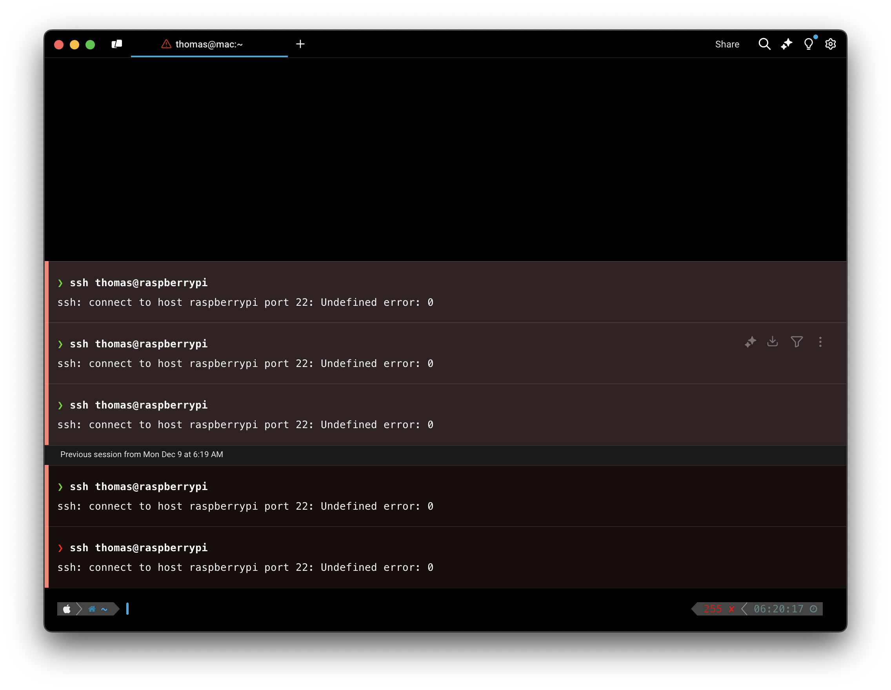
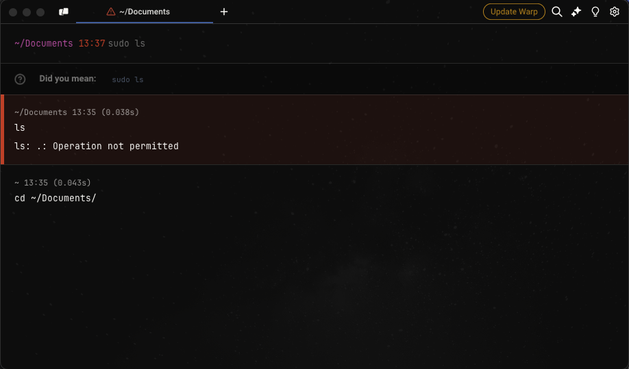

import DemoVideo from '@components/DemoVideo.astro';
import { Tabs, TabItem } from '@astrojs/starlight/components';

:::note
To see a complete list of Warp issues and feature requests, please visit our [GitHub issues page](https://github.com/warpdotdev/Warp/issues?q=is%3Aissue+is%3Aopen+sort%3Acreated-desc).

Please note that there are tools that are incompatible with Warp, as listed [below](/support-and-community/troubleshooting-and-support/known-issues/#list-of-incompatible-tools). You can find debugging information in this [section](/support-and-community/troubleshooting-and-support/known-issues/#debugging).
:::

## General

### SSH

To enable Blocks over SSH, Warp uses an SSH Wrapper function; navigate to settings > features if you need to disable it. Please see [Troubleshooting Legacy SSH](/terminal/warpify/ssh-legacy/#troubleshooting-ssh) for more info on workarounds to SSH issues, or see the [new SSH Page](/terminal/warpify/ssh/) for more on the upcoming features.

### Online features don't work

There is a known issue that can occur that causes online features to break ([Oz agent](/agent-platform/local-agents/overview/), [Generate](/agent-platform/local-agents/overview/), [Block Sharing](/terminal/blocks/block-sharing/), [Refer a Friend](/support-and-community/community/refer-a-friend/) ). This is due to the login token going stale, typically due to a password change, and can be resolved by the following steps:

<Tabs>
  <TabItem label="macOS">
    1. Remove Warp user login with the following command:

    ```bash
    sudo security delete-generic-password -l "dev.warp.Warp-Stable" $HOME/Library/Keychains/login.keychain
    ```

    2. [Login to Warp](/getting-started/quickstart/installation-and-setup/#log-in-to-warp-optional)
  </TabItem>
  <TabItem label="Windows">
    1. Remove any user files with the following command:

    ```powershell
    Remove-Item $env:LOCALAPPDATA\warp\Warp\data\*-User
    ```

    2. [Login to Warp](/getting-started/quickstart/installation-and-setup/#log-in-to-warp-optional)
  </TabItem>
  <TabItem label="Linux">
    1. Remove Warp user login with your keychain manager (gnome-keyring, kwallet, etc.). Search for `dev.warp.Warp` and delete the `User` password/secret.
    2. Remove any user files with the following command:

    ```bash
    rm -f ${XDG_STATE_HOME:-$HOME/.local/state}/warp-terminal/*-User
    ```

    3. [Login to Warp](/getting-started/quickstart/installation-and-setup/#log-in-to-warp-optional)
  </TabItem>
</Tabs>

### English-only UI

Nov 2021: We have added character support for Chinese, Korean, and Japanese, but our UI currently only supports English.

### Abnormal rendering of Chinese characters

If you notice issues with the terminal rendering Chinese characters (i.e. [#3366](https://github.com/warpdotdev/Warp/issues/3366)). Please try adding the following lines to your rc file.

```
export LC_ALL=zh_CN.UTF-8
export LANG=zh_CN.UTF-8
```

### Warp fails to render a window

This can likely occur due to some corruption in the local sqlite db. You may see a similar error your [logs](/support-and-community/#gathering-warp-logs):

```
[WARN] SQLite error 283 (A WAL mode database file was recovered): recovered 383 frames from WAL file /home/xxxxx/.local/state/warp-terminal/warp.sqlite-wal
```
To try and resolve the issue of Warp not rendering a window, rename the SQLite database found in the [following locations](/terminal/sessions/session-restoration/#session-restoration-database).

### Misc.

* When you [SSH](/support-and-community/troubleshooting-and-support/known-issues/#ssh), we start a bash shell on the remote host. We built a wrapper around SSH to make Warp features possible.
* If your default shell is zsh, your aliases typically do not transfer over. Other shells are unsupported for now.
* When you open a [non-shell-based subshell (REPL)](https://github.com/warpdotdev/Warp/issues/4082), Warp does not modify the environment — it behaves like a standard terminal session.
* Warp may become unresponsive if it doesn't have permission to access the folders.
* [No touch input support](https://github.com/warpdotdev/Warp/issues/5347)

## Agent Mode

* Note that Agent Mode blocks are not shareable during [session sharing](/knowledge-and-collaboration/session-sharing/). Participants will be able to share regular shell commands that are run, but will not be able to share AI interactions (requested commands, AI blocks, etc.).
* Block actions such as [Block Sharing](/terminal/blocks/block-sharing/) are not available on Agent Mode AI blocks.
* Agents do not have up-to-date information on several commands’ completion specs
* Agent Mode works better with Warp's default prompt settings, where the prompt starts on a new line, than it does with a same-line prompt. If you are using the same-line prompt, the cursor will jump from the end of the single line to the start of the input box when you switch to Agent Mode.

## Shells

### fish shell `read` command

There is an issue in fish shell version 3.6 and below that causes the `read` built-in command to break Warp's integration with fish. This means that using `read` directly or any fish scripts that call `read` will not work as expected in Warp. That issue is resolved in the fish repository and so should be fixed in the next release of fish itself. We recommend upgrading fish to the most recent version to resolve this issue.

### Warp shell loads slowly due to EDR

If you comment out the rc files (i.e. `~/.zshrc`, `~/.bashrc`, `~/.config/fish/config.fish`), and still notice a slowdown on loading the shell, it is likely due to an Endpoint Detection and Response or EDR (i.e. Sentinel One, CrowdStrike, Carbon Black) causing the issue. Please restart your system and see if the issue persists. If so, please [Send us Feedback](/support-and-community/) and provide details of your EDR, OS, shell, etc.

### Configuring and debugging your RC files

To support Blocks ([custom hooks](https://blog.warp.dev/how-warp-works/#implementing-blocks)), a native Input Editor experience, AI blocks, etc. we have built custom support for a subset of shell functionality (decouple functionality from the shell and move to the terminal). This leads to Warp being incompatible with various tools and plugins. Please see the [list of incompatible](/support-and-community/troubleshooting-and-support/known-issues/#list-of-incompatible-tools) tools to find the tools that are known not to work with Warp.

Unlike typical terminals which are essentially continuous character grids, each section of Warp is its own (separate) UI element. Please see our [Prompt](/terminal/appearance/prompt/) page for more information on custom prompts.

#### Debugging

If Warp is not working with your dotfile configuration, you can run your shell in Warp with a clean configuration using examples below:

<Tabs>
  <TabItem label="bash">
    You can set up clean configs for Bash (Bourne Again SHell) by moving or commenting out your `.bashrc`\
    \
    If Warp starts working correctly then Warp is incompatible with something in the current dotfiles. We can isolate what is incompatible by iteratively disabling sections of our dotfiles with the `WarpTerminal` flag until we find the culprit. See the list of incompatible tools below and comment them out just for Warp with the following conditionals:

    ```bash
# bash (See ~/.bashrc)
    if [[ $TERM_PROGRAM != "WarpTerminal" ]]; then
    ##### WHAT YOU WANT TO DISABLE FOR WARP - BELOW
        # Unsupported plugin/prompt code here, i.e.
    ##### WHAT YOU WANT TO DISABLE FOR WARP - ABOVE
    fi
```
  </TabItem>
  <TabItem label="zsh">
    You can set up clean configs for Zsh (Z SHell) by moving or commenting out your `.zshrc`\
    \
    If Warp starts working correctly then Warp is incompatible with something in the current dotfiles. We can isolate what is incompatible by iteratively disabling sections of our dotfiles with the `WarpTerminal` flag until we find the culprit. See the list of incompatible tools below and comment them out just for Warp with the following conditional:

    ```bash
    # zsh (See ~/.zshrc)
    if [[ $TERM_PROGRAM != "WarpTerminal" ]]; then
    ##### WHAT YOU WANT TO DISABLE FOR WARP - BELOW
        # Unsupported plugin/prompt code here
    ##### WHAT YOU WANT TO DISABLE FOR WARP - ABOVE
    fi
    ```
  </TabItem>
  <TabItem label="fish">
    You can set up clean configs for Fish (Friendly Interactive SHell) by moving or commenting out your `config.fish`\
    \
    If Warp starts working correctly then Warp is incompatible with something in the current config file. We can isolate what is incompatible by iteratively disabling sections of our config file with the `WarpTerminal` flag until we find the culprit. See the list of incompatible tools below and comment them out just for Warp with the following conditional:

    ```bash
    # fish (see ~/.config/fish/config.fish)
    if test "$TERM_PROGRAM" != "WarpTerminal"
        ##### WHAT YOU WANT TO DISABLE FOR WARP - BELOW
        # Unsupported plugin/prompt code here
        ##### WHAT YOU WANT TO DISABLE FOR WARP - ABOVE
    end
    ```
  </TabItem>
  <TabItem label="pwsh">
    You can set up clean configs for pwsh (PowerShell) by moving or commenting out your `$PROFILE`

    If Warp starts working correctly then Warp is incompatible with something in the current profile. We can isolate what is incompatible by iteratively disabling sections of our profile with the WarpTerminal flag until we find the culprit. See the list of incompatible tools below and comment them out just for Warp with the following conditional:

    ```powershell
# pwsh (see $PROFILE)
    if ($env:TERM_PROGRAM -ne "WarpTerminal") {
        ##### WHAT YOU WANT TO DISABLE FOR WARP - BELOW
        # Unsupported plugin/prompt code here
        ##### WHAT YOU WANT TO DISABLE FOR WARP - ABOVE
    }
```
  </TabItem>
</Tabs>

#### List of incompatible tools

The following non-exhaustive list of plugins, prompts, or tools can cause potential issues in Warp:

* oh-my-fish, oh-my-bash, or other unsupported shell prompts. See our [Custom Prompt Compatibility Table](/terminal/appearance/prompt/#custom-prompt-compatibility-table).
* [iterm shell integration](https://iterm2.com/documentation-shell-integration.html)
  * `test -e "${HOME}/.iterm2_shell_integration.zsh" && source "${HOME}/.iterm2_shell_integration.zsh" || true`
* [Termium](https://codeium.com/blog/termium-codeium-in-terminal-launch)
  * `eval "$(termium shell-hook show pre)"`
  * `eval "$(termium shell-hook show post)"`
* [thefuck experimental instant mode](https://github.com/nvbn/thefuck?tab=readme-ov-file#experimental-instant-mode)
  * `eval $(thefuck --alias --enable-experimental-instant-mode)`
* [fubectl](https://github.com/kubermatic/fubectl)
  * `[ -f ${HOME}/bin/fubectl.source ] && source ${HOME}/bin/fubectl.source`
* [BIND keys](https://github.com/warpdotdev/Warp/issues/537)
  * `bindkey '^j' down-line-or-beginning-search`, which causes users to have to hit ENTER twice to run a command.
  * `bindkey 'tab' autosuggest-accept`, which causes incorrect behavior with autocompletion.
* `z`, `compdef`, `compinit`, [prezto utility module](https://github.com/sorin-ionescu/prezto/blob/master/modules/utility/README.md), [bash-it](https://github.com/Bash-it/bash-it), CodeWhisperer or other [shell-based completion](https://github.com/warpdotdev/Warp/discussions/434) plugins.
* OH-MY-ZSH Themes
  * e.g. avit, spaceship, maybe more ...
* OH-MY-ZSH Plugins
  * e.g. zsh-autosuggestions, zsh-autocomplete, maybe more ...
* Oh-My-Tmux
* zsh4h (ZSH for Humans)
* znap
* FZF
* `[[ -r "/usr/local/etc/profile.d/bash_completion.sh" ]] && "/usr/local/etc/profile.d/bash_completion.sh"`
* `eval "$(rbenv init -)"`
* `grml-zsh-config`
* Python virtual environment PS1 [settings](https://github.com/warpdotdev/Warp/issues/2713#issuecomment-1447129449)
* [Starship settings](/terminal/appearance/prompt/#starship-settings)
* `zle-line-init`
* Potentially more — this is a non-exhaustive list. If you find an incompatible tool, please email us at [feedback@warp.dev](mailto:feedback@warp.dev)

## Operating systems

<Tabs>
  <TabItem label="macOS">
    **SSH to local network device is denied on macOS**

    On macOS, you may be [denied permission to SSH](https://github.com/warpdotdev/Warp/issues/5550) from Warp into other devices in your local network and see an error like: `ssh: connect to host <host_name> port 22: Undefined error: 0`.\
    To resolve this issue, go to  > **System Settings** > **Privacy & Security** > **Local Network** and add Warp.

    

    **Unexpected loss of permission on macOS**

    On macOS, you may see an `Operation not permitted` error when trying to run commands in directories that have already been granted macOS permissions (Documents, Downloads, Desktop, etc). The best workaround at this time is to [apply any pending updates](/support-and-community/troubleshooting-and-support/updating-warp/) so that the new Warp binary has the correct permissions. We are tracking this issue [here](https://github.com/warpdotdev/Warp/issues/3009).

    

    **Auto-Update error on macOS**

    Warp may have an error opening after auto-update on macOS Ventura. This issue has been resolved for current and future releases of Warp. To avoid the issue, [update Warp](/support-and-community/troubleshooting-and-support/updating-warp/) _before_ you upgrade to macOS Ventura.\
    \
    If you experience an error opening Warp, please try the following:

    * Go to the macOS Applications folder, right-click on Warp, choose Open, then the '"Warp" is damaged' dialog will have the option to click the Open button.

    <DemoVideo src="/assets/support-and-community/open-warp-mac.mp4" label="Right-clicking Warp in the macOS Applications folder and choosing Open to bypass the damaged app dialog" />

    * If the above doesn't work, [uninstall Warp](/support-and-community/troubleshooting-and-support/logging-out-and-uninstalling/), then [re-install Warp](/getting-started/quickstart/installation-and-setup/).

    **Running x86 commands with macOS**

    In some cases, CLI applications only work on x86, so you can run Warp with Rosetta on macOS to be able to use them by doing the following.

    * Go to **Finder** > **Applications** and search for Warp.
    * Right-click and select Get Info.
    * Then check the box on Open with Rosetta.
  </TabItem>
  <TabItem label="Windows">
    **Unsupported in Warp on Windows**

    The following features are not supported in Warp on Windows. Please track the relevant GitHub issues linked below for any changes:

    * [cmd.exe](https://github.com/warpdotdev/Warp/issues/5882) or [fish](https://github.com/warpdotdev/Warp/issues/6060) shells

    **Warp won't run on Windows**

    We're tracking some issues on Windows where [Warp crashes on startup](https://github.com/warpdotdev/Warp/issues/5840) or doesn't render, with some possible workarounds below. If none of the workarounds help, please open a [new GitHub issue](https://github.com/warpdotdev/warp/issues/new/choose) and include [logs](/support-and-community/#gathering-warp-logs), installation (Baremetal or VM, x86\_64 or ARM64), and the issue you had.

    * Graphics
      * You can select the graphics backend used to render new Warp windows in the Settings menu, under **Features** > **System** > **Preferred graphics backend**.
      * You can also opt to render new Warp windows with an integrated GPU, under **Features** > **System** > **Prefer rendering new windows with integrated GPU (low power)**.

    **Crash on opening a Launch configuration or doesn't become transparent on Windows**

    When a user has an Nvidia 572.xx or AMD 23.10.x drivers or above, Warp may [crash when trying to open a Launch Configuration](https://github.com/warpdotdev/Warp/issues/5875), or [Warp fails to become transparent](https://github.com/warpdotdev/Warp/issues/5903) (opacity setting doesn't work). These are known limitations of the graphics drivers. We're investigating the issues and will update the GitHub issues above. You can workaround this by forcing the graphics backend to Vulkan or OpenGL by running the following from another terminal and setting your GPU driver Vulkan/OpenGL render method setting to "Prefer Native", or using the [DX12 backend](/support-and-community/troubleshooting-and-support/known-issues/#warp-wont-run-or-render-on-windows):

    ```powershell
    # Run if Warp on Windows is installed for a single user
    $env:WGPU_BACKEND="vulkan,gl"; & "$env:LOCALAPPDATA\Programs\Warp\warp.exe"

    # Run if Warp on Windows is installed for all users
    $env:WGPU_BACKEND="vulkan,gl"; & "$env:PROGRAMFILES\Warp\warp.exe"
    ```
  </TabItem>
  <TabItem label="Linux">
    **Warp won't run on Linux**

    We're tracking some issues on Linux where a [Warp window doesn't show/render](https://github.com/warpdotdev/Warp/issues/4215) and won't run in [Virtual Machines](https://github.com/warpdotdev/Warp/issues/4476), over [remote desktops](https://github.com/warpdotdev/Warp/issues/4435), or on [WSL](https://github.com/warpdotdev/Warp/issues/4240). Some possible workarounds are below. If none of the workarounds help, please open a [new GitHub issue](https://github.com/warpdotdev/warp/issues/new/choose) and include [logs](/support-and-community/#gathering-warp-logs) with your Linux distro, installation (WSL, Baremetal or VM, x86\_64 or ARM64), and the issue you had.

    :::note
    * Many package install examples are for Ubuntu using `apt`, your distro may use different commands (`dnf`, `pacman`, `zypper`) or package names.
    * GPU Drivers and Default GPU / Graphics API environment variables are system-dependent, e.g. AMD vs NVIDIA and OpenGL vs Vulkan.
    :::

    * System
      * Installing or Updating [Xorg](https://www.x.org/wiki/) / [Wayland](https://wayland.freedesktop.org/): `sudo apt install xserver-xorg` / `sudo apt install wayland`
      * Installing [Hack font](https://sourcefoundry.org/hack/) on WSL and VMs: `sudo apt install fonts-hack`
      * Install [WSL utilities](https://github.com/wslutilities/wslu): `sudo apt install wslu`
      * Install Mesa utilities: `sudo apt install mesa-utils`
      * Install Mesa Vulkan drivers: `sudo apt install mesa-vulkan-drivers`
      * If unable to use the file picker: `sudo apt install xdg-desktop-portal xdg-desktop-portal-gtk zenity`
      * If unable to copy-paste: `sudo apt install wl-clipboard`
    * Graphics
      * Install or Update your GPU driver: e.g. [NVIDIA](https://github.com/warpdotdev/Warp/issues/4215#issuecomment-1969750786) 535.x or below drivers
        * For Ubuntu: `sudo ubuntu-drivers install`
        * For Fedora: `sudo dnf install akmod-nvidia`
        * For Arch Linux: `sudo pacman -S nvidia`
        * For openSUSE: `sudo zypper install x11-video-nvidiaG05`
      * Use [Low Power (integrated) GPU](https://github.com/warpdotdev/Warp/issues/4215#issuecomment-1967500574) in `~/.config/warp-terminal/user_preferences.json` file: `{"prefs":{"PreferLowPowerGPU": "true",}}`. The low-power workaround is particularly helpful if you see [`Unrecognized device error ERROR_INITIALIZATION_FAILED` in warp.log](https://github.com/warpdotdev/Warp/issues/4390#issuecomment-1989493913).
    * Environmental Variables
      * Prefix `warp-terminal` with the variables (multiple can be used), and once you confirm they work, `export` them in your `.profile`/`.zprofile` to [load on startup](https://github.com/warpdotdev/Warp/issues/4240#issuecomment-1968228029):
        * [Default to Wayland](https://github.com/warpdotdev/Warp/issues/4240#issuecomment-1961993281): `WARP_ENABLE_WAYLAND=1`
        * Set [Default GPU](https://docs.mesa3d.org/drivers/d3d12.html#utilities) for WSL: e.g. `MESA_D3D12_DEFAULT_ADAPTER_NAME=NVIDIA`
        * Set [Graphics APIs](https://github.com/gfx-rs/wgpu?tab=readme-ov-file#environment-variables): e.g. `WGPU_BACKEND=gl`

    **Update fails after upgrading Linux**

    Some Linux distros may modify Warp's package repository during the OS upgrades. We're aware of this on Ubuntu, but this may affect other Linux distros. We're tracking this issue on GitHub [here](https://github.com/warpdotdev/Warp/issues/5201).\
    \
    To workaround this issue, manually add the repository to update Warp. The Ubuntu example is below:

    ```
    sudo apt-get install wget gpg
    wget -qO- https://releases.warp.dev/linux/keys/warp.asc | gpg --dearmor > warpdotdev.gpg
    sudo install -D -o root -g root -m 644 warpdotdev.gpg /etc/apt/keyrings/warpdotdev.gpg
    sudo sh -c 'echo "deb [arch=amd64 signed-by=/etc/apt/keyrings/warpdotdev.gpg] https://releases.warp.dev/linux/deb stable main" > /etc/apt/sources.list.d/warpdotdev.list'
    rm warpdotdev.gpg
    sudo apt update && sudo apt install warp-terminal
    ```

    See the instructions for other Linux distros on our [Quick Start Guide](/getting-started/quickstart/installation-and-setup/#linux).
  </TabItem>
</Tabs>
