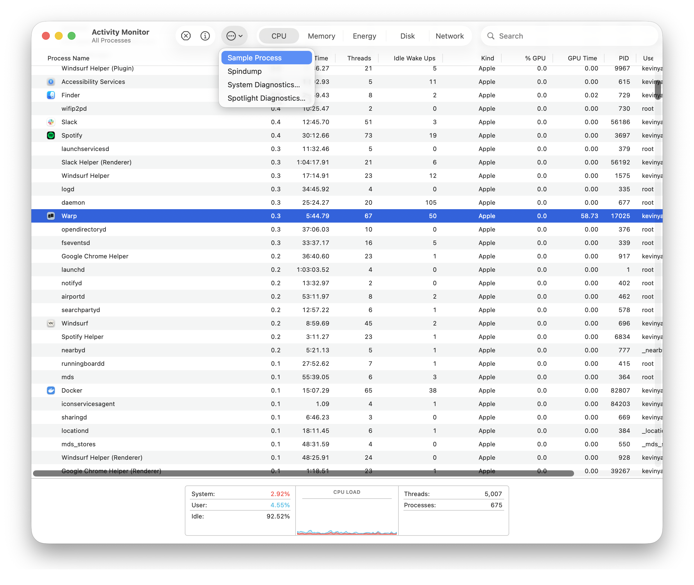
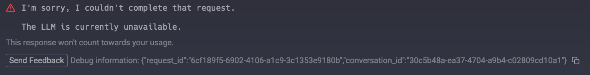

import DemoVideo from '@components/DemoVideo.astro';
import { Tabs, TabItem } from '@astrojs/starlight/components';

### Sending Warp feedback

* Use the [`/feedback`](#using-feedback-in-warp) slash command inside Warp to draft and file a GitHub issue without leaving the terminal.
* Open a new bug or feature request in our [GitHub repository](https://github.com/warpdotdev/warp/issues/new/choose).
* Join our [Warp Community Slack](https://go.warp.dev/join-preview) and share feedback in **#feedback-general**, or **#feedback-preview** if it is specific to [Warp Preview](/support-and-community/community/warp-preview-and-alpha-program/).
* For security issues or questions, email [security@warp.dev](mailto:security@warp.dev).
* For questions about privacy, email [privacy@warp.dev](mailto:privacy@warp.dev).

#### Subscriber and Enterprise

* For subscriber technical issues or questions (bugs, credits, etc.), email [support@warp.dev](mailto:support@warp.dev).
* For subscriber billing issues or questions (refunds, cancellation, etc.), email [billing@warp.dev](mailto:billing@warp.dev).
* For enterprise, please direct all feedback and issues to your designated Slack channel.

<DemoVideo src="/assets/support-and-community/send-feedback-demo.mp4" label="sending feedback from the macOS menu and Warp Essentials" />

## Using `/feedback` in Warp

The `/feedback` [slash command](/agent-platform/capabilities/slash-commands/) is the fastest way to report a Warp bug, flag a regression, or file a feature request from inside the terminal. It files issues against [`warpdotdev/warp`](https://github.com/warpdotdev/warp) so the Warp team can triage reports quickly.

`/feedback` has two flows, and Warp picks the right one automatically based on whether AI is enabled for your account:

* **AI enabled** — the Agent drafts and files the issue for you.
* **AI disabled** — Warp opens the GitHub new-issue picker in your browser so you can write and submit the report yourself.

### With AI enabled

When AI is enabled, `/feedback` hands your report to the Agent, which polishes and files your issue in a single turn. The Agent:

1. **Classifies** your report by type (bug, regression, UX issue, or feature request).
2. **Asks clarifying questions** only when the report is too vague to draft responsibly. For example, when expected behavior, reproduction steps, or the affected platform aren't clear.
3. **Checks for duplicates** in `warpdotdev/warp` and, if a likely duplicate exists, links you to that issue instead of filing a new one.
4. **Files the issue** in `warpdotdev/warp`, either directly or by opening a prefilled new-issue page in your browser.

:::note
This flow uses the Agent to draft your issue, so it consumes [credits](/support-and-community/plans-and-billing/credits/) like any other Agent conversation.
:::

#### Attaching screenshots

You can attach screenshots to your `/feedback` request the same way you attach images to any other Agent prompt (drag-and-drop into the input, paste from the clipboard, or use the attach button). When one or more images are attached, the Agent:

* Includes a short caption for each screenshot in the drafted issue body, so the report stays coherent even if an image never makes it to the final GitHub issue.
* Opens the prefilled new-issue page in your browser with placeholder lines (for example, `_Paste screenshot 1 here_`) indicating exactly where to drop each image. Screenshots have to be added in the browser because GitHub doesn't yet support attaching images to issues over its API.
* Reminds you in its final reply that the issue is drafted but not filed. To complete filing, drop your screenshots into the placeholder lines and click **Submit new issue**.

### With AI disabled

When AI is disabled for your account, `/feedback` (and the **Feedback** button in Warp Essentials) skips the Agent and opens the GitHub new-issue picker for `warpdotdev/warp` directly in your browser, with your current Warp version and operating system prefilled as query parameters. No Agent is invoked and no credits are consumed. You write and submit the issue yourself through GitHub's web UI.

If you're unsure whether AI is enabled for your account, open the Warp app and go to **Settings** > **Agents** > **Warp Agent**.

### What to include

Whether you use the `/feedback` slash command or file an issue manually, a good feedback report answers these questions up front:

* **What happened?** Describe the observed behavior in one or two sentences.
* **What did you expect?** Describe the behavior you expected instead.
* **How do we reproduce it?** List numbered steps when possible. If you can't reproduce the issue reliably, mention that too.
* **What version of Warp are you on?** `/feedback` fills this in automatically; for manual reports, copy it from **Settings** > **Account**.
* **Logs, screenshots, or conversation IDs.** See [Gathering Warp Logs](#gathering-warp-logs), [Collecting crash reports on macOS](#collecting-crash-reports-on-macos), or [Gathering AI conversation ID](#gathering-ai-conversation-id) below.

See the [Slash Commands reference](/agent-platform/capabilities/slash-commands/) for the full list of commands available in Warp.

## Gathering Warp Logs

Retrieve Warp's logs by following the instructions for your platform below. Locate the log file and attach it to your GitHub issue or email.

:::note
Warp's logs and crash reports _**do not**_ contain any console input or output. See more on how we handle [Crash Reports and Telemetry](/support-and-community/privacy-and-security/privacy/#what-telemetry-data-are-you-collecting-and-why).
:::

<Tabs>
  <TabItem label="macOS">
    The Warp log files are located at `~/Library/Logs/`.

    **Warp logs on macOS**

    Run the following to zip the Warp logs to your Desktop:

    ```bash
    zip -j ~/Desktop/warp-logs.zip ~/Library/Logs/warp.log*
    ```

    **Warp Preview logs on macOS**

    Run the following to zip the Warp Preview logs to your Desktop:

    ```bash
    zip -j ~/Desktop/warp_preview-logs.zip ~/Library/Logs/warp_preview.log*
    ```

    :::caution
    If your issue is graphical (e.g. no display of windows) or a crash, please run Warp with the following command to capture more log information:

    ```bash
    # Run if Warp on macOS is installed
    RUST_LOG=wgpu_core=info,wgpu_hal=info /Applications/Warp.app/Contents/MacOS/stable

    # Run if Warp Preview on macOS is installed
    RUST_LOG=wgpu_core=info,wgpu_hal=info /Applications/WarpPreview.app/Contents/MacOS/preview
    ```
    :::
  </TabItem>
  <TabItem label="Windows">
    The Warp log files are located at `$env:LOCALAPPDATA\warp\Warp\data\logs\`.

    **Warp logs on Windows**

    Close Warp and run the following from another terminal to zip the logs to your Desktop:

    ```powershell
    Compress-Archive -Path "$env:LOCALAPPDATA\warp\Warp\data\logs\warp.log*" -DestinationPath "$([Environment]::GetFolderPath('Desktop'))\warp-logs.zip"
    ```

    **Warp Preview logs on Windows**

    Close Warp Preview and run the following from another terminal to zip the logs to your Desktop:

    ```powershell
    Compress-Archive -Path "$env:LOCALAPPDATA\warp\WarpPreview\data\logs\warp_preview.log*" -DestinationPath "$([Environment]::GetFolderPath('Desktop'))\warp_preview-logs.zip"
    ```

    :::caution
    If your issue is graphical (e.g. no display of windows) or a crash, please run Warp with the following command to capture more log information:

    ```powershell
    # Run if Warp on Windows is installed for a single user
    $env:RUST_LOG="wgpu_core=info,wgpu_hal=info"; & "$env:LOCALAPPDATA\Programs\Warp\warp.exe"

    # Run if Warp on Windows is installed for all users
    $env:RUST_LOG="wgpu_core=info,wgpu_hal=info"; & "$env:PROGRAMFILES\Warp\warp.exe"

    # Run if Warp Preview on Windows is installed for a single user
    $env:RUST_LOG="wgpu_core=info,wgpu_hal=info"; & "$env:LOCALAPPDATA\Programs\WarpPreview\preview.exe"

    # Run if Warp Preview on Windows is installed for all users
    $env:RUST_LOG="wgpu_core=info,wgpu_hal=info"; & "$env:PROGRAMFILES\WarpPreview\preview.exe"
    ```
    :::
  </TabItem>
  <TabItem label="Linux">
    The Warp log files are located at `~/.local/state/warp-terminal/`.

    **Warp logs on Linux**

    Run the following to zip the Warp logs to your home directory:

    ```bash
    tar -czf ~/warp-logs.tar.gz -C ~/.local/state/warp-terminal warp.log*
    ```

    **Warp Preview logs on Linux**

    Run the following to zip the Warp Preview logs to your home directory:

    ```bash
    tar -czf ~/warp_preview-logs.tar.gz -C ~/.local/state/warp-terminal-preview warp_preview.log*
    ```

    :::caution
    If your issue is graphical (e.g. no display of windows) or a crash, please run Warp with the following command to capture more log information:

    ```bash
# Run if Warp on Linux is installed
    RUST_LOG=wgpu_core=info,wgpu_hal=info MESA_DEBUG=1 EGL_LOG_LEVEL=debug warp-terminal
    
    # Run if Warp Preview on Linux is installed
    RUST_LOG=wgpu_core=info,wgpu_hal=info MESA_DEBUG=1 EGL_LOG_LEVEL=debug warp-terminal-preview
```
    :::
  </TabItem>
</Tabs>

## Collecting crash reports on macOS

If Warp crashes, macOS may generate `.ips` crash report files in `~/Library/Logs/DiagnosticReports/`. Run the following to collect all Warp crash reports into a zip on your Desktop:

```bash
files=$(find ~/Library/Logs/DiagnosticReports -name "*.ips" -exec grep -l "dev\.warp" {} + 2>/dev/null) && [ -n "$files" ] && echo "$files" | xargs zip -j ~/Desktop/warp-crash-logs.zip || echo "No Warp crash reports found."
```

Attach the resulting `warp-crash-logs.zip` to your [bug report](/support-and-community/troubleshooting-and-support/sending-us-feedback/#sending-warp-feedback).

:::note
This command searches crash report files for Warp's bundle identifier, so it works across all Warp channels (Stable, Preview).
:::

## Collecting debug info on Windows

Occasionally, the Warp team may ask you to provide debugging information on Windows OS in particular with one of the following:

```powershell
# If Warp is in your PATH, Run:
warp --dump-debug-info

# Otherwise you may need to use an absolute path and ...
# Warp on Windows is installed for a single user, Run:
& $env:LOCALAPPDATA\programs\Warp\warp.exe --dump-debug-info

# Warp on Windows is installed for all users, Run:
& $env:PROGRAMFILES\Warp\warp.exe --dump-debug-info
```

## Collecting CPU samples

Certain conditions can cause Warp to use more CPU than expected or become unresponsive. Collecting a CPU sample while the issue is happening is the best way to report it. The sample provides the information the Warp team needs to identify and fix the root cause.

Collect a sample using the steps for your platform and attach it to a new [GitHub issue](https://github.com/warpdotdev/warp/issues/new/choose).

<Tabs>
  <TabItem label="macOS">
    1. Reproduce the high CPU usage or unresponsiveness in Warp.
    2. While the issue is occurring, open **Activity Monitor**, select the **Warp** process, and click **Sample Process**.

    

    3. Save the resulting sample and attach it to your GitHub issue.
  </TabItem>
  <TabItem label="Windows">
    Install [`samply`](https://github.com/mstange/samply) to record a CPU trace:

    ```powershell
    powershell -ExecutionPolicy Bypass -c "irm https://github.com/mstange/samply/releases/download/samply-v0.13.1/samply-installer.ps1 | iex"
    ```

    1. Find the Warp process ID:

       ```powershell
       Get-Process *warp*
       ```

    2. Start recording, replacing `<PID>` with the process ID from the previous step:

       ```powershell
       samply record -p <PID>
       ```

    3. Reproduce the issue that causes high CPU usage or unresponsiveness.
    4. Press `Ctrl+C` to stop recording. `samply` opens the profile in the Firefox Profiler in your browser. Click the upload icon in the top-right corner to generate a shareable link, then paste it into your GitHub issue.
  </TabItem>
  <TabItem label="Linux">
    Install [`samply`](https://github.com/mstange/samply) to record a CPU trace:

    ```bash
    curl --proto '=https' --tlsv1.2 -LsSf https://github.com/mstange/samply/releases/download/samply-v0.13.1/samply-installer.sh | sh
    ```

    :::caution
    `samply` requires access to Linux perf events. If you get a permission error, run:

    ```bash
    echo '-1' | sudo tee /proc/sys/kernel/perf_event_paranoid
    ```
    :::

    1. Start recording the Warp process:

       ```bash
       samply record -p $(pgrep -f warp-terminal)
       ```

    2. Reproduce the issue that causes high CPU usage or unresponsiveness.
    3. Press `Ctrl+C` to stop recording. `samply` opens the profile in the Firefox Profiler in your browser. Click the upload icon in the top-right corner to generate a shareable link, then paste it into your GitHub issue.

    :::note
    If you prefer not to install `samply`, you can use the built-in `perf` tool instead:

    ```bash
    perf record -g -p $(pgrep -f warp-terminal) -- sleep 30
    ```

    Attach the resulting `perf.data` file from your current directory to your GitHub issue.
    :::
  </TabItem>
</Tabs>

## Gathering AI conversation ID

To gather the conversation ID, `RIGHT-CLICK` on the AI conversation block in question and select "Copy conversation ID", then paste that into the [bug report](/support-and-community/troubleshooting-and-support/sending-us-feedback/#sending-warp-feedback) that you submit so that our team can investigate the issue.

Whenever there is an error in the Agent Conversation, there will also be an option to directly copy the conversation ID for the bug report.


