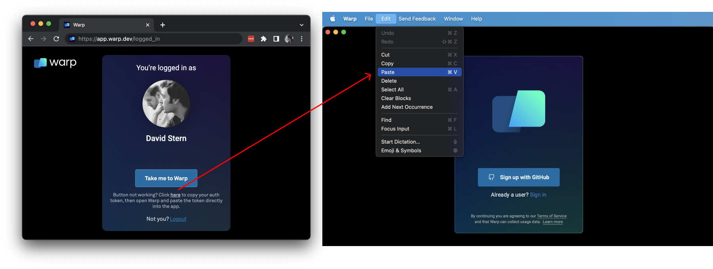

import DemoVideo from '@components/DemoVideo.astro';

## Can't sign up for or log into Warp

Clicking it should open a signup or login pop-up. If clicking the button opens a blank pop-up window, try using a proxy. Your ISP or Firewall may be blocking the app's call to `*.googleapis.com`.

:::note
In some older Ruby development environments, `.dev` domains do not resolve properly and you may need to delete the `/etc/resolver/dev`, see more [here](https://superuser.com/questions/1374892/dev-domains-dont-resolve).
:::

## All browsers

This error could occur if you installed an ad blocker or have stale browser cookies, including our Firebase auth pop-up. **To fix it:**

1. Disable your ad blocker for `app.warp.dev`
2. Clear any cookies and cache, or open an incognito / private browser window
3. Try [http://app.warp.dev/login](http://app.warp.dev/login) again

### Safari

If you are using Safari, you may see the following messages in your console:

1. `Unable to access localStorage`
2. And every time you click the "Sign Up" button, you get `Unhandled Promise Rejection: Error: This operation is not supported in the environment the application is running on. "location.protocol" must be http, https, or chrome-extension and web storage must be enabled.`

This error likely occurs because you are blocking all cookies in Safari's security settings, but Firebase Auth requires the cookie to record whether the user is logged in. **To fix it:**

1. Go to Safari Preferences > Privacy
2. Uncheck the "Block all cookies" checkbox

## Proxies

When behind a proxy, a possible workaround is to disable QUIC in the browser. It will then fall back to TCP and likely allow login.

* In Chrome, or Chromium-based browsers like Edge, Opera, and Arc, type `chrome://flags` into the address bar.
  1. In the search bar on the flags page, type `Experimental QUIC protocol`.
  2. Locate the "Experimental QUIC protocol" flag and click on the drop-down menu next to it.
  3. Select "Disabled" from the options.
  4. Relaunch Chrome for the changes to take effect.
* In Firefox, type `about:config` into the address bar.
  1. You will see a warning message. Click on the "Accept the Risk and Continue" button.
  2. In the search bar, type `network.http.http3.enable`.
  3. Double-click on the `network.http.http3.enable` preference to set its value to `false`. This will disable QUIC in Firefox.
  4. Restart Firefox for the changes to take effect.
* In Safari, unfortunately, there is no built-in option to disable QUIC in Safari. Safari uses QUIC as its default transport protocol and does not provide a user-accessible setting to disable it.

## SSO login

### Can't open Warp from SSO

When directly launching Warp from Okta or other SSO providers', you may see an error message like "`Unable to process request due to missing initial state...`". This is due to a limitation with Warp authentication APIs. Instead, do the following:

1. Go to [app.warp.dev/login](http://app.warp.dev/login)
2. Choose “Continue with SSO”
3. Login with your normal SSO credentials

### I logged in with another method before and now can't use SSO

In cases where you logged in with another method, please do the following to fix SSO login:

1. Go to [app.warp.dev/login](http://app.warp.dev/login)
2. Login with the original method that you used to create your Warp account (email, Google, GitHub).
3. Once logged in, go to [app.warp.dev/link\_sso](https://app.warp.dev/link_sso)
4. This should link your login to SSO. You can now proceed to login with "Continue with SSO".

## Flagged as fraudulent

If you received the message "This account has been flagged as fraudulent.", this means that you have failed one or more checks in our fraud detection system, and you will be unable to authenticate to Warp or leverage AI features.

Please note that creating multiple accounts or using throwaway emails is against our [Terms of Service](https://www.warp.dev/terms-of-service) and increases the chance of triggering this system significantly.

### False positives

At times, ad-blockers or systems like Pi-hole may falsely trigger this system. You may be able to remediate this error by temporarily disabling these and attempting login again.

### Requesting an appeal

If you are still unable to authenticate, you may email [appeals@warp.dev](mailto:appeals@warp.dev) to request an appeal. Please include the email of the account you are experiencing the issue on so a member of our support team can investigate. This may take 5-10 days.

If you have an active subscription and continue to have login issues, please see the rest of the recommendations on [this page](/support-and-community/troubleshooting-and-support/troubleshooting-login-issues/#get-help-with-login-issues).

## How to get an Auth token to login

If the browser does not open from Warp directly when you click "Sign up" or "Sign in". Please go to the [Signup](https://app.warp.dev/signup) page to create an account or [Login](https://app.warp.dev/login) page if you already have one, then copy the auth token from the "here" link on the logged\_in page and paste it into Warp.

If nothing happens when you click "Take me to Warp" on the logged-in page. If this happens to you, copy the "here" link on the web logged-in page (https://app.warp.dev/logged\_in) to copy the authentication token, then paste it into the app as shown below.

:::caution
On Linux and Windows, the default copy-and-paste [Keyboard shortcuts](/getting-started/keyboard-shortcuts/) are `CTRL+SHIFT+C` and `CTRL+SHIFT+V` respectively.\
\
On Linux and WSL you should install and set your default `$BROWSER` to `brave-browser` to workaround any copy-paste issues. Please see the workaround guide below.
:::

<DemoVideo src="/assets/support-and-community/auth-token-demo.mp4" label="Authentication Token Linux" />

If "Take me to Warp" is still not working it may be due to a [proxy issue](/support-and-community/troubleshooting-and-support/troubleshooting-login-issues/#proxies), please see this article for more information on a workaround [here](https://embiid.blog/post/WARP-does-not-work-after-submitting-an-invite-code/).

## Get help with login issues

If Sign Up or Login does not work after trying the steps above, please [contact us](https://www.warp.dev/contact) for support.
