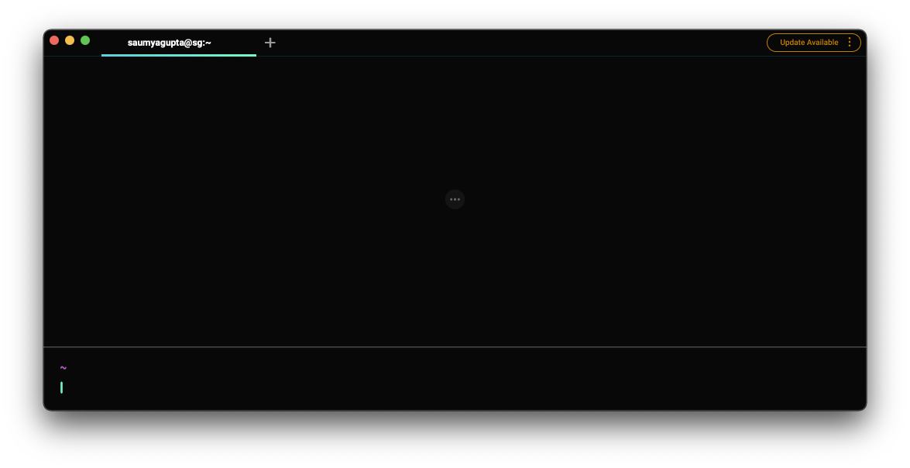
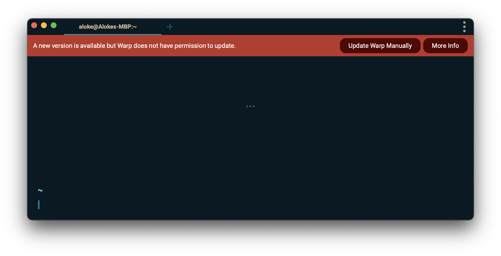

import DemoVideo from '@components/DemoVideo.astro';

Warp automatically checks for updates on startup. A notification will appear in the top right corner of the Warp window when a new update is available.



To check for updates, search for "update" in the [Command Palette](/terminal/command-palette/) or go to **Settings** > **Account** and click "Check for Update".

<DemoVideo src="/assets/support-and-community/check-for-update.mp4" label="Check for Update manually" />

If nothing happens, it means you already have the latest stable build.

## macOS: Auto-update permissions issues

Warp cannot auto-update if it does not have the correct permissions to replace the running version of Warp. If this is the case, a banner will prompt you to manually update Warp.



There are 2 main causes of this:

1. You opened Warp directly from the mounted volume instead of dragging it into your Applications directory. If this is the case, the easiest fix is to quit Warp, drag the application into /Applications, and restart Warp.
2. You are a non-Admin user. This can happen if you use a computer with multiple profiles. If you have admin access on the computer, opening the app with the admin user should fix the auto-update issues.

:::note
(Oct 2022): There is a known issue with [auto-update on macOS Ventura](/support-and-community/troubleshooting-and-support/known-issues/#auto-update-on-macos-ventura).
:::

## Linux: Refreshing the package signing key

If you encounter signature verification errors when trying to update Warp on Linux, you may need to refresh the package signing key. This can happen if the key on your system has expired.

### Debian / Ubuntu (apt)

You may see an error like the following:

```
W: GPG error: https://releases.warp.dev/linux/deb stable Release: The following signatures were invalid: EXPKEYSIG 31F4254AFE49E02E Warp Linux Maintainers (Package Signing Authority) <linux-maintainers@warp.dev>
E: The repository 'https://releases.warp.dev/linux/deb stable Release' is not signed.
```

To fetch the updated signing key, run:

```bash
curl -fsSL https://releases.warp.dev/linux/keys/warp.asc | gpg --dearmor | sudo tee /etc/apt/trusted.gpg.d/warpdotdev.gpg > /dev/null
```

Then retry your update:

```bash
sudo apt update && sudo apt install warp-terminal
```

### Fedora / RHEL / CentOS (dnf/yum)

You may see an error like the following:

```
OpenPGP check for package "warp-terminal-v0.2026.01.28.08.14.stable_04-1.x86_64" (/var/cache/libdnf5/warpdotdev-4ac10ef632833104/packages/warp-terminal-v0.2026.01.28.08.14.stable_04-1.x86_64.rpm) from repo "warpdotdev" has failed: Problem occurred when opening the package.
```

To fetch the updated signing key, run:

```bash
sudo rpm --import https://releases.warp.dev/linux/keys/warp.asc
```

Then retry your update:

```bash
sudo dnf upgrade warp-terminal
# or for older systems:
sudo yum upgrade warp-terminal
```

### Arch Linux (pacman)

You may see an error like the following:

```
error: warpdotdev: signature from "Warp Linux Maintainers (Package Signing Authority) <linux-maintainers@warp.dev>" is expired
```

To fetch the updated signing key, run:

```bash
sudo pacman-key --recv-keys "linux-maintainers@warp.dev" --keyserver hkp://keys.openpgp.org:80
sudo pacman-key --lsign-key "linux-maintainers@warp.dev"
```

Then retry your update:

```bash
sudo pacman -Syu warp-terminal
```
