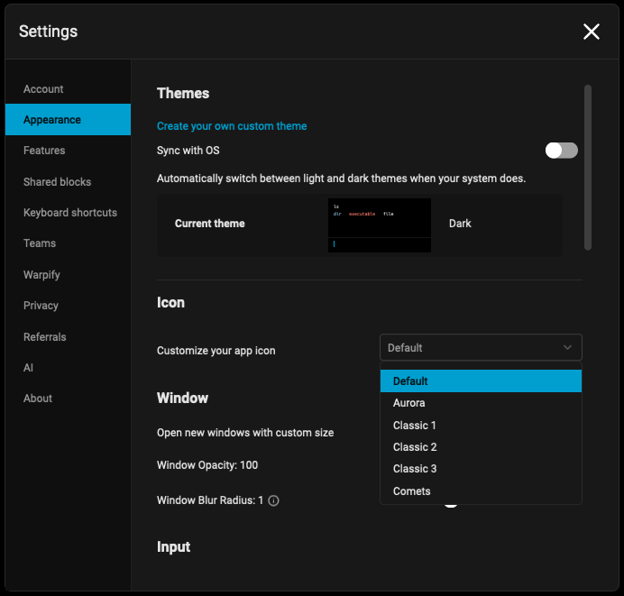

import ImageGrid from '@components/ImageGrid.astro';
import ImageGridItem from '@components/ImageGridItem.astro';
import iconDefault from '../../../../assets/terminal/moody-dev-default-icon.png';
import iconWarp1 from '../../../../assets/terminal/default-icon.png';
import iconAurora from '../../../../assets/terminal/aurora-icon.png';
import iconClassic1 from '../../../../assets/terminal/classic1-icon.png';
import iconClassic2 from '../../../../assets/terminal/classic2-icon.png';
import iconClassic3 from '../../../../assets/terminal/classic3-icon.png';
import iconComets from '../../../../assets/terminal/comets-icon.png';
import iconGlassSky from '../../../../assets/terminal/glass-sky-icon.png';
import iconGlitch from '../../../../assets/terminal/glitch-icon.png';
import iconGlow from '../../../../assets/terminal/glow-icon.png';
import iconHolographic from '../../../../assets/terminal/holographic-icon.png';
import iconMono from '../../../../assets/terminal/mono-icon.png';
import iconNeon from '../../../../assets/terminal/neon-icon.png';
import iconOriginal from '../../../../assets/terminal/original-icon.png';
import iconStarburst from '../../../../assets/terminal/starburst-icon.png';
import iconSticker from '../../../../assets/terminal/sticker-icon.png';

:::note
App icons are only available for Warp on macOS. The feature doesn't support custom dock icons.
:::

## How to change the app icon

* Navigate to **Settings** > **Appearance** > **Icon** > **Customize your app icon**
* Select the desired dock icon from the drop down menu

## Dock icons

By default, Warp ships with these dock icons:

<ImageGrid>
  <ImageGridItem src={iconDefault} label="Default" />
  <ImageGridItem src={iconWarp1} label="Warp 1.0" />
  <ImageGridItem src={iconAurora} label="Aurora" />
  <ImageGridItem src={iconClassic1} label="Classic 1" />
  <ImageGridItem src={iconClassic2} label="Classic 2" />
  <ImageGridItem src={iconClassic3} label="Classic 3" />
  <ImageGridItem src={iconComets} label="Comets" />
  <ImageGridItem src={iconGlassSky} label="Glass Sky" />
  <ImageGridItem src={iconGlitch} label="Glitch" />
  <ImageGridItem src={iconGlow} label="Glow" />
  <ImageGridItem src={iconHolographic} label="Holographic" />
  <ImageGridItem src={iconMono} label="Mono" />
  <ImageGridItem src={iconNeon} label="Neon" />
  <ImageGridItem src={iconOriginal} label="Original" />
  <ImageGridItem src={iconStarburst} label="Starburst" />
  <ImageGridItem src={iconSticker} label="Sticker" />
</ImageGrid>

