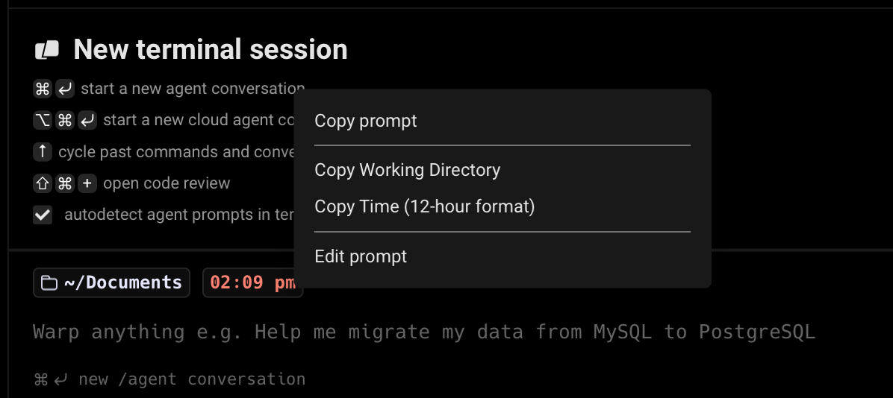
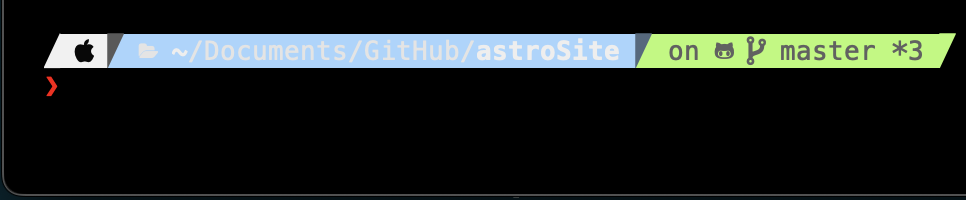

import DemoVideo from '@components/DemoVideo.astro';
import VideoEmbed from '@components/VideoEmbed.astro';

Warp supports two prompt types: the **Warp prompt** and the **Shell prompt (PS1)**. 

## Choosing your prompt type

To switch your prompt type:

1. Open **Settings** > **Appearance**.
2. Under **Input**, set **Input type** to **Warp** or **Shell (PS1)**.

When using the Warp prompt, you can right-click the prompt area to copy the entire prompt, working directory, current git branch, git uncommitted file count, and more.

When using a Shell prompt, you can right-click the prompt area to copy the entire prompt, or select any part of the prompt in previously run blocks in your session.

## Warp prompt

Warp has a native prompt that displays context chips showing information such as your current working directory, git branch, svn status, Kubernetes context, pyenv, date, and time. The Warp prompt is the default when **Input type** is set to **Warp**.

To customize which context chips your Warp prompt displays:

1. Right-click the prompt area and select **Edit prompt**.



2. Select **Warp Prompt**.
3. Drag and drop context chips to configure which pieces of information your prompt displays.

{/* TODO: Add an updated screenshot of the Edit prompt chip customization view (drag-and-drop interface) here, and delete the outdated edit-prompt-modal (1).png from assets. */}

### Git and Subversion

Git and Subversion context chips show which branch you are on locally, as well as the number of uncommitted changed files. This includes any new files, modified files, and deleted files that are staged or unstaged.

### Kubernetes

The Kubernetes context chip shows relevant information when you're using one of the following commands:

`kubectl|helm|kubens|kubectx|oc|istioctl|kogito|k9s|helmfile|flux|fluxctl|stern|kubeseal|skaffold|kubent|kubecolor|cmctl|sparkctl|etcd|fubectl`

:::note
Warp respects the `KUBECONFIG` environment variable. Make sure you set it to your preferred configuration file location if it's not the default path of `~/.kube/config`.
:::

{/* TODO: Same-line prompt was removed in the current release. May return in a future version (V2/V3). Uncomment when the feature ships. */}
{/* ### Same line prompt

By default, Warp's prompt displays on two lines where the command-line input is one line below the prompt.

To enable same-line prompt:

1. Right-click the prompt area and select **Edit prompt**.
2. Select **Warp Prompt**.
3. Check the box for **Same line prompt**. */}

## Shell prompt (PS1)

You can use a Shell prompt instead of the Warp prompt by configuring the **PS1** variable or installing a supported shell prompt plugin (see [Shell Prompt Compatibility Table](/terminal/appearance/prompt/#shell-prompt-compatibility-table)).

To enable the Shell prompt:

1. Open **Settings** > **Appearance**.
2. Under **Input**, set **Input type** to **Shell (PS1)**.
3. Configure your PS1 variable in your shell's RC file, or install a supported prompt plugin.

:::note
The PS1 is a variable used by the shell to generate the prompt, it represents the primary prompt string (hence the "PS") - which the terminal typically displays before typing new commands.
:::

### Multi-line and right-sided prompts

The Shell prompt supports multi-line or right-sided prompts in zsh and fish, not bash. However, you can't have a multiline right-side prompt, only a multiline left prompt.

:::note
If you want to add a new line to your Shell prompt, run the following based on your shell or prompt:

```sh
# Bash
echo -e '\nPS1="${PS1}"$'\''\\n'\''' >> ~/.bashrc

# Zsh
echo -e '\nPROMPT="${PROMPT}"$'\''\\n'\''' >> ~/.zshrc

# Fish
echo -e '\nfunctions --copy fish_prompt fish_prompt_orig; function fish_prompt; fish_prompt_orig; echo; end' >> ~/.config/fish/config.fish

# Powershell
$rawString = @'
$originalPrompt = Get-Item Function:\prompt
Set-Item -Path Function:\prompt_original -Value $originalPrompt
function prompt {
    "$(& prompt_original)`n"
}
'@
Add-Content -Path $PROFILE -Value "`n$rawString`n"

# Powerlevel10k
p10k configure

# Starship Prompt
echo '[line_break]\ndisabled = false' >> ~/.config/starship.toml
```
:::

## How it works

<DemoVideo src="/assets/terminal/warp-custom-prompt-demo.mp4" label="Warp Prompt + Custom Prompt Demo" />

{/* Outdated screenshot removed; see TODO after step 3 in the Warp prompt section. */}

### Shell prompt compatibility table

| Shell                       | Tool                                                                      | Does it work?                                                   |
| --------------------------- | ------------------------------------------------------------------------- | --------------------------------------------------------------- |
| bash \| zsh                 | [PS1](https://www.warp.dev/blog/whats-so-special-about-ps1)               | Working                                                         |
| bash \| zsh \| fish \| pwsh | [Starship](https://github.com/starship/starship)                          | [Working\*](/terminal/appearance/prompt/#starship)                                 |
| bash \| zsh \| fish \| pwsh | [oh-my-posh](https://github.com/JanDeDobbeleer/oh-my-posh)                | Working                                                         |
| zsh                         | [Powerlevel10k](https://github.com/romkatv/powerlevel10k)                 | [Working\*](/terminal/appearance/prompt/#powerlevel10k)                            |
| zsh                         | [Spaceship](https://github.com/spaceship-prompt/spaceship-prompt)         | [Working\*](/terminal/appearance/prompt/#spaceship)                                |
| zsh                         | [oh-my-zsh](https://github.com/ohmyzsh/ohmyzsh)                           | Working                                                         |
| zsh                         | [prezto](https://github.com/sorin-ionescu/prezto)                         | [Working\*](/terminal/appearance/prompt/#prezto)                                   |
| ssh                         |                                                                           | Working                                                         |
| bash                        | [oh-my-bash](https://github.com/ohmybash/oh-my-bash)                      | Not supported                                                   |
| bash                        | [bash-it](https://github.com/Bash-it/bash-it)                             | Not supported                                                   |
| bash                        | [SBP](https://github.com/brujoand/sbp)                                    | Not supported                                                   |
| bash                        | [synth-shell-prompt](https://github.com/andresgongora/synth-shell-prompt) | Not supported                                                   |
| bash \| zsh                 | [Powerline-shell](https://github.com/b-ryan/powerline-shell)              | Not supported                                                   |
| zsh                         | [zplug](https://github.com/zplug/zplug)                                   | Not supported                                                   |
| fish                        | [tide](https://github.com/IlanCosman/tide)                                | [Not supported](https://github.com/warpdotdev/Warp/issues/3358) |
| fish                        | [oh-my-fish](https://github.com/oh-my-fish/oh-my-fish)                    | [Not supported](https://github.com/warpdotdev/Warp/issues/3796) |

## Known incompatibilities

If you're having issues with prompts, please see below or our [Known Issues](/support-and-community/troubleshooting-and-support/known-issues/#configuring-and-debugging-your-rc-files) for more troubleshooting steps.

### Starship

#### Starship Settings

Some `~/.config/starship.toml` settings are known to cause errors in Warp. `#` or `DEL` the following lines to resolve known errors:

```
# Get editor completions based on the config schema
'' = 'https://starship.rs/config-schema.json'

# Disables the custom module
[custom]
disabled = false
```

For `fish` shell, optional for `bash|zsh`, disable the multi-line prompt in Starship by putting the following in your `~/.config/starship.toml`:

```
[line_break]
disabled = true
```

You may also see an error relating to timeout. You can set the `command_timeout` variable in your `~/.config/starship.toml` to fix this. See more in the [starship docs](https://starship.rs/config/#prompt).

#### Starship + bash

Starship prompt may not render properly if your [default shell](/getting-started/supported-shells/#changing-what-shell-warp-uses) is `/bin/bash`. To [workaround](https://github.com/warpdotdev/Warp/issues/3066#issuecomment-1548643121) the issue, we recommend you upgrade bash, find the path with `echo $(which bash)`, then put the path in **Settings** > **Features** > **Session** > **"Startup shell for new sessions"**.

#### Starship + zsh

If you want to restore the additional line after the Starship prompt on `zsh`, add the following to the bottom of your `~/.zshrc` file: `PROMPT="${PROMPT}"$'\n'`

### Powerlevel10k

When installing the Powerlevel10k (P10k) prompt, we recommend you use the [Meslo Nerd Font](https://github.com/romkatv/powerlevel10k/blob/master/font.md).\
\
P10K may display the arrow dividers as grey instead of color. The color for those chars is rendered grey due to Warp's minimum contrast setting. To [workaround](https://github.com/warpdotdev/Warp/issues/2851#issuecomment-1605005256) this issue, go to **Settings** > **Appearance** > **Text** > **Enforce minimum contrast** and set it to "Never".



Warp does support [p10k](https://github.com/romkatv/powerlevel10k#installation) version 1.19.0 and above. Ensure you have the latest version installed and restart Warp after the installation/update of p10k. Then enable the custom prompt as stated [above](/terminal/appearance/prompt/#choosing-your-prompt-type) and it should work.

:::note
Warp still doesn't fully support some p10k features like transient prompt and visual features like gradients.
:::

<VideoEmbed url="https://www.youtube.com/watch?t=18s&v=dIV9Cso4Mi8" title="Installing Powerlevel10k" />

:::caution
Please note the Installing Powerlevel10k video mentions enabling a custom prompt in **Settings** > **Features** > **Honor users custom prompt (PS1)**, but it's now in **Settings** > **Appearance** > **Input** > **Classic** > **Current prompt** > **Shell Prompt (PS1)** .
:::

### Spaceship

This prompt can cause an issue with typeahead in Warp's input editor. To [workaround](https://github.com/warpdotdev/Warp/issues/1973#issuecomment-1340150521) the issue, run `echo "SPACESHIP_PROMPT_ASYNC=FALSE" >>! ~/.zshrc`.

### Prezto

Although Warp does have support for prezto's prompt, enabling the [prezto utility module](https://github.com/sorin-ionescu/prezto/blob/master/modules/utility/README.md) in the `.zpreztorc` is not supported as with many other autocompletion [plugins that are incompatible](/support-and-community/troubleshooting-and-support/known-issues/#list-of-incompatible-tools).

### Disabling unsupported prompts for Warp

We advise using Warp's default prompt or installing one of the supported tools, see [Compatibility Table](/terminal/appearance/prompt/#shell-prompt-compatibility-table). You can disable unsupported prompts for Warp as such:

```
if [[ $TERM_PROGRAM != "WarpTerminal" ]]; then
##### WHAT YOU WANT TO DISABLE FOR WARP - BELOW

    # Unsupported Custom Prompt Code

##### WHAT YOU WANT TO DISABLE FOR WARP - ABOVE
fi
```

#### iTerm2

The iTerm2 shell integration breaks Warp and your custom prompt will not be able to be visible with this on. If you're coming from iTerm2 please check your dotfiles for it. We advise disabling the integration for Warp like so:

```
if [[ $TERM_PROGRAM != "WarpTerminal" ]]; then
##### WHAT YOU WANT TO DISABLE FOR WARP - BELOW

test -e "${HOME}/.iterm2_shell_integration.zsh" && source "${HOME}/.iterm2_shell_integration.zsh"

##### WHAT YOU WANT TO DISABLE FOR WARP - ABOVE
fi
```
