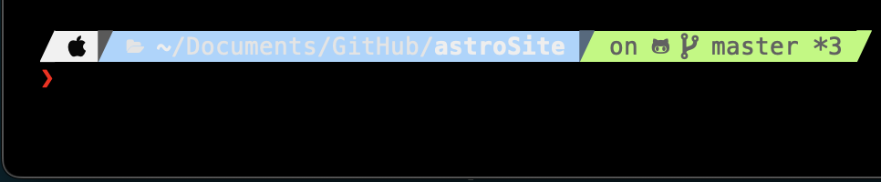

Warp supports two prompt types: the **Warp prompt** and the **Shell prompt (PS1)**.

## Choosing your prompt type

To switch your prompt type:

1. In the Warp app, open **Settings** > **Appearance**.
2. Under **Input**, set **Input type** to **Warp** or **Shell (PS1)**.

With the Warp prompt, open the prompt context menu to copy the entire prompt or individual context chip values, such as the working directory or Git branch. Right-click the prompt, or use `Shift`+right-click if your right-click behavior is set to paste.

With a Shell prompt, open the prompt context menu to copy the entire prompt. You can also select part of the prompt in a previously run block.

## Warp prompt

Warp's native prompt displays context chips for information such as your current working directory, Git branch, Subversion status, Kubernetes context, Python environment, date, and time. The Warp prompt is the default when **Input type** is set to **Warp**.

To customize which context chips your Warp prompt displays:

1. In the Warp app, open **Settings** > **Appearance**.
2. Under **Input**, click the prompt preview below **Input type**.
3. In **Edit prompt**, select **Warp terminal prompt**.
4. Drag context chips into the dashed box and arrange them in the order you want.
5. Click **Save changes**.

### Git and Subversion

Git and Subversion context chips show your local branch and uncommitted changes. Git chips can also show remote tracking status and diff statistics.

### Kubernetes

The Kubernetes context chip shows relevant information when you're using one of the following commands:

`kubectl|helm|kubens|kubectx|oc|istioctl|kogito|k9s|helmfile|flux|fluxctl|stern|kubeseal|skaffold|kubent|kubecolor|cmctl|sparkctl|etcd|fubectl`

:::note
Warp respects the `KUBECONFIG` environment variable. Make sure you set it to your preferred configuration file location if it's not the default path of `~/.kube/config`.
:::

## Shell prompt (PS1)

You can use a Shell prompt instead of the Warp prompt by configuring the **PS1** variable or installing a supported shell prompt plugin (see [Shell prompt compatibility table](/terminal/appearance/prompt/#shell-prompt-compatibility-table)).

To enable the Shell prompt:

1. In the Warp app, open **Settings** > **Appearance**.
2. Under **Input**, set **Input type** to **Shell (PS1)**.
3. Configure your `PS1` variable in your shell's RC file, or install a supported prompt plugin.

`PS1` is the shell variable for the primary prompt string, which the terminal displays before your command-line input.

### Multi-line and right-sided prompts

The Shell prompt supports multi-line or right-sided prompts in zsh and fish, not bash. However, you can't have a multiline right-side prompt, only a multiline left prompt.

:::note
If you want to add a new line to your Shell prompt, run the following based on your shell or prompt:

```sh
# Bash
echo -e '\nPS1="${PS1}"$'\''\\n'\''' >> ~/.bashrc

# Zsh
echo -e '\nPROMPT="${PROMPT}"$'\''\\n'\''' >> ~/.zshrc

# Fish
echo -e '\nfunctions --copy fish_prompt fish_prompt_orig; function fish_prompt; fish_prompt_orig; echo; end' >> ~/.config/fish/config.fish

# PowerShell
$rawString = @'
$originalPrompt = Get-Item Function:\prompt
Set-Item -Path Function:\prompt_original -Value $originalPrompt
function prompt {
    "$(& prompt_original)`n"
}
'@
Add-Content -Path $PROFILE -Value "`n$rawString`n"

# Powerlevel10k
p10k configure

# Starship Prompt
echo '[line_break]\ndisabled = false' >> ~/.config/starship.toml
```
:::

### Shell prompt compatibility table

| Shell                       | Tool                                                                      | Does it work?                                                   |
| --------------------------- | ------------------------------------------------------------------------- | --------------------------------------------------------------- |
| bash \| zsh                 | [PS1](https://www.warp.dev/blog/whats-so-special-about-ps1)               | Working                                                         |
| bash \| zsh \| fish \| pwsh | [Starship](https://github.com/starship/starship)                          | [Working\*](/terminal/appearance/prompt/#starship)                                 |
| bash \| zsh \| fish \| pwsh | [oh-my-posh](https://github.com/JanDeDobbeleer/oh-my-posh)                | Working                                                         |
| zsh                         | [Powerlevel10k](https://github.com/romkatv/powerlevel10k)                 | [Working\*](/terminal/appearance/prompt/#powerlevel10k)                            |
| zsh                         | [Spaceship](https://github.com/spaceship-prompt/spaceship-prompt)         | [Working\*](/terminal/appearance/prompt/#spaceship)                                |
| zsh                         | [oh-my-zsh](https://github.com/ohmyzsh/ohmyzsh)                           | Working                                                         |
| zsh                         | [prezto](https://github.com/sorin-ionescu/prezto)                         | [Working\*](/terminal/appearance/prompt/#prezto)                                   |
| ssh                         |                                                                           | Working                                                         |
| bash                        | [oh-my-bash](https://github.com/ohmybash/oh-my-bash)                      | Not supported                                                   |
| bash                        | [bash-it](https://github.com/Bash-it/bash-it)                             | Not supported                                                   |
| bash                        | [SBP](https://github.com/brujoand/sbp)                                    | Not supported                                                   |
| bash                        | [synth-shell-prompt](https://github.com/andresgongora/synth-shell-prompt) | Not supported                                                   |
| bash \| zsh                 | [Powerline-shell](https://github.com/b-ryan/powerline-shell)              | Not supported                                                   |
| zsh                         | [zplug](https://github.com/zplug/zplug)                                   | Not supported                                                   |
| fish                        | [tide](https://github.com/IlanCosman/tide)                                | [Not supported](https://github.com/warpdotdev/Warp/issues/3358) |
| fish                        | [oh-my-fish](https://github.com/oh-my-fish/oh-my-fish)                    | [Not supported](https://github.com/warpdotdev/Warp/issues/3796) |

## Known incompatibilities

If you have prompt issues, review the notes below and [debug your shell RC files](/support-and-community/troubleshooting-and-support/known-issues/#configuring-and-debugging-your-rc-files).

### Starship

#### Starship settings

To keep a Starship prompt on one line, add the following to `~/.config/starship.toml`:

```toml
[line_break]
disabled = true
```

Set `disabled` to `false` to put the input on a new line. For other prompt-wide settings, including `command_timeout`, see the [Starship prompt configuration](https://starship.rs/config/#prompt).

#### Starship + bash

Starship may not render properly if your [default shell](/getting-started/supported-shells/#changing-what-shell-warp-uses) is `/bin/bash`. To work around the issue, upgrade Bash, find its path with `command -v bash`, then select that path under **Settings** > **Features** > **Session** > **Default shell for new sessions** in the Warp app.

#### Starship + zsh

To put the input on a new line after the Starship prompt in zsh, add `PROMPT="${PROMPT}"$'\n'` to the bottom of `~/.zshrc`.

### Powerlevel10k

Powerlevel10k recommends the [Meslo Nerd Font](https://github.com/romkatv/powerlevel10k/blob/master/font.md).

Powerlevel10k may display arrow dividers in gray because of Warp's minimum contrast setting. To work around the issue, go to **Settings** > **Appearance** > **Text** > **Enforce minimum contrast** and select **Never**.

<figure style={{ maxWidth: "563px" }}>

<figcaption>Example of the grey dividers in p10k.</figcaption>
</figure>

Warp supports [Powerlevel10k](https://github.com/romkatv/powerlevel10k#installation) version 1.19.0 and later. Install the latest version, restart Warp, then [switch to the Shell prompt](#choosing-your-prompt-type).

Warp doesn't support some Powerlevel10k features, including transient prompts and gradients.

### Spaceship

This prompt can cause an issue with typeahead in Warp's input editor. To work around the issue, run `echo "SPACESHIP_PROMPT_ASYNC=FALSE" >>! ~/.zshrc`.

### Prezto

Warp supports the Prezto prompt, but not the [Prezto utility module](https://github.com/sorin-ionescu/prezto/blob/master/modules/utility/README.md) or other [incompatible autocompletion plugins](/support-and-community/troubleshooting-and-support/known-issues/#list-of-incompatible-tools).

### Disabling unsupported prompts for Warp

Use Warp's default prompt or install a tool from the [Shell prompt compatibility table](#shell-prompt-compatibility-table). To disable an unsupported prompt only in Warp, wrap its setup in this condition:

```bash
if [[ $TERM_PROGRAM != "WarpTerminal" ]]; then
##### WHAT YOU WANT TO DISABLE FOR WARP - BELOW

    # Unsupported Custom Prompt Code

##### WHAT YOU WANT TO DISABLE FOR WARP - ABOVE
fi
```

#### iTerm2

The iTerm2 shell integration is incompatible with Warp and can hide your custom prompt. If you migrated from iTerm2, check your dotfiles and disable the integration in Warp:

```bash
if [[ $TERM_PROGRAM != "WarpTerminal" ]]; then
##### WHAT YOU WANT TO DISABLE FOR WARP - BELOW

test -e "${HOME}/.iterm2_shell_integration.zsh" && source "${HOME}/.iterm2_shell_integration.zsh"

##### WHAT YOU WANT TO DISABLE FOR WARP - ABOVE
fi
```

## Related pages

* [Supported shells](/getting-started/supported-shells/)
* [Configuring and debugging shell RC files](/support-and-community/troubleshooting-and-support/known-issues/#configuring-and-debugging-your-rc-files)
