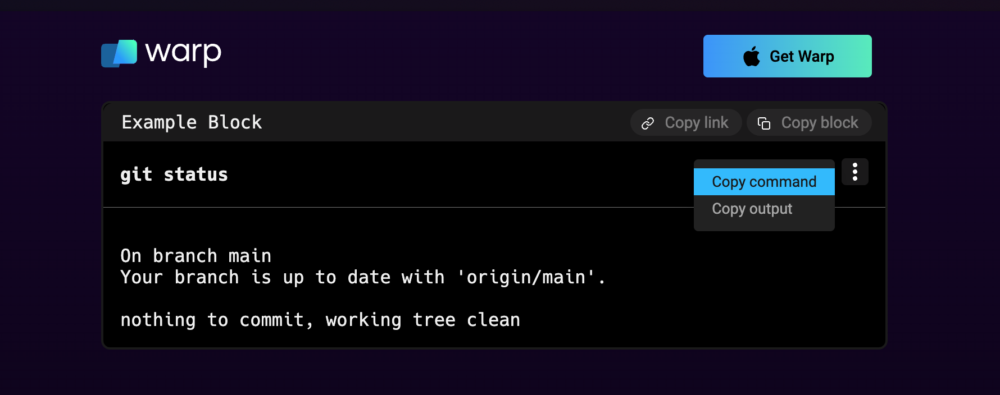
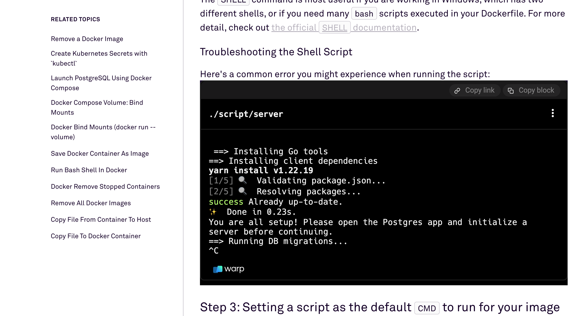

import DemoVideo from '@components/DemoVideo.astro';
import { Tabs, TabItem } from '@astrojs/starlight/components';
import VideoEmbed from '@components/VideoEmbed.astro';

:::note
This action sends command information to our server and is explicitly opt-in. Read more about privacy at Warp on [our privacy page](https://www.warp.dev/privacy).
:::

Share your blocks with a permalink or HTML embed. You can get started with shared blocks by opening the context menu and copying the command, output, or prompt.

## How to share blocks

<Tabs>
  <TabItem label="macOS">
    To share your blocks, follow these steps:

    1. On a finished block, click the context menu and select **Share...** or select the block and hit `CMD-SHIFT-S`.
    2. A modal will pop up that lets you title your block and customize it by selecting which parts of the block you want to share (e.g. command, output, prompt, etc.).
    3. Click either "Create link" or "Get embed" depending on how you want to share your block.
    4. The link or embed snippet will be copied to your clipboard.
  </TabItem>
  <TabItem label="Windows">
    To share your blocks, follow these steps:

    1. On a finished block, click the context menu and select **Share...** or by setting up a key bind for Share Block in **Settings** > **Keyboard shortcuts**.
    2. A modal will pop up that lets you title your block and customize it by selecting which parts of the block you want to share (e.g. command, output, prompt, etc.).
    3. Click either "Create link" or "Get embed" depending on how you want to share your block.
    4. The link or embed snippet will be copied to your clipboard.
  </TabItem>
  <TabItem label="Linux">
    To share your blocks, follow these steps:

    1. On a finished block, click the context menu and select **Share...** or by setting up a key bind for Share Block in **Settings** > **Keyboard shortcuts**.
    2. A modal will pop up that lets you title your block and customize it by selecting which parts of the block you want to share (e.g. command, output, prompt, etc.).
    3. Click either "Create link" or "Get embed" depending on how you want to share your block.
    4. The link or embed snippet will be copied to your clipboard.
  </TabItem>
</Tabs>

:::note
If you experience any issues with block sharing, please see our known issues for [troubleshooting steps](/support-and-community/troubleshooting-and-support/known-issues/#online-features-dont-work).
:::

<DemoVideo src="/assets/terminal/block-sharing-embed.mp4" label="Block Sharing & Embed Demo" />

## Permalink

Create and share a permalink to your blocks to collaborate with teammates. Here is the [web permalink](https://app.warp.dev/block/vzFATak939iqGWfNh7wsAP) of the block depicted below.



## Embedded blocks

Create and embed your blocks on web pages to help your readers follow along with technical writing. Readers can interact with an embedded block as they would with a block in Warp, with a context menu and styling. When you click "Get embed", Warp will copy an `iframe` to your clipboard. Here's an example `iframe`:

```html
<iframe src="https://app.warp.dev/block/embed/qn0g1CqQnkYjEafPH5HCVT"
title="server script error" style="width: 712px; height: 397px; border:0;
overflow:hidden;" allow="clipboard-read; clipboard-write"></iframe>
```

#### Embedded block example on web page



## Managing shared blocks

You can unshare a block by navigating to **Settings** > **Shared blocks**. Currently, shared blocks are accessible to anyone with the link.

## Link previews

Shared permalinks will also display a preview of your code for quick context on each link.

:::note
Compatible with any platform that supports Open Graph or Twitter meta tags. For example Slack, Twitter, Facebook, Telegram, Notion, and more ...
:::

<VideoEmbed url="https://www.loom.com/share/a78147fee8804c00b08a1decbc0d4e72?hide_owner=true&hide_share=true&hide_title=true&hideEmbedTopBar=true" title="Share and Unfurl a Block Preview" />
