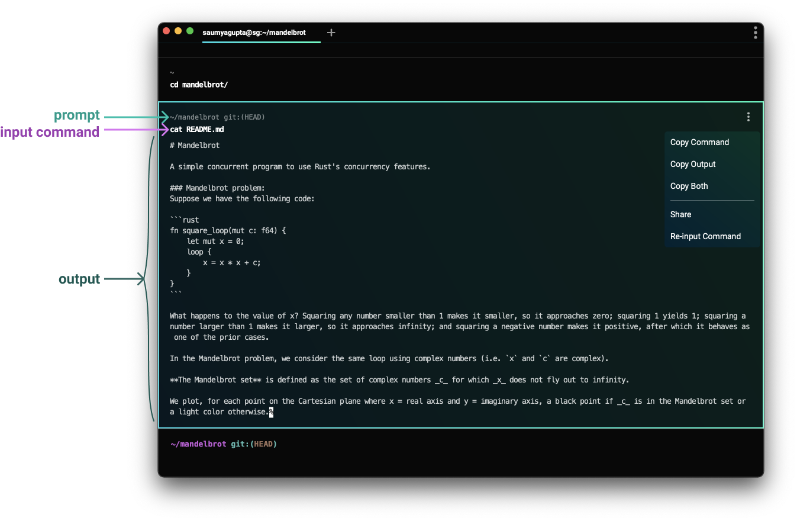

import VideoEmbed from '@components/VideoEmbed.astro';

Blocks are Warp's fundamental unit for organizing terminal output. Every command and its output is grouped into a single Block that you can copy, search, filter, bookmark, share, and navigate independently — replacing the endless scroll of traditional terminals with structured, actionable output.

## What are Blocks?

Blocks enable us to easily:

* Copy a command
* Copy a command’s output
* Scroll directly to the start of a command’s output
* Re-input commands
* Share both a command and its output (with formatting!)
* Bookmark commands

:::note
Interested in how we differentiate input and output, or how we implement blocks? Check out our blog post: [How Warp Works.](https://www.warp.dev/blog/how-warp-works#implementing-blocks)
:::

<VideoEmbed url="https://youtu.be/PH1u0TZ5Lf0" title="Intro to Blocks" />

