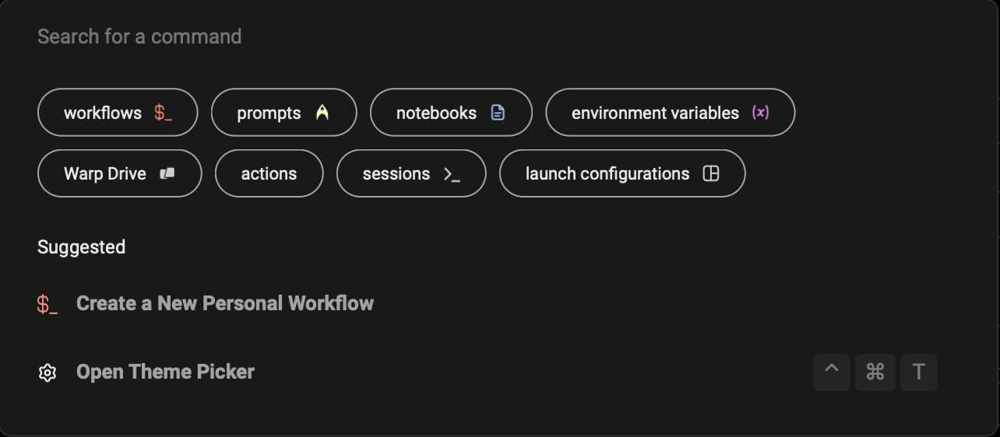

import { Tabs, TabItem } from '@astrojs/starlight/components';
import VideoEmbed from '@components/VideoEmbed.astro';

## How to access it

<Tabs>
  <TabItem label="macOS">
    You can access the Command Palette with the keyboard shortcut `CMD-P`.
  </TabItem>
  <TabItem label="Windows">
    You can access the Command Palette with the keyboard shortcut `CTRL-SHIFT-P`.
  </TabItem>
  <TabItem label="Linux">
    You can access the Command Palette with the keyboard shortcut `CTRL-SHIFT-P`.
  </TabItem>
</Tabs>

## How it works

* Start typing to search for workflows, notebooks, keyboard shortcuts, actions, toggles, etc.
* Activate a specific filter, by clicking on the filter buttons or prepending your search with the following:
  * `workflows:` or `w:` will filter for [Workflows](/knowledge-and-collaboration/warp-drive/workflows/).
  * `prompts:` or `p:` will filter for [Prompts](/knowledge-and-collaboration/warp-drive/prompts/).
  * `notebook:` or `n:` will filter for [Notebooks](/knowledge-and-collaboration/warp-drive/notebooks/).
  * `env_vars:` will filter for [Environment Variables](/knowledge-and-collaboration/warp-drive/environment-variables/).
  * `files:` will filter for local files.
  * `drive:` will filter for [Warp Drive](/knowledge-and-collaboration/warp-drive/).
  * `actions:` will filter for Warp-specific actions like settings and features.
  * `sessions:` will filter for active sessions with [Session Navigation](/terminal/sessions/session-navigation/).
  * `launch_configs:` will filter for [Launch Configurations](/terminal/sessions/launch-configurations/).

<VideoEmbed url="https://www.loom.com/share/0e6108b295234637a0bb20cc941976e9?hide_owner=true&hide_share=true&hide_title=true&hideEmbedTopBar=true" title="Command Palette Demo" />
