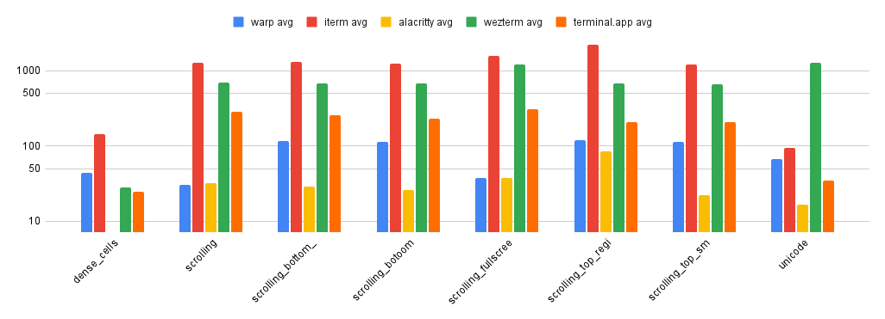
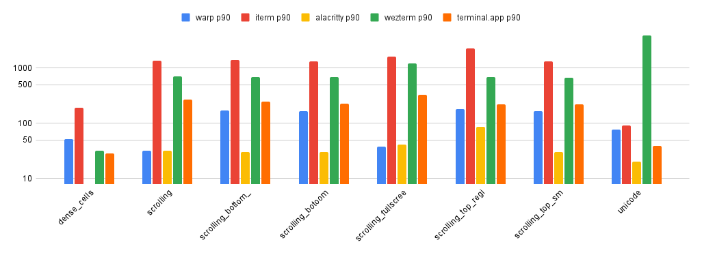
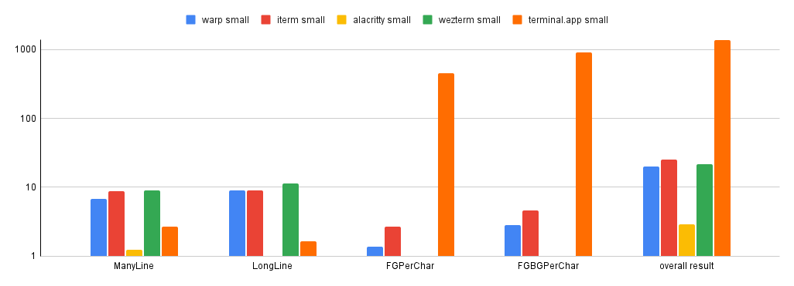
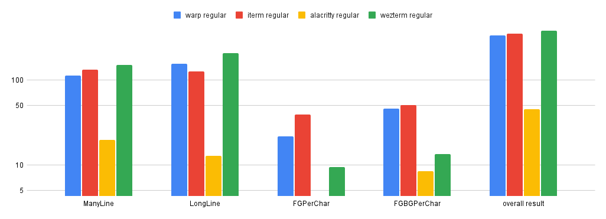

## Terminal apps selected for these benchmarks

We chose to benchmark Warp against 4 other terminal emulator applications, based on their popularity as well as language and principles. Here is the list of the applications we chose for this comparison together with the explanation as to why we decided to include it in our comparison:

* Terminal.app - the default terminal app available on the macOS;
* ITerm2 - one of the most popular terminal emulators used by macOS users;
* Alacritty & WezTerm - both of those terminals are written in Rust and are well-known for their speed and overall performance, things that Warp is aiming for.

### Versions & settings used during the comparison

| Terminal     | Version                        | Terminal size (cols / rows, window is identical pixel-wise) |
| ------------ | ------------------------------ | ----------------------------------------------------------- |
| Warp         | v0.2022.04.01.01.37.stable\_03 | 208 cols / 54 rows                                          |
| Terminal.app | Version 2.11 (440)             | 188 cols / 72 rows                                          |
| iTerm2       | Build 3.4.15                   | 211 cols / 78 rows                                          |
| Alacritty    | alacritty 0.10.1 (2844606)     | 286 cols / 102 rows                                         |
| Wezterm      | 20220319-142410-0fcdea07       | 243 cols / 80 rows                                          |

### About benchmarks

We link the source code of each benchmark used, so you can easily reproduce the tests with other terminal apps. Please, note that those benchmarks are not exhaustive. Comparing terminal emulators with each other is not an easy task - right now we're checking how each of the apps behaves when dealing with lots of input and/or output.

Ideally, the benchmarks would also cover the latency (time between pressing a key and the character showing on the screen, but also a delay between the user's input and communication with the shell). We may include tests that account for that in the future.

## VTE benchmark

Benchmark code can be found [here](https://github.com/alacritty/vtebench) with the specific commit we used in our comparison: `93bcc32b6e0f7560e9b1a5a8b0998c04fbf9b50d`. Results in milliseconds.

### Average time for each of the benchmark tests

|                                  | Warp avg (ms) | Terminal.app avg (ms) | iTerm avg | Alacritty avg | WezTerm avg |
| -------------------------------- | ------------- | --------------------- | --------- | ------------- | ----------- |
| dense\_cells                     | 43.88         | 24.91                 | 144.84    | 7.25          | 28.15       |
| scrolling                        | 30.06         | 283.34                | 1257.57   | 31.75         | 687.77      |
| scrolling\_bottom\_region        | 117.34        | 257.23                | 1294.25   | 29.1          | 672.67      |
| scrolling\_bottom\_small\_region | 114.52        | 227.75                | 1251      | 25.98         | 669.93      |
| scrolling\_fullscreen            | 37.4          | 307.03                | 1565.17   | 37.36         | 1205        |
| scrolling\_top\_region           | 120.63        | 209.29                | 2212.2    | 84.42         | 682.6       |
| scrolling\_top\_small\_region    | 114.64        | 205.59                | 1216.33   | 21.91         | 663.44      |
| unicode                          | 66.47         | 34.45                 | 93.01     | 16.78         | 1279.25     |

### P90 of the results

|                                  | Warp p90 | Terminal.app p90 | iTerm p90 | Alacritty p90 | WezTerm p90 |
| -------------------------------- | -------- | ---------------- | --------- | ------------- | ----------- |
| dense\_cells                     | 52       | 28               | 189       | 8             | 32          |
| scrolling                        | 32       | 266.76           | 1336      | 32            | 707         |
| scrolling\_bottom\_region        | 170      | 243              | 1398      | 30            | 686         |
| scrolling\_bottom\_small\_region | 167      | 224              | 1331      | 30            | 679         |
| scrolling\_fullscreen            | 38       | 327              | 1593      | 41            | 1208        |
| scrolling\_top\_region           | 178      | 222              | 2243      | 85            | 686         |
| scrolling\_top\_small\_region    | 167      | 222              | 1314      | 30            | 666         |
| unicode                          | 77       | 39               | 90        | 20            | 3883        |

## Termbench

Benchmark code can be found [here](https://github.com/cmuratori/termbench) with the specific commit we used in our comparison: `82afbc69256b4e22de913f0f02f82e0480f3dac5`.

Below you'll find results for small and regular test sizes. Note that Terminal.app only participated in the small test. Results in seconds.

### Small test sizes

|                | Warp small (s) | Terminal.app small (s) | iTerm small (s) | Alacritty small | WezTerm small |
| -------------- | -------------- | ---------------------- | --------------- | --------------- | ------------- |
| ManyLine       | 6.7854         | 2.6789                 | 8.7057          | 1.2532          | 8.9436        |
| LongLine       | 9.0033         | 1.6473                 | 9.0849          | 0.8179          | 11.4587       |
| FGPerChar      | 1.3716         | 453.9888               | 2.6625          | 0.2788          | 0.6487        |
| FGBGPerChar    | 2.8403         | 908.894                | 4.5881          | 0.5931          | 0.7283        |
| overall result | 20.0006        | 1367.209               | 25.0413         | 2.943           | 21.7793       |

### Regular test size

|                | Warp regular (s) | iTerm regular (s) | Alacritty regular (s) | WezTerm regular |
| -------------- | ---------------- | ----------------- | --------------------- | --------------- |
| ManyLine       | 113.76           | 132.4975          | 19.8802               | 150.8175        |
| LongLine       | 155.0937         | 126.7561          | 12.7859               | 207.3647        |
| FGPerChar      | 21.8928          | 39.3352           | 4.2925                | 9.4265          |
| FGBGPerChar    | 46.312           | 50.5369           | 8.418                 | 13.5142         |
| overall result | 337.0585         | 349.1258          | 45.3767               | 381.1229        |

