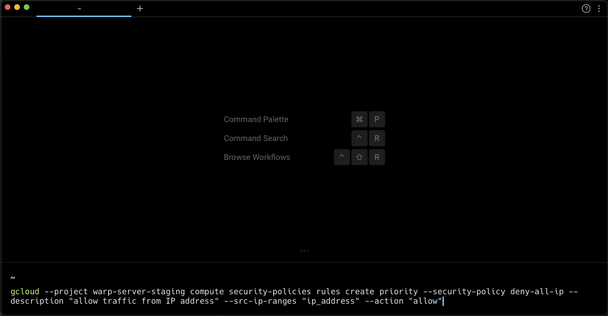

import { Tabs, TabItem } from '@astrojs/starlight/components';
import VideoEmbed from '@components/VideoEmbed.astro';

:::note
Text Editor Input also works for [SSH sessions](/terminal/warpify/ssh/).
:::

### Soft Wrapping

Warp supports soft wrapping in the input editor. If an autosuggestion goes off-screen, the input editor will be horizontally scrollable to make it visible. Some operations treat soft-wrapped lines like a logical line (`TRIPLE-CLICK`) while other operations treat soft wrapped lines like visible different lines (`UP`/`DOWN`, `SHIFT-UP`/`SHIFT-DOWN`).

### Copy on Select

Warp supports copy on select for selectable text within [Blocks](/terminal/blocks/).

* Toggle this feature **Settings** > **Features** > **Terminal** or search for "Copy on select" in the [Command Palette](/terminal/command-palette/).

### Autocomplete quotes, parentheses, and brackets

Warp can automatically complete quotes, brackets, and parentheses like you're used to in IDEs.

* Toggle this feature **Settings** > **Features** > **Text Editing** or search for "Autocomplete quotes" in the [Command Palette](/terminal/command-palette/).

## How to use it

<Tabs>
  <TabItem label="macOS">
    <table><thead><tr><th width="317">Keyboard binding</th><th>Shortcut description</th></tr></thead><tbody><tr><td><code>ESCAPE</code></td><td>Closes the input suggestions or history menu</td></tr><tr><td><code>CTRL-L</code></td><td>Clears the terminal</td></tr><tr><td><code>CTRL-H</code></td><td>Backspace</td></tr><tr><td><code>CTRL-C</code></td><td>Clear the entire editor buffer</td></tr><tr><td><code>CTRL-U</code></td><td>Copy and Clear the current line</td></tr><tr><td><code>CMD-SHIFT-K</code></td><td>Clear selected lines</td></tr><tr><td><code>CMD-C</code>, <code>CMD-X</code>, <code>CMD-V</code></td><td>Copy, cut, paste</td></tr><tr><td><code>CTRL-W</code> / <code>OPT-D</code></td><td>Cut the word to the left / right of the cursor</td></tr><tr><td><code>OPT-BACKSPACE</code> / <code>OPT-D</code></td><td>Delete the word to the left / right of the cursor</td></tr><tr><td><code>CTRL-K CMD-DELETE</code></td><td>Delete everything to the right of the cursor</td></tr><tr><td><code>OPT-LEFT</code> / <code>OPT-RIGHT</code></td><td>Move to the beginning of the previous / next word</td></tr><tr><td><code>CTRL-OPT-LEFT</code> / <code>CTRL-OPT-RIGHT</code></td><td>Move backward / forward by one subword</td></tr><tr><td><code>CMD-LEFT</code> <code>CTRL-A</code>/ <code>CTRL-E</code> <code>CMD-DOWN</code> <code>CMD-RIGHT</code></td><td>Move the cursor to the start / end of the line</td></tr><tr><td><code>SHIFT-LEFT</code> / <code>SHIFT-RIGHT</code></td><td>Select the character to the left / right of the cursor</td></tr><tr><td><code>OPT-SHIFT-LEFT</code> / <code>OPT-SHIFT-RIGHT</code></td><td>Select the word to the left / right of the cursor</td></tr><tr><td><code>CMD-SHIFT-LEFT</code> / <code>CMD-SHIFT-RIGHT</code></td><td>Select everything to the left / right of the cursor</td></tr><tr><td><code>SHIFT-UP</code> / <code>SHIFT-UP</code></td><td>Select everything above / below the cursor</td></tr><tr><td><code>CMD-A</code></td><td>Select the entire editor buffer</td></tr><tr><td><code>SHIFT-ENTER</code> <code>CTRL-ENTER</code> <code>OPT-ENTER</code></td><td>Insert newline</td></tr><tr><td><code>CTRL-R</code></td><td>Command Search</td></tr><tr><td><code>CMD-D</code></td><td>Split pane</td></tr></tbody></table>
  </TabItem>
  <TabItem label="Windows">
    <table><thead><tr><th width="317">Keyboard binding</th><th>Shortcut description</th></tr></thead><tbody><tr><td><code>ESCAPE</code></td><td>Closes the input suggestions or history menu</td></tr><tr><td><code>CTRL-L</code></td><td>Clears the terminal</td></tr><tr><td><code>CTRL-H</code></td><td>Backspace</td></tr><tr><td><code>CTRL-C</code></td><td>Clear the entire editor buffer</td></tr><tr><td><code>CTRL-U</code></td><td>Copy and Clear the current line</td></tr><tr><td><code>CTRL-SHIFT-K</code></td><td>Clear selected lines</td></tr><tr><td><code>CTRL-C</code>, <code>CTRL-X</code>, <code>CTRL-V</code></td><td>Copy, cut, paste</td></tr><tr><td><code>CTRL-W</code> / <code>ALT-D</code></td><td>Cut the word to the left / right of the cursor</td></tr><tr><td><code>ALT-BACKSPACE</code> / <code>ALT-D</code></td><td>Delete the word to the left / right of the cursor</td></tr><tr><td><code>CTRL-K</code></td><td>Delete everything to the right of the cursor</td></tr><tr><td><code>ALT-LEFT</code> / <code>ALT-RIGHT</code></td><td>Move to the beginning of the previous / next word</td></tr><tr><td><code>CTRL-LEFT</code> / <code>CTRL-RIGHT</code></td><td>Move backward / forward by one subword</td></tr><tr><td><code>CTRL-A</code>/ <code>CTRL-E</code></td><td>Move the cursor to the start / end of the line</td></tr><tr><td></td><td>Select the character to the left / right of the cursor</td></tr><tr><td><code>META-SHIFT-B</code> / <code>META-SHIFT-F</code></td><td>Select the word to the left / right of the cursor</td></tr><tr><td></td><td>Select everything to the left / right of the cursor</td></tr><tr><td><code>SHIFT-UP</code> / <code>SHIFT-UP</code></td><td>Select everything above / below the cursor</td></tr><tr><td><code>CTRL-A</code></td><td>Select the entire editor buffer</td></tr><tr><td><code>SHIFT-ENTER</code> <code>CTRL-ENTER</code> <code>ALT-ENTER</code></td><td>Insert newline</td></tr><tr><td><code>CTRL-R</code></td><td>Command Search</td></tr><tr><td><code>CTRL-SHIFT-D</code></td><td>Split pane</td></tr></tbody></table>
  </TabItem>
  <TabItem label="Linux">
    <table><thead><tr><th width="317">Keyboard binding</th><th>Shortcut description</th></tr></thead><tbody><tr><td><code>ESCAPE</code></td><td>Closes the input suggestions or history menu</td></tr><tr><td><code>CTRL-L</code></td><td>Clears the terminal</td></tr><tr><td><code>CTRL-H</code></td><td>Backspace</td></tr><tr><td><code>CTRL-C</code></td><td>Clear the entire editor buffer</td></tr><tr><td><code>CTRL-U</code></td><td>Copy and Clear the current line</td></tr><tr><td><code>CTRL-SHIFT-K</code></td><td>Clear selected lines</td></tr><tr><td><code>CTRL-C</code>, <code>CTRL-X</code>, <code>CTRL-V</code></td><td>Copy, cut, paste</td></tr><tr><td><code>CTRL-W</code> / <code>ALT-D</code></td><td>Cut the word to the left / right of the cursor</td></tr><tr><td><code>ALT-BACKSPACE</code> / <code>ALT-D</code></td><td>Delete the word to the left / right of the cursor</td></tr><tr><td><code>CTRL-K</code></td><td>Delete everything to the right of the cursor</td></tr><tr><td><code>ALT-LEFT</code> / <code>ALT-RIGHT</code></td><td>Move to the beginning of the previous / next word</td></tr><tr><td><code>CTRL-LEFT</code> / <code>CTRL-RIGHT</code></td><td>Move backward / forward by one subword</td></tr><tr><td><code>CTRL-A</code>/ <code>CTRL-E</code></td><td>Move the cursor to the start / end of the line</td></tr><tr><td></td><td>Select the character to the left / right of the cursor</td></tr><tr><td><code>META-SHIFT-B</code> / <code>META-SHIFT-F</code></td><td>Select the word to the left / right of the cursor</td></tr><tr><td></td><td>Select everything to the left / right of the cursor</td></tr><tr><td><code>SHIFT-UP</code> / <code>SHIFT-UP</code></td><td>Select everything above / below the cursor</td></tr><tr><td><code>CTRL-A</code></td><td>Select the entire editor buffer</td></tr><tr><td><code>SHIFT-ENTER</code> <code>CTRL-ENTER</code> <code>ALT-ENTER</code></td><td>Insert newline</td></tr><tr><td><code>CTRL-R</code></td><td>Command Search</td></tr><tr><td><code>CTRL-SHIFT-D</code></td><td>Split pane</td></tr></tbody></table>
  </TabItem>
</Tabs>

## How it Works

<VideoEmbed url="https://loom.com/share/1517049fefc34227bf1abaf19cc7e6ea?hide_owner=true&hide_share=true&hide_title=true&hideEmbedTopBar=true" title="Text Editor Input Demo" />

