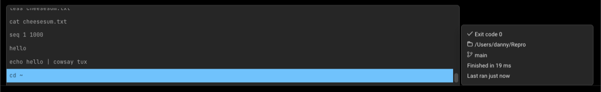

import VideoEmbed from '@components/VideoEmbed.astro';

## What is it

While running, Warp isolates the history of each shell session e.g. if you have two Split Panes open, commands created in one pane do not populate the history of the other. Warp combines the history upon closing.

Command History also provides rich information like exit code, directory, thread, time to finish running, last run, etc.

## How to access it

* Hitting `UP` in the [Input Editor](/terminal/editor/) brings up your history and performs a prefix search based on input.
* Pressing `CTRL-R` opens the [Command Search](/terminal/entry/command-search/) panel and initiates a search of your Command History. To navigate the Command Search panel:
  * Start typing and Warp will automatically filter using fuzzy search. Warp bolds matching text when filtering with fuzzy search.

## How it works

<VideoEmbed url="https://www.loom.com/share/8119beca8d794b06859c5dea1b1377bb?hide_owner=true&hide_share=true&hide_title=true&hideEmbedTopBar=true" title="Command History Demo" />
