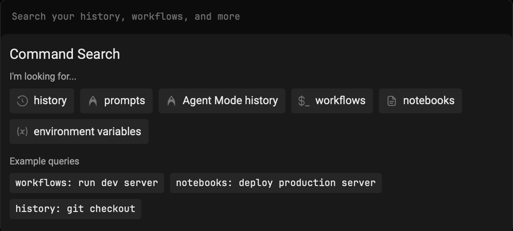

import VideoEmbed from '@components/VideoEmbed.astro';

The Command Search panel provides unified search across all your terminal inputs, saved commands, and [Terminal and Agent modes](/agent-platform/local-agents/interacting-with-agents/terminal-and-agent-modes/) conversation history. Use it to quickly find and reuse commands, workflows, or past agent interactions.

:::note
Tailor your Command Search experience by toggling off "Show Global Workflows" in **Settings** > **Features** > **Workflows**. When disabled, your search will exclusively encompass YAML and Warp Drive Workflows.
:::

## Quick Start

1. Press `CTRL-R` to open the Command Search Panel
2. Type your search query in the input box
3. Press `ENTER` to input the selected command into Warp's Input Editor

## Search Filters

You can filter your search results by prepending your search term with any of the following:

<table><thead><tr><th width="215.78436279296875">Filter</th><th>Shortcuts</th></tr></thead><tbody><tr><td>Command History</td><td><code>history:</code>, <code>h:</code>, or <code>H-TAB</code></td></tr><tr><td>Prompts</td><td><code>prompts:</code>, <code>p:</code>, or <code>P-TAB</code></td></tr><tr><td><a href="/agent-platform/local-agents/interacting-with-agents/">Agent Mode</a> History</td><td><code>ai_history:</code>, <code>a:</code>, or <code>A-TAB</code></td></tr></tbody></table>

:::note
When a filter is activated, it will be bolded and italicized in the search panel.
:::

## Additional Features

* You can expand the menu horizontally by dragging the right edge
* The panel supports fuzzy search and ranks results by relevance

## How it works

<VideoEmbed url="https://www.loom.com/share/21a6f58a33754ee7913edbff6d33d8d1?hideEmbedTopBar=true&hide_owner=true&hide_share=true&hide_title=true" title="Command Search Demo" />
