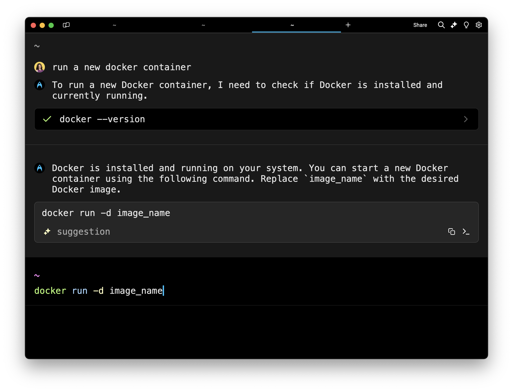
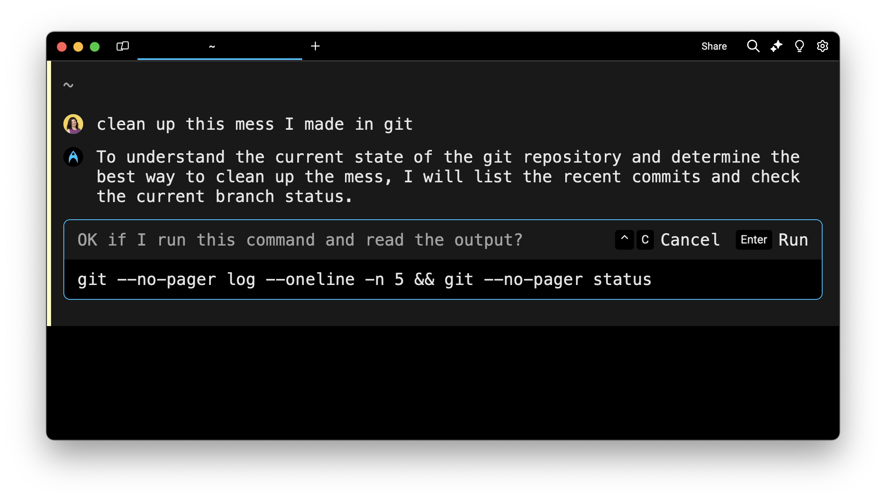
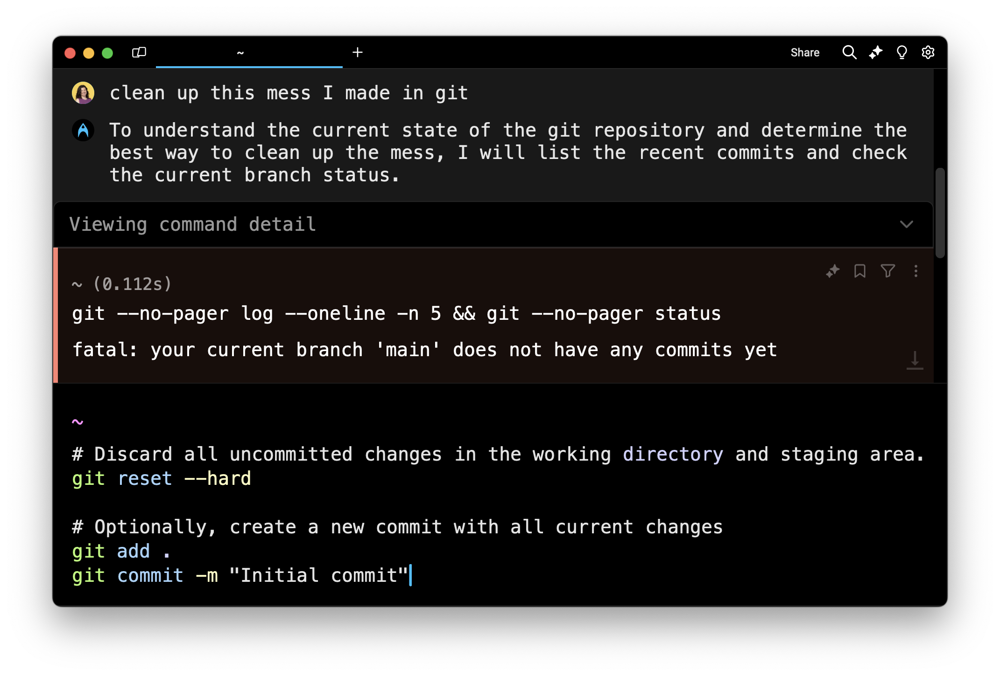

import { Tabs, TabItem } from '@astrojs/starlight/components';

Classic Input corresponds to the **Shell (PS1)** option under **Settings** > **Appearance** > **Input**. It provides a traditional terminal experience with support for shell customizations like PS1 prompts, oh-my-zsh themes, same-line prompts, and more.

Warp's default input uses [Terminal and Agent modes](/agent-platform/local-agents/interacting-with-agents/terminal-and-agent-modes/), which provide a clean terminal by default and a dedicated conversation view for agent interactions. Classic Input is an alternative for users who prefer a more traditional terminal.

[Agent Mode](/agent-platform/local-agents/interacting-with-agents/) works in Classic Input with some minor differences from the default input.

## Features

Classic Input supports all of Warp's core terminal features, including the following and more:

* [Prompt](/terminal/appearance/prompt/) — Use a fully customizable Warp prompt or your shell prompt, with support for PS1 and same-line prompts.
* [Input Position](/terminal/appearance/input-position/) — Choose where the input appears in Warp, including both the prompt and the command line.
* [Modern Text Editing](/terminal/editor/) — Warp's input editor works like a modern IDE, with rich editing capabilities not found in most terminals.
* [Command Entry](/terminal/entry/) — Access Warp's features for command history, synchronized inputs, YAML workflows, and more.
* [Text Selection](/terminal/more-features/text-selection/) — Use smart selection or rectangular (column) selection to highlight text precisely without tedious cleanup.

## How to enter Agent Mode

You can enter Agent Mode in a few ways:

<Tabs>
  <TabItem label="macOS">
    * Type any natural language, like a task or a question, in the terminal input. Warp will recognize natural language with a local auto-detection feature and prepare to send your query to an Oz agent.
    * Use the keyboard shortcut `⌘+I` to toggle into Agent Mode, or type `*+Space`.
    * Click the “AI” sparkles icon in the menu bar, and this will open a new terminal pane that starts in Agent Mode.
    * From a block you want to ask an Oz agent about, you can click the sparkles icon in the toolbelt, or click on its block context menu item "Attach block(s) to AI query".
  </TabItem>
  <TabItem label="Windows">
    * Type any natural language, like a task or a question, in the terminal input. Warp will recognize natural language with a local auto-detection feature and prepare to send your query to an Oz agent.
    * Use the keyboard shortcut `Ctrl+I` to toggle into Agent Mode, or type `*+Space`.
    * Click the "AI" sparkles icon in the menu bar, and this will open a new terminal pane that starts in Agent Mode.
    * From a block you want to ask an Oz agent about, you can click the sparkles icon in the toolbelt, or click on its block context menu item "Attach block(s) to AI query".
  </TabItem>
  <TabItem label="Linux">
    * Type any natural language, like a task or a question, in the terminal input. Warp will recognize natural language with a local auto-detection feature and prepare to send your query to an Oz agent.
    * Use the keyboard shortcut `Ctrl+I` to toggle into Agent Mode, or type `*+Space`.
    * Click the "AI" sparkles icon in the menu bar, and this will open a new terminal pane that starts in Agent Mode.
    * From a block you want to ask an Oz agent about, you can click the sparkles icon in the toolbelt, or click on its block context menu item "Attach block(s) to AI query".
  </TabItem>
</Tabs>

This opens an agent conversation where you can write questions and tasks in an ongoing conversation with Warp's agent.

When you are in Agent Mode, a ✨ sparkles icon will display in line with your terminal input.

## Auto-detection for natural language and configurable settings

The feature Warp uses to detect natural language automatically is completely local. None of your input is sent to AI unless you press `Enter` in Agent Mode.

If you find that certain shell commands are falsely detected as natural language, you can fix the model by adding those commands to a denylist in **Settings** > **Agents** > **Warp Agent** > **Natural language denylist**.

You can also turn autodetection off from **Settings** > **Agents** > **Warp Agent** > **Autodetect agent prompts in terminal input**.

The first time you enter Agent Mode, you will be served a banner with the option to disable auto-detection for natural language on your command line:

## Input hints

Warp input occasionally shows hints within the input editor in a light grey text that helps users learn about features. It's enabled by default.

* Toggle this feature **Settings** > **Agents** > **Warp Agent** > **Show input hint text** or search for "Input hint text" in the [Command Palette](/terminal/command-palette/) or Right-click on the input editor.

## How to exit Agent Mode

<Tabs>
  <TabItem label="macOS">
    You can quit Agent Mode at any point with `Esc` or `Ctrl+C`, or toggle out of Agent Mode with `⌘+I`.
  </TabItem>
  <TabItem label="Windows">
    You can quit Agent Mode at any point with `Esc` or `Ctrl+C`, or toggle out of Agent Mode with `Ctrl+I`.
  </TabItem>
  <TabItem label="Linux">
    You can quit Agent Mode at any point with `Esc` or `Ctrl+C`, or toggle out of Agent Mode with `Ctrl+I`.
  </TabItem>
</Tabs>

## How to run commands in Agent Mode

Once you have typed your question or task in the input, press `Enter` to execute your AI query. Agent Mode will send your request to Oz and begin streaming output in the form of an AI block.

Unlike a chat panel, Agent Mode can complete tasks for you by running commands directly in your session.

#### Agent Mode command suggestions

If Agent Mode finds a suitable command that will accomplish your task, it will describe the command in the AI block. It will also fill your terminal input with the suggested command so you can press `Enter` to run the command.

When you run a command suggested by Agent Mode, that command will work like a standard command you've written in the terminal. No data will be sent back to the AI.

If the suggested command fails and you want to resolve the error, you can start a new AI query to address the problem.

#### Agent Mode requested commands

If Agent Mode doesn't have enough context to assist with a task, it will ask permission to run a command and read the output of that command.

You must explicitly agree and press `Enter` to run the requested command. When you hit enter, both the command input and the output will be sent to Oz.

If you do not wish to send the command or its output to AI, you can click Cancel or press `Ctrl+C` to exit Agent Mode and return to the traditional command line.

Once a requested command is executed, you can click to expand the output and view command details.

If a requested command fails, Oz detects it. Agent Mode is self-correcting. It will request another command until it completes the task for you.

Warp lets you choose from a curated list of LLMs for use in Agent Mode. By default, Warp uses **Auto (Responsive)**, which routes to the highest-quality, fastest available model. You can switch to other supported models — see [Model choice](/agent-platform/capabilities/model-choice/) for the full list.
