import { Tabs, TabItem } from '@astrojs/starlight/components';
import VideoEmbed from '@components/VideoEmbed.astro';

:::caution
**This is legacy documentation.** Universal Input has been replaced by [Agent Modality](/agent-platform/local-agents/interacting-with-agents/terminal-and-agent-modes/), which provides a cleaner terminal experience with a dedicated conversation view for agent interactions.
:::

The **Universal Input** was the main input interface for using Warp.

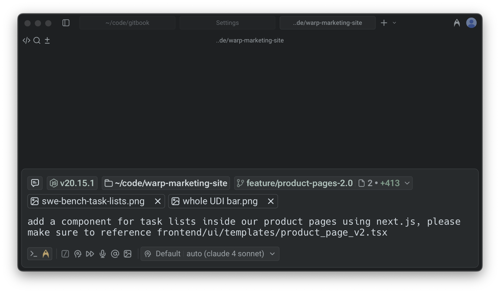

<VideoEmbed url="https://www.youtube.com/watch?v=4c05OEqzQIA" title="Using the Universal Input" />

### Breaking down the Universal Input

The Universal Input brings together all of Warp's input features into one streamlined editor:

* **Natural language auto-detection**: Warp can automatically detect when you're writing in plain English, as opposed to a shell command, and switch you into [Agent Mode](/agent-platform/local-agents/interacting-with-agents/#what-is-agent-mode).
* **Contextual chips**: See your current directory, previous conversations, Git status, node version, and more, all inline with your input.
* [**Modern text editing**](/terminal/editor/): Enjoy IDE-like editing features such as [completions](/terminal/command-completions/), [syntax highlighting](/terminal/editor/syntax-error-highlighting/), mouse support, [rectangular selection](/terminal/more-features/text-selection/), and [Next Command](/agent-platform/local-agents/active-ai/) predictions.
* **Input toolbelt**: Quickly access [@-context](/agent-platform/local-agents/agent-context/using-to-add-context/), [Slash Commands](/agent-platform/capabilities/slash-commands/), [voice input](/agent-platform/local-agents/interacting-with-agents/voice/), [image attachments](/agent-platform/local-agents/agent-context/images-as-context/) as context, and other AI features.

If you prefer a more traditional terminal input experience, you can switch to [Classic Input](/terminal/input/classic-input/) in **Settings** > **Appearance** > **Input**. Classic input also supports oh-my-posh, PS1 customizations, and [same line prompt.](/terminal/appearance/prompt/#same-line-prompt)

## Input Modes

The Universal Input supports three modes, shown in the input switcher:

#### 1. Agent Mode (natural language)

Ask Warp's agent to build, debug, or run tasks in natural language. Warp uses leading LLMs to interpret your request, run the right commands, surface code diffs, and stream results directly into your session.

_Indicator:_ Agent icon is highlighted in the switcher.

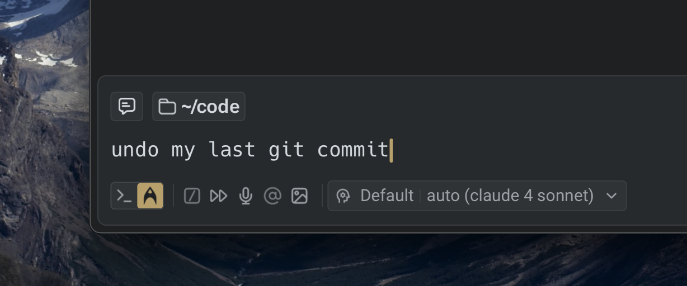

#### 2. Terminal Mode (shell commands)

Enter shell commands just like any terminal, with the benefit of Warp’s modern editor features—completions, syntax highlighting, error underlining, and more included.

_Indicator_: Terminal icon highlighted in the switcher

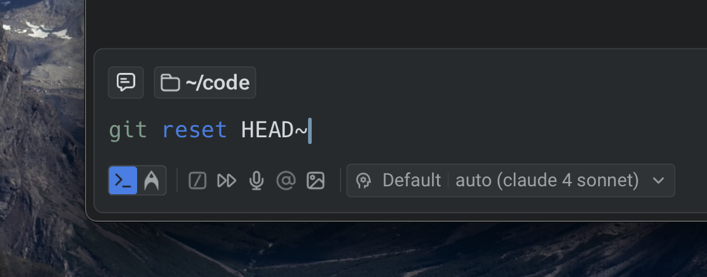

#### 3. Auto-detection Mode

Warp automatically detects whether your input is natural language or a shell command. You can stay in detection mode or explicitly lock into Terminal or Agent Mode.

_Indicator_: Neither mode highlighted.

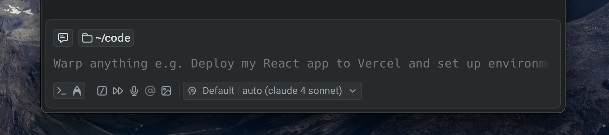

When Warp detects an input type, the input switcher softly highlights the corresponding mode.

| Agent (natural language) mode detected                                                          | Terminal (shell) mode detected                                                                 |
| ----------------------------------------------------------------------------------------------- | ---------------------------------------------------------------------------------------------- |
| 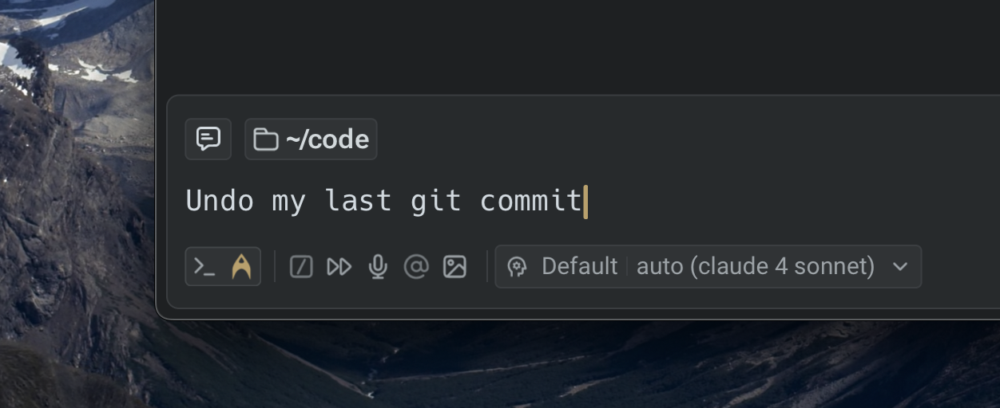 | 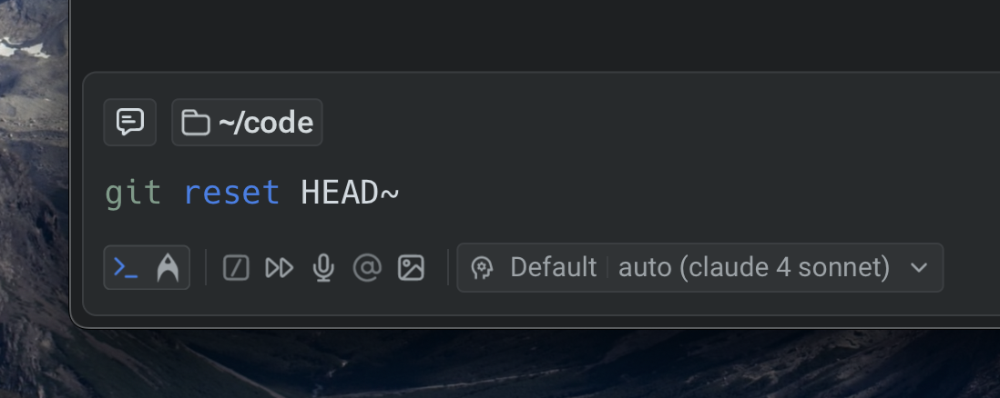 |

:::note
The model Warp uses to detect natural language automatically is completely local.
:::

#### Disabling Natural Language Auto-detection

By default, auto-detection is enabled. This means Warp decides whether to treat your input as a command or an Agent prompt.

* **To turn off auto-detection**: go to **Settings** > **AI** > **Input** > **Natural Language Detection**
* When disabled: You’ll explicitly be in either Terminal or Agent Mode. Use the following keyboard shortcuts to switch between modes:
  * `CMD+I` (macOS)
  * `CTRL+I` (Windows/Linux)

| Agent (natural language) mode enabled                                                              | Terminal (shell) mode enabled                                                                   |
| -------------------------------------------------------------------------------------------------- | ----------------------------------------------------------------------------------------------- |
| 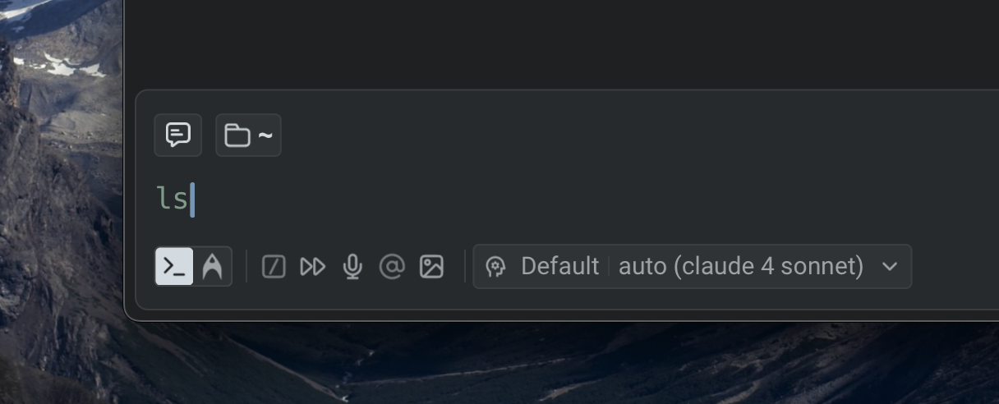 | 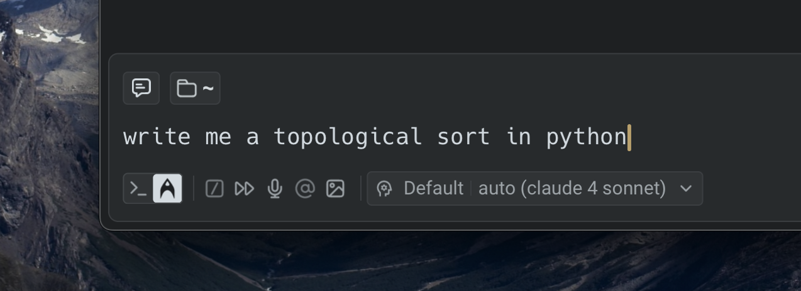 |

### Entering Agent Mode

[Agent Mode](/agent-platform/local-agents/interacting-with-agents/) is how you interact directly with Warp's AI to ask questions, run tasks, and collaborate in natural language. There are multiple ways to enter Agent Mode depending on where you are in your workflow:

<Tabs>
  <TabItem label="macOS">
    * **Type natural language directly**: If auto-detection is enabled, you can type a task or question into the input, and Warp will recognize it as natural language using its local auto-detection feature.
    * **Use keyboard shortcuts**: Quickly toggle into Agent Mode with `CMD + I`.
    * **Attach blocks to a prompt**: From any block you want to use as context, click the ✨ icon in the toolbelt or select "Attach block(s)" to AI query from the block’s context menu.
    * **Force a mode with special characters**:
      * `!` at the start of input forces Terminal Mode.
      * `*` at the start of input forces Agent Mode.
    * **Switch modes manually**: Click the Agent icon in the input switcher to lock into Agent Mode, or click the terminal icon to switch to Terminal Mode.
  </TabItem>
  <TabItem label="Windows">
    * **Type natural language directly**: If auto-detection is enabled, you can type a task or question into the input, and Warp will recognize it as natural language using its local auto-detection feature.
    * **Use keyboard shortcuts**: Quickly toggle into Agent Mode with `CTRL + I`.
    * **Attach blocks to a prompt**: From any block you want to use as context, click the ✨ icon in the toolbelt or select "Attach block(s)" to AI query from the block’s context menu.
    * **Force a mode with special characters**:
      * `!` at the start of input forces Terminal Mode.
      * `*` at the start of input forces Agent Mode.
    * **Switch modes manually**: Click the Agent icon in the input switcher to lock into Agent Mode, or click the terminal icon to switch to Terminal Mode.
  </TabItem>
  <TabItem label="Linux">
    * **Type natural language directly**: If auto-detection is enabled, you can type a task or question into the input, and Warp will recognize it as natural language using its local auto-detection feature.
    * **Use keyboard shortcuts**: Quickly toggle into Agent Mode with `CTRL + I`.
    * **Attach blocks to a prompt**: From any block you want to use as context, click the ✨ icon in the toolbelt or select "Attach block(s)" to AI query from the block’s context menu.
    * **Force a mode with special characters**:
      * `!` at the start of input forces Terminal Mode.
      * `*` at the start of input forces Agent Mode.
    * **Switch modes manually**: Click the Agent icon in the input switcher to lock into Agent Mode, or click the terminal icon to switch to Terminal Mode.
  </TabItem>
</Tabs>

When you're in Agent Mode, the **Agent icon** will be highlighted in the [Universal Input(/terminal/input/universal-input/)

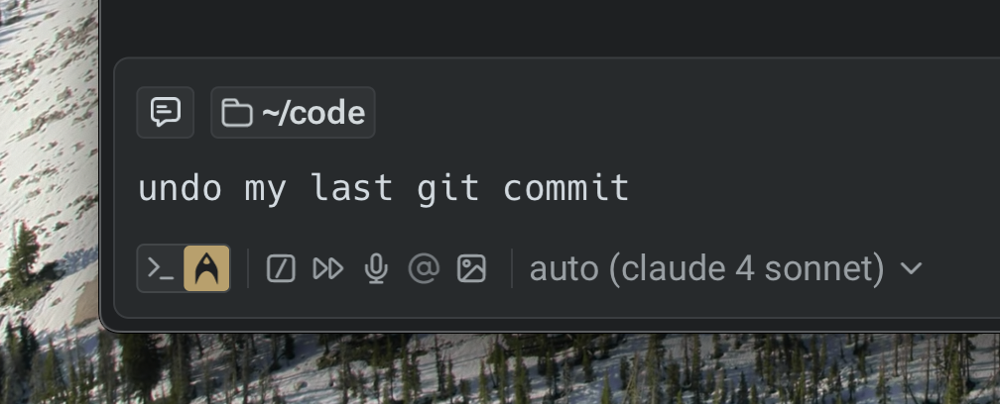

In Classic Input, you’ll also see a ✨ sparkles indicator inline.

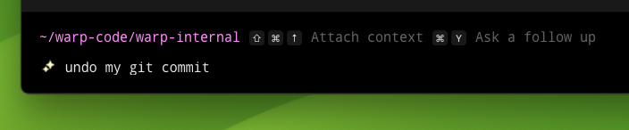

By default, entering Agent Mode starts you in _Pair Mode_, where you can continue an ongoing conversation by asking follow-up questions or assigning tasks. From here, you can ask the agent to build, debug, fix, or even deploy code as needed.

### Exiting Agent or Terminal Modes

You can leave Agent or Terminal Modes in several ways:

<Tabs>
  <TabItem label="macOS">
    * **Keyboard shortcuts**
      * Press `ESC` to quit the current mode.
      * Toggle modes with `CMD + I`
    * **Force modes with special characters**
      * `!` at the start of input forces Terminal Mode.
      * `*` at the start of input forces Agent Mode.
    * **Manual switching**: click the Agent icon or Terminal icon in the input switcher to swap modes directly.
  </TabItem>
  <TabItem label="Windows">
    * **Keyboard shortcuts**
      * Press `ESC` to quit the current mode.
      * Toggle modes with `CTRL + I`
    * **Force modes with special characters**
      * `!` at the start of input forces Terminal Mode.
      * `*` at the start of input forces Agent Mode.
    * **Manual switching**: click the Agent icon or Terminal icon in the input switcher to swap modes directly.
  </TabItem>
  <TabItem label="Linux">
    * **Keyboard shortcuts**
      * Press `ESC` to quit the current mode.
      * Toggle modes with `CTRL + I`
    * **Force modes with special characters**
      * `!` at the start of input forces Terminal Mode.
      * `*` at the start of input forces Agent Mode.
    * **Manual switching**: click the Agent icon or Terminal icon in the input switcher to swap modes directly.
  </TabItem>
</Tabs>

### Natural Language Auto-detection Settings

Warp can automatically detect when you’re writing in plain English and switch you into Agent Mode. If needed, you can customize or disable this behavior.

#### Fixing false detections

If certain shell commands are mistakenly detected as natural language, you can add them to the denylist: **Settings** > **AI** > **Input** > **Natural language denylist**

#### Turning off auto-detection

To disable natural language detection entirely, go to: **Settings** > **AI** > **Input Auto-detection**

When auto-detection is turned off, you’ll need to explicitly switch between Terminal Mode and Agent Mode using `CMD + I` (macOS) or `CTRL + I` (Windows/Linux).

#### First-time setup

The first time you enter Agent Mode, Warp will display a banner with the option to disable natural language detection for your command line:

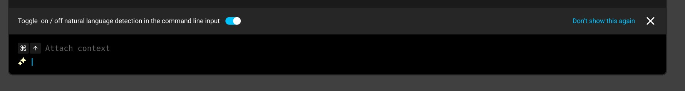

---

## Contextual Input Chips

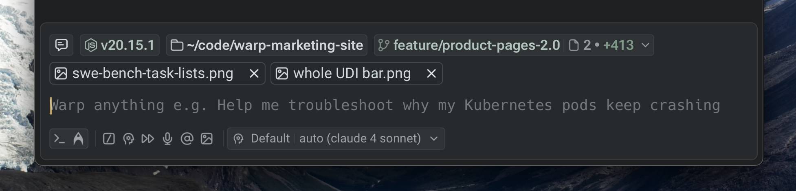

The Universal Input includes **contextual chips** that provide inline information about your current environment. These chips surface relevant details such as directory paths, Git status, conversations, or runtime versions, making it easier to navigate, manage context, and take quick actions without leaving the input.

#### Conversation Management chip

The conversation management chip shows your recent [Agent conversations](/agent-platform/local-agents/interacting-with-agents/), allowing you to reference or reopen them directly.

These chips appear in both Agent Mode and Terminal Mode, so you can continue a previous conversation without starting from scratch. For more details, see [Agent Conversations](/agent-platform/local-agents/interacting-with-agents/).

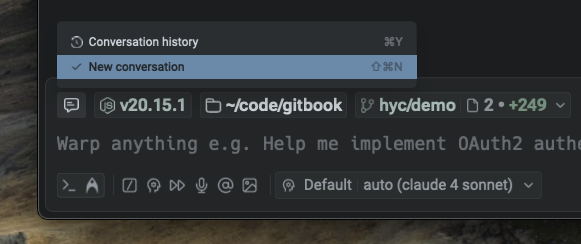

These chips appear in both Agent Mode and Terminal Mode, helping you continue a previous conversation without starting from scratch. For more details, refer to [Agent Conversations](/agent-platform/local-agents/interacting-with-agents/).

#### Active directory chip

The active directory chip displays your current working directory and enables simple file navigation. Clicking on a folder moves you into that folder, while clicking on a file opens it in [Warp’s native code editor](/code/code-editor/). This makes it possible to move around your workspace seamlessly from within the input.

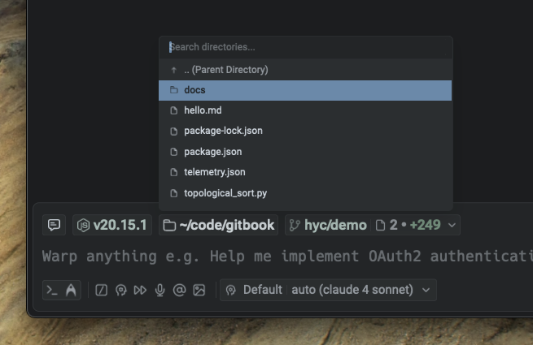

#### Git Status chip

When you're in a Git-tracked repository, the Git Status chip displays file- and line-level changes. You can switch branches by clicking on the branch name or review modified files in Warp's [native Code Review panel](/code/code-review/).

The chip updates automatically as files are added, removed, or changed, giving you a real-time view of your repository state.

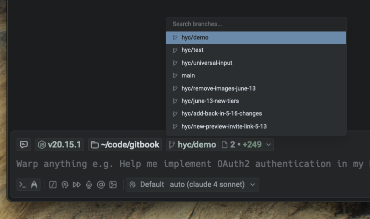

#### File attachments chips

The file attachments chip lets you attach images and other files directly to a prompt. You can upload up to five [images at a time (as Agent Context)](/agent-platform/local-agents/agent-context/images-as-context/) using the upload button in the toolbelt or by dragging and dropping files into the input. This makes it possible to add screenshots, diagrams, PDFs, or other references directly to your query, giving the Agent richer context.

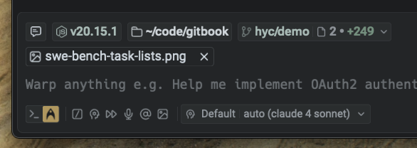

**Node version chip**

In repositories that include a `package.json`, a Node Version chip appears to show the detected Node.js version. This gives you visibility into your runtime environment without needing to run additional commands.

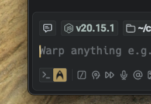

:::note
At this time, contextual chips are not configurable, but they update automatically based on your workspace and repository state.
:::

---

## Input toolbelt

The **Input Toolbelt** provides quick-access controls alongside the Universal Input. These tools allow you to attach context, run shortcuts, and configure Agent behavior without leaving the input field. Depending on the mode you are in, some features are automatically enabled or will place you into Agent Mode.

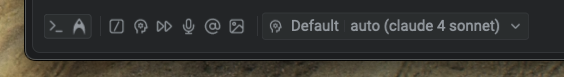

#### @ - Context

The [@ context chip](/agent-platform/local-agents/agent-context/using-to-add-context/) is available when you are working in a Git repository. Outside of a Git repo, it appears dimmed.

This feature allows you to attach specific files, folders, code symbols, Warp Drive objects, or blocks from other sessions as context for a prompt. Typing **@** inside the input also opens a context menu where you can search for and select files or directories to include.

Attaching context with @ works in both Agent Mode (when interacting with Agents) and classic Terminal commands (for referencing file paths).

**Slash Commands**

[Slash Commands](/agent-platform/capabilities/slash-commands/) are available in Agent Mode and Auto-detection Modes. They allow you to quickly run built-in actions or saved prompts without leaving the input field. Typing / displays a menu of available commands, which can be customized or extended.

**Voice Input**

[Voice Input](/agent-platform/local-agents/interacting-with-agents/voice/) automatically places you in Agent Mode. Speaking directly into Warp lets you phrase tasks, commands, or queries in natural language, and Warp will interpret them as if you had typed them. This feature is especially useful when you want hands-free interaction or when dictating longer tasks.

**Image Attachments**

You can [attach images as context](/agent-platform/local-agents/agent-context/images-as-context/) directly to a prompt, which will automatically place you in Agent Mode. This is useful when you want the Agent to reference visual materials such as screenshots, diagrams, or other assets.

You can add images using the image upload button in the toolbelt (located at the bottom left or right, depending on your input layout). For additional methods of attaching images, see [Images as Context](/agent-platform/local-agents/agent-context/images-as-context/).

**Fast Forward**

Fast Forward gives the Agent full autonomy for the remainder of a task or conversation. When enabled, the next prompt you enter allows the Agent to execute commands, read files, and apply code diffs without asking for confirmation each time. This is useful for complex workflows where step-by-step approval would slow things down.

#### Profile Picker

The Profile Picker allows you to select from different [Agent Profiles](/agent-platform/capabilities/agent-profiles-permissions/), each with its own configuration of autonomy, tools, and default model. If you have only one profile, the picker will not appear in the UI.

From the Profile Picker, you can view all available profiles, switch between them, and quickly see the default model attached to each one. Profiles make it possible to tailor Agent behavior for different types of tasks or projects.

### Model Picker

The Model Picker is tied to your current Agent Profile. Each profile has a default model, but you can override it at any time using the picker. Warp curates a selection of top large language models (LLMs) for you to choose from, balancing speed, quality, and reasoning ability depending on your needs.

For a full list of supported models and guidance on when to use them, see [Model Choice](/agent-platform/capabilities/model-choice/).
