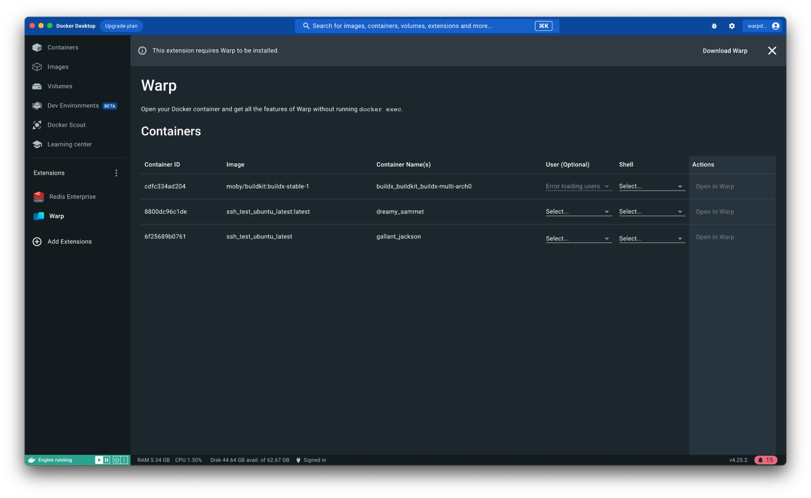
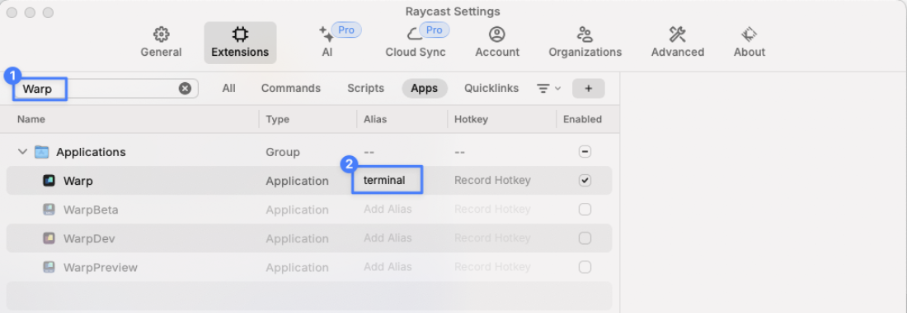

import DemoVideo from '@components/DemoVideo.astro';
import { Tabs, TabItem } from '@astrojs/starlight/components';
import VideoEmbed from '@components/VideoEmbed.astro';

## Docker

:::note
Currently, the Docker extension is only available on macOS.
:::

[Warp’s Docker extension](https://hub.docker.com/extensions/warpdotdev/warp) makes it more convenient to open Docker containers in Warp. With the extension, you can click to open any Docker container in a [Warpified subshell](/terminal/warpify/subshells/), without manually running `docker exec` or typing out lengthy container IDs.

Select a container from the list and specify a shell type. Note, that only `bash|zsh|fish` are supported shells for docker containers. Then, select a user (optional) and finally click “Open in Warp” to run commands within the Docker container.

## Raycast

:::note
Currently, the Raycast extension is only available on macOS.
:::

Warp + Raycast extension helps you open new windows, tabs, or Launch Configurations with [ease](https://twitter.com/warpdotdev/status/1678432353461637121).

<VideoEmbed url="https://www.raycast.com/warpdotdev/warp" title="Warp + Raycast Extension Link" />

:::note
**Terminal Tip**\
Within `Raycast Settings > Extensions > Apps` search for Warp and assign the alias "terminal" so that it will show up on a search.
:::

## VSCode

<Tabs>
  <TabItem label="macOS">
    Press `SHIFT-CMD-C` while in [VSCode](https://code.visualstudio.com/docs/terminal/basics) to open a new session in Warp.

    <DemoVideo src="/assets/terminal/vscode_new_session.mp4" label="VSCode New Session Shortcut" />

    To configure this, navigate to Settings in VSCode and search for `Terminal › External: Osx Exec`.\
    \
    Change this to `Warp.app` if you've installed Warp in the default location. Otherwise, put in the full path to the executable.
  </TabItem>
  <TabItem label="Windows">
    Press `CTRL-SHIFT-C` while in [VSCode](https://code.visualstudio.com/docs/terminal/basics) to open a new session in Warp.

    To configure this, navigate to Settings in VSCode and search for `Terminal › External: Windows Exec`.\
    \
    Change this to `%LOCALAPPDATA%\Programs\Warp\warp.exe` if you've installed Warp in the default location for a single user or `%PROGRAMFILES%\Warp\warp.exe` if you've installed Warp in the default location for all users. Otherwise, put in the full path to the executable.
  </TabItem>
  <TabItem label="Linux">
    Press `CTRL-SHIFT-C` while in [VSCode](https://code.visualstudio.com/docs/terminal/basics) to open a new session in Warp.

    To configure this, navigate to Settings in VSCode and search for `Terminal › External: Linux Exec`.\
    \
    Change this to `warp-terminal` if you've installed Warp with your distribution's package manager. Otherwise, put in the full path to the executable (e.g. if it is an AppImage).
  </TabItem>
</Tabs>

## JetBrains IDEs

:::note
Currently, the JetBrains IDE configuration is only available on macOS.
:::

Press a keyboard shortcut of choice while in a JetBrains IDE to open a new session in Warp.

To configure this, use the Apple Menu. Click on **Preferences**, go to `External Tools` , and click **Add**. In this menu, put the following information:

* _Name_: Open Warp
* _Program_: `/Applications/Warp.app`
* _Arguments_: `$ProjectFileDir$`
* _Working Directory_: `/Applications`

Then press `Ok`. Now you will be able to `Open Warp` from the Apple Menu under `Tools` -> `External Tools`.

<DemoVideo src="/assets/terminal/jetbrains_external_terminal_config.mp4" label="JetBrains New Session Shortcut" />

To attach this configuration to a keyboard shortcut, you must go to the Apple Menu -> `Preferences`. Then go to `Keymap` -> `External Tools`. You will find `Open Warp`. Right-click on it, and select **Add Keyboard Shortcut**. Type your desired shortcut and click save! You're ready to open Warp with a keyboard shortcut.

<DemoVideo src="/assets/terminal/jetbrains_external_window_keymap_config.mp4" label="JetBrains Configure Keyboard Shortcut" />
