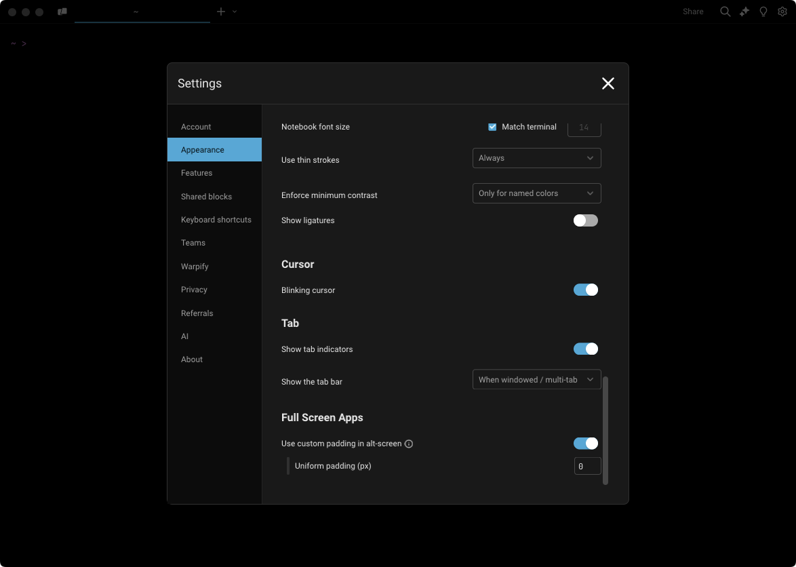

import VideoEmbed from '@components/VideoEmbed.astro';

## Mouse and scroll reporting

Warp supports configuring how to handle mouse and scroll events. They can be sent to the currently running app, e.g. `vim`, or kept and handled by Warp.

:::note
Mouse reporting must be enabled to also toggle scroll reporting.
:::

Once mouse reporting is enabled, Warp will use ANSI escape sequences to communicate mouse events to the running app.

:::note
If you want a mouse event to go to Warp instead (for example, for text selection) without disabling mouse reporting, you can hold the `SHIFT` key.
:::

### How to access it

* From the Settings panel, **Settings** > **Features** > **Terminal** > **Enable Mouse Reporting**
  * Scroll Reporting can be enabled after toggling **Enable Mouse Reporting**
* From the [Command Palette](/terminal/command-palette/), search for "Toggle Mouse Reporting"
* From the macOS Menu, **View** > **Toggle Mouse Reporting**

### How it works

<VideoEmbed url="https://www.loom.com/share/a918696b002148d3beafd545b233c1be?hideEmbedTopBar=true&hide_owner=true&hide_share=true&hide_title=true" title="Mouse and Scroll Reporting Demo" />

## Padding

Warp supports configuring how much padding surrounds full-screen apps. The default is 0 pixel padding, but this can be changed to a custom padding amount or to match the padding in the Blocklist.

:::note
Warp allows you to scale your terminal by fractions of a cell width | height. When your terminal size is not perfectly aligned to a cell width | height, the extra space appears as padding on the right | bottom.
:::

### How to access it

* Go to **Settings** > **Appearance** > **Full-screen Apps** or from the [Command Palette](/terminal/command-palette/) search for "Appearance"
  * `Use custom padding in alt-screen` is enabled by default, you can disable it to match the Blocklist padding
    * Set the desired uniform padding (px) pixels, which is set to 0px by default

:::caution
Some full-screen applications don't behave well when resizing. If you are experiencing rendering issues with full screen apps, try turning this setting off. This will ensure that full-screen apps don't need to resize when starting up.
:::

