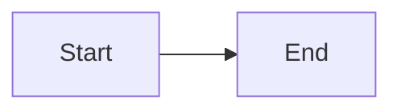
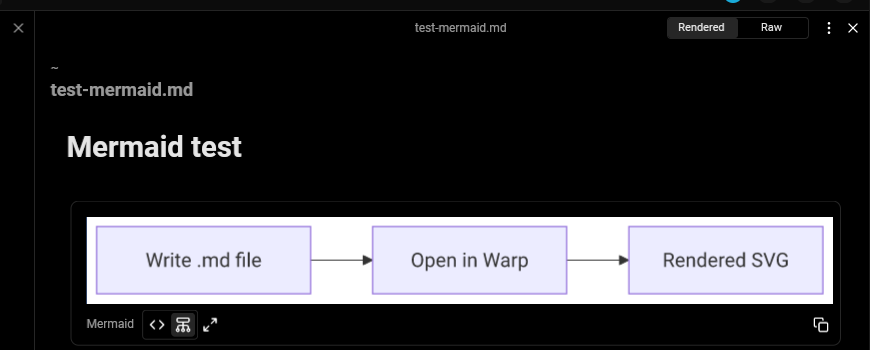

import DemoVideo from '@components/DemoVideo.astro';
import { Tabs, TabItem } from '@astrojs/starlight/components';

Warp can be used for both editing and viewing rendered Markdown files in a [split pane](/terminal/windows/split-panes/). Any local file with the `.md` or `.markdown` extension is treated as a Markdown file. Remote files are currently not supported. Turning on **Settings** > **Features** > **General** > **Open Markdown files in Warp's Markdown viewer by default** will make the Markdown viewer default, otherwise Markdown files will open in Warp's editor.

### Opening a file link within a block

<Tabs>
  <TabItem label="macOS">
    For any link to a Markdown file within a block, you can open the file in Warp by `⌘`-clicking on the link, from the link tooltip, or the right-click context menu on the link.
  </TabItem>
  <TabItem label="Windows">
    For any link to a Markdown file within a block, you can open the file in Warp by `Ctrl`-clicking on the link, from the link tooltip, or the right-click context menu on the link.
  </TabItem>
  <TabItem label="Linux">
    For any link to a Markdown file within a block, you can open the file in Warp by `Ctrl`-clicking on the link, from the link tooltip, or the right-click context menu on the link.
  </TabItem>
</Tabs>

<figure>

<figcaption>Opening a Markdown file via link tooltip.</figcaption>
</figure>

### Markdown-viewing commands

If you run a Markdown-viewing command like `cat myfile.md`, Warp will show a banner with a button to open the Markdown file.

The following commands are considered Markdown viewers:

* `cat`
* `glow`
* `less`

### Opening a Markdown file from Finder

From Finder, you can open a Markdown file in Warp from the “Open With” menu that appears when right-clicking on the file.

### Toggling between editor and viewer

You can toggle between the Markdown editor and viewer via the pane overflow menu.

<figure>

<figcaption>Toggling between editor and viewer.</figcaption>
</figure>

## Shell commands in Markdown files

Warp can run shell commands from Markdown code blocks in your active terminal session. Click the run icon `>_` to insert a command into the terminal input.

:::note
The shell command must be in a code block with three backticks ` ``` ` and not inline code for Warp to treat the code like a runnable command.
:::

Markdown shell blocks also support keyboard navigation. There are two ways to enter the keyboard navigation mode:

<Tabs>
  <TabItem label="macOS">
    * Clicking on a shell block.
    * Pressing `⌘+↑` or `⌘+↓`.

    Once a shell block is selected, press `⌘+Enter` to insert it into the terminal input. You can also use `↑`, `↓`, `⌘+↑`, and `⌘+↓` to navigate between shell blocks. While the Markdown file is focused, press `⌘+L` to switch focus back to the terminal without inserting a command.
  </TabItem>
  <TabItem label="Windows">
    * Clicking on a shell block.
    * Pressing `Ctrl+↑` or `Ctrl+↓`.

    Once a shell block is selected, press `Ctrl+Enter` to insert it into the terminal input. You can also use `↑`, `↓`, `Ctrl+↑`, and `Ctrl+↓` to navigate between shell blocks. While the Markdown file is focused, press `Ctrl+Shift+L` to switch focus back to the terminal without inserting a command.
  </TabItem>
  <TabItem label="Linux">
    * Clicking on a shell block.
    * Pressing `Ctrl+↑` or `Ctrl+↓`.

    Once a shell block is selected, press `Ctrl+Enter` to insert it into the terminal input. You can also use `↑`, `↓`, `Ctrl+↑`, and `Ctrl+↓` to navigate between shell blocks. While the Markdown file is focused, press `Ctrl+Shift+L` to switch focus back to the terminal without inserting a command.
  </TabItem>
</Tabs>

If the command contains any arguments using the curly brace `{{param}}` syntax, they will be treated as Workflow arguments. Learn more about [Workflows](/knowledge-and-collaboration/warp-drive/workflows/).

<DemoVideo src="/assets/terminal/run-markdown-file-command.mp4" label="Demo of running two commands from a Markdown file in Warp" />

In addition, all shell and code blocks have a copy button to quickly copy the block's text to the clipboard.

Code blocks without a set language, or one of the following languages, are treated as shell commands: `sh`, `shell`, `bash`, `fish`, `zsh`, `warp-runnable-command`.

## Mermaid diagrams

Warp renders [Mermaid](https://mermaid.js.org/) diagrams in the markdown viewer. Add a fenced code block with the `mermaid` language tag and Warp converts it to a rendered SVG diagram automatically.

````

````

<figure>

<figcaption>A Mermaid diagram rendered in the Markdown Viewer.</figcaption>
</figure>

### Switching between raw and rendered

Each Mermaid block includes a **Raw** and **Rendered** toggle. Use it to switch between the rendered diagram and the original Mermaid source without leaving the viewer.
