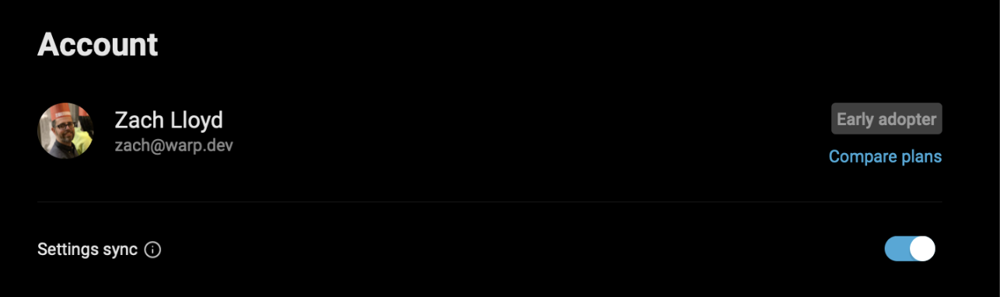
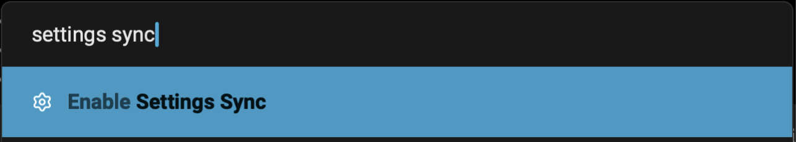
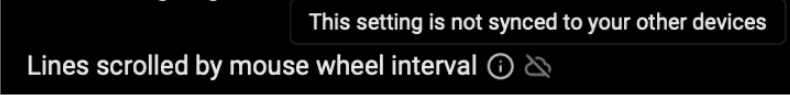

## How to toggle settings sync

* You can toggle Settings Sync within the **Settings** > **Account** pane
* Through the [Command Palette](/terminal/command-palette/) by searching for “Settings Sync”

## How settings sync works

**Settings Sync** works by syncing the state of most of your Warp settings to our cloud servers.

When you log in to Warp on another device or through the browser with [Session Sharing](/knowledge-and-collaboration/session-sharing/), if you have Settings Sync enabled, most of your settings will be the same as they were when you were logged in before.

That means your themes, most features, privacy settings, AI settings, **are all the same everywhere you use Warp**, saving you the time from having to set them up again.

When you first enable Settings Sync, the settings from the computer you enabled it on becomes the default settings for all devices. This is true if you toggle Settings Sync off and on as well - the synced settings are always from **the last device you enabled Settings Sync on**, so toggling effectively causes all of your devices to have settings from the current logged in instance.

:::note
Read more about privacy for cloud features in the [privacy overview](https://www.warp.dev/privacy/overview).
:::

### Non-synced settings

Not all settings are synced, however. Notably, Warp does not sync:

* Custom keybindings (we may in the future). Although, you can set [custom keybinds with a file](/getting-started/keyboard-shortcuts/#custom-keyboard-shortcuts)
* Custom themes (we may in the future)
* Device specific settings (e.g. what editor you prefer using, startup shell)
* Platform-specific settings are synced across devices on the same platform (e.g. your settings for how to interact with the Linux clipboard are synced across all Linux devices, but not on macOS, Windows, or Web).

You can tell when a setting is not synced because it will have a special cloud strikethrough icon in the settings panel.

