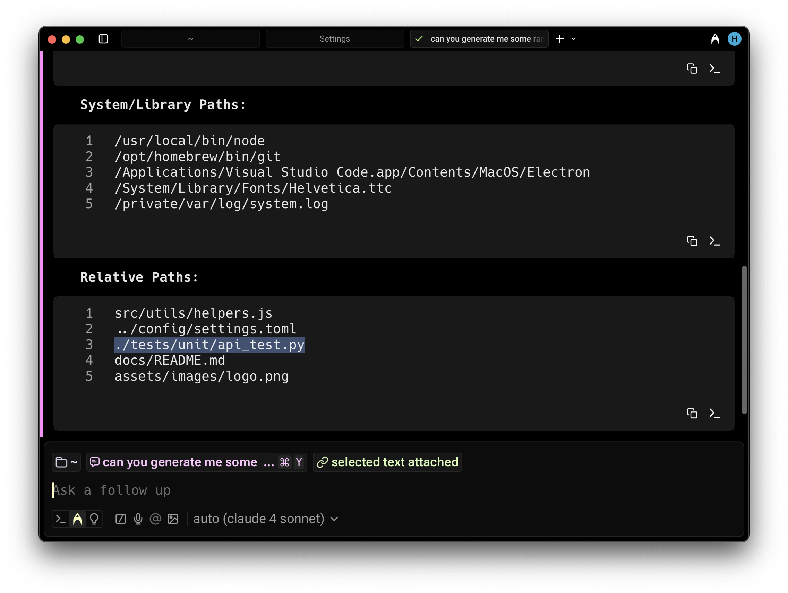
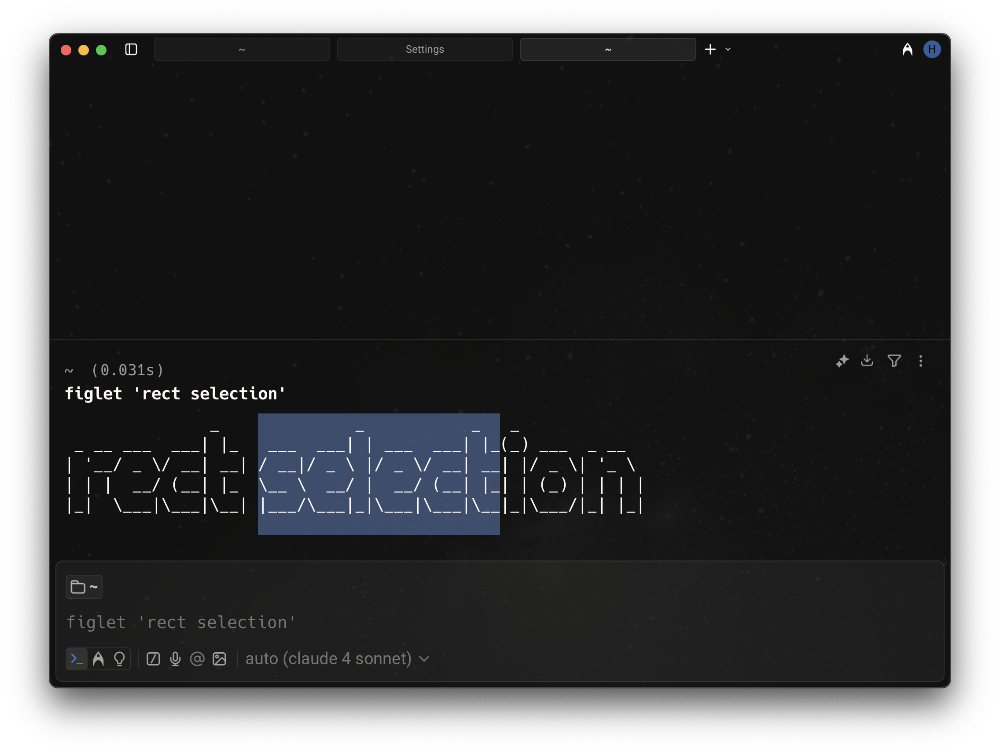

## Smart selection

**Smart selection** goes beyond the typical double-click selection, which only highlights a single word. Instead, it uses semantic rules to treat common patterns (like URLs or file paths) as one unit, even when separated by punctuation or whitespace.

Double-click on text in the input or blocklist. The following patterns are recognized:

1. URLs
2. File paths
3. Email addresses
4. IP addresses
5. Floating point numbers, including scientific notation.

You can toggle smart selection on the **Settings** > **Features** > **Terminal** > **Double-click smart selection**. If disabled, you can instead manually select specific punctuation characters to be included within word boundaries.

## Rectangular selection

**Rectangular selection** lets you highlight text in a clean vertical block (also called _column_ or _box_ selection). This is especially useful for copying command output, logs, or prefixed text without grabbing unwanted characters.

Hold the modifier keys while dragging your mouse:

* macOS: `CMD-OPT`
* Windows and Linux: `CTRL-ALT`
