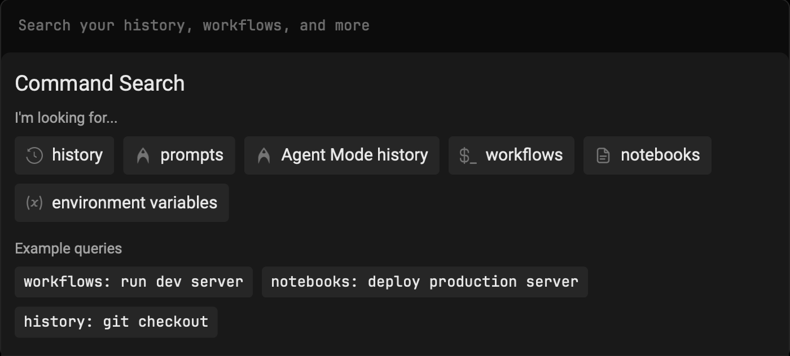

import VideoEmbed from '@components/VideoEmbed.astro';

The Command Search panel provides unified search across all your terminal inputs, saved commands, and [Agent Modality](https://docs.warp.dev/agent-platform/local-agents/interacting-with-agents/agent-modality) conversation history. Use it to quickly find and reuse commands, workflows, or past agent interactions.

:::note
Tailor your Command Search experience by toggling off "Show Global Workflows" in **Settings** > **Features**. When disabled, your search will exclusively encompass YAML and Warp Drive Workflows.
:::

## Quick Start

1. Press `CTRL-R` to open the Command Search Panel
2. Type your search query in the input box
3. Press `ENTER` to input the selected command into Warp's Input Editor

## Search Filters

You can filter your search results by prepending your search term with any of the following:

* **Command History** — `history:`, `h:`, or `H-TAB`
* **Prompts** — `prompts:`, `p:`, or `P-TAB`
* **[Agent Mode](https://docs.warp.dev/agent-platform/local-agents/interacting-with-agents) History** — `ai_history:`, `a:`, or `A-TAB`

:::note
When a filter is activated, it will be bolded and italicized in the search panel.
:::

## Additional Features

* You can expand the menu horizontally by dragging the right edge
* The panel supports fuzzy search and ranks results by relevance

## How it works

<VideoEmbed url="https://www.loom.com/share/21a6f58a33754ee7913edbff6d33d8d1?hideEmbedTopBar=true&hide_owner=true&hide_share=true&hide_title=true" title="Command Search Demo" />
