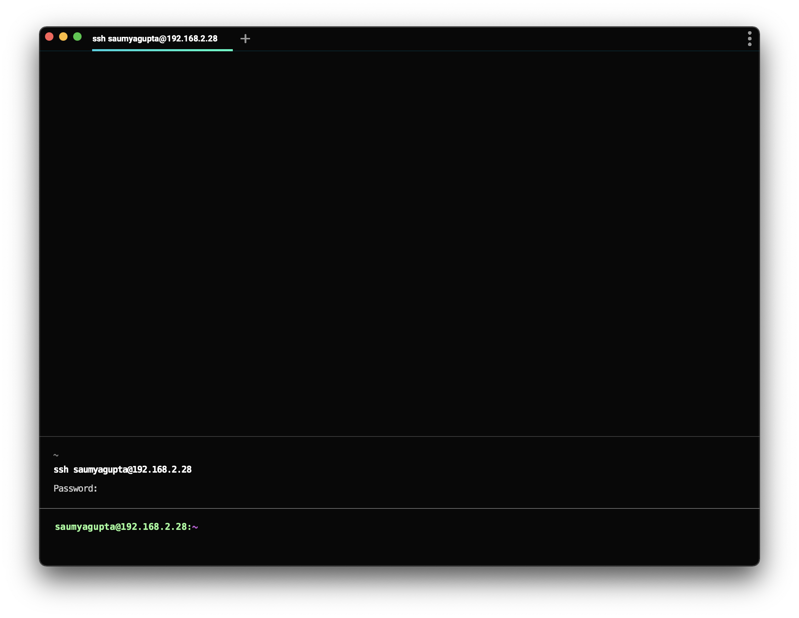

import DemoVideo from '@components/DemoVideo.astro';

:::note
If you are looking to troubleshoot the tmux SSH feature, see the [SSH](/terminal/warpify/ssh/).
:::

When you SSH into a remote box, you get all the features of Warp without any configuration on your part. The input editor, auto-completions, and history search work the same, regardless of machine.

:::caution
[Limitations of SSH](https://github.com/warpdotdev/Warp/issues/578) (as of May 2024):

* The SSH Wrapper only supports `bash` or `zsh` shells in remote sessions.
* If you're using a different shell, you'll want to use `command ssh` directly (see below for more details).
* For zsh, xxd is required to bootstrap warp.
* For Windows, [Cygwin](https://www.cygwin.com/) is required to bootstrap the SSH Wrapper.
* RemoteCommand causes the ssh wrapper to fail.
* [Tmux is not currently supported.](https://github.com/warpdotdev/Warp/discussions/501)
:::

:::note
If you're using zsh on the remote host, Warp creates a temp folder to act as the ZDOTDIR during the bootstrapping process and removes it when the shell is set up.
:::

## Implementation

We create a wrapper (around `/usr/bin/ssh`) to set up the shell for Warp's feature set. We authenticate normally using `/usr/bin/ssh`, and bootstrap the remote shell to work with Warp Blocks and the Input Editor. You can opt out of this functionality by invoking `command ssh` directly.

* Warp takes over the prompt which enables us to build a modern input editor.
* Warp configures histcontrol to ignore commands with leading spaces. We do this so our bootstrapping code does not clutter the history.

You can see the SSH wrapper by using `which warp_ssh_helper` in zsh, `type warp_ssh_helper` in bash.

_Note:_ The ssh wrapper is only _initialized_ on your local machine. We don’t currently support bootstrapping nested ssh sessions.

:::note
Warp [Completions](/terminal/command-completions/completions/) for ssh show entries in `~/.ssh/config` and `~/.ssh/known_hosts`
:::

## Troubleshooting SSH

### channel 2: open failed: connect failed: open failed

If you're seeing these errors, you may have some config on your server (usually in `/etc/ssh/sshd_config`) preventing Warp's ControlMaster connection from working. In this state, completions that require information from your remote host won't work and your history also won't work.

You should ensure that `MaxSessions` is either commented out or is at least `2`.

Write access in `/etc/ssh/` typically requires sudo access. After any edits, you'd also need to restart the `sshd` daemon.

### SSH Wrapper fails

There are several [known issues with SSH Wrapper](https://github.com/warpdotdev/Warp/issues?q=is%3Aissue+is%3Aopen+sort%3Acreated-desc+label%3ABugs+label%3ASSH). As a workaround to the SSH Wrapper, you can add `command ssh` to your **Settings** > **Warpify** > **Subshells** > **Added commands**, then run `command ssh <user@server>` to connect to a remote session, this will attempt to enable Warp features as a [subshell](/terminal/warpify/subshells/).

:::note
If the subshell workaround helps, we recommend you disable the SSH Wrapper in **Settings** > **Features** > **Session**. You'll need to start a new session before a change is reflected or try invoking the SSH binary directly with `command ssh`.
:::

<DemoVideo src="/assets/terminal/subshell-ssh-demo.mp4" label="Command SSH subshell workaround" />
