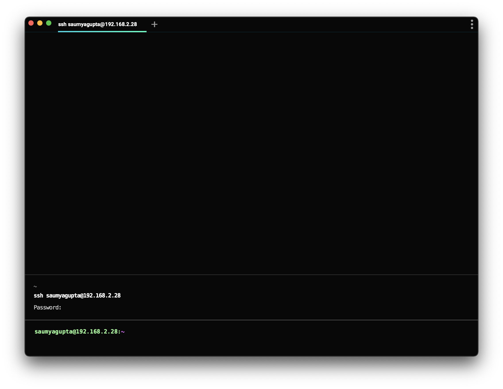

import DemoVideo from '@components/DemoVideo.astro';

:::note
This page covers the legacy SSH wrapper, a fallback path. For the current, fully-featured way to use Warp over SSH, see the [SSH extension](/terminal/warpify/ssh/).
:::

The legacy SSH wrapper brings a subset of Warp's features, such as Blocks, the input editor, and command completions, to a remote session without installing anything on the remote host. Warp falls back to it when [SSH extension install mode](/terminal/settings/all-settings/#ssh) is set to **Never install**, or when a host doesn't meet the SSH extension's [requirements](/terminal/warpify/ssh/#requirements).

:::caution
Limitations of the legacy SSH wrapper:

* It only supports `bash` or `zsh` shells in remote sessions. If you're using a different shell, use `command ssh` directly (see below for more details).
* For zsh, `xxd` is required to bootstrap Warp.
* For Windows, [Cygwin](https://www.cygwin.com/) is required to bootstrap the SSH wrapper.
* `RemoteCommand` in your SSH config causes the SSH wrapper to fail.
:::

:::note
If you're using zsh on the remote host, Warp creates a temp folder to act as the ZDOTDIR during the bootstrapping process and removes it when the shell is set up.
:::

## Implementation

We create a wrapper (around `/usr/bin/ssh`) to set up the shell for Warp's feature set. We authenticate normally using `/usr/bin/ssh`, and bootstrap the remote shell to work with Warp Blocks and the Input Editor. You can opt out of this functionality by invoking `command ssh` directly.

* Warp takes over the prompt which enables us to build a modern input editor.
* Warp configures histcontrol to ignore commands with leading spaces. We do this so our bootstrapping code does not clutter the history.

You can see the SSH wrapper by using `which warp_ssh_helper` in zsh, `type warp_ssh_helper` in bash.

_Note:_ The SSH wrapper is only _initialized_ on your local machine. We don’t currently support bootstrapping nested ssh sessions.

:::note
Warp [Completions](/terminal/command-completions/completions/) for ssh show entries in `~/.ssh/config` and `~/.ssh/known_hosts`
:::

## Troubleshooting SSH

### channel 2: open failed: connect failed: open failed

If you're seeing these errors, you may have some config on your server (usually in `/etc/ssh/sshd_config`) preventing Warp's ControlMaster connection from working. In this state, completions that require information from your remote host won't work and your history also won't work.

You should ensure that `MaxSessions` is either commented out or is at least `2`.

Write access in `/etc/ssh/` typically requires sudo access. After any edits, you'd also need to restart the `sshd` daemon.

### SSH wrapper fails

There are several [known issues with the SSH wrapper](https://github.com/warpdotdev/Warp/issues?q=is%3Aissue+is%3Aopen+sort%3Acreated-desc+label%3ABugs+label%3ASSH). As a workaround, add `command ssh` to **Settings** > **Warpify** > **Subshells** > **Added commands**, then run `command ssh <user@server>` to connect. Warp then tries to enable features as a [subshell](/terminal/warpify/subshells/) instead of through the SSH wrapper.

<DemoVideo src="/assets/terminal/subshell-ssh-demo.mp4" label="Command SSH subshell workaround" />
