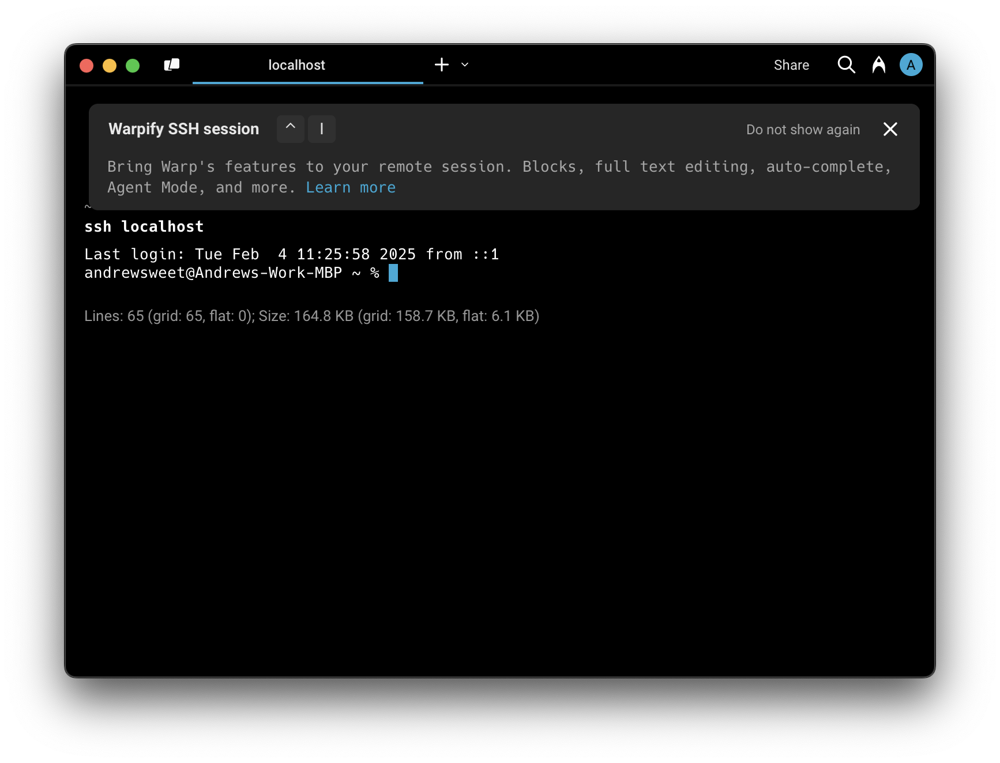
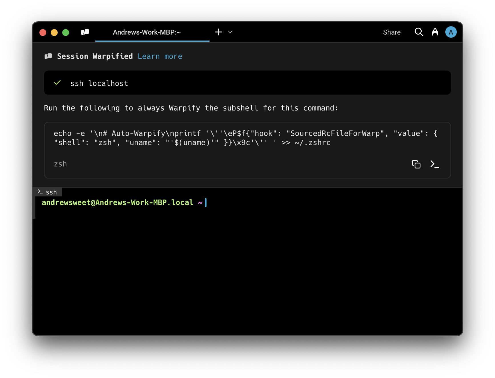

import VideoEmbed from '@components/VideoEmbed.astro';

Warp's **SSH extension** brings the local Warp experience to remote macOS and Linux hosts. After you opt in on first connect, you get a real file tree backed by the remote filesystem, more reliable completions over a single multiplexed SSH connection, and a coding agent that applies edits with Warp's native diff tool instead of falling back to `sed`.

<VideoEmbed url="https://www.loom.com/share/466d88a1968842c68f66a3b66b94f146" title="SSH extension demo" />

## What you get over SSH

Once the SSH extension is installed on a remote host, the following features work the same way they do locally:

* **File tree (Project Explorer)** - The left panel reflects the remote project's structure and updates as you `cd` between directories or change files. See [File Tree](/code/code-editor/file-tree/).
* **Reliable completions and autosuggestions** - Generators run in parallel over a single multiplexed connection instead of opening a new SSH session per command, so completions stop hitting the remote host's `MaxSessions` ceiling and stop occasionally injecting errors into your blocks.
* **Native file reads and code diffs** - The Agent reads files and applies edits through Warp's built-in diff tool. Code changes show up as inline diffs you can review and approve, instead of being applied via `sed` or other shell commands. See [Code diffs](/agent-platform/local-agents/code-diffs/).
* **All core terminal features** - The input editor, blocks, command history, autosuggestions, and history search behave the same as in a local session.

For a full breakdown of what works over SSH and what doesn't, see [Feature support over SSH](/code/ssh-feature-support/).

## Installing the SSH extension

On the first SSH connection to a host that doesn't already have the SSH extension installed, Warp shows an in-block prompt with two options:

* **Install Warp's SSH extension** - Recommended. Warp downloads the matching `oz` binary for the remote OS and architecture, installs it under `~/.warp/remote-server` (or `~/.warp-preview/remote-server` on Preview builds), launches it, and completes the handshake. Subsequent connections to the same host skip the prompt and reuse the installed binary.
* **Continue without installing** - Falls back to the existing tmux-powered Warpification path. You still get the input editor, blocks, completions, and history, but the new file tree and native code-diff support are unavailable for this session.

Warp never installs anything on a remote host without your explicit consent, and the install only writes under `~/.warp*/`.

:::note
The extension binary tracks your client's release channel. Stable Warp installs `~/.warp/remote-server`, Preview installs `~/.warp-preview/remote-server`, and Dev installs `~/.warp-dev/remote-server`, so multiple channels can coexist on the same remote host.
:::

### Managing the install prompt

In the Warp app, go to **Settings** > **Warpify** to control how the prompt behaves:

* **Always ask** (default) - Show the install prompt the first time you connect to each host.
* **Always install** - Skip the prompt and install the extension automatically when it's missing.
* **Never install** - Skip the prompt and always fall back to the tmux-powered path.

The same setting can also be changed inline from the install prompt by selecting **Don't ask me this again** before clicking either button. The underlying TOML key is `warpify.ssh.ssh_extension_install_mode` - see [All settings reference](/terminal/settings/all-settings/#ssh) for the full list of SSH-related settings, including `ssh_hosts_denylist` for hosts you never want to engage Warpification on.

## Fallback: tmux-powered Warpification

If you decline the SSH extension or connect from a build that doesn't ship it (for example, Windows clients), Warp falls back to a tmux-based wrapper that still gives you Blocks, completions, the input editor, and history search.

### FAQs

#### Will Warpifying a remote SSH session make changes to the remote machine?

Only with your explicit permission. The SSH extension installs the `oz` binary under `~/.warp*/remote-server` and the tmux fallback installs [`tmux`](#why-do-i-need-tmux-on-the-remote-machine) (a popular open source terminal multiplexer) if it isn't already present. Both flows show you exactly what they're going to run, and you can always decline and continue using SSH without these features.

#### Why do I need `tmux` on the remote machine?

`tmux` is only required by the fallback path. It's used to asynchronously run commands on the remote machine without disrupting your interactive session. [tmux](https://github.com/tmux/tmux/wiki) is a popular open source terminal multiplexer that lets you run multiple sessions within one SSH connection. It requires minimal permissions and is widely adopted (⭐ 35k+ on GitHub). The fallback uses [tmux Control Mode](https://github.com/tmux/tmux/wiki/Control-Mode) to run ad-hoc background tasks like autocompleting a `cd` command or populating the contents of a custom prompt. The SSH extension supersedes this by speaking a length-delimited protocol over a single SSH connection.

#### Can I SSH to remote machines that I don't want to Warpify?

Yes. Cancel the prompt to continue without Warp features, or add the host to the denylist (**Settings** > **Warpify** > **SSH hosts denylist**) so you're never prompted again.

#### Do I have to manually Warpify every time?

After you successfully Warpify an SSH connection manually, Warp provides a brief script you can run to append a marker at the end of your shell's rcfile. This lets Warp know when your remote shell is ready to be Warpified. Place the snippet at the bottom of your rcfile for the best results.

#### What shells and operating systems are supported?

Warp supports macOS and most flavors of Linux as remote hosts on both the SSH extension and the tmux fallback. Supported shells are `bash` and `zsh`. Windows remote hosts are not yet supported.

#### What if Warp fails to detect my SSH session?

If you're in a remote SSH session and Warp didn't detect it, you can manually Warpify by opening the [Command Palette](/terminal/command-palette/) and searching for "Warpify SSH Session".

#### What triggers SSH session detection for Warpification?

With SSH session detection enabled, Warp watches for `ssh` commands whose arguments suggest an interactive session. If you've aliased `ssh` or are running it as part of a script, Warp won't perform SSH session detection.

Once Warp is confident you've successfully authenticated (by detecting `Last login:` or something resembling a basic prompt), it prompts you to Warpify the active SSH session.

If SSH session detection doesn't pick up your session, you can still [Warpify manually](#what-if-warp-fails-to-detect-my-ssh-session).
