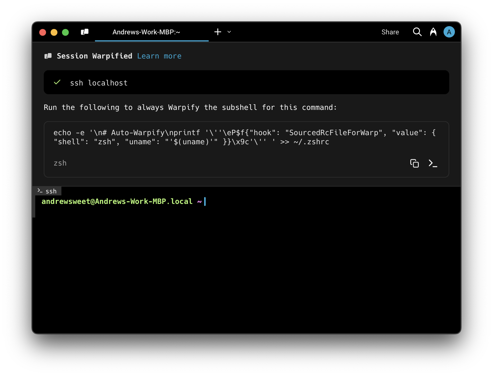

import VideoEmbed from '@components/VideoEmbed.astro';

Warp's **SSH extension** brings the local Warp experience to remote macOS and Linux hosts. After you opt in on first connect, you get a real file tree backed by the remote filesystem, Warp's code editor and code review on remote files, codebase indexing for the remote repo, and a coding agent that applies edits with Warp's native diff tool instead of falling back to `sed`.

<VideoEmbed url="https://www.loom.com/share/466d88a1968842c68f66a3b66b94f146" title="SSH extension demo" />

## How it works

When you connect to a remote host and accept the install prompt, Warp installs a small companion server in your home directory on the remote machine. The server runs in the background as your user and communicates with Warp over your existing SSH connection. It doesn't open any network ports, doesn't require root, and doesn't change anything outside your home directory.

The server does the heavy lifting directly on the remote machine: it reads and writes files, watches your repository for changes, runs git commands, and indexes your codebase. Only lightweight, incremental updates stream back to Warp — an edit, a diff, a status change — instead of full file contents round-tripped through shell commands. This keeps the connection fast while features like the file tree, code review, and the Agent's file tools behave the same as they do locally.

A few properties worth knowing:

* **One server, many sessions** - Multiple SSH sessions and Warp windows connected to the same host share a single server process.
* **Automatic updates** - The extension version tracks your Warp version. When you connect to a host with an outdated extension, Warp automatically installs the matching version.
* **Easy to remove** - Uninstall by deleting the `~/.warp*/remote-server` directory on the remote host.

## What you get over SSH

Once the SSH extension is installed on a remote host, most of Warp's coding features work the same way they do locally. See [Feature support over SSH](/code/ssh-feature-support/) for the full breakdown of what's included and what isn't. Headline features include a real file tree backed by the remote filesystem, Warp's code editor and code review on remote files, codebase indexing for the remote repo, and native code diffs applied through Warp's built-in diff tool instead of `sed`. Core terminal features like the input editor, blocks, and completions also work the same as they do locally.

## Requirements

The SSH extension has the following requirements on the remote host:

* **Operating system** - Linux or macOS. Windows remote hosts are not supported. The extension is also not available from Warp's Windows client.
* **Architecture** - `x86_64` (amd64) or `aarch64` (arm64).
* **glibc 2.31 or newer (Linux)** - The prebuilt server binary requires glibc 2.31+ (Ubuntu 20.04 or equivalent). Hosts with an older glibc (for example RHEL/CentOS 7 and 8, Amazon Linux 2, Ubuntu 18.04, Debian 10) or a non-glibc libc (for example Alpine's musl) are not supported. Warp detects this before installing anything and quietly falls back to a regular SSH session.
* **Shell** - `bash` or `zsh` as the remote shell.
* **Home directory and Unix sockets** - The install writes only under `~/.warp*/`, so your home directory must be writable. The server also needs to create Unix domain sockets under your home directory and run as a background process under your user.
* **Outbound HTTPS for install** - The install script downloads the server binary from `app.warp.dev` using `curl` or `wget`, so the host needs outbound HTTPS access to `app.warp.dev`. If neither `curl` nor `wget` is available, Warp uploads the binary over the SSH connection instead.
* **Outbound HTTPS for account-backed features** - Features that use your Warp account, such as codebase indexing and AI-generated commit messages, require the server on the remote host to reach Warp's servers over HTTPS. The server authenticates with credentials forwarded from your local Warp session over the SSH connection; you never log in on the remote host. Core features like the file tree, file reads and edits, and completions work without any outbound access from the host.

When a host doesn't meet these requirements, or when [SSH extension install mode](/terminal/settings/all-settings/#ssh) is set to **Never install**, Warp falls back to the [legacy SSH wrapper](/terminal/warpify/ssh-legacy/).

:::note
We are actively working on extending support to older glibc versions and more operating systems.
:::

## Installing the SSH extension

On the first SSH connection to a host that doesn't already have the SSH extension installed, Warp shows an in-block prompt with two options:

* **Install Warp's SSH extension** - Recommended. Warp downloads the matching remote server extension for the remote OS and architecture, installs it under `~/.warp/remote-server` (or `~/.warp-preview/remote-server` on Preview builds), launches it, and completes the handshake. Subsequent connections to the same host skip the prompt and reuse the installed binary.
* **Continue without installing** - Skip installing the extension for this connection. The session continues without the SSH extension, so file tree, native file reads, and native code diffs are unavailable until you install. You can reconnect and install at any time.

Warp never installs anything on a remote host without your explicit consent, and the install only writes under `~/.warp*/`.

:::note
The extension binary tracks your client's release channel. Stable Warp installs the extension under `~/.warp/remote-server`, and Preview installs it under `~/.warp-preview/remote-server`, so both channels can coexist on the same remote host.
:::

### Managing the install prompt

In the Warp app, go to **Settings** > **Warpify** to control how the prompt behaves:

* **Always ask** (default) - Show the install prompt the first time you connect to each host.
* **Always install** - Skip the prompt and install the extension automatically when it's missing.
* **Never install** - Skip the prompt and connect to the host without installing the SSH extension.

The same setting can also be changed inline from the install prompt by selecting **Don't ask me this again** before clicking either button. The underlying TOML key is `warpify.ssh.ssh_extension_install_mode` - see [All settings reference](/terminal/settings/all-settings/#ssh) for the full list of SSH-related settings, including `ssh_hosts_denylist` for hosts you never want to engage Warpification on.

## Legacy: tmux-based Warpification

Tmux-based Warpification was an older approach to enabling Warp features in SSH sessions that used [`tmux`](https://github.com/tmux/tmux/wiki) to multiplex commands over your SSH connection. It has been removed in favor of the SSH extension described on this page.

## FAQs

### Will Warpifying a remote SSH session make changes to the remote machine?

Only with your explicit permission. The SSH extension installs the remote server extension under `~/.warp*/remote-server`. Warp shows you exactly what it's going to run, and you can always decline and continue using SSH without these features.

### Can I SSH to remote machines that I don't want to Warpify?

Yes. Cancel the prompt to continue without Warp features, or add the host to the denylist (**Settings** > **Warpify** > **SSH hosts denylist**) so you're never prompted again.

### Do I have to manually Warpify every time?

After you successfully Warpify an SSH connection manually, Warp provides a brief script you can run to append a marker at the end of your shell's rcfile. This lets Warp know when your remote shell is ready to be Warpified. Place the snippet at the bottom of your rcfile for the best results.

### What shells and operating systems are supported?

Warp supports macOS and most flavors of Linux as remote hosts. Supported shells are `bash` and `zsh`. Windows remote hosts are not yet supported. See [Requirements](#requirements) for the full list.

### What if Warp fails to detect my SSH session?

If you're in a remote SSH session and Warp didn't detect it, first check that **Settings** > **Warpify** > **Warpify SSH Sessions** is enabled. If it's already on, Warp likely skipped detection for that particular command. See [What triggers SSH session detection for Warpification?](#what-triggers-ssh-session-detection-for-warpification) for the cases Warp doesn't detect.

### What triggers SSH session detection for Warpification?

With SSH session detection enabled, Warp watches for `ssh` commands whose arguments suggest an interactive session. If you've aliased `ssh` or are running it as part of a script, Warp won't perform SSH session detection.

Once Warp is confident you've successfully authenticated (by detecting `Last login:` or something resembling a basic prompt), it prompts you to Warpify the active SSH session.

If SSH session detection doesn't pick up your session, see [What if Warp fails to detect my SSH session?](#what-if-warp-fails-to-detect-my-ssh-session).
